#Sprawozdanie DevOps - lab02
### Daniel Klata - ITE-GCL03

## 1, 2. Przygotuj git hook, który rozwiąże najczęstsze problemy z commitami
- otworzono folder `/my-git-repo/.git/hooks`
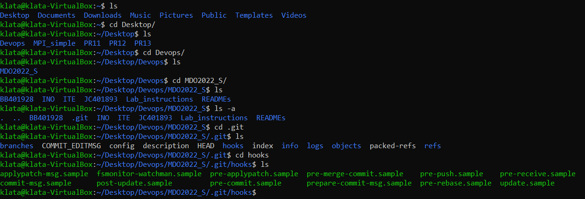
- usunięto `.sample` z nazwy pre-commita, aby git hook poprawnie się uruchomił oraz napisano prosty git hook sprawdzający, czy wiadomość commita zawiera inicjały oraz numer indeksu
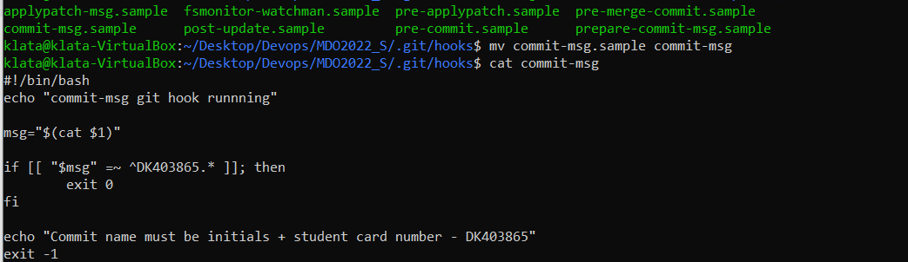
- przetestowano działanie hooka, tworząc commita ze złą nazwą
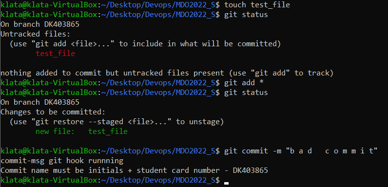
- zmodyfikowano git hook w taki sposób aby sprawdzał również czy w treści commita zawiera się nr laboratorium
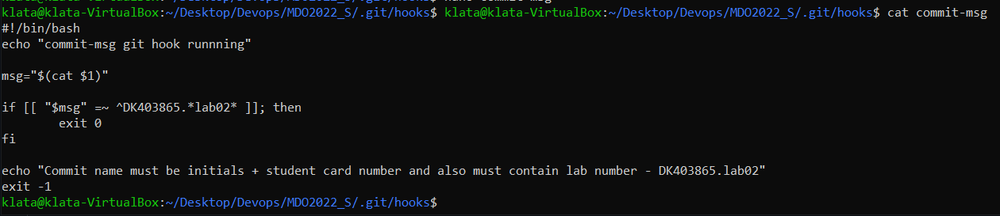
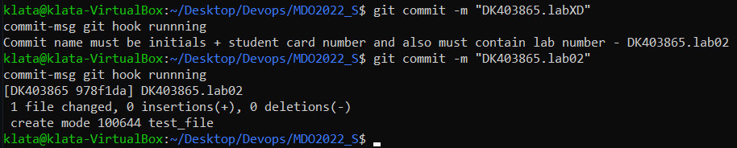

## 3. Rozpocznij przygotowanie środowiska Dockerowego
- zapewniono dostęp do maszyny wirtualnej przez zdalny terminal ssh (przygotowano już w ramach poprzedniego laboratorium, więc tutaj tylko umieszczono potwierdzenie działania ssh)
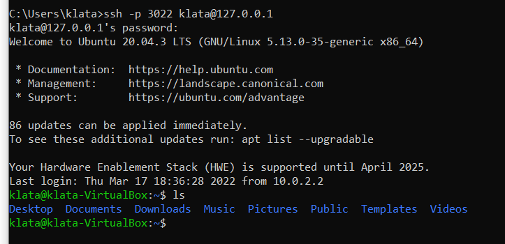
- zainstalowano środowisko dockerowe przy pomocy menedżera paczek komendą `sudo apt-get install docker.io`
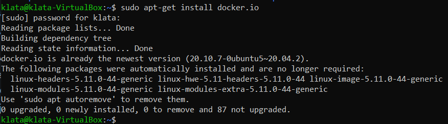

## 4. Działanie środowiska
- sprawdzono szybko działanie środowiska dockerowego:
- pobrano dockerowy obraz `hello-world` za pomocą komendy `docker pull hello-world`
- sprawdzono, czy obraz jest zainstalowany komendą `docker images`
- następnie uruchomiono obraz komendą `docker run hello-world`, która powitała użytkownika wiadomością, że wygląda na to iż instalacja dockera działa poprawnie.
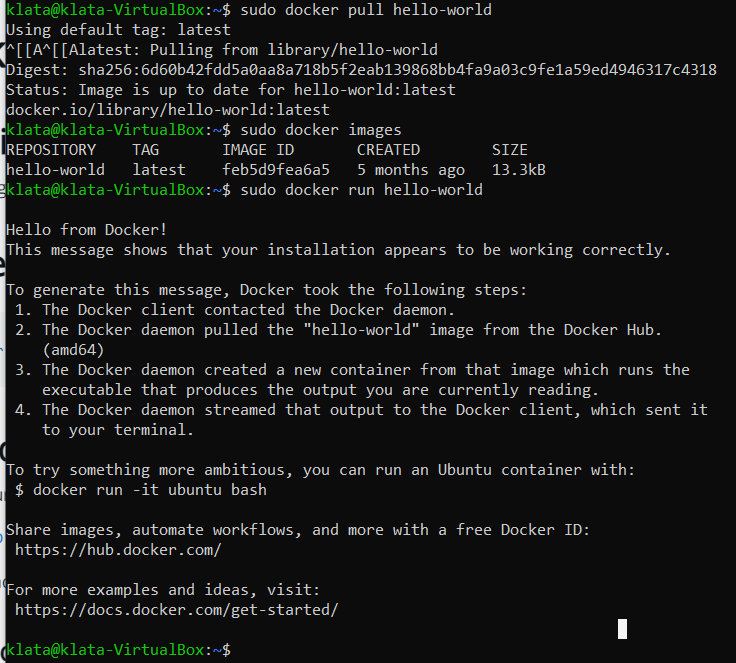
- sprawdzono dodatkowo działanie dockera pobierając obraz dystrybucji linuksowej za pomocą komendy `sudo docker pull ubuntu`
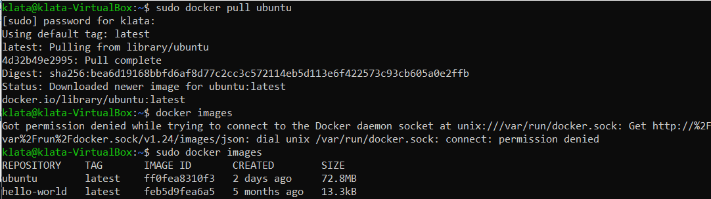
- uruchomiono kontener z obrazem linksowej dystrybucji używając `docker run`, a następnie sprawdzono wersję systemu odczytując zawartość pliku os-release
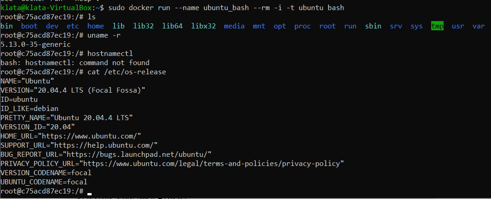

## 5. Załóż konto na Docker Hub

- Stworzono konto na dockerhub
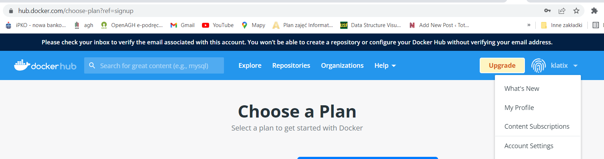
