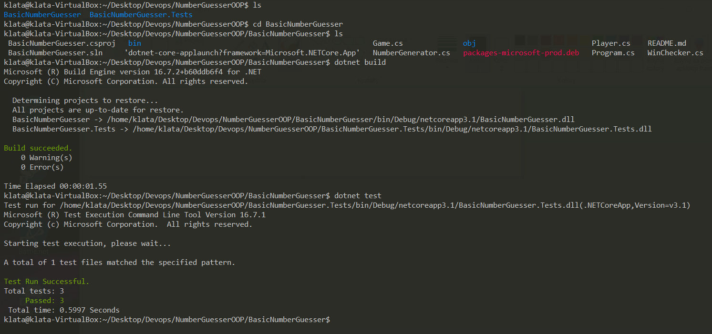
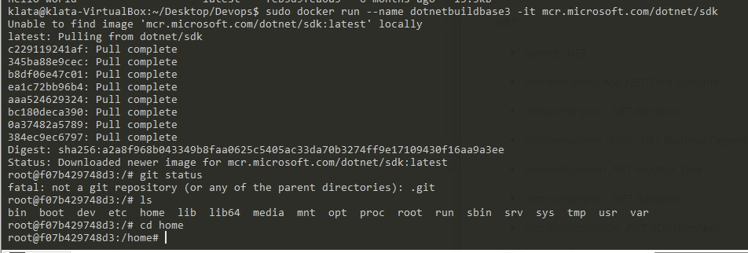
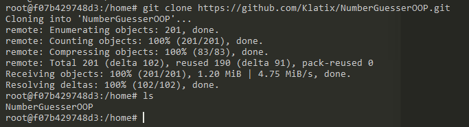
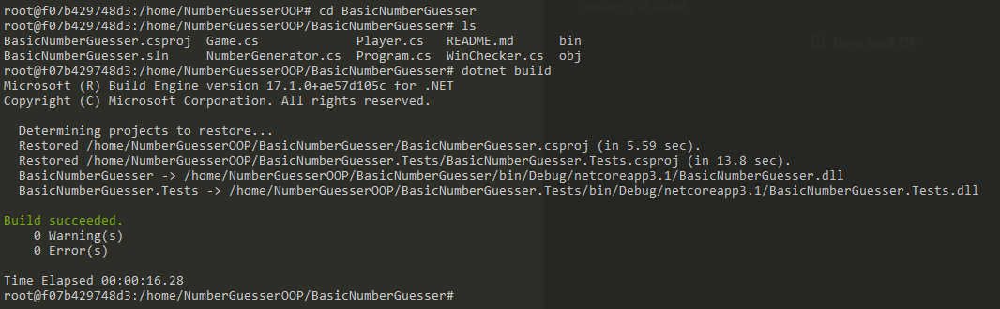
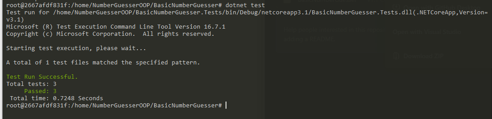
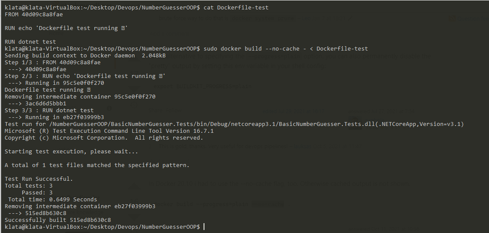

#Sprawozdanie DevOps - lab02
### Daniel Klata - ITE-GCL03

## Wybór oprogramowania
Jako program do zapakowania w kontener wybrano własny kod. 
Jest to prosta aplikacja będą grą w zgadywanie liczb, lecz zawiera swoje testy jednostkowe w osobnym folderze .Tests
Aplikacja oparta jest na .Net Core 3.1, co pozwala na łatwe budowanie i testowanie komendami `dotnet build` i `dotnet test`

Na początku przetestowano budowanie i testowanie na maszynie wirtualnej bez użycia konteneryzacji.
(zależności dotnetowe były już wcześniej zainstalowane w systemie)

# Przeprowadzenie buildu w kontenerze

## Wykonaj kroki build i test wewnątrz wybranego kontenera bazowego.

Wybrano obraz .Net Core w wersji odpowiadającej aplikacji (tj. 3.1), zpullowano go oraz uruchomiono przy pomocy komendy `sudo docker run --name dotnetbuildbase -it mcr.microsoft.com/dotnet/sdk:3.1`
(komenda docker run automatycznie wyszuka obraz o podanej nazwie, jeśli taki nie istnieje lokalnie. Można też użyć komendy `docker pull` aby pobrać jedynie obraz bez uruchamiania kontenera.

Sklonowano repozytorium wewnątrz kontenera (obraz dotnetowy od razu posiada wbudowane dependencje gita, więc wystarczyło użyć komendy `git clone` bez potrzeby instalowania gita)

Wewnątrz kontenera zbudowano aplikację komendą `dotnet build`

Następnie uruchomiono testy wewnątrz kontenera za pomocą komendy `dotnet test`

## Stwórz dwa pliki Dockerfile automatyzujące kroki powyżej

Stworzono Dockerfile dla obrazu budującego i uruchomiono go komendą `docker build - < Dockerfile-build`

Stworzono Dockerfile dla obrazu testującego, bazującego na obrazie budującym (użyto FROM ID_kontenera_budującego) i uruchomiono go komendą `docker build - < Dockerfile-test`

Kontener wdraża się i pracuje poprawnie, na powyższych screenshotach widać output z konsoli informujący o poprawnym buildzie oraz status odpalonych testów jednostkowych wraz z informacją, że wszystkie przeszły poprawnie. 