#Sprawozdanie DevOps - lab04
### Daniel Klata - ITE-GCL03

## Przygotowano woluminy do użycia 

Użyto komend `docker volume create`
## Uruchomiono kontener ze zmountowanymi woluminami

użyto komendy `docker run` z parametrami --mount source=v_in,target=/v_in i source=v_out,target=/v_out
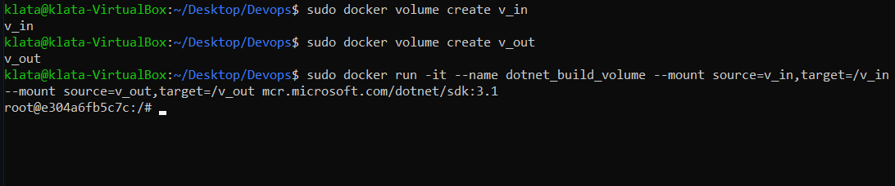

Sprawdzono poprawność mountowania woluminu

## Obraz dotnetowy nie wymagał doinstalowywania dependencji, więc sklonowano repozytorium na wolumin wejściowy
(dotnetowy obraz bazowo zawiera gita, nie był doinstalowywany, więc możnaby pobrać repo bezpośrednio w kontenerze, natomiast można tak samo z zewnątrz wejść do woluminu i sklonować repo)
`cd /var/lib/docker/volumes/v_in/_data/`
`git clone https://github.com/Klatix/NumberGuesserOOP.git`

komendą ls sprawdzono że repo jest na v_in

## Uruchomiono build i wrzucono output do woluminu wyjściowego

Użyto komendy `dotnet build` z parametrem `--output ścieżka_do_woluminu_out`
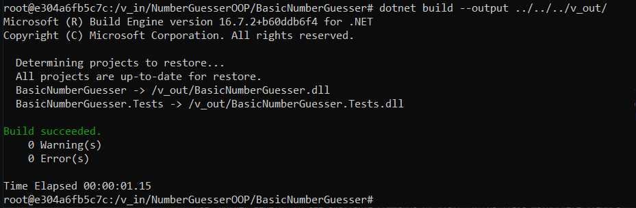

## Na woluminie wyjściowym widać pliki z builda
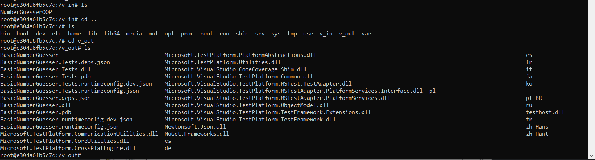

Wyłączono kontener:
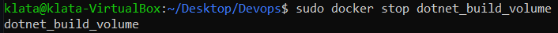

Stan volume po wyłączeniu kontenera:
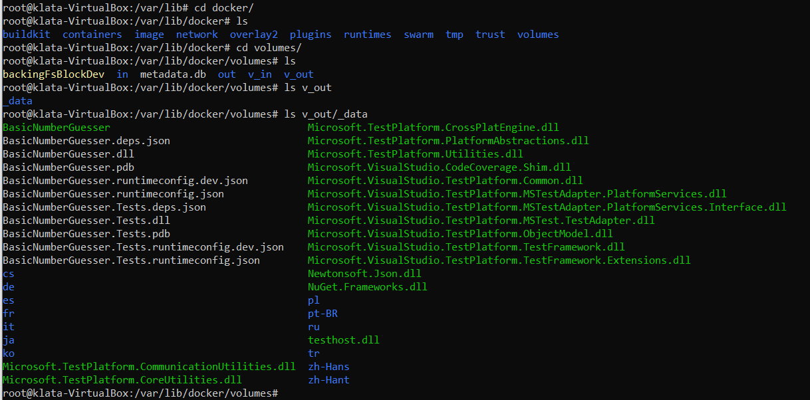

# Pobrano obraz iperf3
Użyto docker pull `networkstatic/iperf3`

Uruchomiono serwer wewnątrz kontenera
`sudo docker run  -it --rm --name=iperf3-server -p 5201:5201 networkstatic/iperf3 -s`
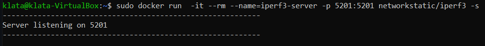

Sprawdzono adres serwera
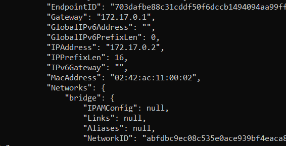

## Badanie łączności kontener-kontener

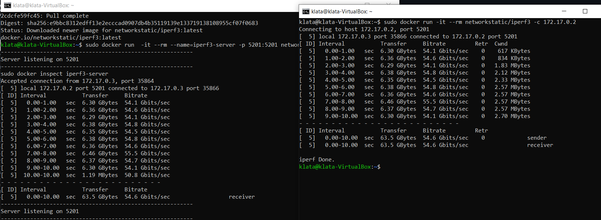

## Badanie łączności kontener-host

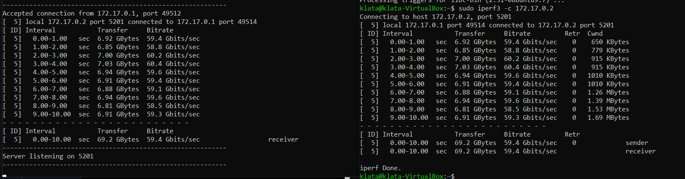

## Wyniki

|Badanie|Bitrate|
|-------|-------|
|kontener-kontener|54.6 Gbit/s|
|kontener-host|59.4 Gbit/s|

Lepszy wynik otrzymano przy połączeniu kontener-host

# Utworzono sieć jenkins

Użyto komendy `docker network create nazwa_sieci`

## Pobrano i uruchomiono obraz DIND

Użyto następującej komendy zaczerpniętej z tutoriala do instalacji jenkinsa:
docker run \
  --name jenkins-docker \
  --rm \
  --detach \
  --privileged \
  --network jenkins \
  --network-alias docker \
  --env DOCKER_TLS_CERTDIR=/certs \
  --volume jenkins-docker-certs:/certs/client \
  --volume jenkins-data:/var/jenkins_home \
  --publish 2376:2376 \
  docker:dind \
  --storage-driver overlay2
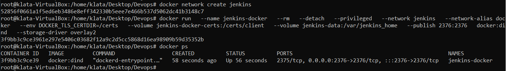

## Utworzono dockerfile dla jenkinsa
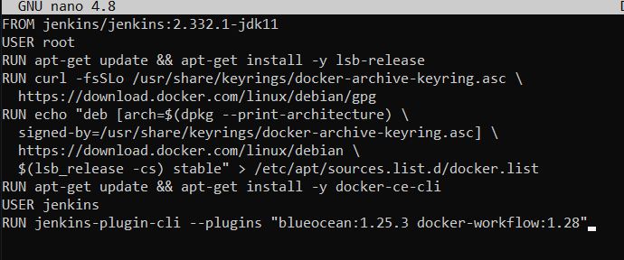
 
Następnie na bazie tego dockerfile, stworzono obraz komendą docker build

## Uruchomiono kontener z jenkinsem
Użyto komendy:

docker run \
  --name jenkins-blueocean \
  --rm \
  --detach \
  --network jenkins \
  --env DOCKER_HOST=tcp://docker:2376 \
  --env DOCKER_CERT_PATH=/certs/client \
  --env DOCKER_TLS_VERIFY=1 \
  --publish 8080:8080 \
  --publish 50000:50000 \
  --volume jenkins-data:/var/jenkins_home \
  --volume jenkins-docker-certs:/certs/client:ro \
  myjenkins-blueocean:2.332.1-1 

## Poprawnie wyświetlany panel logowania (z poza maszyny wirtualnej)
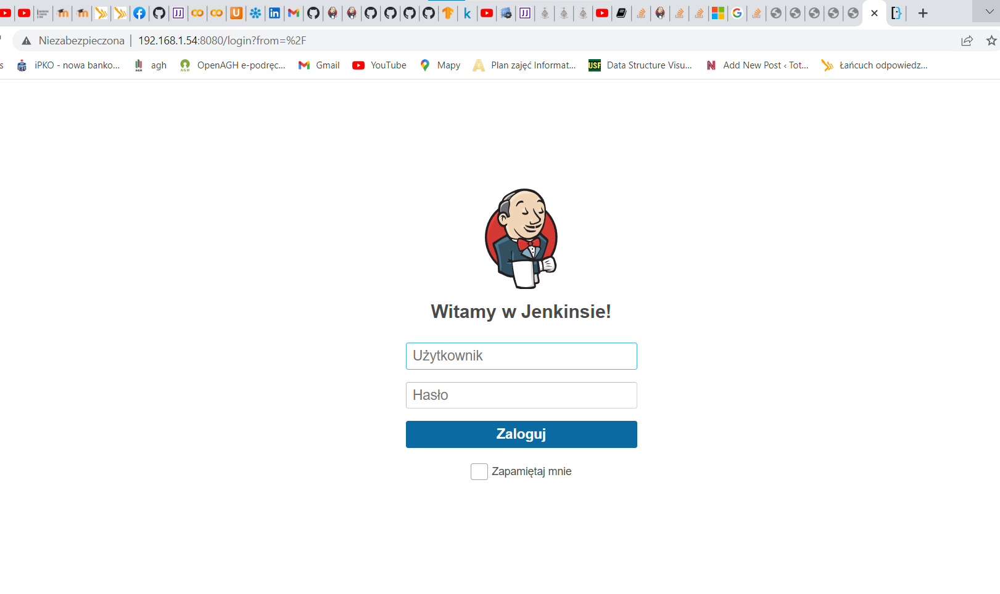

Wyciągnięto bazowe hasło admina do jenkinsa z /var/jenkins_home/secrets/initialAdminPassword w kontenerze

A następnie użyto hasła i skonfigurowano Jenkinsa
