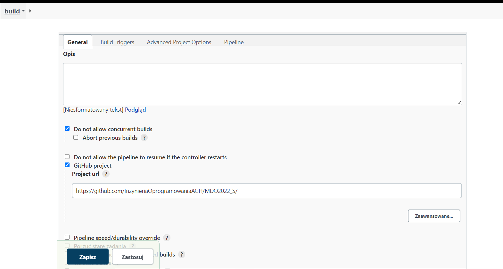
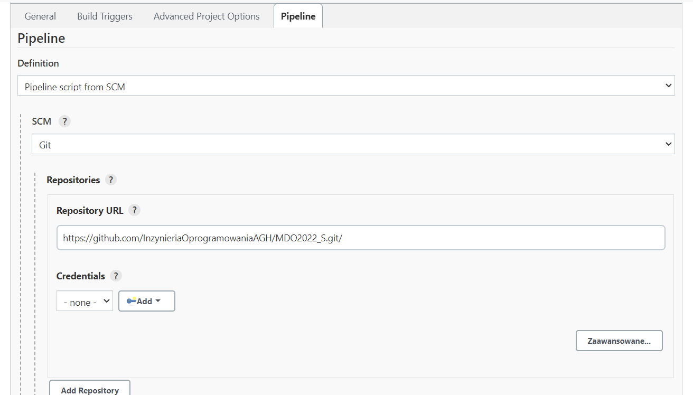
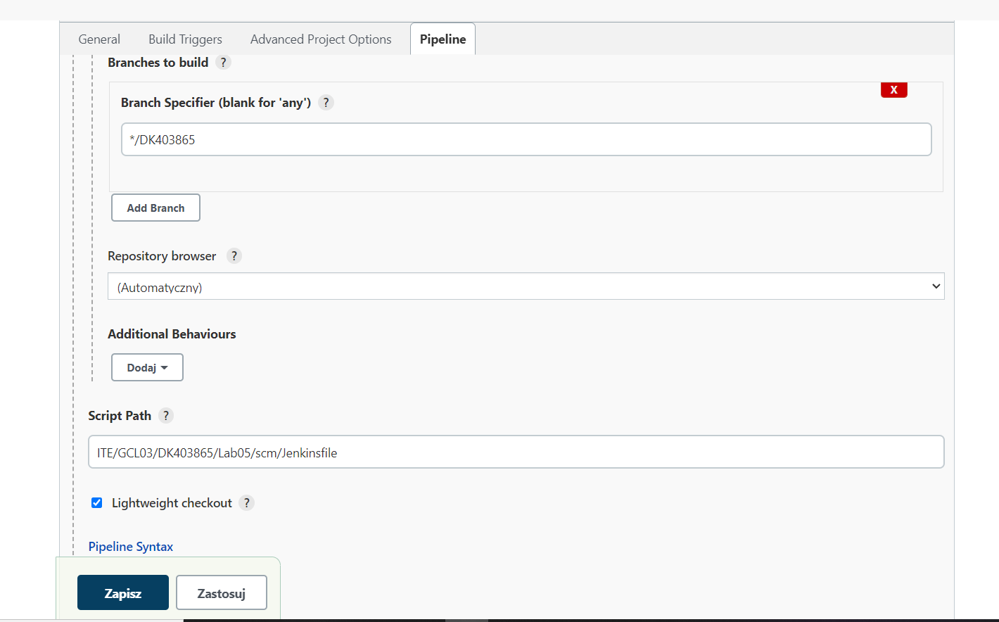
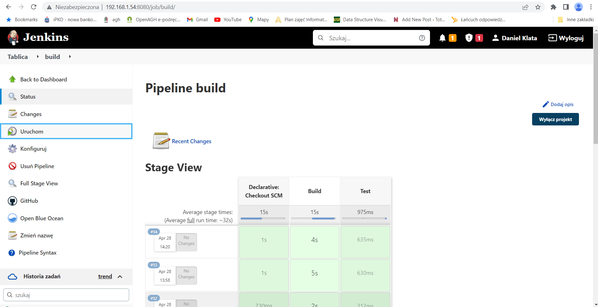

#Sprawozdanie DevOps - lab05
### Daniel Klata - ITE-GCL03

## Zadanie

Zadanie miało na celu przygotowanie pipeline'u z krokami build oraz test. 
W tym celu korzystano z wiadomości oraz plików Dockerfiles stworzonych na poprzednich zajęciach.
Uruchomiono kontenery Jenkinsa oraz DIND (aby móc wykonywać dockerowe polecenia z poziomu jenkinsa) w taki sam sposób jak to opisano w poprzednim sprawozdaniu.
Skorzystano z plików Dockerfiles do testu oraz builda, które stworzono na wcześniejszych zajęciach.

## Utworzono Nowy Projekt będący Pipelinem wewnątrz Jenkinsa

Skonfigurowano definicję pipeline'u

Ustalono branch którego będzie klonował jenkins oraz podano ścieżkę do skryptu pipeline'u (Jenkinsfile)

## Napisano Jenkinsfile zawierający kroki Build i Test

	 pipeline {
	    agent any
	    stages {
	        stage('Build') {
	            steps {
			git 'https://github.com/InzynieriaOprogramowaniaAGH/MDO2022_S.git'
			sh 'git checkout DK403865'
			sh 'git pull origin'
			sh 'cd ITE/GCL03/DK403865/Lab05/Dockerfiles/DockerfileBuild ; docker build -t build_base:latest .'            
		}
	        }
		stage('Test') {
	            steps {
	                sh 'cd ITE/GCL03/DK403865/Lab05/Dockerfiles/DockerfileTest ; docker build -t test_base:latest .'  
	            }
	        }

	    }
    }

Pipeline ten w pierwszym stage'u "Build" najpierw sklonuje repozytorium przedmiotu (tylko za pierwszym uruchomieniem, repo jest klonowane na workspace tego job'a przechowywanym na volume Jenkinsa i nie będzie pobierane za każdym razem)
Checkoutuje się na odpowiednią gałąź oznaczoną inicjałami i nr albumu.
Pulluje zmiany, aby zawsze mieć najnowszą wersję brancha.
Przechodzi do katalogu który zawiera dockerfile builda i uruchamia go. Jeśli wszystkie polecenia się poprawnie wykonają, to stage "Build" zaświeci się na zielono i przejdzie do Testu

W kroku "Test" pipeline przechodzi do katalogu z Dockerfile do obrazu testowego i uruchamia docker build, aby odpalić testy za pomocą Dockerfile'a.

Jeśli wszystkie testy przejdą pomyślnie, krok test zaświeci się na zielono, a pipeline dobiegnie końca

## Odpalono pipeline, który przeszedł wszystkie etapy pomyślnie

