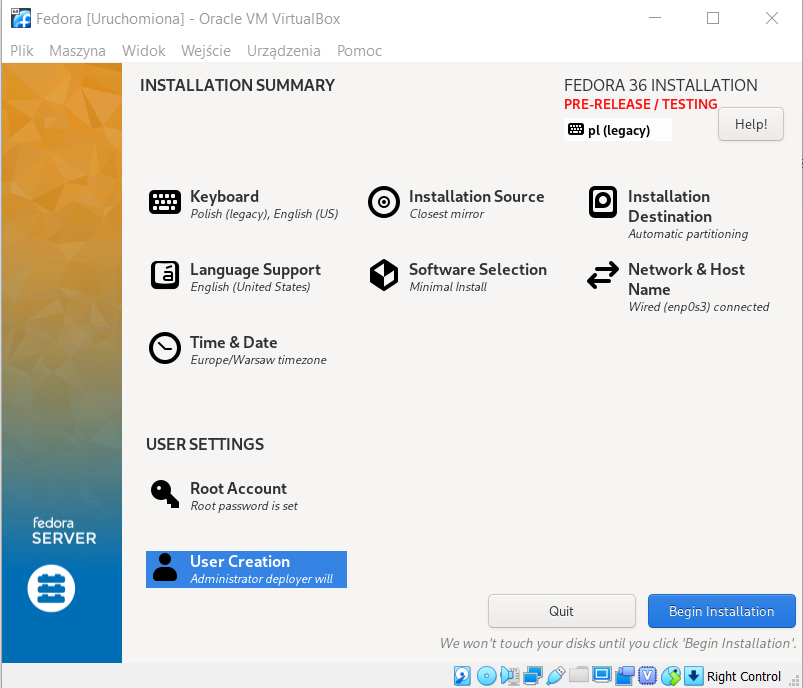
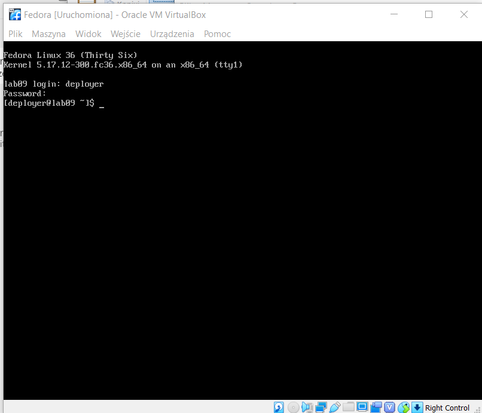
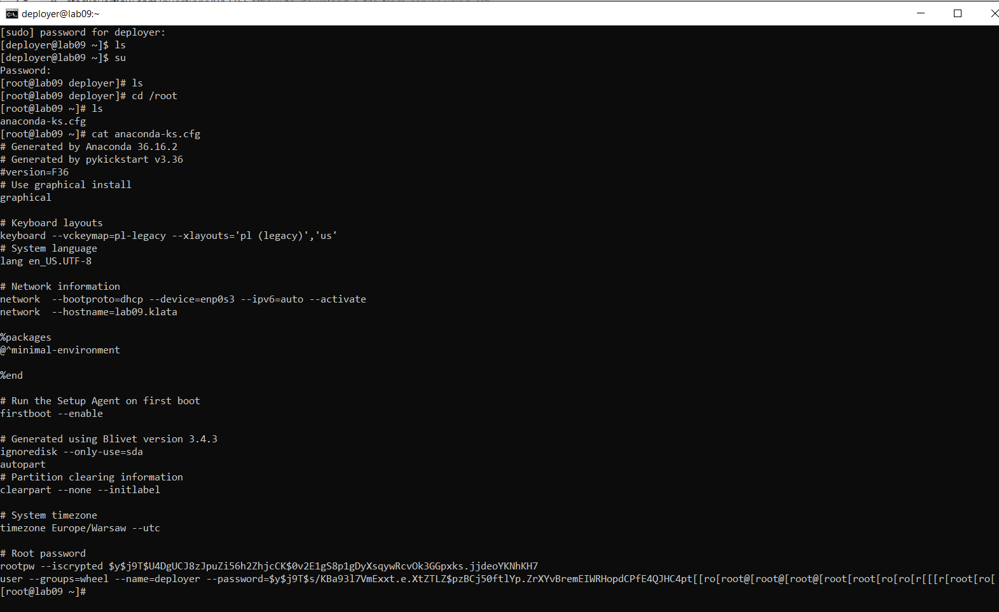
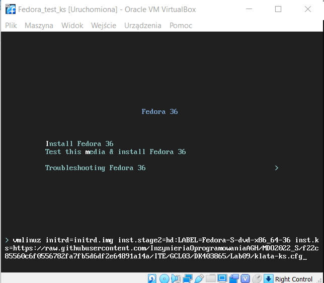
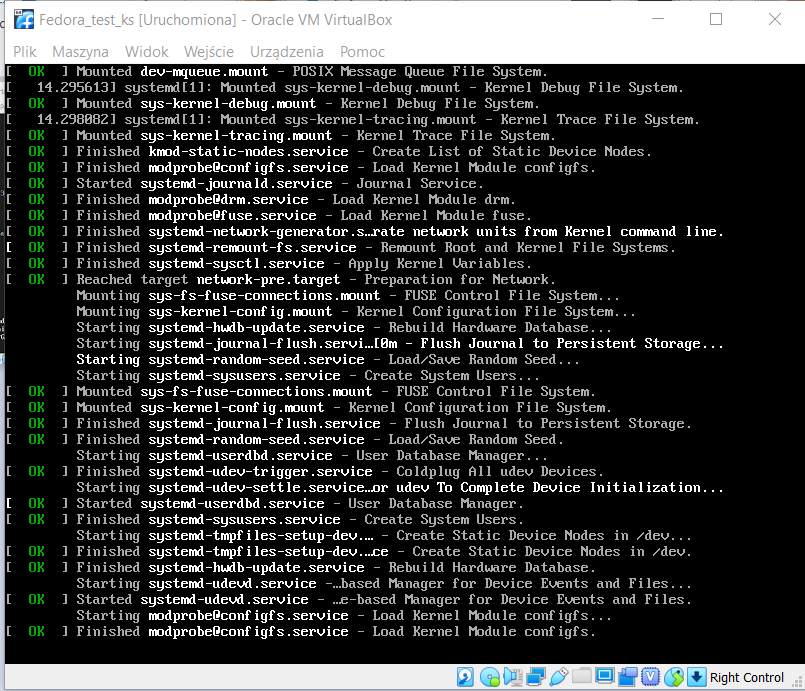
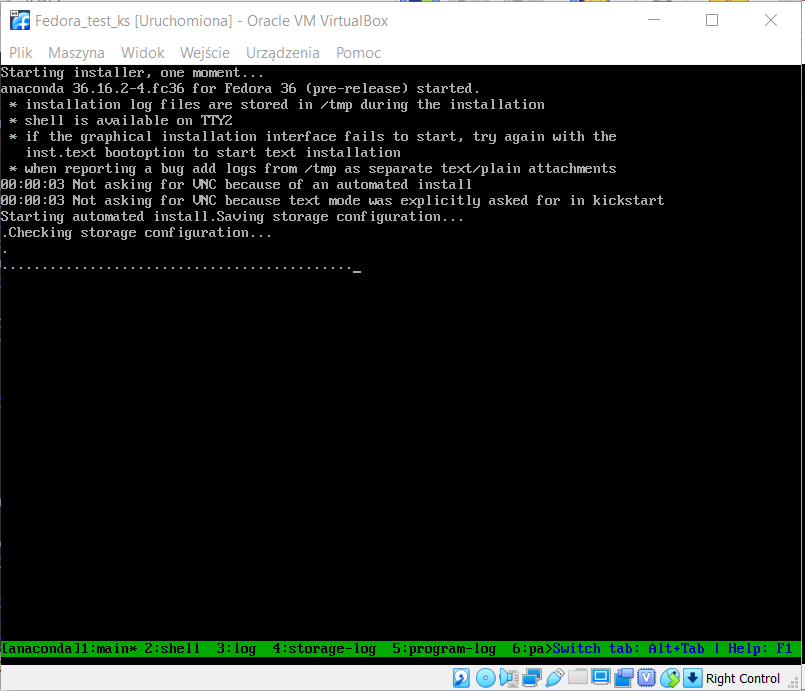
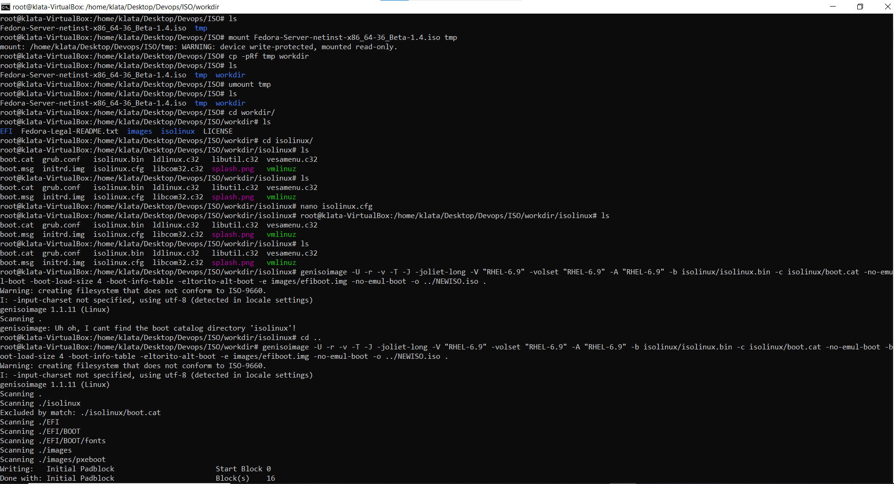
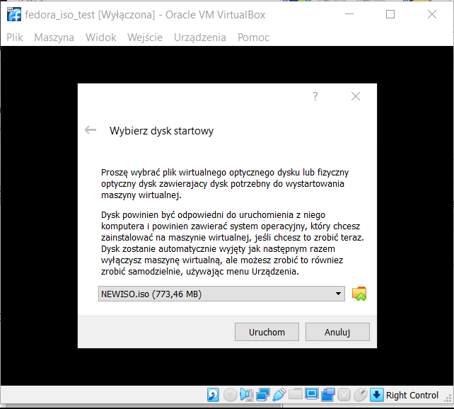

#Sprawozdanie DevOps - lab09
### Daniel Klata - ITE-GCL03

## Zadanie
Zadanie mia³o na celu przygotowanie wdro¿eñ nienadzorowanych. Polega³o na stworzeniu pliku odpowiedzi dla instalacji Fedory, a nastêpnie zaimplementowaniu go wewn¹trz pliku .iso, tak aby instalacja systemu w zdefiniowany przez nas sposób odbywa³a siê automatycznie.

## Wykonanie
Zainstalowano odpowiednio skonfigurowan¹ wersjê systemu Fedora w maszynie wirtualnej (odpowiedni jêzyk systemu, klawiatura, wersja minimalna, utworzony u¿ytkownik, itd.)

Instalacja zakoñczyla siê sukcesem.

Nastêpnie skopiowano automatycznie wygenerowany plik odpowiedzi i zedytowano go w nastêpuj¹cy sposób:

	# Generated by Anaconda 36.16.2
	# Generated by pykickstart v3.36
	#version=F36
	# Use graphical install
	text
	
	# Keyboard layouts
	keyboard --vckeymap=us --xlayouts='us'
	# System language
	lang en_US.UTF-8
	
	# Network information
	network  --bootproto=dhcp --device=enp0s3 --ipv6=auto --activate
	network  --hostname=lab09.klata
	
	# Repo
	url --mirrorlist=http://mirrors.fedoraproject.org/mirrorlist?repo=fedora-$releasever&arch=x86_64
	repo --name=updates --mirrorlist=http://mirrors.fedoraproject.org/mirrorlist?repo=updates-released-f$releasever&arch=x86_64
	
	%packages
	@^minimal-environment
	dotnet-sdk-3.1
	dotnet-runtime-3.1
	%end
	
	# Run the Setup Agent on first boot
	firstboot --enable
	
	# Generated using Blivet version 3.4.3
	ignoredisk --only-use=sda
	# Partition clearing information
	clearpart --none --initlabel
	# Disk partitioning information
	part /boot --fstype="xfs" --ondisk=sda --size=1024
	part pv.50 --fstype="lvmpv" --ondisk=sda --size=46185
	part /boot/efi --fstype="efi" --ondisk=sda --size=600 --fsoptions="umask=0077,shortname=winnt"
	volgroup fedora_fedora --pesize=4096 pv.50
	logvol none --size=36872 --thinpool --metadatasize=36 --chunksize=64 --name=pool00 --vgname=fedora_fedora
	logvol / --fstype="xfs" --size=36864 --thin --poolname=pool00 --name=root --vgname=fedora_fedora
	
	# System timezone
	timezone Europe/Warsaw --utc
	
	# Root password
	rootpw --plaintext 12345
	user --name=deployer --password=12345 --plaintext --gecos="deployer"
	
	%post
	mkdir /opt/devops
	touch /opt/test_file.txt
	%end 
	
Ustawiono tryb "text" zamiast graphical aby instalacja by³a szybsza. Dodano informacje o repo systemu oraz update'ów oraz dodano dotnetowe sdk oraz runtime do paczek do pobrania. Na koñcu dodano sekcjê post, która utworzy plik tekstowy.

## Testowanie pliku konfiguracyjnego
Plik wrzucono na repozytorium, a nastêpnie u¿yto linku do tego pliku (link w wersji raw, aby dostarczaæ jedynie zawartoœæ pliku) aby u¿yæ tych odpowiedzi w trakcie instalacji systemu.

Instalacja przebieg³a pomyœlnie.

## Tworzenie ISO

Nastêpnym krokiem by³o stworzenie pliku ISO, który od razu bêdzie zawiera³ plik odpowiedzi.

Aby stworzyæ plik ISO pos³u¿ono siê tutorialem dostêpnym na tej stronie:

https://access.redhat.com/documentation/zh_cn/red_hat_enterprise_linux/6/html/installation_guide/s1-kickstart2-putkickstarthere

Zmountowano, oraz skopiowano pliki z poprzendnio u¿ywanego "bazowego" iso, odmountowano stare iso a nastêpnie zmieniono zawartoœæ pliku `isolinux/isolinux.cfg` w taki sposób aby odnosi³a siê do naszego pliku konfiguracyjnego dodaj¹c opcjê `ks=`

Nastêpnie wygenerowano nowy obraz ISO komend¹ `genisoimage`

Efektem tej komendy, by³o wygenerowanie nowego pliku NEWISO.iso, który mo¿emy wykorzystaæ do nienadzorowanej instalacji systemu.

Na koñcu stworzono nowy system, tym razem bazuj¹cy na nowo wygenerowanym iso od razu z plikiem konfiguracyjnym.

