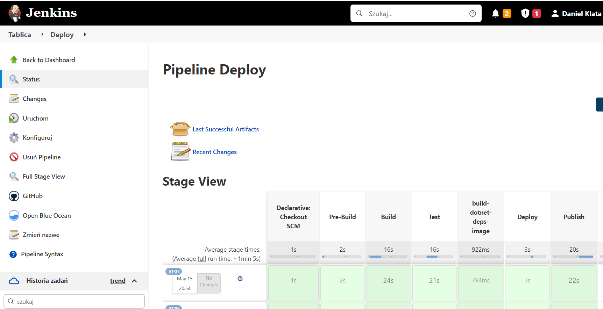
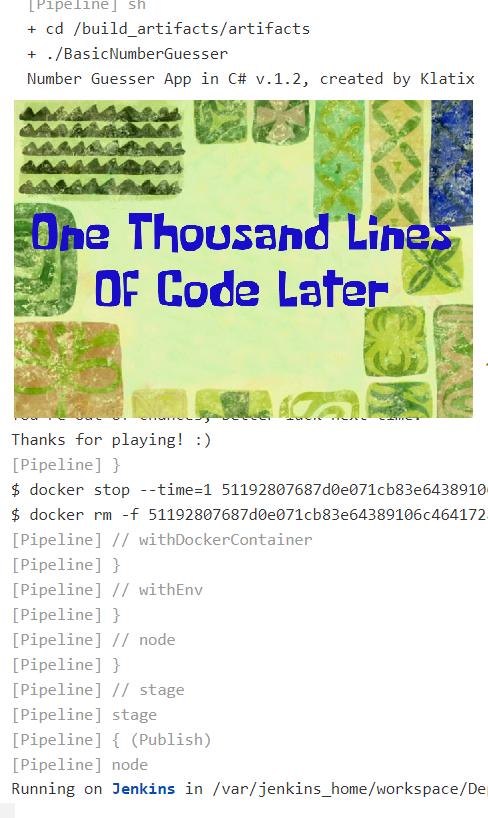
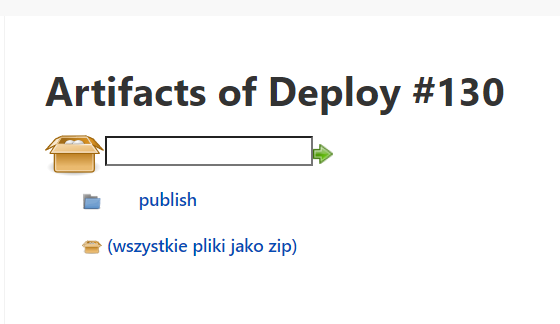
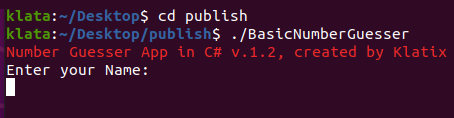
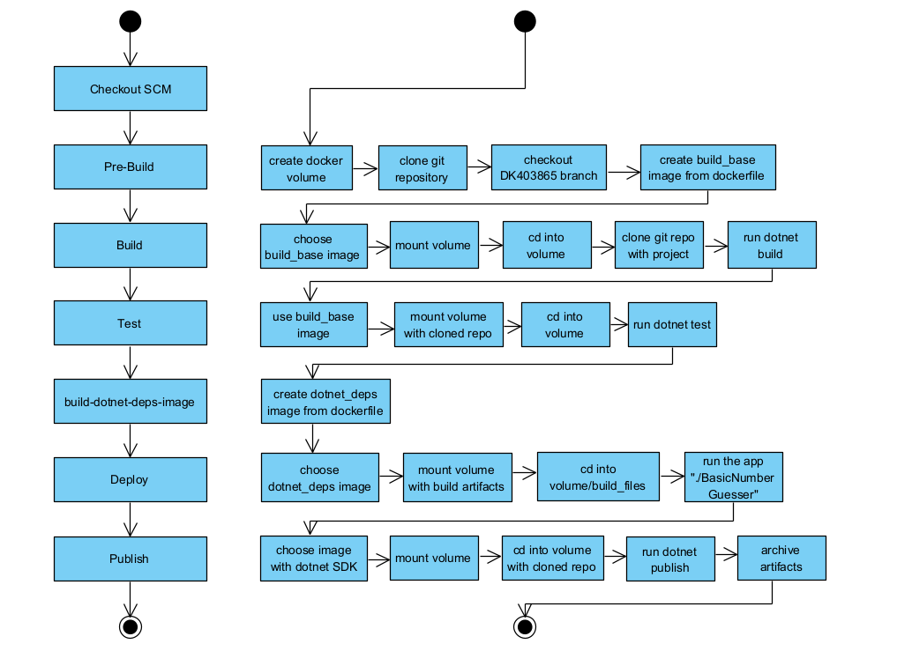

# Projekt MDO - Daniel Klata
## Cel

Celem projektu jest stworzenie Pipeline'a w jenkinsie, który pozwoli na ciągłą integrację i wdrażanie repozytorium. W tym przypadku wybrano repozytorium bazujące na .NetCore.
Stworzony Pipeline ma pobrać wybrane przez nas repozytorium, zbudować je, uruchomić testy, zdeployować aplikację na środowisku uruchomieniowym oraz końcowo wydać aplikację do klienta, a przy tym wszystkim wyrzucić błąd jeśli którykolwiek z kroków się nie powiedzie.

Opis budowy kroków build oraz test, jak również samą konfigurację pipeline'u wewnątrz Jenkinsa zrealizowaną w ramach lab05 można znaleźć [tutaj](https://github.com/InzynieriaOprogramowaniaAGH/MDO2022_S/blob/DK403865/ITE/GCL03/DK403865/Lab05/sprawozdanie.md)
Te sprawozdanie skupi się na samej budowie odpowiedniego Jenkinsfile oraz na problemach napotkanych w trakcie tworzenia pipeline'u. 

W ramach pełnego projektu przygotowano konkretny pipeline:

## Wytłumaczenie wszystkich stage'y pipeline'a

### Declarative: Checkout SCM

Jest to stage tworzony automatycznie przez Jenkinsa po wybraniu opcji `Pipeline script form SCM`, ta opcja sprawia, że nie tworzymy skryptu pipeline'a wewnątrz Jenkinsa, tylko pobieramy Jenkinsfile ze wskazanego repozytorium (w tym przypadku repo przedmiotu), dzięki temu utrzymujemy nasz pipeline razem z repozytorium (infrastructure as code)

### Pre-Build

	`stage('Pre-Build') {
            steps {
		sh 'docker volume create build_artifacts'
		git 'https://github.com/InzynieriaOprogramowaniaAGH/MDO2022_S.git'
		sh 'git checkout DK403865'
		sh 'git pull origin'
		sh 'cd ITE/GCL03/DK403865/Lab06/Build ; docker build -t build_base:latest .'
	}`

Stage Pre-Build wykonuje kilka czynności, tworzy volume na którym będą przechowywane artefakty po buildzie potrzebne przy następnych krokach, przede wszystkim przy deployu, gdzie nie chcemy mieć dependencji do budowania aplikacji.
klonuje repozytorium, checkoutuje się na odpowiednią gałąź użytkownika, oraz upewnia się że wersja gałęzi jest najnowsza. Następnie stage Pre-Build tworzy obraz dockerowy build_base z odpowiedniego Dockerfile'a, który będzie potrzebny przy kroku build.

Dockerfile dla obrazu build_base:

`FROM mcr.microsoft.com/dotnet/sdk:3.1
RUN echo 'Dockerfile running 🍉'`

Jest to prosty dockerfile, który tylko definiuje środowisko. Dla builda (w projekcie dotnetowym) używany będzie obraz dotnet sdk, ponieważ zawiera dependencje do budowania aplikacji.

### Build

	`stage('Build') {
            agent {
                docker {
                    image 'build_base:latest'
                    args '--mount source=build_artifacts,target=/build_artifacts -u root:root'
                }
            }
            steps {
		sh 'ls -l'
		sh 'cd /build_artifacts && rm -r NumberGuesserOOP && git clone https://github.com/Klatix/NumberGuesserOOP.git && cd NumberGuesserOOP/BasicNumberGuesser && dotnet build --output ../../artifacts/'         
	}`

Stage Build korzysta z agenta dockerowego, pozwoli on na znacznie łatwiejszą integrację dockera z pipelinem Jenkinsa. Agentowi podajemy obraz build_base, stworzony w poprzednim kroku oraz parametry, które w tym przypadku mountują wolumin na który zapiszemy pliki wyjściowe builda.
Następnie, klonujemy repozytorium na wolumin, przechodzimy do pobranego repozytorium z projektem oraz uruchamiamy builda komendą dotnet build, wyznaczając przy tym odpowiedni folder jako output.

Dobrym podejściem jest stosowanie woluminów in oraz out, na "in" przechowane by było samo sklonowane repo, a na "out" wyniki z builda, lecz tutaj zdecydowano się na użycie jednego ustrukturyzowanego woluminu (podzielenie go na odpowiednie foldery z repozytorium, oraz osobne nazwane artifacts, gdzie są efekty builda) 
Takie podejście pozwala nam na zachowanie przejrzystości pomimo użycia jednego woluminu.

### Test
	`stage('Test') {
            agent {
                docker {
                    image 'build_base:latest'
                    args '--mount source=build_artifacts,target=/build_artifacts -u root:root'
                }
            }

            steps {
                sh 'cd /build_artifacts/NumberGuesserOOP/BasicNumberGuesser && dotnet test' 
            }
        }`

Stage Test ponownie korzysta z agenta dockerowego, do testowania korzystamy z tego samego obrazu co przy buildowaniu. Sam pipeline przechodzi tylko do woluminu, gdzie zapisany jest projekt oraz uruchamia testy komendą "dotnet test".
Wykorzystanie woluminu tutaj jest istotne, gdyż nie chcemu kilkukrotnie bezsensownie klonować tego samego repozytorium, w przypadku dużych projektów zajęłoby to strasznie dużo czasu, a równie dobrze możemy wykorzystać to samo repo które pobraliśmy przed sekundą i odłożyliśmy na wolumin.

### Build-dotnet-deps-image

        `stage('build-dotnet-deps-image') {
            steps {
		sh 'git pull origin'
		sh 'cd ITE/GCL03/DK403865/Lab06/DotnetDeps ; docker build -t dotnet_deps:latest .'            
	}`

Dockerfile DotnetDeps:
`FROM mcr.microsoft.com/dotnet/runtime:3.1

ENV \
    # Configure web servers to bind to port 80 when present
    ASPNETCORE_URLS=http://+:80 \
    # Enable detection of running in a container
    DOTNET_RUNNING_IN_CONTAINER=true`

Jest to Dockerfile zalecany przez microsoft, bierze on obraz zawierający runtime oraz ustawia zmienne środowiskowe, które w niektórych przypadkach mogą się przydać, lecz tutaj bez ustawienia ich projekt zadziałałby tak samo.

Stage ten jest bardzo krótki i jak sama nazwa wskazuje, buduje on obraz z dotnetowymi dependencjami, który będzie potrzebny do Deploya. Równie dobrze, stage ten mógłby się nazywać "Pre-deploy".

`Dlaczego deploy wykonujemy na innym obrazie?`

Istotą deployowania aplikacji jest upewnienie się, że zadziała ona poza środowiskiem build'owym, aby mieć taką pewność nie możemy skorzystać z obrazu build_base stworzonego wcześniej (nie to chcemy zrobić w deployu, pomimo tego że aplikacja się tam bez problemu uruchomi)
Dlatego tworzymy obraz dotnet_deps, który zawiera jedynie dependencje do uruchomienia aplikacji (tj. zawiera runtime, a nie zawiera SDK)

### Deploy

	`stage('Deploy') {
		agent{
			docker{
				image 'dotnet_deps:latest'
				args '--mount source=build_artifacts,target=/build_artifacts -u root:root'
			}
		}
            steps {
		sh 'cd /build_artifacts/artifacts'
                    sh 'cd /build_artifacts/artifacts && ./BasicNumberGuesser'
            }
        }`

Deploy jest jednym z głównych elementów pipeline'u. Jak wytłumaczono wyżej, chcemy tutaj uruchomić aplikację w innym środowisku, tj. takim który ma jedynie runtime dotneta. 
Wykorzystany jest agent dockerowy, któremu przekazujemy obraz z dependencjami i volume na którym są pliki stworzone przez Builda w poprzenich etapach.

`Dlaczego potrzebny jest tutaj volume?`

Nie możemy na tym środowisku zbudować aplikacji, ani nawet pobrać repozytorium. Obraz ten zawiera jedynie sam runtime dotneta, pozwoli on odpalić zbudowaną aplikację, lecz nie ma szans na zbudowanie jej od zera.
Dlatego aby deploy miał sens, musimy użyć woluminu, na którym są już zbudowane pliki.

Sam Deploy uruchomi aplikację (jeśli uruchomienie dobiegnie końca, to aplikacja zwróci dobry kod wyjścia, a pipeline pójdzie dalej.)
Jak widać, aplikacja normalnie uruchamia się wewnątrz pipeline'a i program dobiega końca. Co jest dowodem na to, że aplikacja działa normalnie poza środowiskiem buildowym:

Aplikacja się zakończyła, i można zauważyć, że pipeline przełącza się na następny stage - Publish.

### Publish

Publish okazał się najbardziej problematycznym krokiem, ponieważ napotkano pierwsze błędy i problemy których nie udało się rozwiązać pomimo wielu prób.

Obecne działanie stage'a:
	`stage('Publish') {
		agent{
			docker{
				image 'mcr.microsoft.com/dotnet/sdk:3.1'
				args '--mount source=build_artifacts,target=/build_artifacts -u root:root'
			}
		}
            steps {
		sh 'cd /build_artifacts/artifacts'
                    sh 'cd /build_artifacts/NumberGuesserOOP/BasicNumberGuesser && dotnet publish -c Release -r win-x64 -p:UseAppHost=true --output ../../publish/'
		   sh "cp -R /build_artifacts/artifacts ${WORKSPACE}/publish"
  			 archiveArtifacts 'publish/*'
            }
        }`

Stage ponownie korzysta z dockerowego agenta, tym razem jako obraz bierze zwyczajnie dotnetowe sdk, gdyż jest ono wymagane do wykonania komendy `dotnet publish`.
Ponadto w argurmentach mountujemy wolumin zawierający pobrane repozytorium. Wewnątrz pipeline'a nawigujemy do katalogu z plikem solucji, a następnie uruchamiamy komendę dotnet publish z następującymi argumentami:
-c Release - zmienia konfiguracje z Debug na Release
-r win-x64 - ustala "runtime identifier", czyli środowisko które targetujemy na windowsa. 

`Dlaczego użyto -r win-x64?`

Pierwotny plan zakładał, aby efektem publisha był pojedynczy plik zawierający wszystkie potrzebne dependencje razem z runtimem, co pozwoliłiby na uruchomienie go na dowolnej maszynie windowsowej bez najmniejszego problemu i potrzeby instalacji runtime'u.
Aby to uczynić, należałoby użyć dwóch ważnych opcji "--self-contained true" oraz "-p:PublishSingleFile=true", lecz tutaj pojawił się znaczny problem, którego nie udało się rozwiązać. Przy próbie użycia tych opcji Jenkins wypluwa błąd:

Dotnet chce aby ustawić runtime identifier, aby zrobić aplikację która jest self-contained i/lub SingleFile. Sęk w tym, że runtime identifier jest już ustawiony, a mimo to błąd się pojawia. 
Po szukaniu odpowiedzi przez dosłowne godziny, okazało się że jest to dość częsty problem, a jedyną solucją była modyfikacja pliku .csproj wewnątrz repozytorium które chcemy zbuildować i publishować. 
Naturalnie nie jest to dobre rozwiązanie takiego błędu, a jedynie workaround, lecz w tym przypadku nawet workaround w postaci modyfikowania repozytorium nie działał, błąd nie chciał zniknąć za nic.
Najbliższą do rozwiązania problemu okazała się komenda której finalnie użyłem. Opcja `"-r win-x64` ma to do siebie, że gdy jej użyjemy to opcja `"--self-contained"` defaultowo ustawia się na "true", ale z jakiegoś powodu, nie wywala już błędu.
Takie samo rozwiązanie niestety nie udało się z opcją `PublishSingleFile`, więc końcowo mamy aplikację która jest "self contained" ale już nie jest "Single File". Efektem tego jest katalog z zupą plików, która wygląda źle, ale działa dobrze.

### Zpublishowana aplikacja jako artefakt w jenkinsie

Po zakończeniu, publish odkłada pliki końcowe do folderu `/publish` na woluminie, a następnie kopiuje je do innego folderu publish, tylko w Workspace tego job'a.
`Dlaczego kopiujemy pliki z woluminu na workspace?`
Jak sama nazwa wskazuje celem publisha jest opublikowanie programu, nie tylko stworzenie tych plików wewnątrz pipeline'a a potem stracenie ich po jego zakończeniu.
Dlatego chcemy utworzyć z tych zpublishowanych plików artefakt, który będzie można pobrać i faktycznie uruchomić.
Aby stworzyć artefakty z publisha, używamy komendy archiveArtifacts wewnątrz Jenkinsfile'a, która zapisze wszystkie pliki z folderu publish `znajdującego się w workspace`
Jenkins nie jest w stanie bezpośrednio wyciągnąć plików do zapisania jako artefakt z wewnątrz woluminu, jesteśmy w stanie zapisać artefakty tylko z poziomu Workspace'a, dlatego musimy je wcześniej przekopiować z woluminu na workspace.

Efektem tego jest mała ikonka strzałki do download'u przy danym uruchomieniu Pipeline'a.

Możemy pobrać folder ze zpublishowaną aplikacją:

I przy wejściu do pobranego katalogu, możemy zwyczajnie uruchomić plik wykonywalny aplikacji i upewnić sie, że opublikowana wersja działa:

## Diagramy

Diagram po lewej jest bardzo ogólny i przedstawia tylko stages pipeline'u, diagram po prawej szczegółowo opisuje wszystkie czynności wewnątrz tych stage'y.
