# Sprawozdanie 1
Filip Górnicki gr III DevOps
10.03.2022

## 1. Instalacja Gita oraz SSH na maszynie wirtualnej

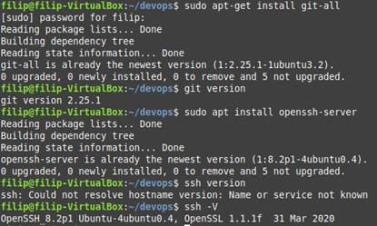

## 2. Sklonowanie repozytorium przy pomocy HTTPS

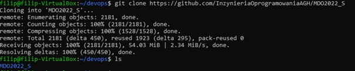

## 3. Wygenerowanie klucza SSH, dodanie go jako metodę dostępu do GitHuba oraz sklonowanie repozytorium przy pomocy SSH

### a. Generowanie klucza i dodanie go do agenta SSH
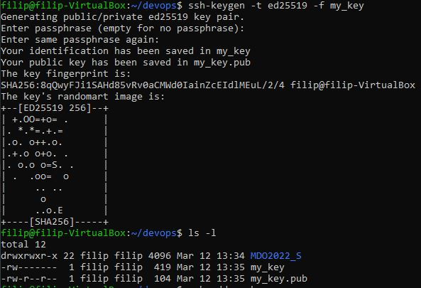
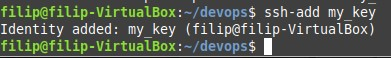
### b. Dodanie klucza SSH do konta na GitHubie
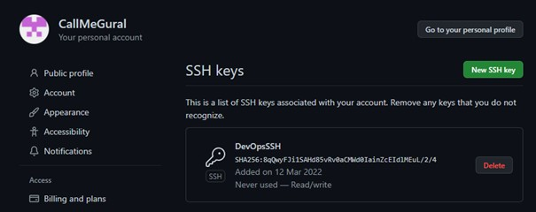
### c. Sklonowanie repozytorium wykorzystując SSH
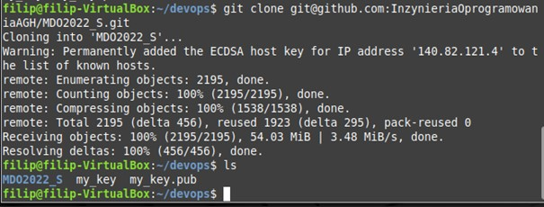

Poprzednio usunąłem repozytorium sklonowane poprzez HTTPS (rm -r)

## 4. Przełączenie się na gałąź swojej grupy
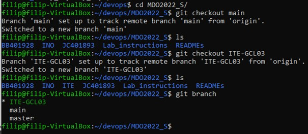
## 5. Utworzenie własnej gałęzi o nazwie "inicjały & nr indeksu"
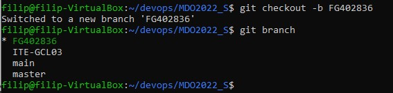
## 6. Dodanie plików do katalogu
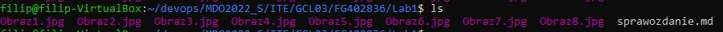
## 7. Dodanie i wysłanie zmian
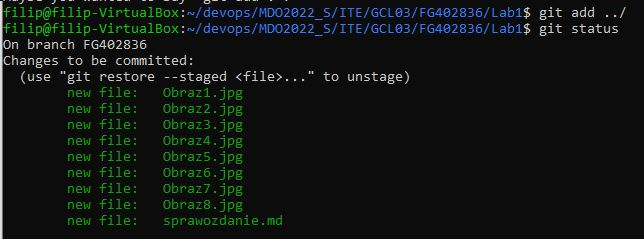
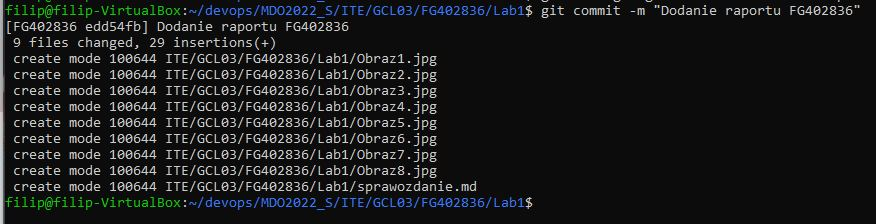
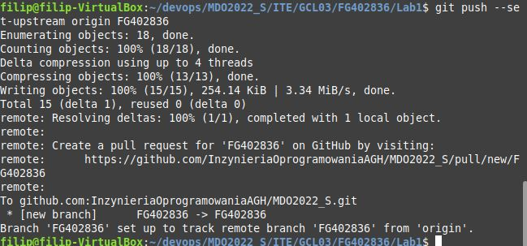
## 8. Próba wciągnięcia gałęzi do gałęzi grupowej
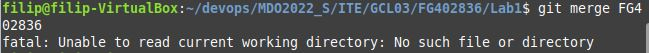
## 9. Aktualizacja sprawozdania
