# Sprawozdanie Filip Górnicki lab 9
### 1. Instalacja systemu Fedora
Wybrałem język systemu:
</br>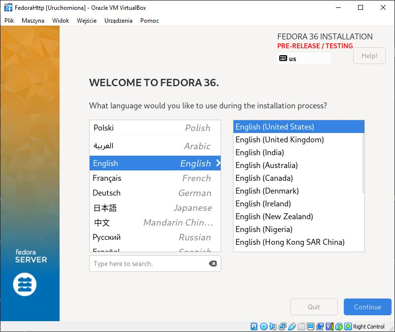
</br>Dodałem polską klawiaturę
</br>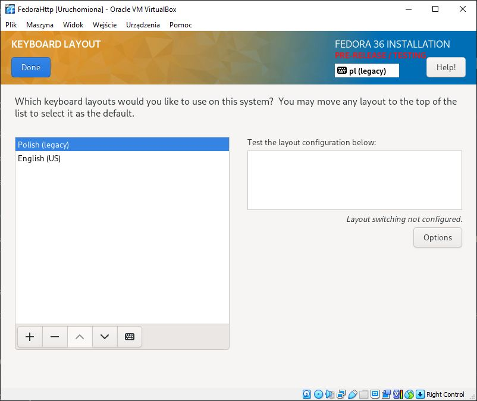
</br>Ustawiłem hostname:
</br>- dla 'zwykłego' systemu: lab9.template.agh
</br>- dla systemu z serwerem http: lab9.http.agh
</br>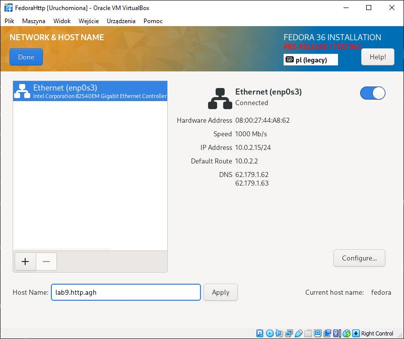
</br>Ustawiłem partycje
</br>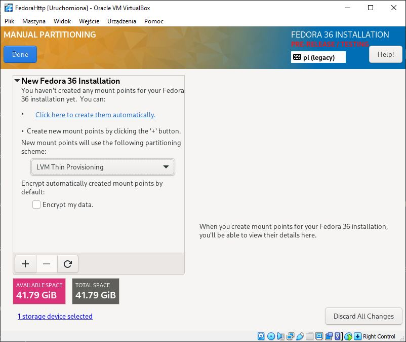
</br>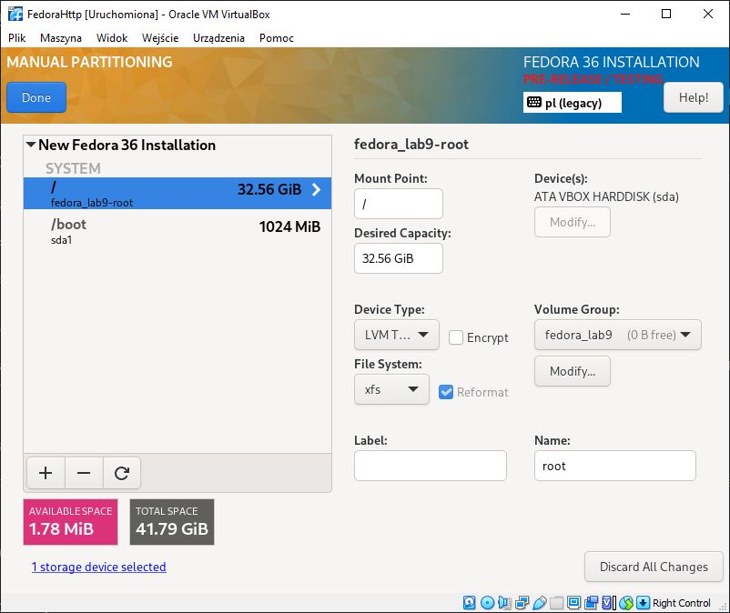
</br>Dodałem konto root'a oraz ustawiłem hasło
</br>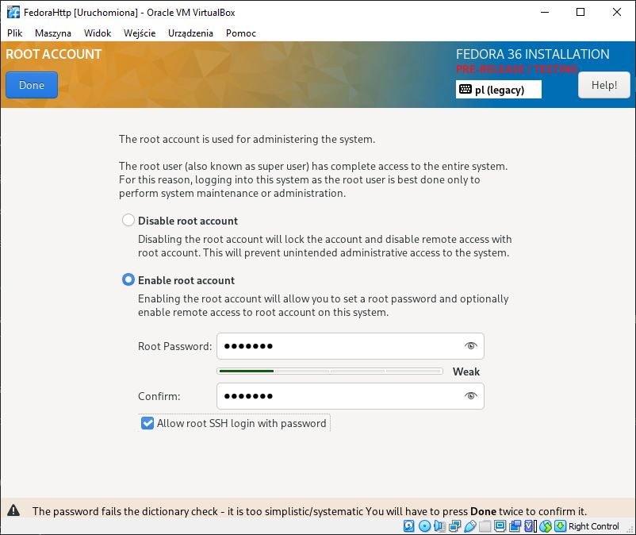
</br>Wybrałem opcję oprogramowania z minimalnymi funkcjonalnościami
</br>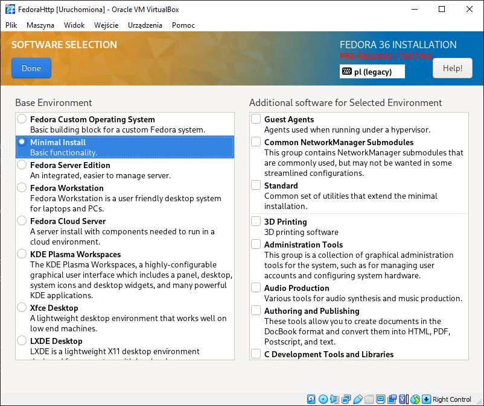
</br>Rozpocząłem instalację systemu
</br>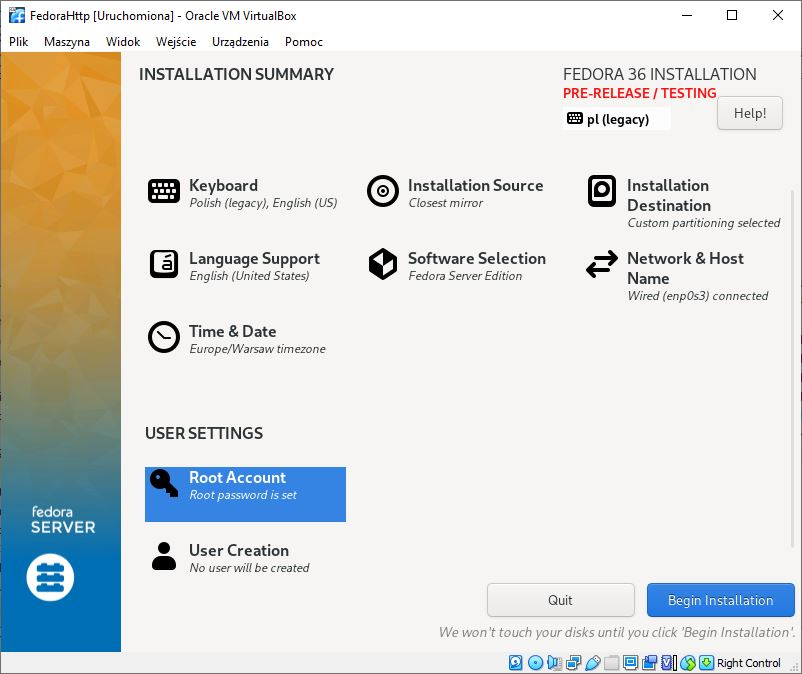
</br>Na obrazie służącym do hostowania plików, zainstalowałem oprogramowanie do serwera httpd przy użyciu komendy
```
sudo dnf group install "Web Server"
``` 
</br>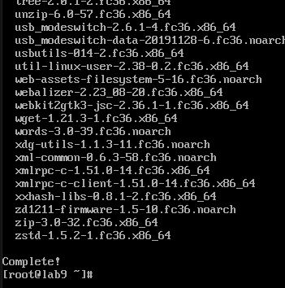
</br>Uruchomiłem usługę
</br>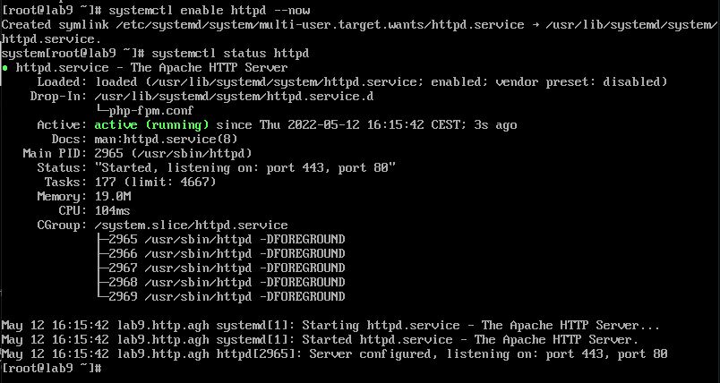  
</br>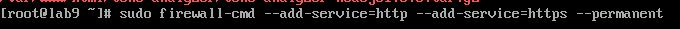
</br>Wrzuciłem artefakt na serwer przy pomocy FileZilli oraz komend
</br>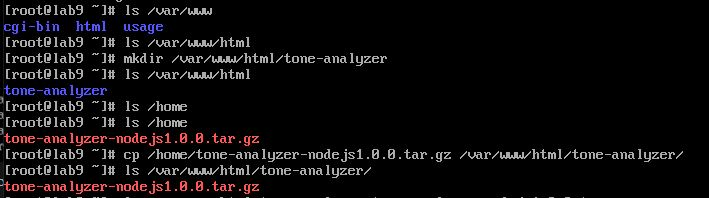
</br>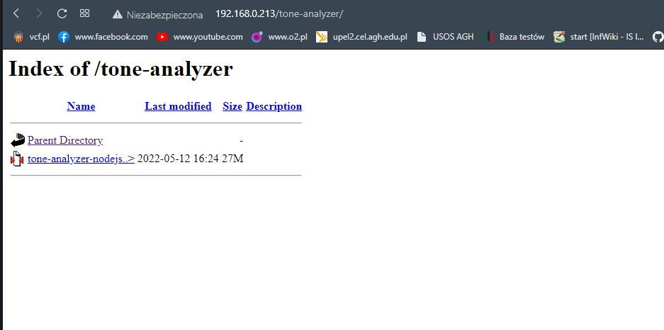
</br>Pobrałem z serwera na 'zwykły' system plik przy pomocy komendy
```
scp root@192.168.0.213:/var/www/html/tone-analyzer/tone-analyzer-nodejs1.0.0.tar.gz .
```
</br>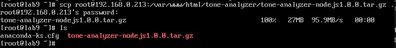
### 2. Instalacja nienadzorowana
</br>Po zainstalowaniu systemu, wykorzystując FileZillę, skopiowałem plik odpowiedzi z instalacji o nazwie
```
anaconda-ks.cfg
```
</br>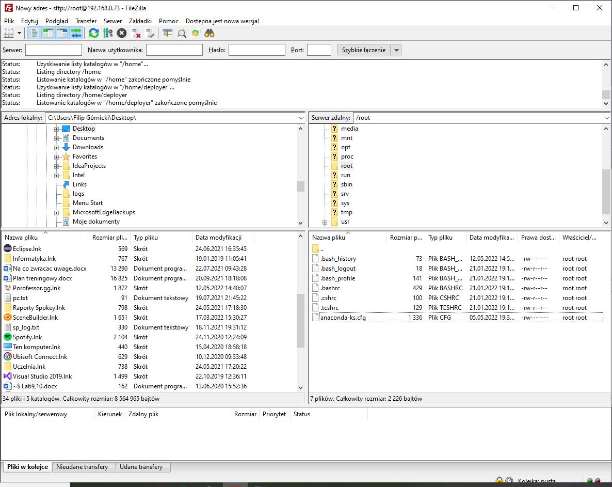
</br>Zedytowałem plik:
```
# Use graphical install
text

# Repo
url --mirrorlist=http://mirrors.fedoraproject.org/mirrorlist?repo=fedora-$releasever&arch=x86_64 repo --name=updates --mirrorlist=http://mirrors.fedoraproject.org/mirrorlist?repo=updates-released-f$releasever&arch=x86_64

%post
mkdir tone-analyzer
scp root@192.168.0.213:/var/www/html/tone-analyzer/tone-analyzer-nodejs1.0.0.tar.gz ./tone-analyzer
%end
```
</br>Utworzyłem nową maszynę wirtualną z identycznymi parametrami jak pierwsza ('zwykła').  
</br>Na ekranie startowym wpisałem polecenie
</br>
</br>Instalacja powiodła się  
</br>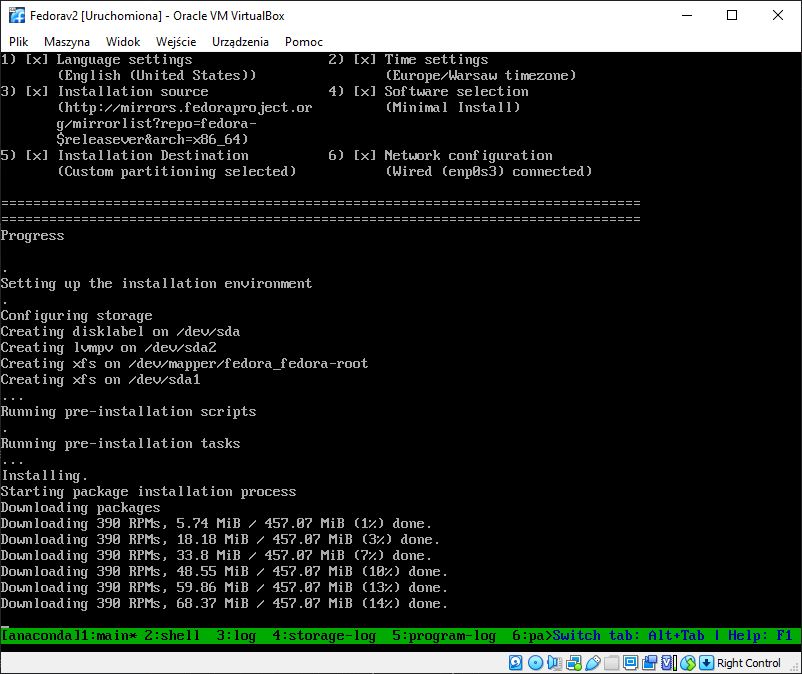
</br>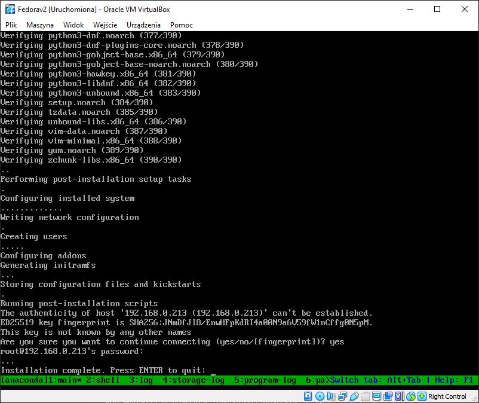
</br>Paczka została pobrana z serwera
</br>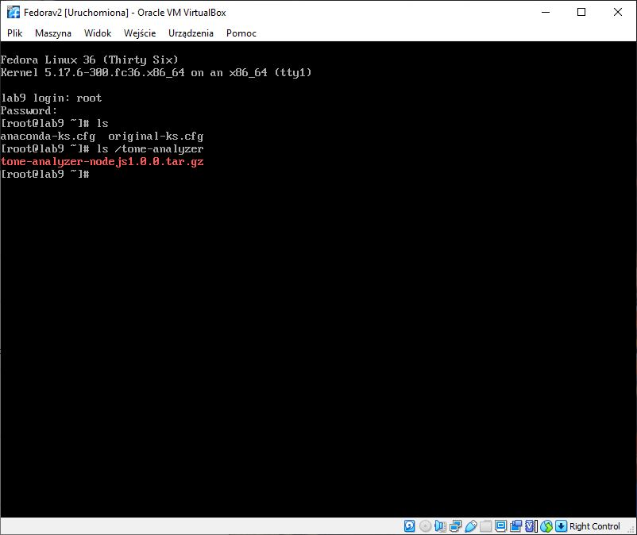
