# Sprawozdanie 11
### Filip Górnicki
## 1. Klastra Kubernetes
Zainstalowałem minikube na podstawie dokumentacji:
 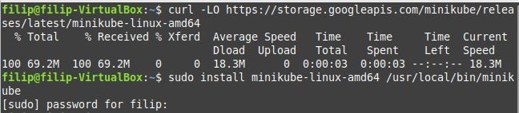
 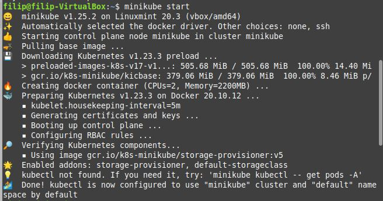
 Oraz zaopatrzyłem się w polecenie kubectl
 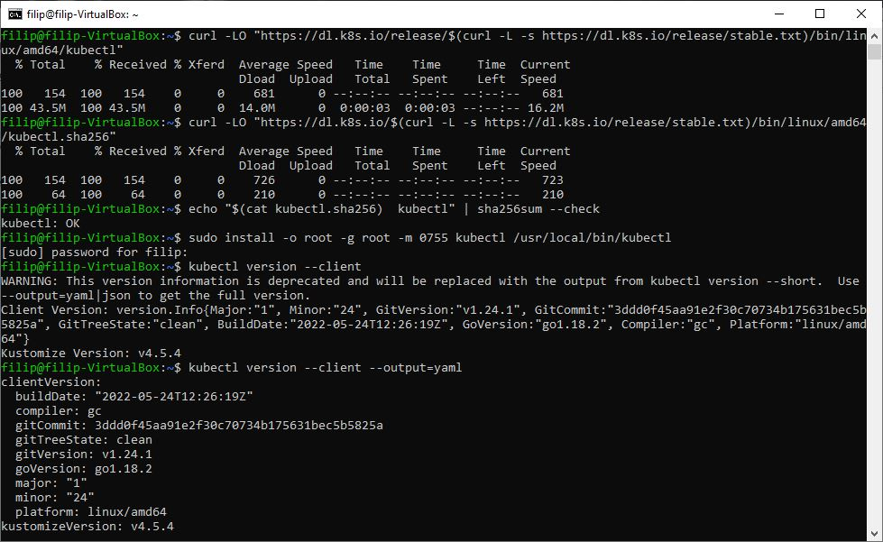
 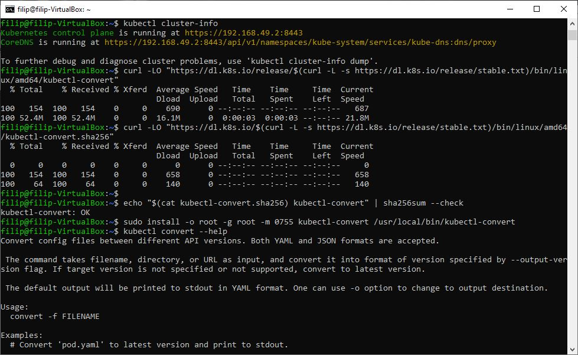
 Wpisaniu komendy minikube dashboard, uruchomiła się przeglądarka:
 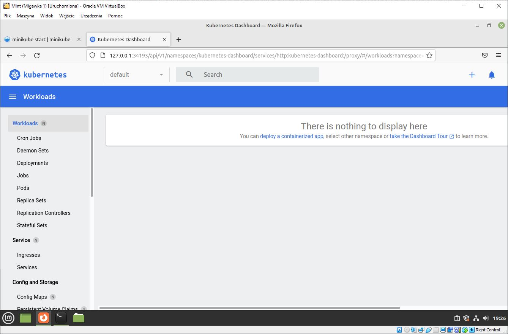
 Kuberenetes działa jako kontener
 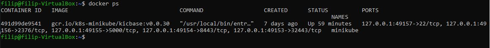
## 2. Analiza posiadanego kontenera
Pobrałem gotowy obraz nginx komendą
``docker pull nginx`` oraz uruchomiłem:
 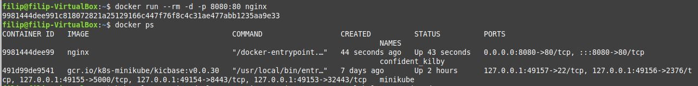
## 3. Uruchamianie oprogramowania
Uruchomiłem kontener na stosie
 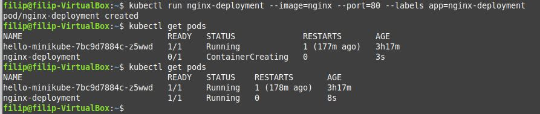
 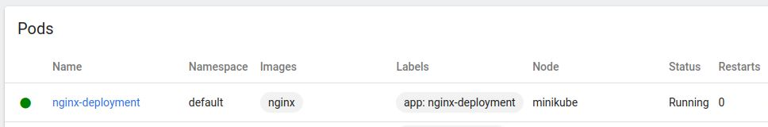
 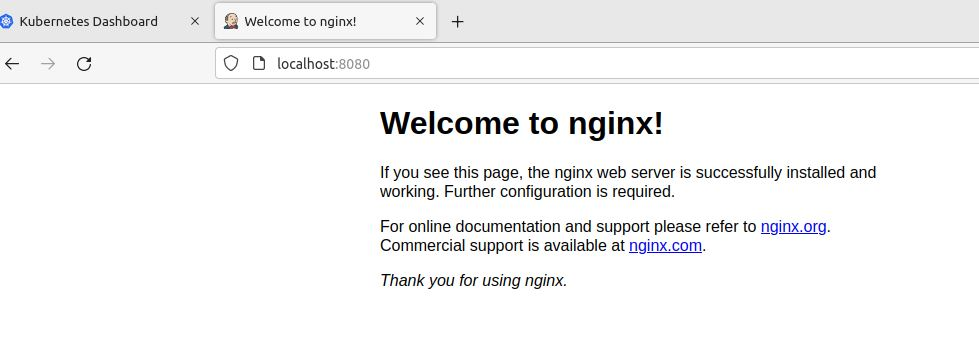
 Wyprowadziłem port
 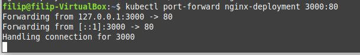
 
## 4. Utworzenie pliku wdrożenia
Utworzyłem plik wdrożeniowy:
 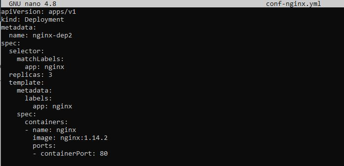
W którym dodaje 3 repliki.
 Uruchamiam oprogramowanie wykorzystując plik wdrożeniowy:
 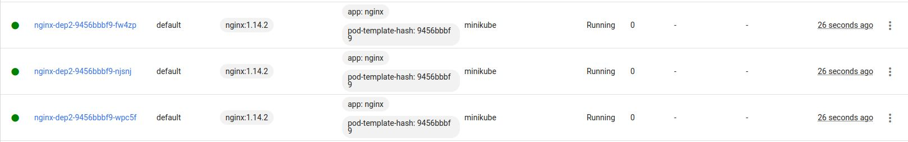
 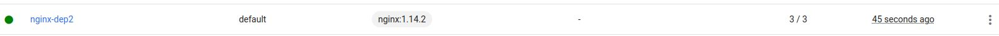

