# Sprawozdanie 12
### Filip Górnicki
## 1. Konwersja wdrożenia ręcznego na dekleratywne
Wzbogaciłem obraz o 4 repliki, a następnie go wdrożyłem i zbadałem stan
</br>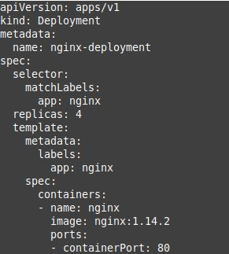
</br>
</br>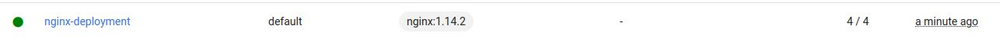
## 2. Przygotowanie nowego obrazu
Utworzyłem Dockerfile, który przygotowuje obraz z błędem
</br>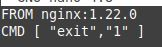
</br>Nowy obraz nazwałem nginx-fail
## 3. Zmiany w deploymencie - aktualizacja pliku .yml
### a) Zwiększenie replik:
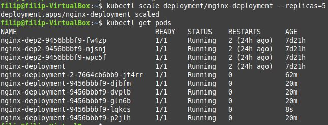
### b) Zmniejszenie liczby replik do 1
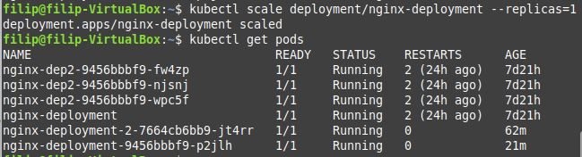
### b) Zmniejszenie liczby replik do 0
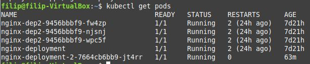
### c) Zastosowanie nowego obrazu
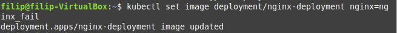
</br>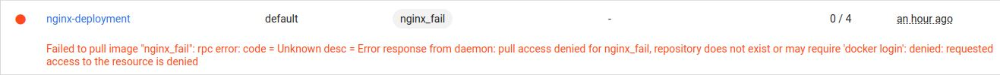
### d) Zastosowanie starego obrazu
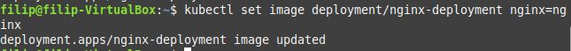
</br>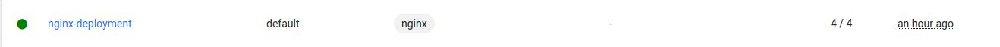
### e) Przywrócenie poprzednich wersji wdrożeń
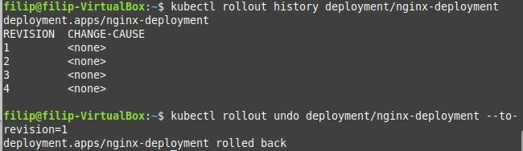
## 4. Kontrola wdrożenia - skrypt
Utworzyłem skrypt sprawdzający czy wdrożenie wykonało się w przeciągu 60 sekund
</br>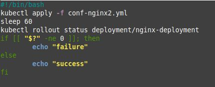
</br>Sprawdziłem poprawność skryptu - usunąłem wcześniejszy Deployment i utworzyłem go przy pomocy skryptu - wdrożenie powiodło się
</br>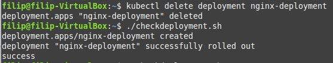
## 5. Strategie wdrożenia
### a) Recreate
Do pliku wdrożeniowego należało dodać:
</br>
```
strategy:
  type: Recreate
```
</br>Strategia ta powoduje natychmiastowe zabicie wszystkich podów i utworzenie nowych.
</br>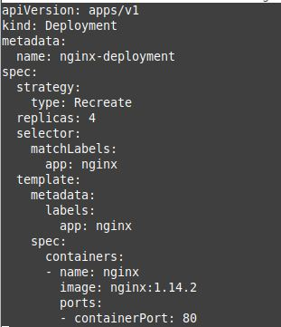
</br>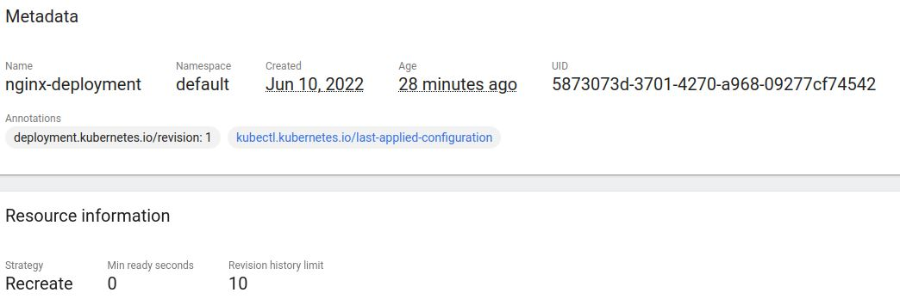
</br>Tutaj powstał problem - sprawdzając w różnych źródłach czy nie popełniłem gdzieś błędu w pliku wdrożeniowym, takowych nie zauważyłem a mimo to strategia ta się nie wykonywała
### b) Rolling Update
Jest to strategia, która jest ustawiona jako domyślna, dlatego podstawowa wersja pliku wdrożeniowego jest przykładem wykorzystania strategii Rolling Update.
</br>Polega ona na płynnym aktualizowaniu liczby podów bez przerw w działaniu deploymentu, np:
</br>- mamy 4 pody i zmniejszamy ich liczbę do 3 - zostanie usunięty jeden pod, reszta pozostanie nietknięta
</br>- mamy 4 pody i zwiększamy ich liczbę do 5 - zostanie dodany nowy pod, a reszta zostanie nietknięta
### c) Canary Deployment
Utworzyłem dwa pliki wdrożeniowe dodając nową etykietę version o dwóch róznych wartościach - 1.0 oraz 2.0
</br>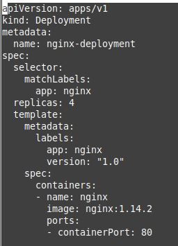
</br>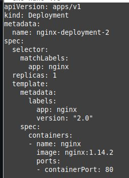
</br>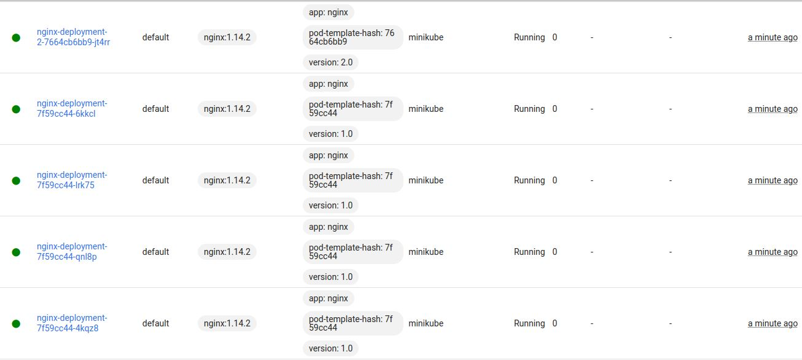
</br>Powstały dwa deploymenty, których pody różnią się jedynie wartością etykiety version.
Nowa wersja aplikacji jest wdrażana obok poprzedniej.
</br>Następować będzie teraz monitorowanie "kanarka", czyli deploymentu 2.0 i migrowanie użytkowników z wersji 1.0 na niego. Proces taki będzie trwał do momentu wykrycia błędu lub gdy wszyscy użytkownicy przejdą na "kanarka".