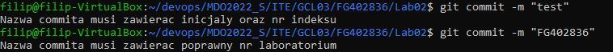
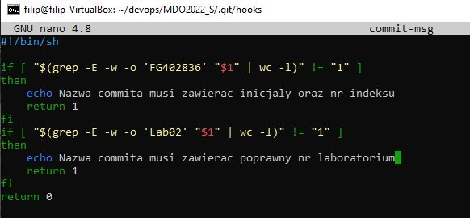
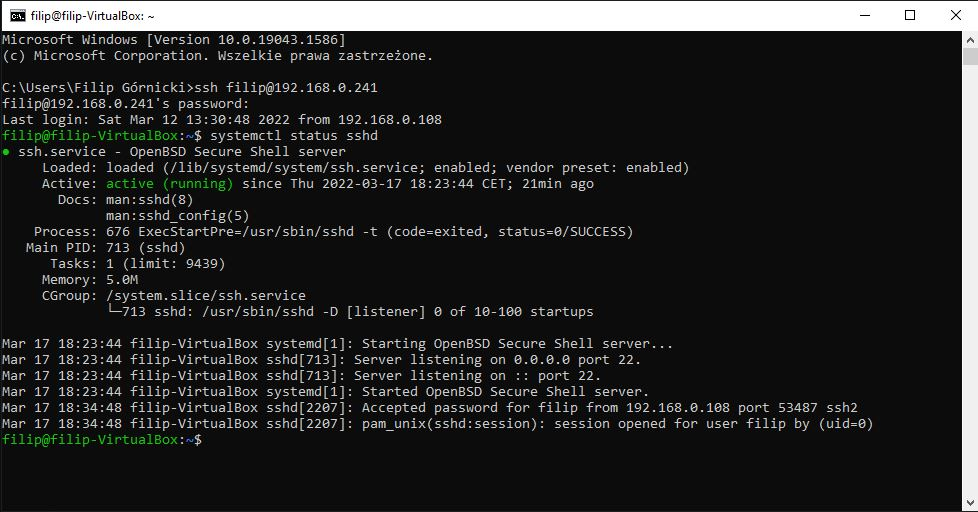
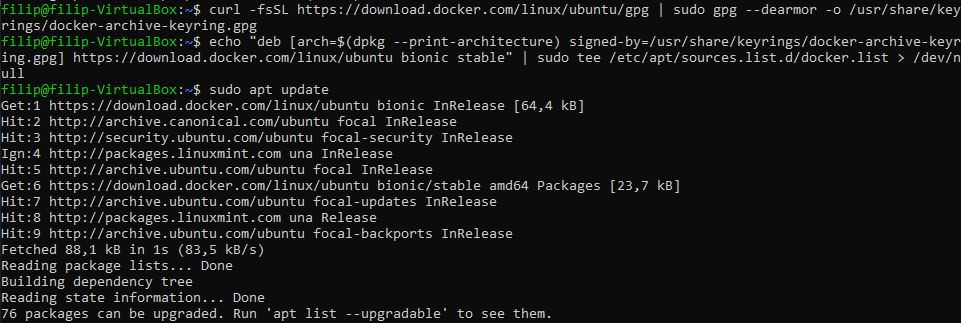
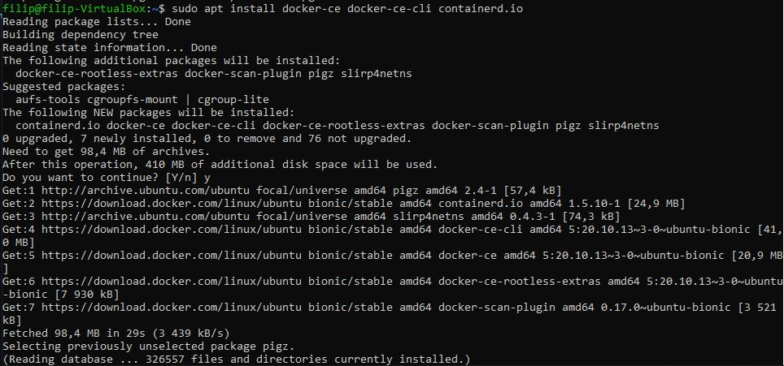
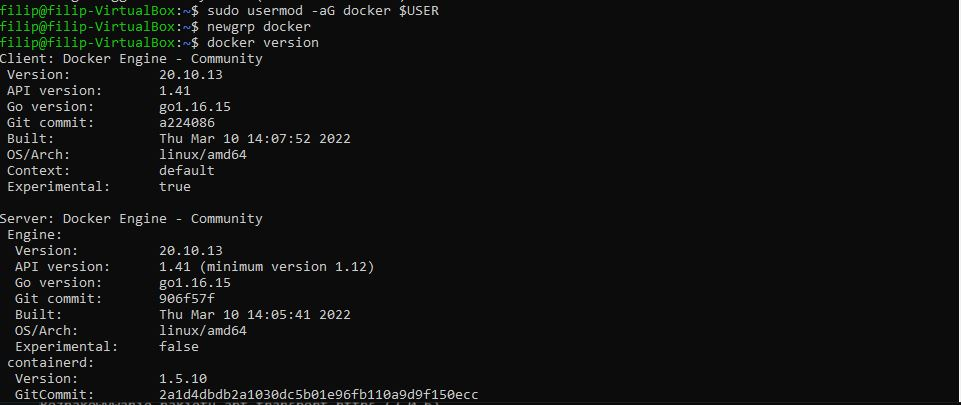
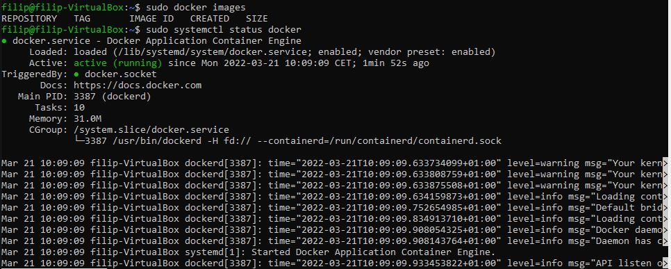
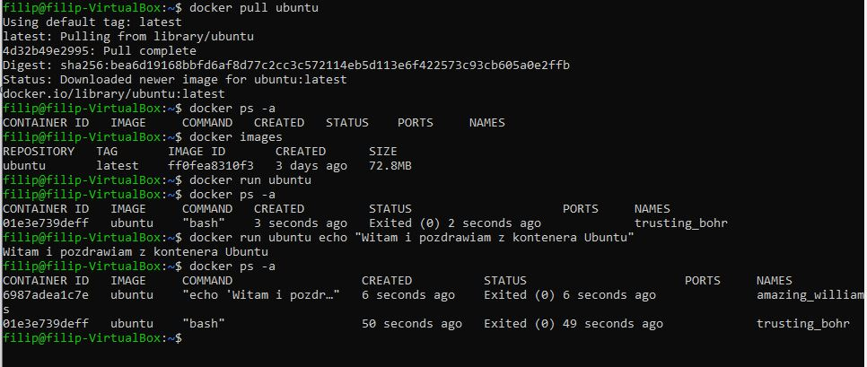
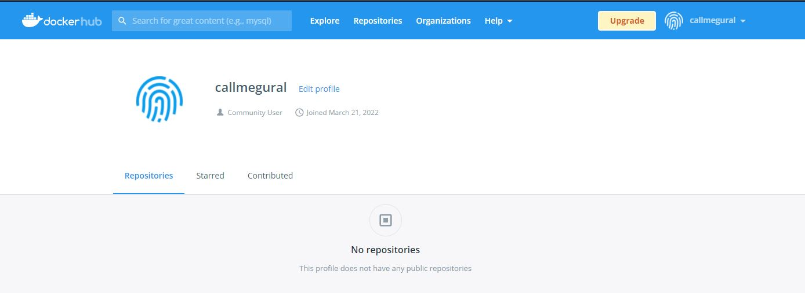

# Sprawozdanie 2
Filip Górnicki gr III DevOps 17.03.2022
## 1. Przygotuj git hook sprawdzający czy tytuł commita nazywa się \<inicjały>\<nr indeksu> oraz czy pada numer labu zadania

  
## 2. Rozpocznij przygotowanie środowiska Dockerowego
### a) dostęp do VM przez terminal
Wykorzystano terminal Windows do kontaktu z VM
 
### b) instalacja Dockera

 
 
 
## 3. Działanie środowiska
### a) wykazanie działania z definicji

### b) wykazanie działania praktycznie poprzez instalacje dystrybucji linuksowej i wyświetlenie nr wersji

## 4. Założenie konta na Docker Hub

