# Sprawozdanie 3
Filip Górnicki gr III DevOps 24.03.2022
## 1. Wybór oprogramowania na zajęcia
### 1. Wybrałem repozytorium z otwartą licencją oraz narzędziem npm https://github.com/watson-developer-cloud/tone-analyzer-nodejs
### 2. Sklonowałem repozytorium, doinstalowałem potrzebne zależności i zbudowałem program:
Sklonowałem: git clone
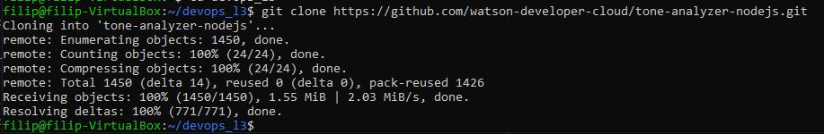
 sudo apt install npm
 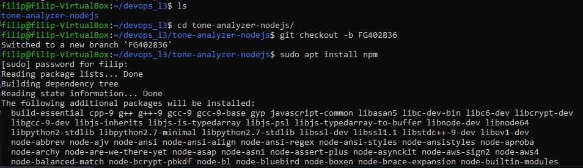
  Zbudowałem program: nmp install
 
  Oraz uruchomiłem: nmp start
 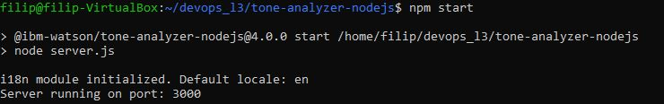
  Aplikacja działa na localhoscie na porcie 3000
 
  Uruchomiłem testy jednostkowe: nmp test
 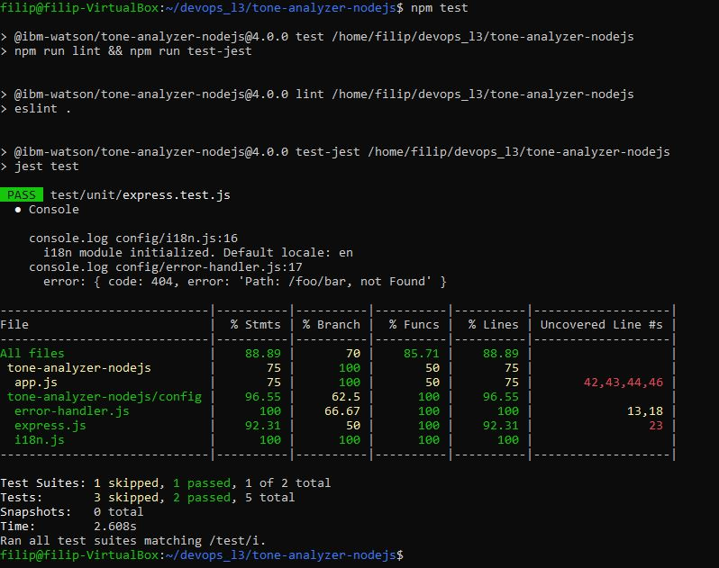
## 2. Przeprowadzenie buildu w kontenerze
### 1. Uruchomiłem kontener ubuntu, który pobrałem na ostatnich zajęciach, zainstalowałem w kontenerze gita oraz sklonowałem repozytorium
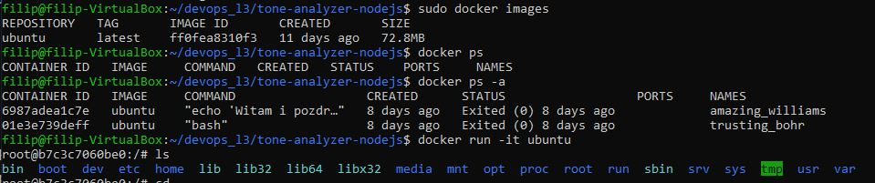
 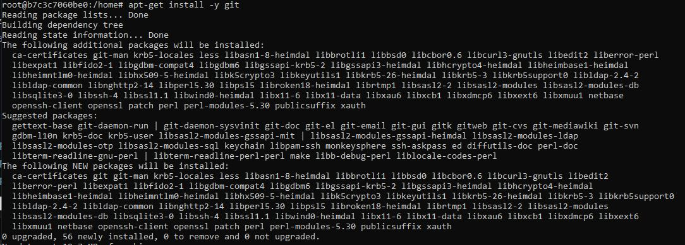
 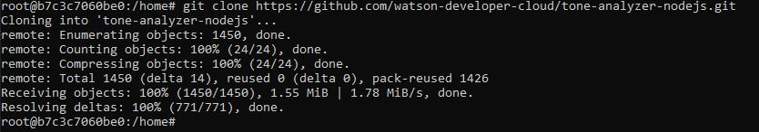
 Zainstalowałem npm
 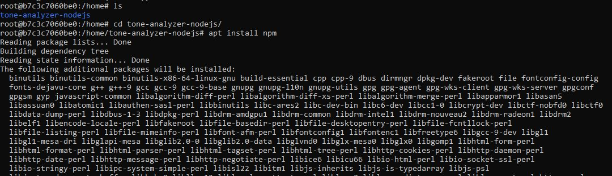
 Zbudowałem program
 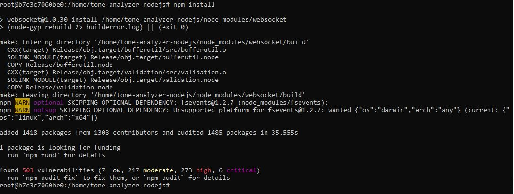
 Uruchomiłem testy
 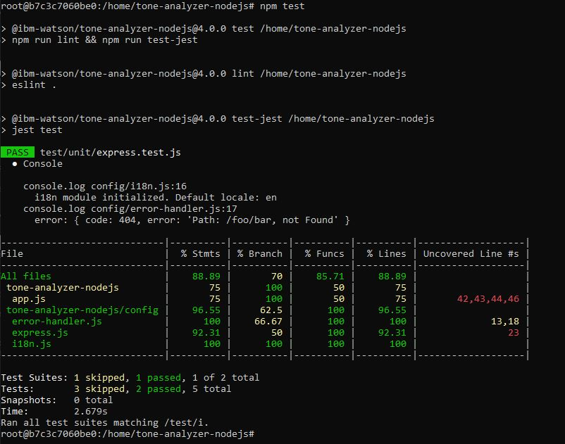
### 2. Stworzyłem pliki Dockerfile automatyzujące kroki powyżej
 Kod Dockerfile1:
 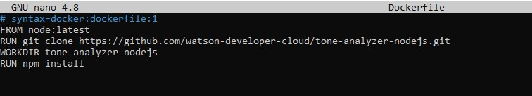
 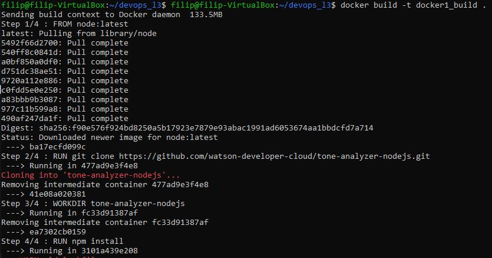
 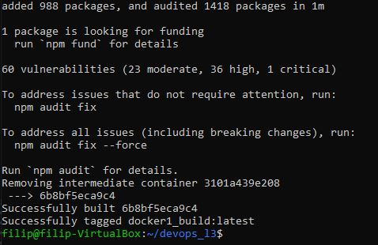
 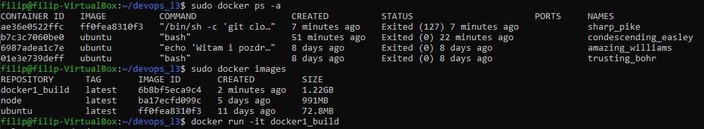
 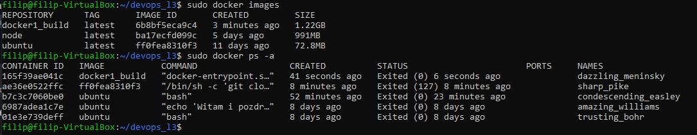
 Kod Dockerfile2:
 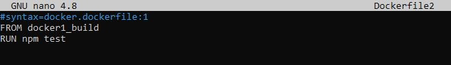
 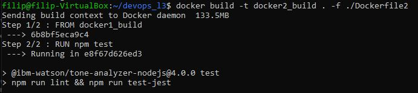
 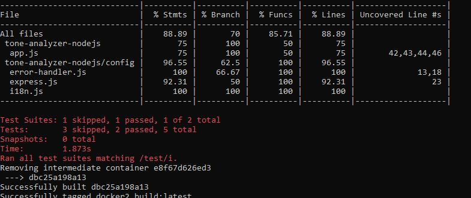
 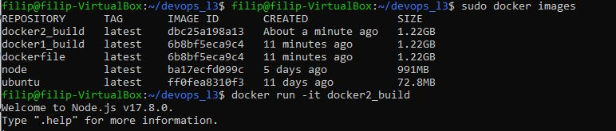
 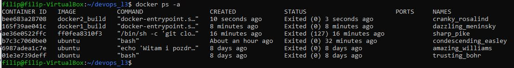
### 3. Wykaż, że kontener wdraża się i pracuje poprawnie
 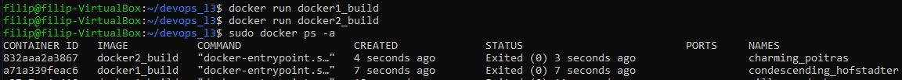
 Zauważyć można, że kontenery wdrożyły się i uruchomiły poprawnie, ponieważ kod wyjścia (STATUS) jest równy 0.
