# Sprawozdanie 4
Filip Górnicki gr III DevOps 31.03.2022
## 1. Zachowywanie stanu
### 1. Utworzenie woluminów wejściowych i wyjściowych i podłączenie do kontenera:
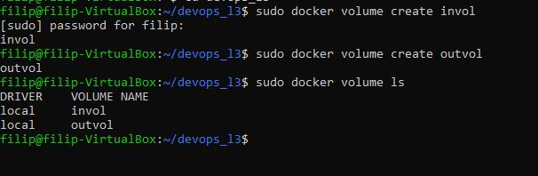
### 2. Uruchomienie kontenera i zainstalowanie wymagań:
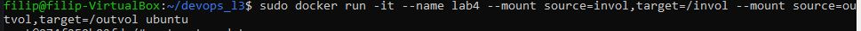
 
### 3. Sklonowanie repozytorium na wolumin wejściowy:
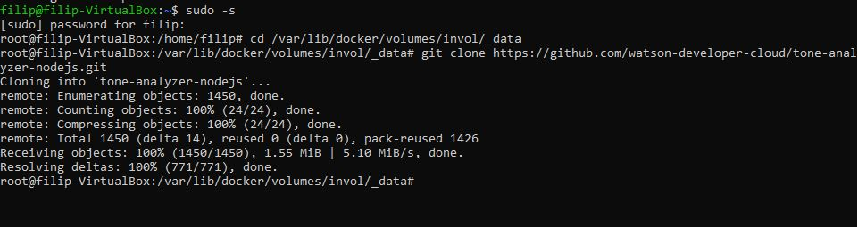
 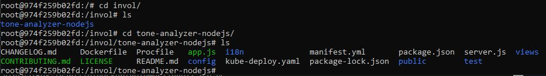
### 4. Uruchomienie buildu w kontenerze:
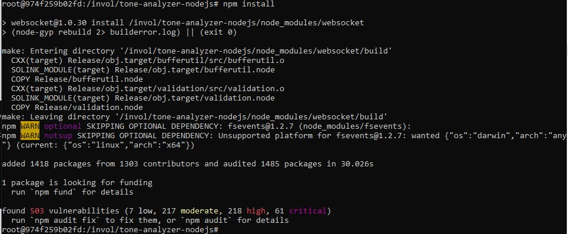
### 5. Zapisanie powstałych plików na woluminie wyjściowym:
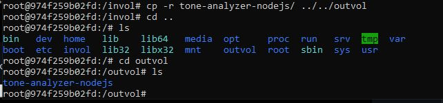
 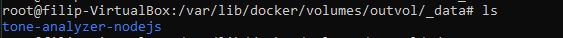
## 2. Eksponowanie portu:
### 1. Uruchomienie kontenera z serwerem iperf3
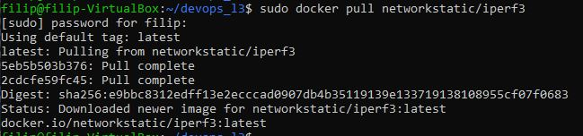
 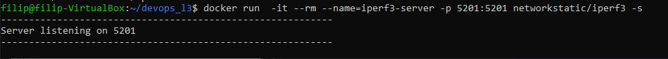
 Przy pomocy komendy sudo docker inspect iperf3-server sprawdzono adres IP kontenera:
 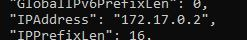
### 2. Połączenie się z kontenerem z innego kontenera:
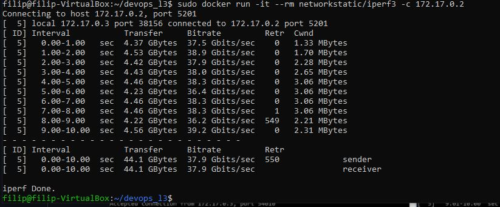
 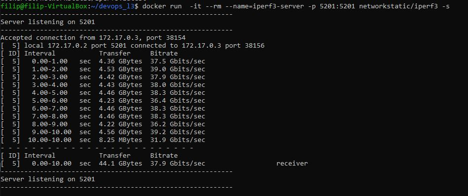
 Przepustowość: 37.9 Gb/s
### 3. Połączenie się z kontenerem z hosta wewnętrznego:
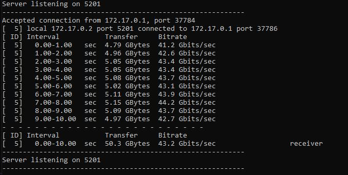
 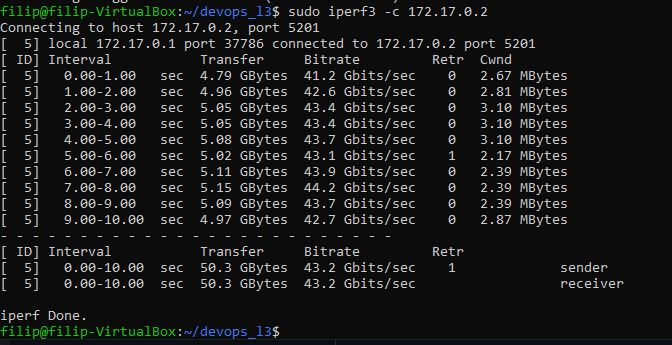
 Przepustowość: 43.2 Gb/s
### 4. Połączenie się z kontenerem z hosta zewnętrznego:
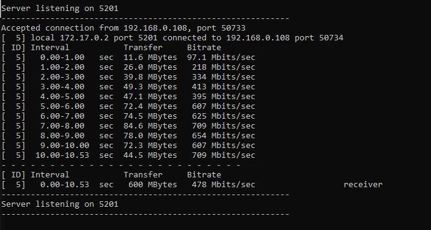
 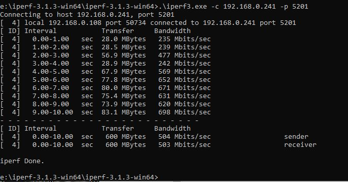
 Przepustowość: 748 Mb/s
 Najwyższą przepustowość osiągnięto podczas łączenia poprzez host wewnętrzny, natomiast najmniejszą poczas łączenia przez host zewnętrzny.
## 3. Instalacja Jenkins
### 1. Zapoznanie z dokumentacją
### 2. Instalacja skonteneryzowanej instalacji Jenkinsa z pomocnikiem DIND:
Utworzono sieć oraz pobrano i uruchomiono obraz DIND:
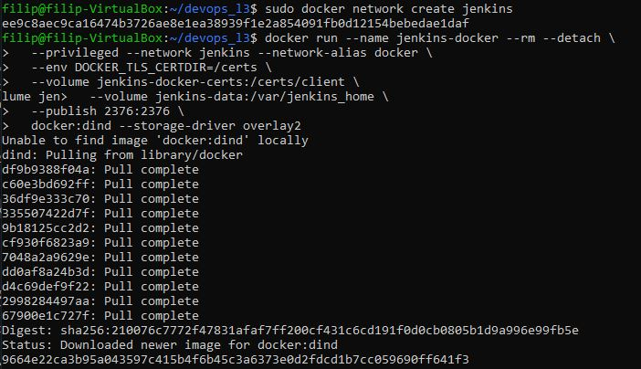
 Utworzono Dockerfile
 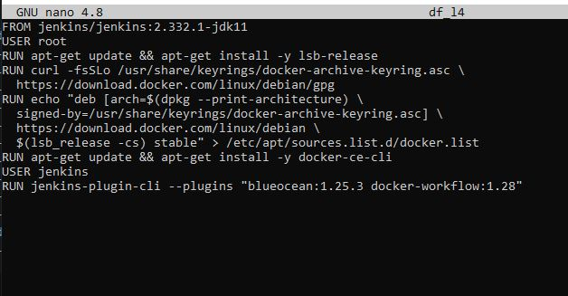
### 3. Zainicjalizuj instancję, wykaż działające kontenery, pokaż ekran logowania
Zbudowano obraz przy pomocy Dockerfile
 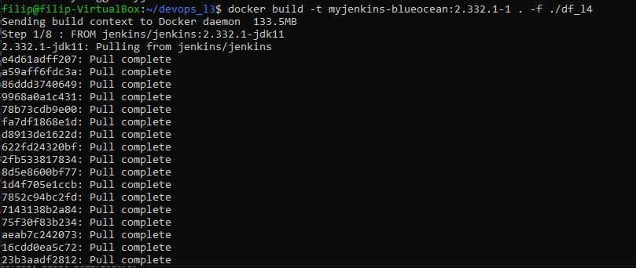
 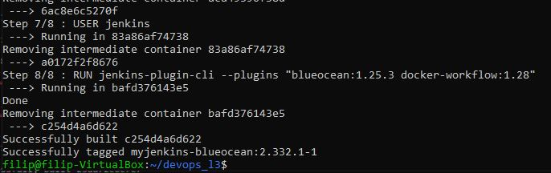
 Uruchomiono kontener
 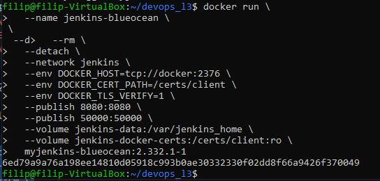
 Ekran powitalny Jenkinsa
 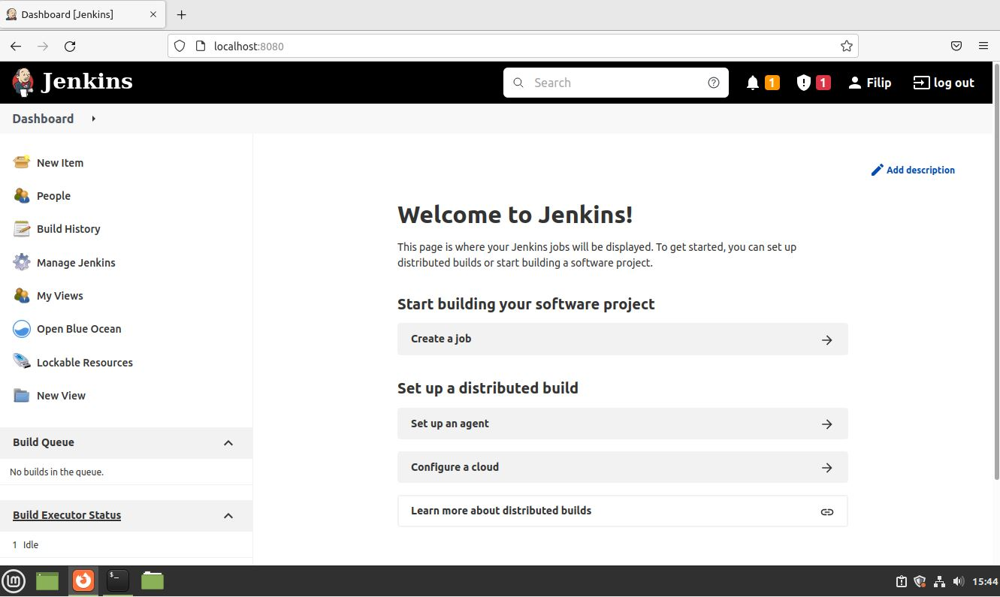
 Działające kontenery
 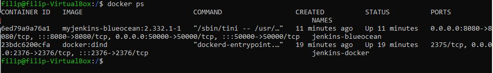

