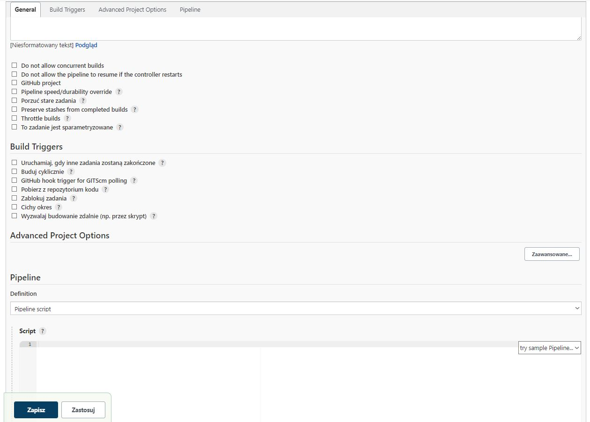
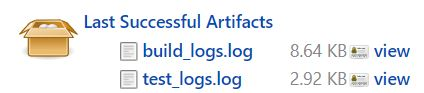
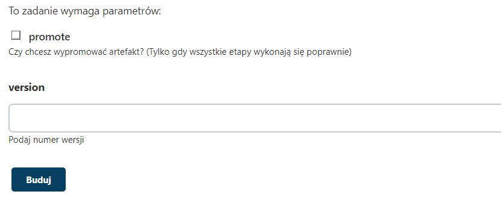
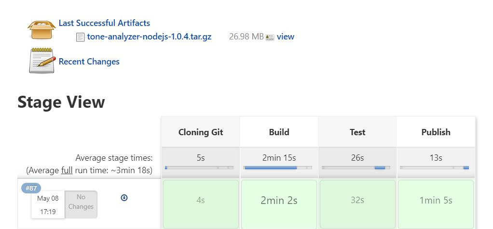
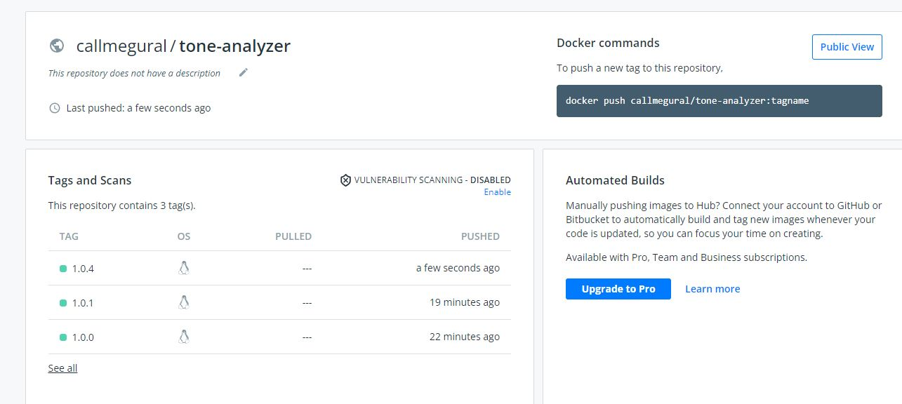
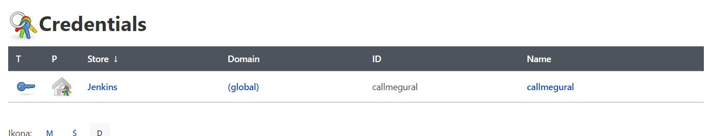
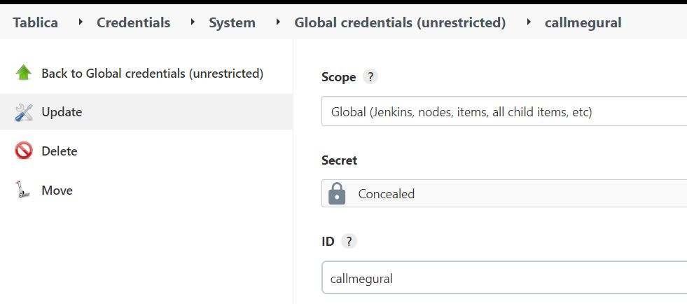
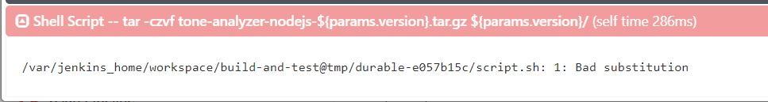
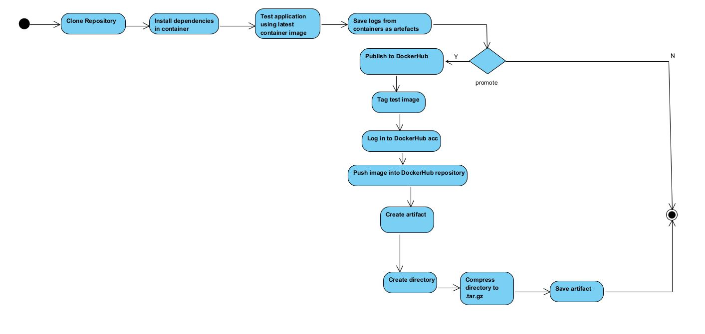

# Sprawozdanie z Projektu DevOps
#### Filip Górnicki
## Cel projektu
Jenkins to jeden z najbardziej znanych systemów Continuous Integration i Continuous Delivery.
</br>Jenkins pozwala na zautomatyzowanie procesu tworzenia oprogramowania, np:
</br>- kompilowania projektu
</br>- wykonania testów jednostkowych
</br>- budowania i publikowania aplikacji
</br>Do projektu wybrano aplikację w NodeJS do analizy tonu w jakim został napisany tekst (https://github.com/watson-developer-cloud/tone-analyzer-nodejs).
</br>Wykorzystując narzędzie Jenkins, utworzyłem pipeline, który automatycznie instaluje dependencje, testuje, tworzy artefakty z logów i spakowanego programu oraz wysyła obraz kontenera na DockerHub.
## Działanie
### 1. Konfiguracja Jenkinsa
Bazując na dokumentacji Jenkinsa (https://www.jenkins.io/doc/book/installing/docker/) wykonałem potrzebne kroki pozwalające uruchomić Jenkinsa:
</br>Utworzyłem bridga w dockerze
```
docker network create jenkins
```
</br>Uruchomiłem obrazu kontenera aby móc obsługiwać polecenia Dockera
```
docker run \
  --name jenkins-docker \
  --rm \
  --detach \
  --privileged \
  --network jenkins \
  --network-alias docker \
  --env DOCKER_TLS_CERTDIR=/certs \
  --volume jenkins-docker-certs:/certs/client \
  --volume jenkins-data:/var/jenkins_home \
  --publish 2376:2376 \
  docker:dind \
  --storage-driver overlay2
```
</br>Utworzyłem Dockerfile 
```
FROM jenkins/jenkins:2.332.3-jdk11
USER root
RUN apt-get update && apt-get install -y lsb-release
RUN curl -fsSLo /usr/share/keyrings/docker-archive-keyring.asc \
  https://download.docker.com/linux/debian/gpg
RUN echo "deb [arch=$(dpkg --print-architecture) \
  signed-by=/usr/share/keyrings/docker-archive-keyring.asc] \
  https://download.docker.com/linux/debian \
  $(lsb_release -cs) stable" > /etc/apt/sources.list.d/docker.list
RUN apt-get update && apt-get install -y docker-ce-cli
USER jenkins
RUN jenkins-plugin-cli --plugins "blueocean:1.25.3 docker-workflow:1.28"
```
</br>Zbudowałem obraz
```
docker build -t myjenkins-blueocean:2.332.3-1 .
```
</br>Uruchomiłem obraz z Jenkinsem
```
docker run \
  --name jenkins-blueocean \
  --rm \
  --detach \
  --network jenkins \
  --env DOCKER_HOST=tcp://docker:2376 \
  --env DOCKER_CERT_PATH=/certs/client \
  --env DOCKER_TLS_VERIFY=1 \
  --publish 8080:8080 \
  --publish 50000:50000 \
  --volume jenkins-data:/var/jenkins_home \
  --volume jenkins-docker-certs:/certs/client:ro \
  myjenkins-blueocean:2.332.3-1 
```
</br>Po wykonaniu tych kroków, na porcie 8080 powinna uruchomić się strona startowa Jenkinsa.
</br>Przy kolejnych uruchomieniach Jenkinsa należy jedynie uruchomić oba kontenery.
</br>Nieuruchomienie kontenera `jenkins-docker` spowoduje błąd poczas budowania kontenerów.
### 2. Tworzenie nowego pipeline
Po zalogowaniu na Jenkinsa należy wybrać: Nowy Projekt -> Pipeline oraz nadać nazwę.
</br>Pojawi się następujące okno:

### 3. Podłączanie repozytorium uczelnianego, na którym znajdują się potrzebne do zainstalowania zależności oraz testowania Dockerfile
Pipeline ma ustaloną konwencję jego tworzenia - dzieli się go na części nazywane Stage'ami
```
stage('Cloning Git') {
            steps {
                sh "docker system prune --all -f"
                git url: 'https://github.com/InzynieriaOprogramowaniaAGH/MDO2022_S.git', branch: 'FG402836'
                sh 'rm build_logs.log'
                sh 'rm test_logs.log'
                sh 'touch build_logs.log'
                sh 'touch test_logs.log'
            }
        }
```
W pierwszym stage'u profilaktycznie usuwam wszystkie obrazy kontenerów a następnie klonuję repozytorium uczelniane z Dockerfile'ami do instalowania dependencji oraz testowania, a następnie przełączam się na swojego brancha.
</br>Dodatkowo tworzę pliki do przechowania logów z kontenerów.
### 4. Instalowanie dependencji
```
stage('Build') {
            steps {
                sh 'echo "Building"'
                sh 'docker build -t docker1_build:latest . -f ./ITE/GCL03/FG402836/lab5/build_df/Dockerfile | tee build_logs.log'
                sh 'docker run --name  docker1_build docker1_build:latest'
            }
        }
```
W tym kroku buduję obraz z Dockerfile'a znajdującego się na mojej gałęzi w folderze lab5/build_df, który następnie uruchamiam nazywając go `docker1_build`.
</br>Dodatkowo, przy pomocy komendy `tee`, zapisuje logi do pliku.
<br>Uwaga: Nazwa doker1_build powstała na potrzeby wcześniejszych zajęć. Teraz chciałem nadać inną (jenkinsbuild), jednak w Dockerfile'u do testowania, zachowałem wcześniejszą nazwę, przez co (domyślam się, że spowodowane jest to synchronizacją z GitHubem) nie wykrywało mi nowej nazwy.
</br>Wykorzystany do tego kroku Dockerfile wygląda następująco:
```
FROM node:latest
RUN git clone https://github.com/watson-developer-cloud/tone-analyzer-nodejs.git
WORKDIR tone-analyzer-nodejs
RUN npm install
```
Wybranym obrazem jest `node`, dzięki któremu mogę wykorzystywać polecenia `npm`. Klonuję wybrane przez siebie repozytorium do tworzonego katalogu tone-analyzer-nodejs, po czym instaluję zależności poleceniem `npm install`.
### 5. Testowanie projektu
```
stage('Test') {
            steps {
                sh 'echo "Testing"'
                sh 'docker build -t jenkinstest:latest . -f ./ITE/GCL03/FG402836/lab5/test_df/Dockerfile | tee test_logs.log'
                sh 'docker run --name  jenkinstest jenkinstest:latest'
            }
        }
```
W kroku `Test` ponownie buduję oraz uruchamiam obraz z Dockerfile'a z mojej gałęzi, natomiast, jest to Dockerfile do uruchamiania testów, znajdujący się w folderze lab5/test_df.
</br>Dodatkowo, przy pomocy komendy `tee`, zapisuje logi do pliku.
```
FROM docker1_build
RUN npm test
```
Ten Dockerfile wykorzystuje obraz utworzony poprzednim Dockerfilem (`node`) oraz uruchamia testy poleceniem `npm test`.
### 6. Cleanup i logi
```
stage('Cleanup') {
            steps {
                sh ' docker rm docker1_build'
                sh 'docker rm jenkinstest'
                archiveArtifacts artifacts: "build_logs.log"
                archiveArtifacts artifacts: "test_logs.log"
            }
        }
```
W tym kroku usuwam obrazy nieużywanych już kontenerów oraz eksportuje logi z kontenerów, które wcześniej zapisałem do plików `.log`, do artefaktów.
</br>
### 7. Promowanie do artefektu oraz na DockerHuba.
W tym kroku, wiedząc, że aplikacja działa poprawnie, tworzę artefakt możliwy do pobrania oraz dodatkowo wysyłam obraz kontenera na DockerHuba.
</br>Najpierw jednak, potrzebne jest dodanie parametrów budowania Pipeline'a.
```
parameters {
        booleanParam(name: "promote",
            defaultValue: false,
            description: "Czy chcesz wypromować artefakt? (Tylko gdy wszystkie etapy wykonają się poprawnie)")
        string(name: "version",
            defaultValue: "",
            description: "Podaj numer wersji")
    }
```
Po uruchomieniu skryptu, otrzymuję następujące okno do podania parametrów
</br>
</br>Parametry utworzone wcześniej, wykorzystuję w stage'u publikowania:
```
stage('Publish') {
            steps {
                sh 'echo "Publishing"'
                script {
                    if(params.promote) {
                        sh "mkdir ${params.version}"
                        sh 'docker run --name jenkinstest jenkinstest:latest'
                        sh "docker cp jenkinstest:/tone-analyzer-nodejs ./${params.version}"
                        sh 'echo "Pushing Image to DockerHub"'
                        withCredentials([string(credentialsId: 'callmegural', variable: 'dockerhubpwd')]) {
                            sh 'docker login -u callmegural -p ${dockerhubpwd}'
                        }
                        sh "docker tag jenkinstest:latest callmegural/tone-analyzer:${params.version}"
                        sh "docker push callmegural/tone-analyzer:${params.version}"
                        
                        sh 'docker rm jenkinstest'
                        sh "tar -czvf tone-analyzer-nodejs-${params.version}.tar.gz ${params.version}/"
                        sh 'echo "Creating Artifact"'
                        archiveArtifacts artifacts: "tone-analyzer-nodejs-${params.version}.tar.gz"
                    }
                    else {
                        sh 'echo "Etapy wykonane poprawnie, jednak nie promuje artefaktu do nowej wersji"'
                    }
                }
            }
        }
```
Na początek tworzę folder o nazwie podanej jako parametr (`np 1.0.0`). Następnie uruchamiam kontener z testami i kopiuję jego zawartość do wcześniej utworzonego folderu.
</br>Mając ciągle działający kontener, loguję się do swojego konta na DockerHubie, otagowuje kontener, którego obraz potem wysyłam na repozytorium na DockerHubie.
</br>Usuwam niepotrzebny juz kontener i pakuję folder z przekopiowaną zawartością. Na koniec tworzę artefakt o nazwie < nazwa-programu >-< wersja >.tar.gz.
</br>Powyższe zadania wykonują się jedynie wtedy, gdy wcześniej zaznaczyłem parametr `promote`.
</br>
</br>
</br>Powyższe zrzuty pokazują, że skrypt zadziałał poprawnie i udało się wypromować i artefakt, i obraz kontenera na DockerHuba.
</br>Aby zalogować się z poziomu Jenkinsa do DockerHuba, należy dodać swoje konto na DockerHubie do listy uwierzytelniającej (Credentials).
</br>
</br>
</br>Uwaga: W tym kroku nie wykorzystuję komendy `npm pack` do spakowania aplikacji, ponieważ wykonując ten krok, w paczce znajdował się jedynie jeden, niewielki plik `.json`, dlatego, znajdując inny (pewnie mniej optymalny, a na pewno dłuższy) sposób, który zadział poprawnie, zdecydowałem się na jego pozostawienie.
</br>Uwaga: W trakcie tworzenia skryptu może pojawić się błąd:
</br>
</br>Pojawia się on, gdy w niektórych poleceniach w skrypcie w stage'u Publish, gdy zamiast `cudzysłowów` wykorzystywałem `średniki`. Zamiana na `cudzysłowy` pozwalała naprawić problem. Co dziwniejsze, błąd ten nie pojawiał się co każde wywołanie komendy shellowej.
</br>
### 8. Diagramy
Diagram aktywności:
</br>
</br>Diagram wdrożenia:
</br>
