##### Kamil Kalisztan   WIMiIP, IT, sem.: VI   DevOps GCL03

# Ad 1) Zainstaluj klienta Git i obsługę kluczy SSH
## Instalacja ssh
### Wykonane kroki:
* kamil@kamil-VB:\~$ sudo apt-get update
* kamil@kamil-VB:\~$ sudo apt-get upgrade
* kamil@kamil-VB:\~$ sudo apt-get install openssh-client
* kamil@kamil-VB:\~$ sudo apt install openssh-server
* kamil@kamil-VB:\~$ sudo systemctl enable ssh
* kamil@kamil-VB:\~$ sudo systemctl status ssh
* kamil@kamil-VB:\~$ sudo ufw allow ssh
* kamil@kamil-VB:\~$ ip addr
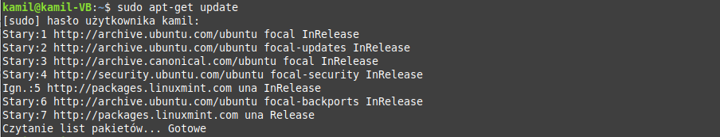
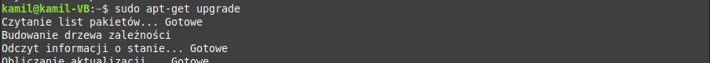
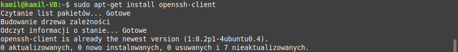
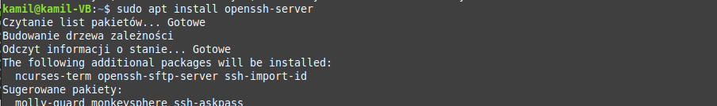
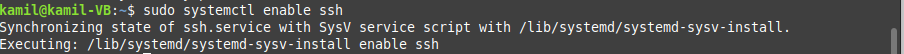
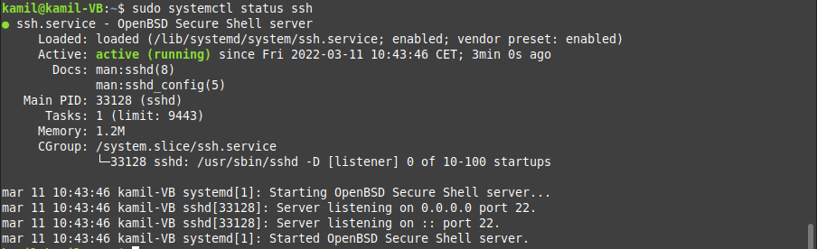
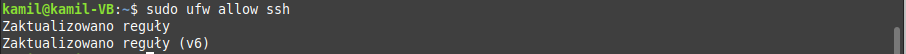
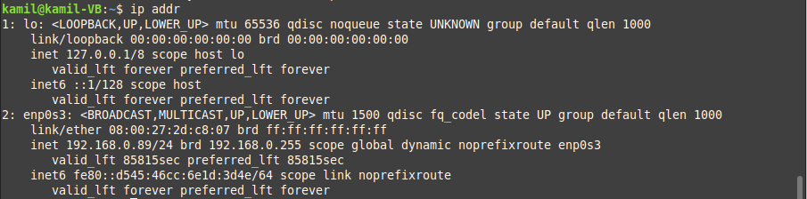
## Połączenie przez ssh z wirtualną maszyną z wykorzystaniem cmd 
* C:\Users\kamil>ssh kamil@192.168.0.89
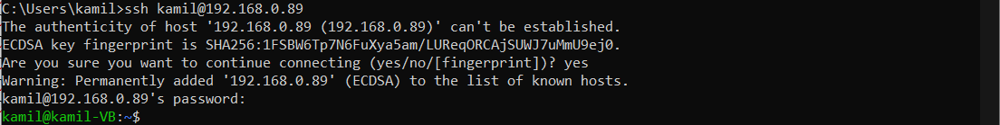
## Instalacja Git:
### Wykonane kroki
* kamil@kamil-VB:~$ sudo apt-get update
* kamil@kamil-VB:~$ sudo apt-get upgrade  
* kamil@kamil-VB:~$ sudo apt-get install git
* kamil@kamil-VB:~$ git –version
* kamil@kamil-VB:~$ git config --global user.name "Kamil Kalisztan"
* kamil@kamil-VB:~$ git config --global user.email kali19jr@gmail.com
* kamil@kamil-VB:~$ git config --list

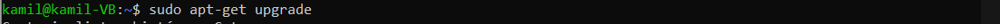

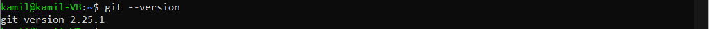

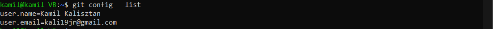

# Ad 2) Sklonuj repozytorium https://github.com/InzynieriaOprogramowaniaAGH/MDO2022_S za pomocą HTTPS

## Wykonane kroki:
* kamil@kamil-VB:~$ cd Pulpit/
* kamil@kamil-VB:~/Pulpit$ mkdir DevOps_Laby
* kamil@kamil-VB:~/Pulpit$ cd DevOps_Laby/
* kamil@kamil-VB:~/Pulpit/DevOps_Laby$ git clone https://github.com/InzynieriaOprogramowaniaAGH/MDO2022_S
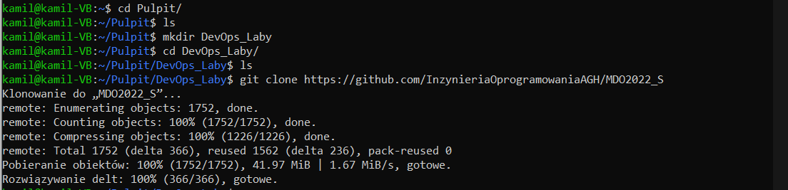

# Ad 3) Upewnij się w kwestii dostępu do repozytorium jako uczestnik i sklonuj je za pomocą utworzonego klucza SSH
*	Utwórz dwa klucze SSH, inne niż RSA, w tym co najmniej jeden zabezpieczony hasłem
*	Skonfiguruj klucz SSH jako metodę dostępu do GitHuba
*	Sklonuj repozytorium z wykorzystaniem protokołu SSH

## Wykonane kroki 
* kamil@kamil-VB:~$ ssh-keygen -t ed25519 -f klucz.id
* kamil@kamil-VB:~$ ls -l
* kamil@kamil-VB:~$ ssh-add klucz
	[Could not open a connection to your authentication agent.]
* kamil@kamil-VB:~$ eval `ssh-agent -s`
* kamil@kamil-VB:~$ ssh-add klucz.id
* kamil@kamil-VB:~$ cat klucz.id.pub
* kamil@kamil-VB:~/Pulpit/DevOps_Laby$ git clone git@github.com:InzynieriaOprogramowaniaAGH/MDO2022_S.git
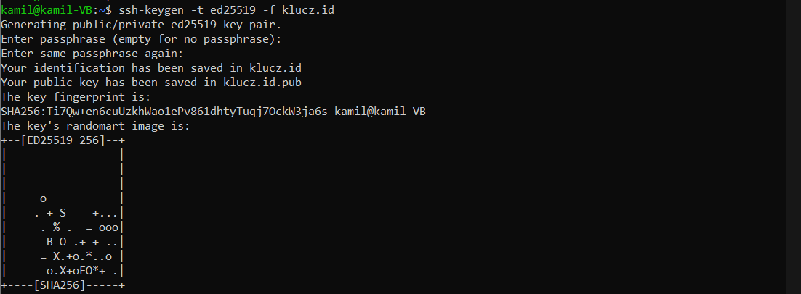
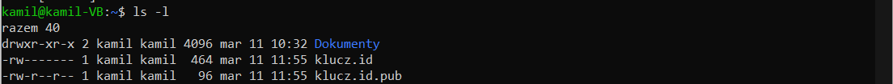
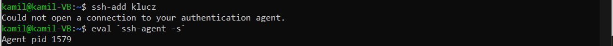
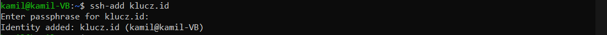
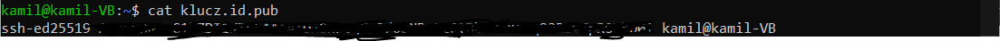
## Konfiguracja klucza SSH jako motoda dostępu do GitHuba - wklejenie klucza publicznego
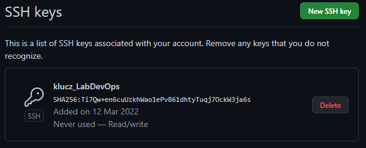
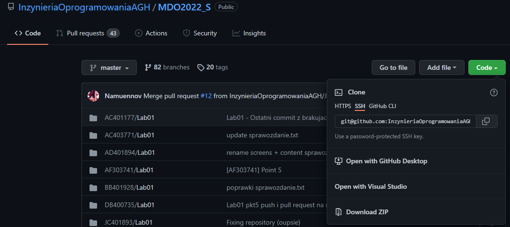
## Sklonowane wcześniej repozytorium usunąłem, a następnie skolonowałem je ponownie do tego samego katalogu za pomocą ssh 
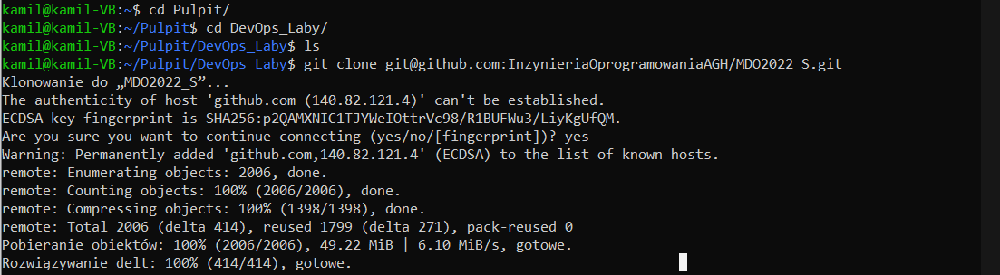

# Ad 4) Przełącz się na gałąź main, a potem na gałąź swojej grupy (pilnuj gałęzi i katalogu!)

## Wykonane kroki 
* kamil@kamil-VB:~/Pulpit/DevOps_Laby$ cd MDO2022_S/
* kamil@kamil-VB:~/Pulpit/DevOps_Laby/MDO2022_S$ git branch
* kamil@kamil-VB:~/Pulpit/DevOps_Laby/MDO2022_S$ git checkout main
* kamil@kamil-VB:~/Pulpit/DevOps_Laby/MDO2022_S$ git branch
* kamil@kamil-VB:~/Pulpit/DevOps_Laby/MDO2022_S$ git checkout ITE-GCL03
* kamil@kamil-VB:~/Pulpit/DevOps_Laby/MDO2022_S$ git branch
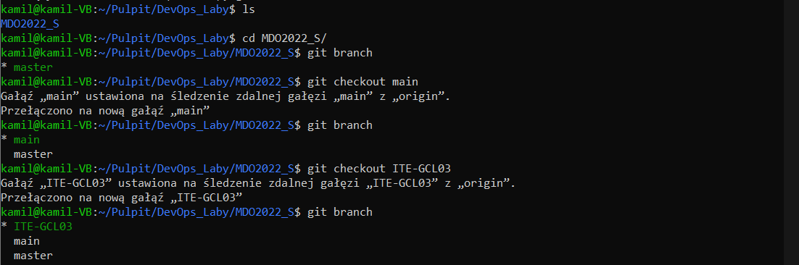

# Ad 5) Utwórz gałąź o nazwie "inicjały & nr indeksu" np. KD232144. Miej na uwadze, że odgałęziasz się od brancha grupy!

## Wykonane kroki 
* kamil@kamil-VB:~/Pulpit/DevOps_Laby/MDO2022_S$ git checkout -b KK401258
* kamil@kamil-VB:~/Pulpit/DevOps_Laby/MDO2022_S$ git branch
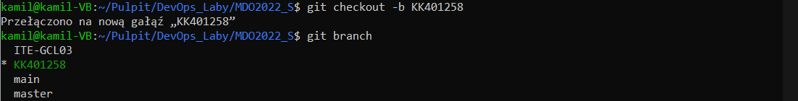

# Ad 6) Rozpocznij pracę na nowej gałęzi
* W katalogu właściwym dla grupy utwórz nowy katalog, także o nazwie "inicjały & nr indeksu" np. KD232144
* W nim także utwórz katalog: Lab01

## Wykonane kroki 
* kamil@kamil-VB:~/Pulpit/DevOps_Laby/MDO2022_S$ cd ITE
* kamil@kamil-VB:~/Pulpit/DevOps_Laby/MDO2022_S/ITE$ cd GCL03
* kamil@kamil-VB:~/Pulpit/DevOps_Laby/MDO2022_S/ITE/GCL03$ mkdir KK401258
* kamil@kamil-VB:~/Pulpit/DevOps_Laby/MDO2022_S/ITE/GCL03$ cd KK401258/
* kamil@kamil-VB:~/Pulpit/DevOps_Laby/MDO2022_S/ITE/GCL03/KK401258$ mkdir Lab01
* kamil@kamil-VB:~/Pulpit/DevOps_Laby/MDO2022_S/ITE/GCL03/KK401258$ cd Lab01/
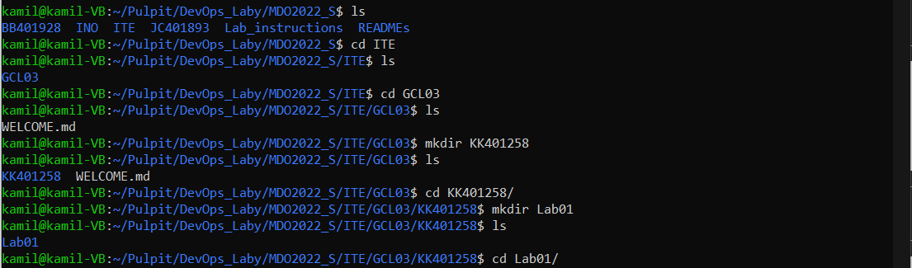

# Cd. ad 6) 
* W nowym katalogu dodaj plik ze sprawozdaniem
* Dodaj zrzuty ekranu (jako inline)
* Wyślij zmiany do zdalnego źródła
* Spróbuj wciągnąć swoją gałąź do gałęzi grupowej
* Zaktualizuj sprawozdanie i zrzuty o ten krok i wyślij aktualizację do zdalnego źródła (na swojej gałęzi)
## Zainstalowałem i skonfigurowałem serwer ftp na maszynie wirtualnej, a następnie połączyłem się z nią z wykorzytsaniem programu Filezilla.
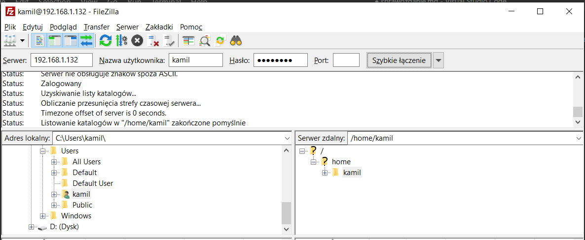
## Przesłałem pierwszą wersję sprawozdania wraz z zrzutami ekranu.
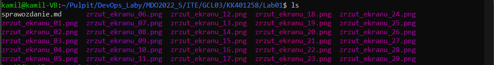
## Wysłałem zmiany do zdalnego źródła:
### Wykonane kroki
* kamil@kamil-VB:~/Pulpit/DevOps_Laby/MDO2022_S/ITE/GCL03/KK401258/Lab01$ git add -A
* kamil@kamil-VB:~/Pulpit/DevOps_Laby/MDO2022_S/ITE/GCL03/KK401258/Lab01$ git status
* kamil@kamil-VB:~/Pulpit/DevOps_Laby/MDO2022_S/ITE/GCL03/KK401258/Lab01$ git commit -m "KK401258 - dodanie sprawozdania w wersji 1"
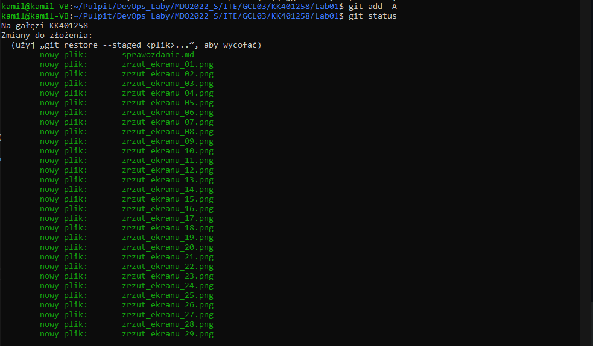
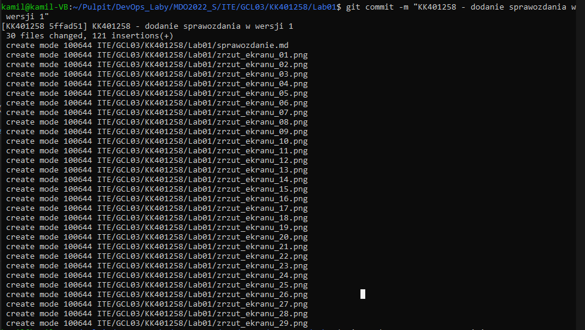
### Następnie próbowałem dokonać push z poziomu cmd, lecz nie powiodło się to i nie znalazłem rozwiązania (generowałem również ponownie nowy klucz)
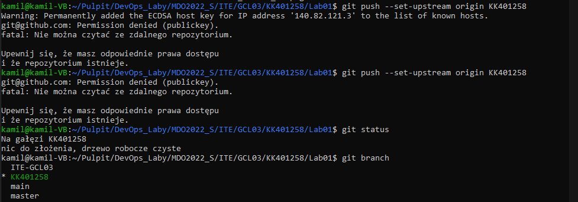
### pusha dokonałem z poziomu maszyny wirtualnej
* kamil@kamil-VB:~/Pulpit/DevOps_Laby/MDO2022_S/ITE/GCL03/KK401258/Lab01$ git push --set-upstream origin KK401258
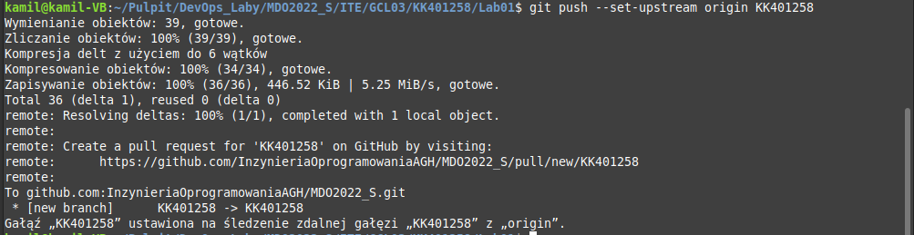
## Próbowałem wyciągnąć swoją gałąź KK401258 do gałęzi grupowej ITE-GCL03 - nie powiodło się, branche nie zosatły złączone
* kamil@kamil-VB:~/Pulpit/DevOps_Laby/MDO2022_S/ITE/GCL03/KK401258/Lab01$ git merge KK401258
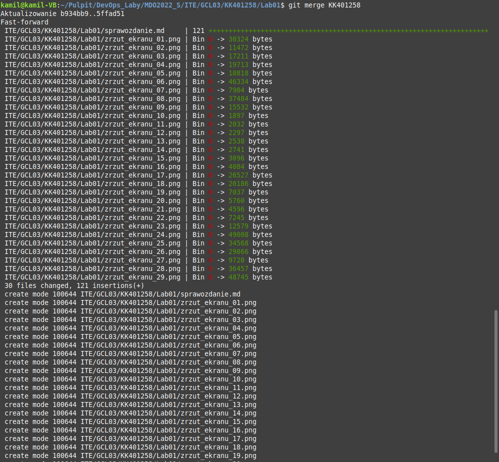
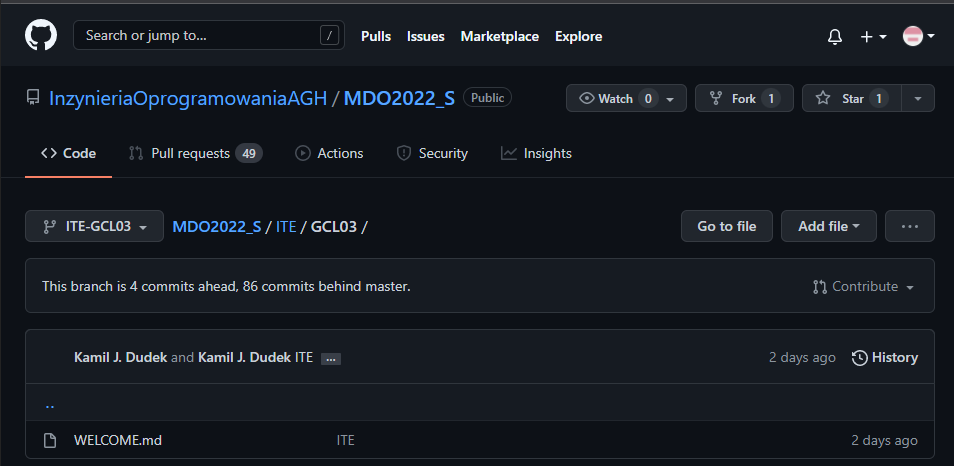

# Ad 7) Wystaw Pull Request do gałęzi grupowej
## Po zapisaniu sprawozdania wystawiłem Pull Request
# Ad 8) Zgłoś zadanie (Teams assignment - jeżeli dostępne)

