Kamil Kalisztan <br>
WIMiIP, IT, sem.: VI <br>
DevOps GCL03
___


# <center>Sprawozdanie</center>
## <center>Instrukcja II</center>

### <center>Hooks, heterogeniczne środowisko pracy, instancja Dockera</center>
___

## Wykonane zadania
### Ad 1) Przygotuj git hook, który rozwiąże najczęstsze problemy z commitami
* hook sprawdzający, czy tytuł commita nazywa się ```<inicjały><numer indeksu>```
* hook sprawdzający, czy w treści commita pada numer labu, właściwy dla zadania

---

	if [[ $1 =~ .*"KK401258 ".* ]]; then
	  echo "Poprawna nazwa."
	  echo $1
	  if [[ $2 =~ .*"Lab02".* ]];then
	    echo "Podano właściwy numer labu.";
	  else 
	    echo "Treść commit'u niepoprawna (zawiera niewłaściwy numer labu)."    
	    exit 1
	  fi
	  exit 0
	else
	  echo "Niepoprawna nazwa. Commit musi zaczynać się od \"KK401258 	\"(prefiks musi byc oddzielony spacją)."
	  exit 1
	fi
---

### Ad 3) Rozpocznij przygotowanie środowiska Dockerowego

* zapewnij dostęp do maszyny wirtualnej przez zdalny terminal (nie "przez okienko")
* jeżeli nie jest stosowane VM (np. WSL, Mac, natywny linux), wykaż ten fakt **dokładnie**
* zainstaluj środowisko dockerowe w stosowanym systemie operacyjnym

<br>

* Dostęp do maszyny wirtualnej przez zdalny terminal został zapewniony podczas wykonania poprzedniego laboratorium. 

* Wykonane kroki:
	> ``` kamil@kamil-VB:~$ sudo apt update ``` <br>

	> ``` kamil@kamil-VB:~$ sudo apt -y install apt-transport-https ca-certificates curl software-properties-common ``` <br>

	> ```kamil@kamil-VB:~$ sudo apt -y remove docker docker-engine docker.io containerd runc``` <br>

	> ```kamil@kamil-VB:~$ curl -fsSL https://download.docker.com/linux/ubuntu/gpg | sudo gpg --dearmor -o /usr/share/keyrings/docker-archive-keyring.gpg``` <br>

	> ```kamil@kamil-VB:~$ echo "deb [arch=$(dpkg --print-architecture) signed-by=/usr/share/keyrings/docker-archive-keyring.gpg] https://download.docker.com/linux/ubuntu bionic stable" | sudo tee /etc/apt/sources.list.d/docker.list > /dev/null``` <br>

	> ```kamil@kamil-VB:~$ sudo apt update``` <br>

	> ```kamil@kamil-VB:~$ sudo apt install docker-ce docker-ce-cli containerd.io``` <br>

	> ```kamil@kamil-VB:~$ sudo usermod -aG docker $USER``` <br

	> ```kamil@kamil-VB:~$ newgrp docker``` <br>

	> ```kamil@kamil-VB:~$ docker version``` <br>

	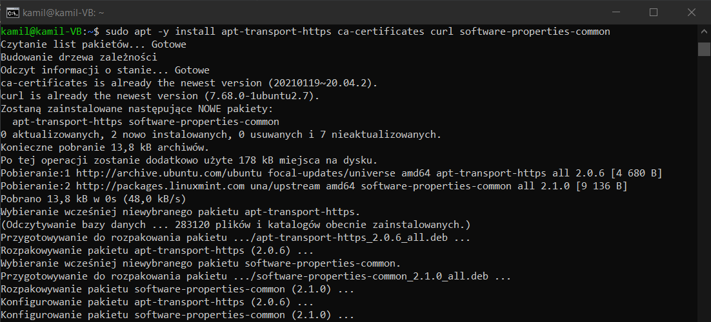
	
	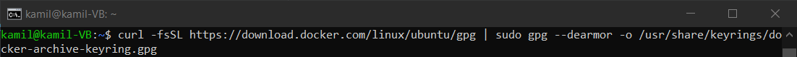
	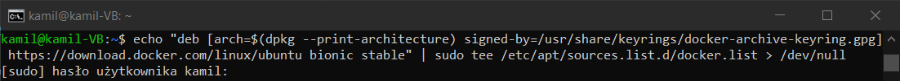
	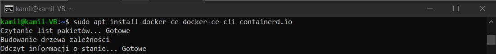
	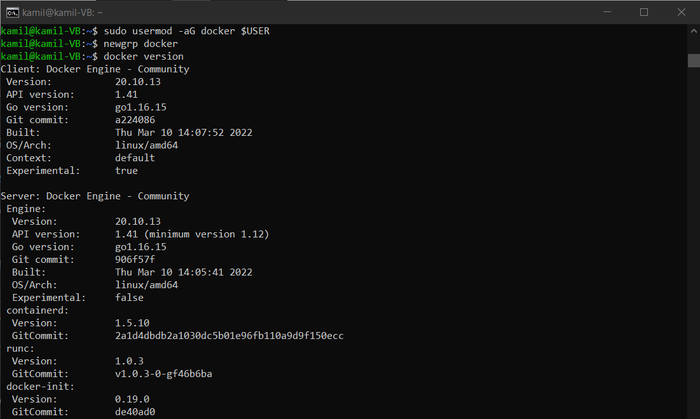


### Ad 4) Działanie środowiska
* wykaż, że środowisko dockerowe jest uruchomione i działa (z definicji)
	
	>```kamil@kamil-VB:~$ sudo systemctl status docker``` <br>
	> ```kamil@kamil-VB:~$ sudo docker images``` <br>
	
	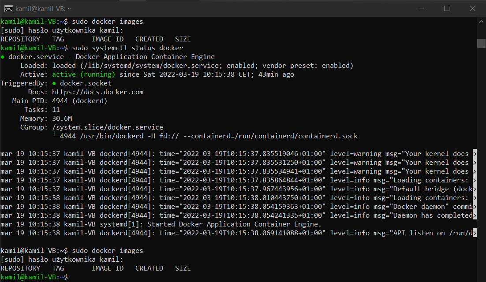
	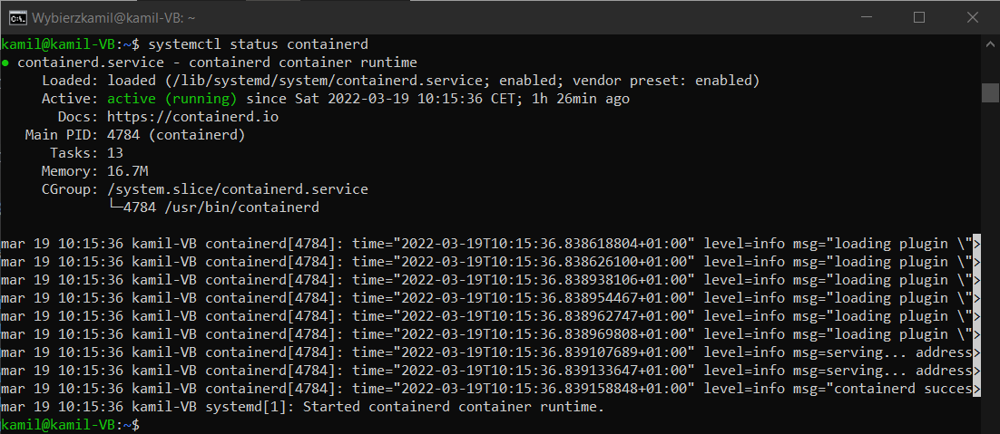

	
* wykaż działanie z sposób praktyczny (z własności):
	* pobierz obraz dystrybucji linuksowej i uruchom go 
	* wyświetl jego numer wersji
* Wykonane kroki:

>```kamil@kamil-VB:~$ docker pull ubuntu```

>```kamil@kamil-VB:~$ docker ps -a```

>```kamil@kamil-VB:~$ docker images```

>```kamil@kamil-VB:~$ docker run ubuntu```

>```kamil@kamil-VB:~$ docker ps -a```

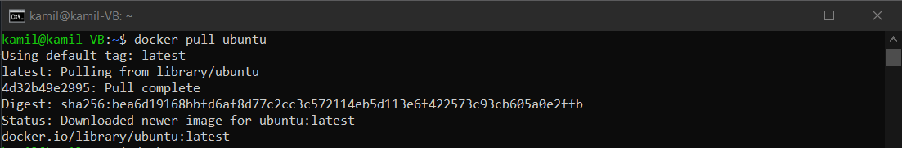
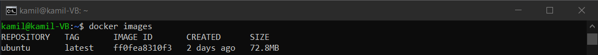
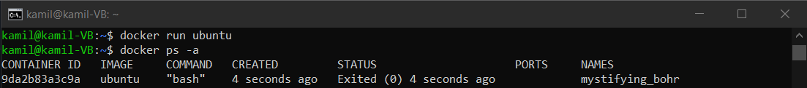

* Zlecenie zadania dla kontenera:
>```kamil@kamil-VB:~$ docker run ubuntu echo "Hejo! ~Kontener UBUNTU"```

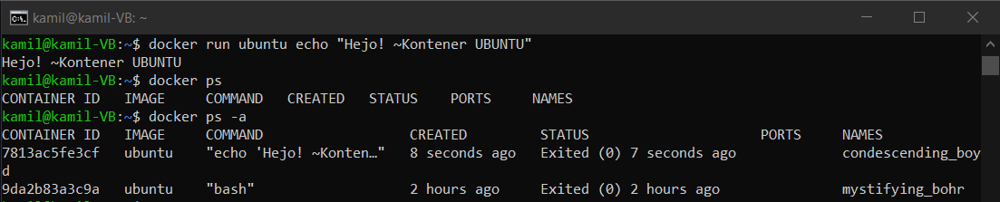


### Ad 5) Załóż konto na Docker Hub

Zrzut ekranu potwierdzający założenie konta:

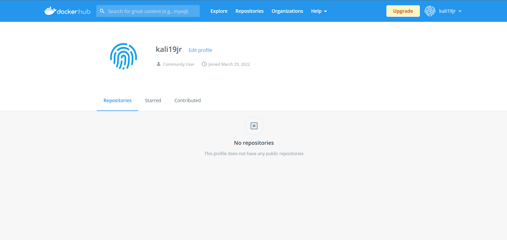
