Kamil Kalisztan <br>
WIMiIP, IT, sem.: VI <br>
DevOps GCL03

- - -

# Sprawozdanie

## Instrukcja III

### Docker files, kontener jako definicja etapu

- - -

## Wykonane zadania


### Wybór oprogramowania na zajęcia

* Znajdź repozytorium z kodem dowolnego oprogramowania, które:
    * dysponuje otwartą licencją
    * jest umieszczone wraz ze swoimi narzędziami Makefile tak, aby możliwe był uruchomienie w repozytorium czegoś na kształt ```make build``` oraz ```make test```. Środowisko Makefile jest dowolne. Może to być automake, meson, npm, maven, nuget, dotnet, msbuild...
    * Zawiera zdefiniowane i obecne w repozytorium testy, które można uruchomić np. jako jeden z "targetów" Makefile'a. Testy muszą jednoznacznie formułować swój raport końcowy (gdy są obecne, zazwyczaj taka jest praktyka)
* Sklonuj niniejsze repozytorium, przeprowadź build programu (doinstaluj wymagane zależności)
* Uruchom testy jednostkowe dołączone do repozytorium

	#### Wykonane kroki:

* Link do repozytorium:
https://github.com/actionsdemos/calculator?fbclid=IwAR1LcCT034XgTJCbCgnXAx78HhnugrMFbYHnBUi42TUSEXflhLHP7QaJQIg
* ```kamil@kamil-VB:~/Pulpit/DevOps_lab03$ git clone [https://github.com/actionsdemos/calculator.git](https://github.com/actionsdemos/calculator.git)```

	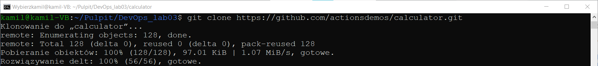
 
* ```kamil@kamil-VB:~/Pulpit/DevOps_lab03$ cd calculator/```
* ```kamil@kamil-VB:~/Pulpit/DevOps_lab03/calculator$ git checkout -b KK401258```
* ```kamil@kamil-VB:~/Pulpit/DevOps_lab03/calculator$ sudo apt install npm```

	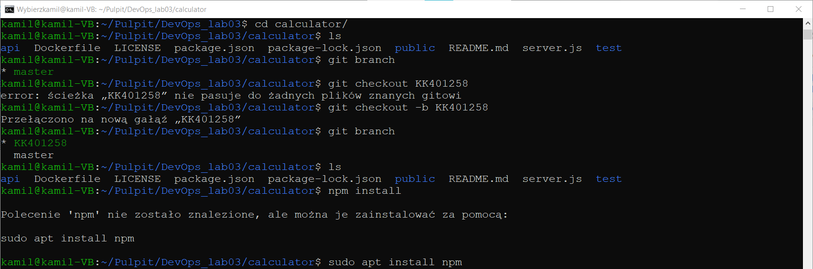


* ```kamil@kamil-VB:~/Pulpit/DevOps_lab03/calculator$ npm install```
* ```kamil@kamil-VB:~/Pulpit/DevOps_lab03/calculator$ npm audit```

	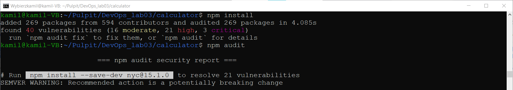

* ```kamil@kamil-VB:~/Pulpit/DevOps_lab03/calculator$ npm start```

	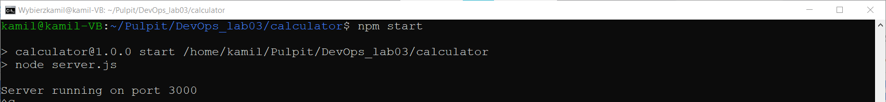
	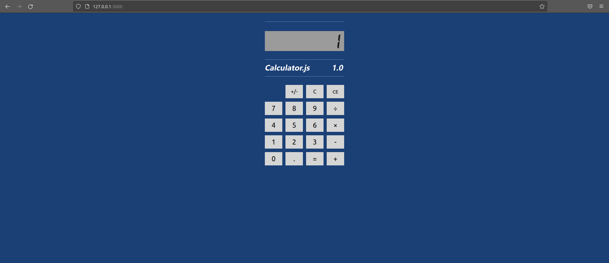
* ```kamil@kamil-VB:~/Pulpit/DevOps_lab03/calculator$ npm test```

	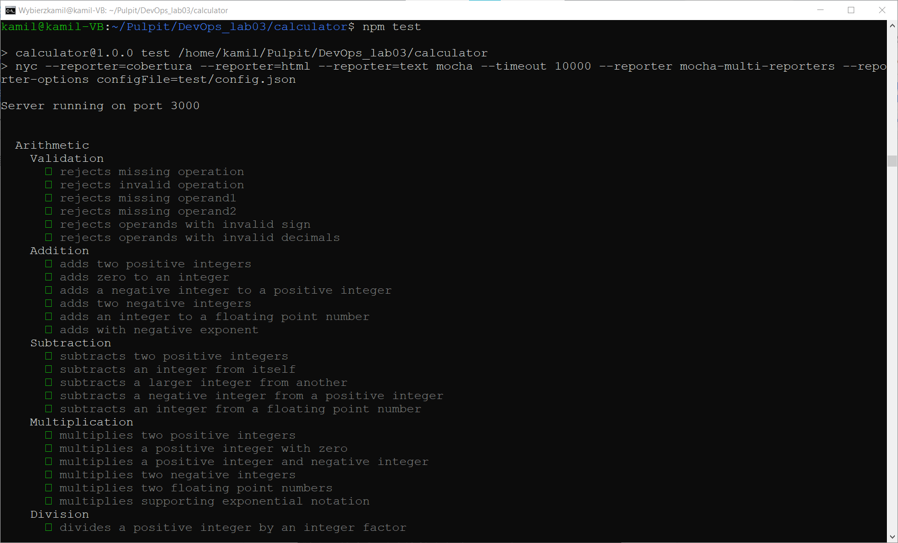
	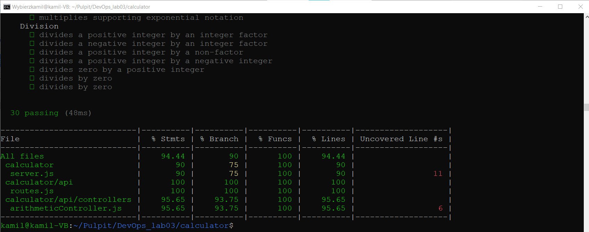


<br>

### Przeprowadzenie buildu w kontenerze

1. Wykonaj kroki build i test wewnątrz wybranego kontenera bazowego. Tj. wybierz "wystarczający" kontener, np ```ubuntu``` dla aplikacji C lub ```node``` dla Node.js
    * uruchom kontener
    * podłącz do niego TTY celem rozpoczęcia interaktywnej pracy
    * zaopatrz kontener w wymagania wstępne (jeżeli proces budowania nie robi tego sam)
    * sklonuj repozytorium
    * uruchom build
    * uruchom testy

	#### Wykonane kroki:
	* kamil@kamil-VB:~/Pulpit/DevOps_lab03/calculator$ sudo docker images
	* kamil@kamil-VB:\~/Pulpit/DevOps_lab03/calculator$ docker ps
	* kamil@kamil-VB:\~/Pulpit/DevOps_lab03/calculator$ docker ps -a
	
	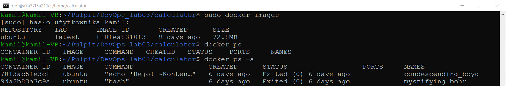
	
	* kamil@kamil-VB:~/Pulpit/DevOps_lab03/calculator$ docker run -it ubuntu
	* root@a7a37f5a211c:/# cd home
	
	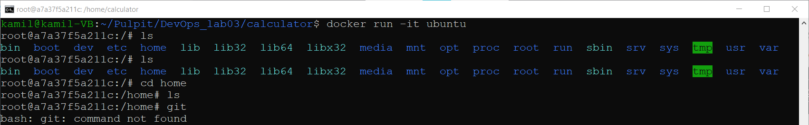
	
	* root@a7a37f5a211c:/home# git
	* root@a7a37f5a211c:/home# apt install git
	
	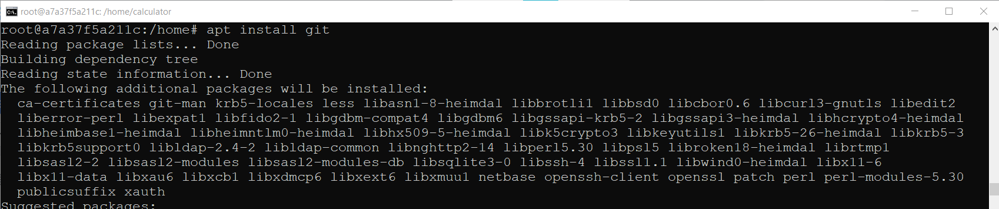
	
	* root@a7a37f5a211c:/home# git clone https://github.com/actionsdemos/calculator.git
	* root@a7a37f5a211c:/home# cd calculator/
	* root@a7a37f5a211c:/home/calculator# apt install npm
	
		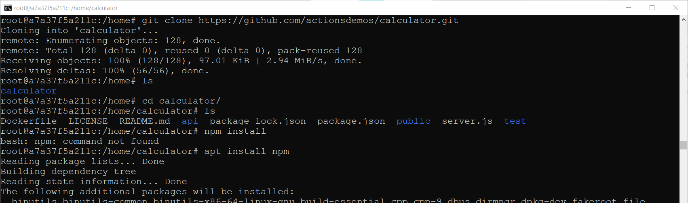
	
	* root@a7a37f5a211c:/home/calculator# npm install
	* root@a7a37f5a211c:/home/calculator# npm audit
	
		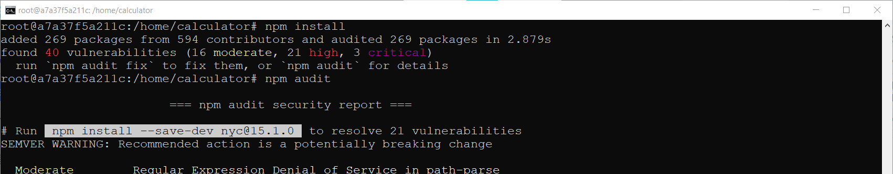
		
	* root@a7a37f5a211c:/home/calculator# npm test
	
		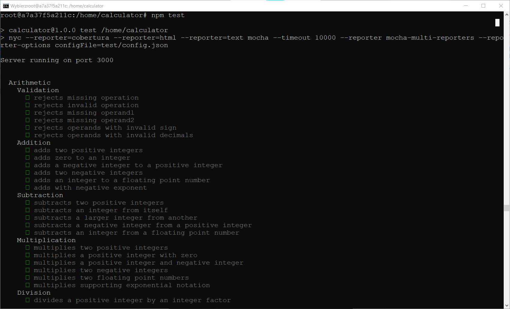
		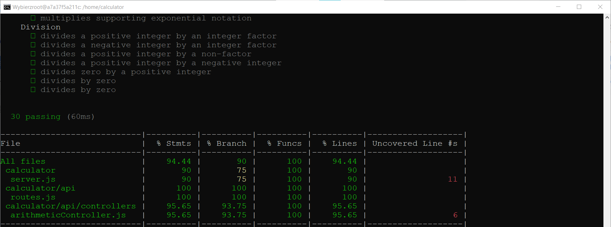


---

<br>

2. Stwórz dwa pliki Dockerfile automatyzujące kroki powyżej, z uwzględnieniem następujących kwestii
    * Kontener pierwszy ma przeprowadzać wszystkie kroki aż do builda
	>Plik Dockerfile:
	
	> ```# syntax=docker/dockerfile:1``` <br>
	>```FROM node:latest```  <br>
	>```RUN git clone https://github.com/actionsdemos/calculator.git```  <br>
	>```WORKDIR calculator```  <br>
	>```RUN npm install```  <br>
	

	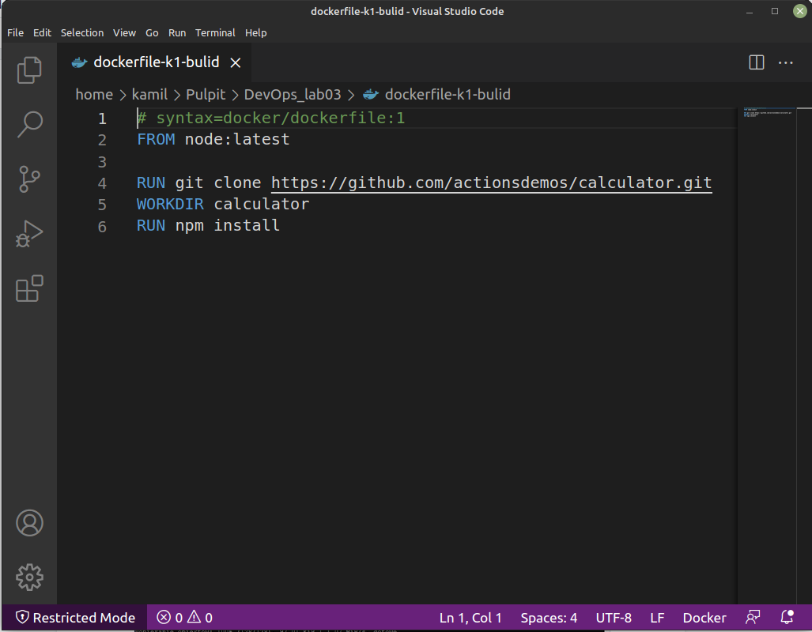

	#### Wykonane kroki:
	* kamil@kamil-VB:~/Pulpit/DevOps_lab03$ sudo docker build -t k1-build . -f ./dockerfile-k1-bulid
	* kamil@kamil-VB:~/Pulpit/DevOps_lab03$ sudo docker images
	* kamil@kamil-VB:~/Pulpit/DevOps_lab03$ sudo docker ps -a
	* kamil@kamil-VB:~/Pulpit/DevOps_lab03$ docker run -it k1-build
	* kamil@kamil-VB:~/Pulpit/DevOps_lab03$ sudo docker ps -a
	
	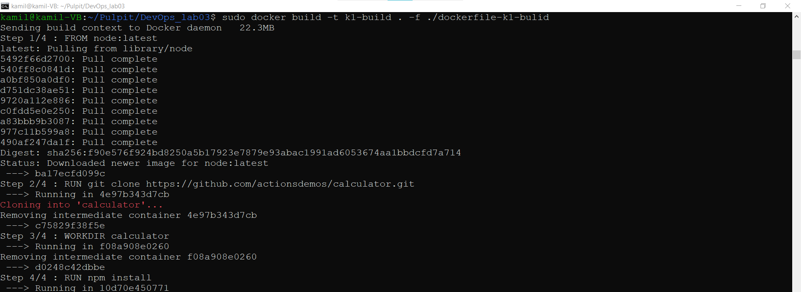
	
	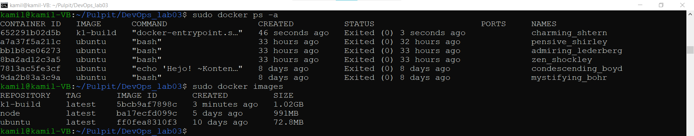
	
    * Kontener drugi ma bazować na pierwszym i wykonywać testy

	>Plik Dockerfile:
	> ```# syntax=docker/dockerfile:1```
	> ```FROM k1-build```
	>
	> ```RUN npm test```

	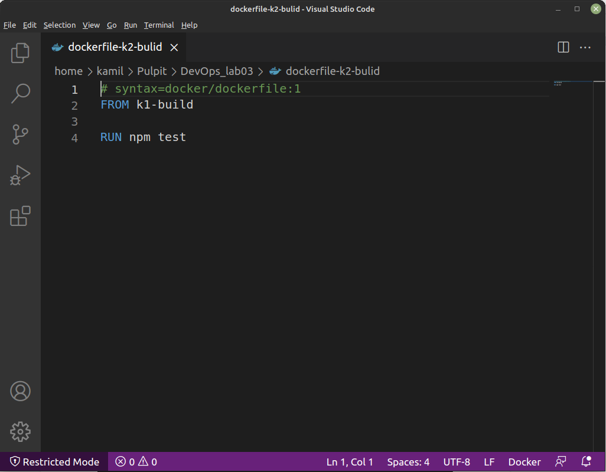

	#### Wykonane kroki:
	* kamil@kamil-VB:~/Pulpit/DevOps_lab03$ sudo docker build -t k2-build . -f ./dockerfile-k2-bulid
	* kamil@kamil-VB:~/Pulpit/DevOps_lab03$ sudo docker images

	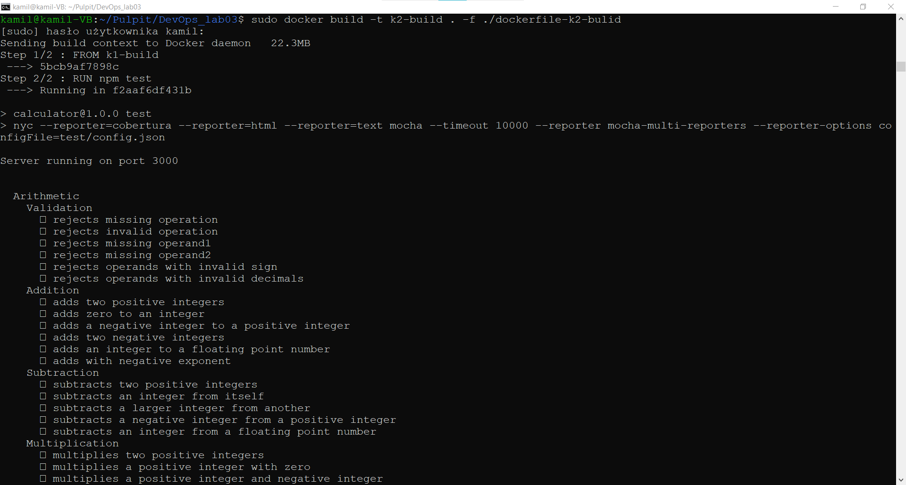
	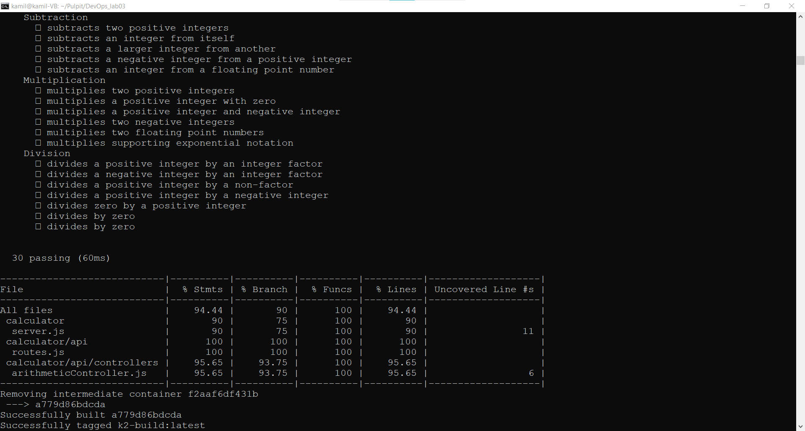
	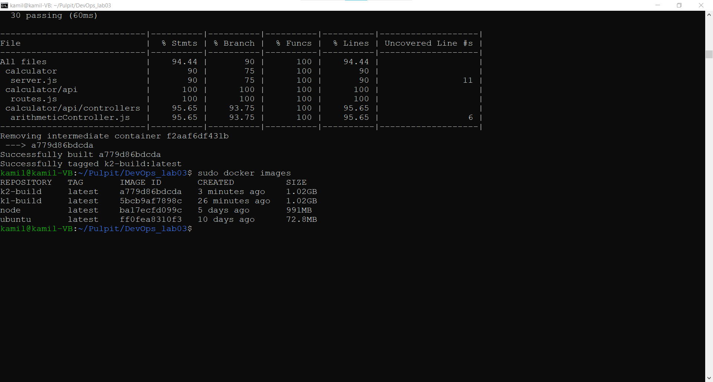
	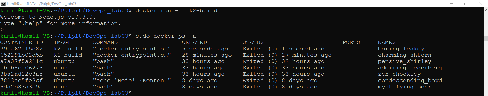


3. Wykaż, że kontener wdraża się i pracuje poprawnie. Pamiętaj o różnicy między obrazem a kontenerem. Co pracuje w takim kontenerze?

	> ```kamil@kamil-VB:~/Pulpit/DevOps_lab03$ docker run k1-build```
	> ```kamil@kamil-VB:~/Pulpit/DevOps_lab03$ docker run k2-build```
	> ```kamil@kamil-VB:~/Pulpit/DevOps_lab03$ sudo docker ps -a```

	Na poniższym (oraz powyższych) zrzucie ekranu widać, że kontenery uruchomiły się poprawnie - kod wyjścia 0 - i zakończyły od razu swoją pracę, ponieważ wykonały wszystkie instrukcje dla nich przeznaczone - czyli w tym przypadku, poza uruchomieniem, żadne. 
	
	

