Kamil Kalisztan  
WIMiIP, IT, sem.: VI  
DevOps GCL03

- - -

# Sprawozdanie

## Instrukcja IV

### Dodatkowa terminologia w konteneryzacji, instancja Jenkins
- - -

## Wykonane zadania

### Zachowywanie stanu
* Przygotuj woluminy wejściowy i wyjściowy, o dowolnych nazwach, i podłącz je do kontenera bazowego, z którego rozpoczynano poprzednio pracę
* Uruchom kontener, zainstaluj niezbędne wymagania wstępne (jeżeli istnieją), ale *bez gita*
* Sklonuj repozytorium na wolumin wejściowy
* Uruchom build w kontenerze
* Zapisz powstałe/zbudowane pliki na woluminie wyjściowym

##### Wykonane kroki: 	
* kamil@kamil-VB:~$ sudo docker volume create lab4_volume_in
* kamil@kamil-VB:~$ sudo docker volume create lab4_volume_out
* kamil@kamil-VB:~$ sudo docker volume ls
* kamil@kamil-VB:~$ sudo docker inspect lab4_volume_in
* kamil@kamil-VB:~$ sudo docker inspect lab4_volume_out
* kamil@kamil-VB:~$ sudo docker run -it --name lab4_node --mount source=lab4_volume_in,target=/lab4_volume_in
 --mount source=lab4_volume_out,target=/lab4_volume_out node
* kamil@kamil-VB:/var/lib/docker/volumes/lab4_volume_in/_data$ 

	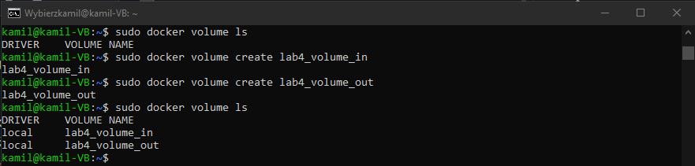
	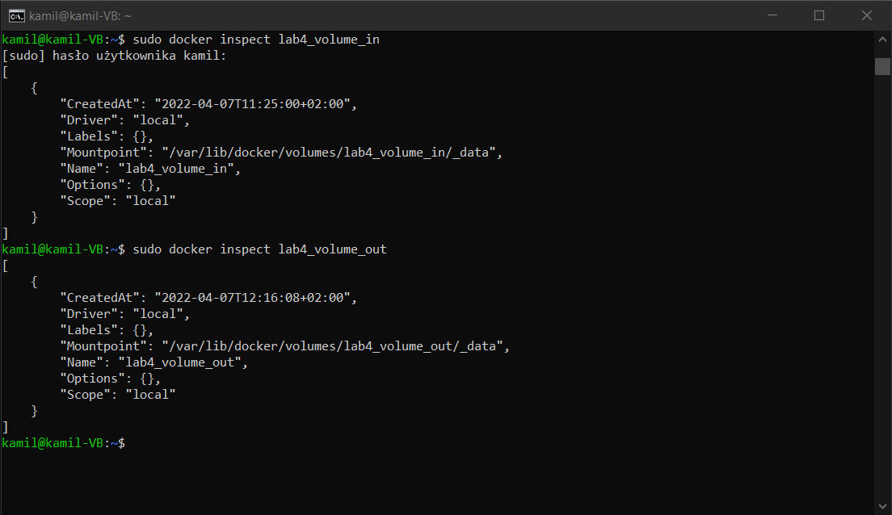
	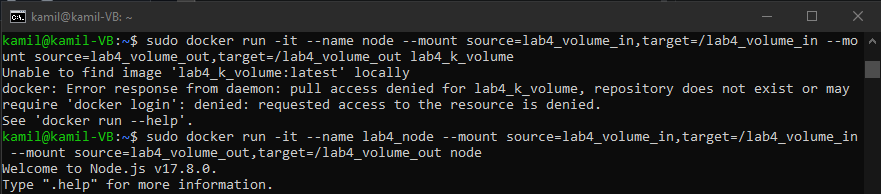
	
* sudo git clone https://github.com/ahfarmer/calculator.git
* sudo npm test
* kamil@kamil-VB:/var/lib/docker/volumes/lab4_volume_in/_data/calculator$ sudo npm run-script build
* kamil@kamil-VB:/var/lib/docker/volumes/lab4_volume_in/_data/calculator$ sudo cp -r build/ ../../../lab4_volume_out/_data
* kamil@kamil-VB:/var/lib/docker/volumes/lab4_volume_in/_data/calculator$ cd ../../../lab4_volume_out/_data

	
	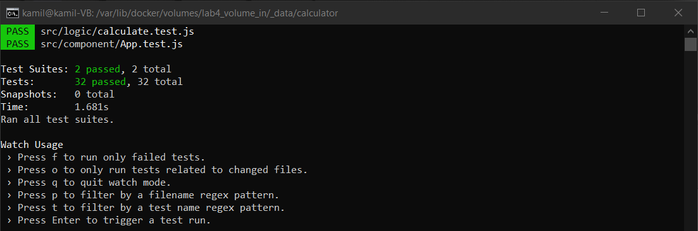
	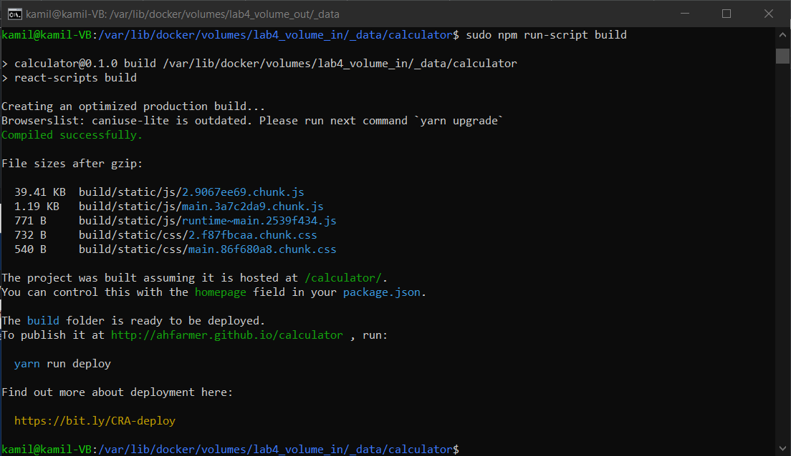
	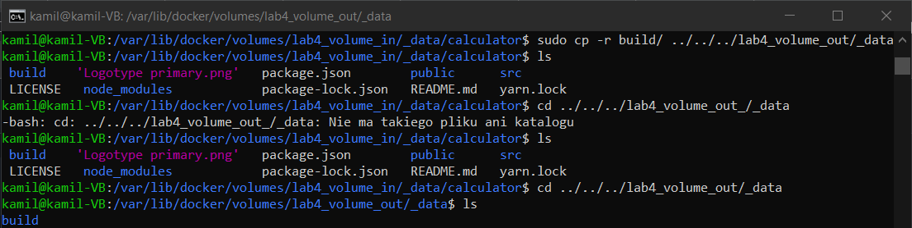

### Eksponowanie portu
* Uruchom wewnątrz kontenera serwer iperf (iperf3)
* Połącz się z nim z drugiego kontenera, zbadaj ruch
* Połącz się spoza kontenera (z hosta i spoza hosta)
* Przedstaw przepustowość komunikacji lub problem z jej zmierzeniem (wyciągnij log z kontenera)

##### Wykonane kroki: 	
* kamil@kamil-VB:~$ sudo docker pull networkstatic/iperf3
* kamil@kamil-VB:~$ sudo docker images
* kamil@kamil-VB:~$ sudo docker run -it --name=lab4_iperf3 --publish 5201:5201 networkstatic/iperf3 -s

		
	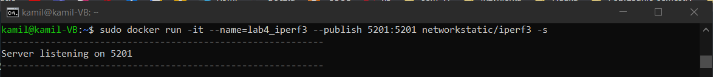

* kamil@kamil-VB:~$ sudo docker inspect lab4_iperf3
 
	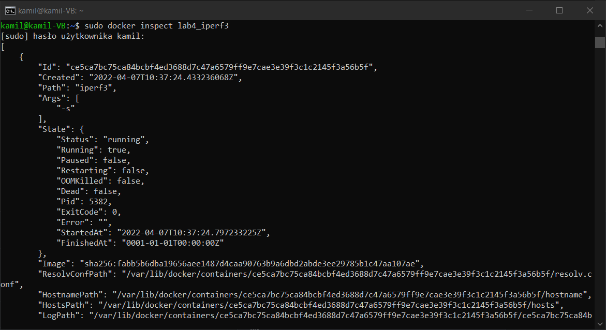
	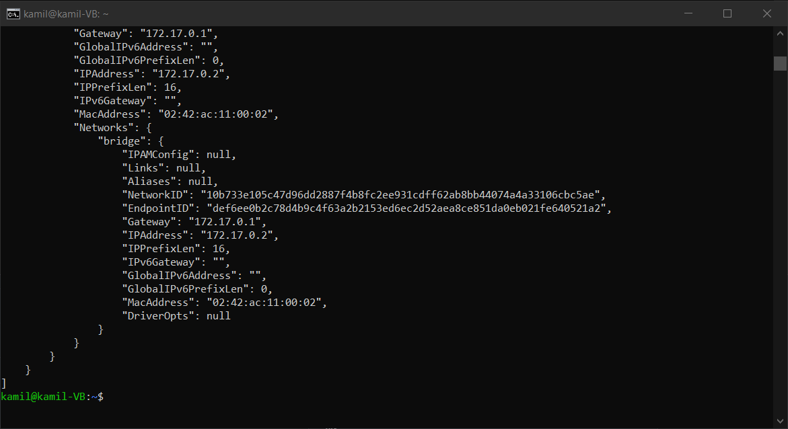

* kamil@kamil-VB:~$ sudo docker run -it networkstatic/iperf3 -c 172.17.0.2

	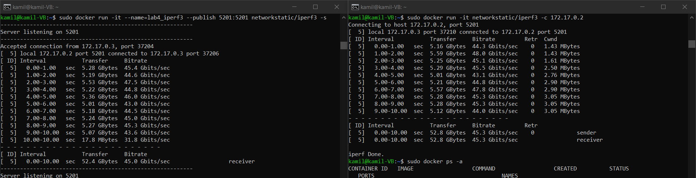

* kamil@kamil-VB:~$ sudo apt install iperf3
* kamil@kamil-VB:~$ iperf3 -c 172.17.0.2

	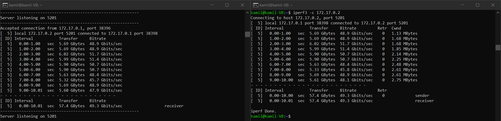

* PS D:\Programy\iperf3\iperf-3.1.3-win64> ./iperf3.exe -c 192.168.0.88 -p 5201

	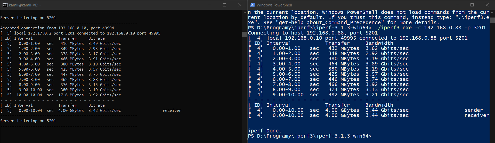

	| Połączenie | Uzyskana przepustowość |
	| --- | --- |
	| z kontenera | 45.3 Gbits/sec |
	| z hosta | 49.3 Gbits/sec |
	| spoza hosta | 3.44 Gbits/sec |

### Instancja Jenkins
* Zapoznaj się z dokumentacją  https://www.jenkins.io/doc/book/installing/docker/
* Przeprowadź instalację skonteneryzowanej instancji Jenkinsa z pomocnikiem DIND
* Zainicjalizuj instację, wykaż działające kontenery, pokaż ekran logowania

##### Wykonane kroki: 	
* kamil@kamil-VB:~$ sudo docker network create jenkins
* docker run --name jenkins-docker --rm --detach \
  --privileged --network jenkins --network-alias docker \
  --env DOCKER_TLS_CERTDIR=/certs \
  --volume jenkins-docker-certs:/certs/client \
  --volume jenkins-data:/var/jenkins_home \
  --publish 2376:2376 \
  docker:dind --storage-driver overlay2

	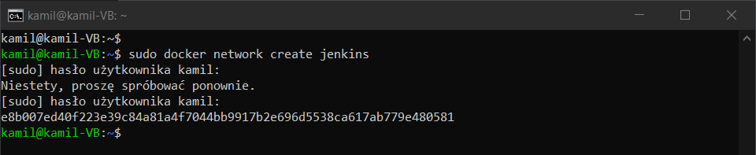
	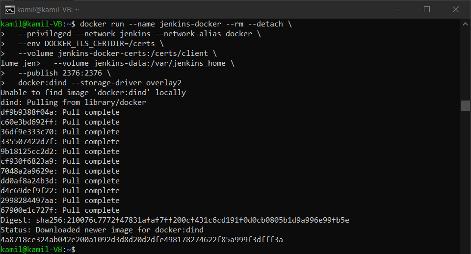

* kamil@kamil-VB:~/Pulpit$ docker build -t myjenkins-blueocean:2.332.2-1 .

	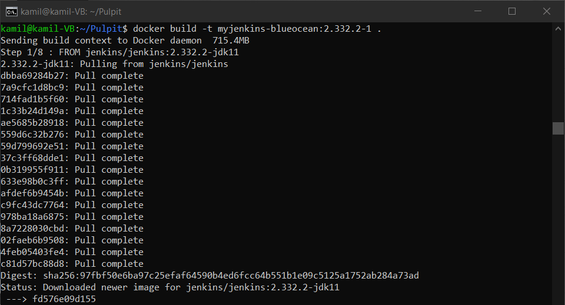

* kamil@kamil-VB:~/Pulpit$ docker run --name jenkins-blueocean --rm --detach \
   --network jenkins --env DOCKER_HOST=tcp://docker:2376 \
   --env DOCKER_CERT_PATH=/certs/client --env DOCKER_TLS_VERIFY=1 \
   --publish 8080:8080 --publish 50000:50000 \
   --volume jenkins-data:/var/jenkins_home \
   --volume jenkins-docker-certs:/certs/client:ro \
   myjenkins-blueocean:2.332.2-1
* kamil@kamil-VB:~/Pulpit$ sudo docker ps

	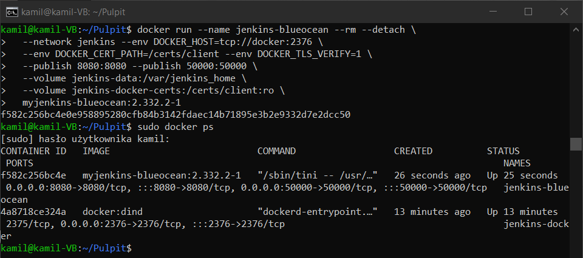

	Odblokowywanie Jenkinsa:
	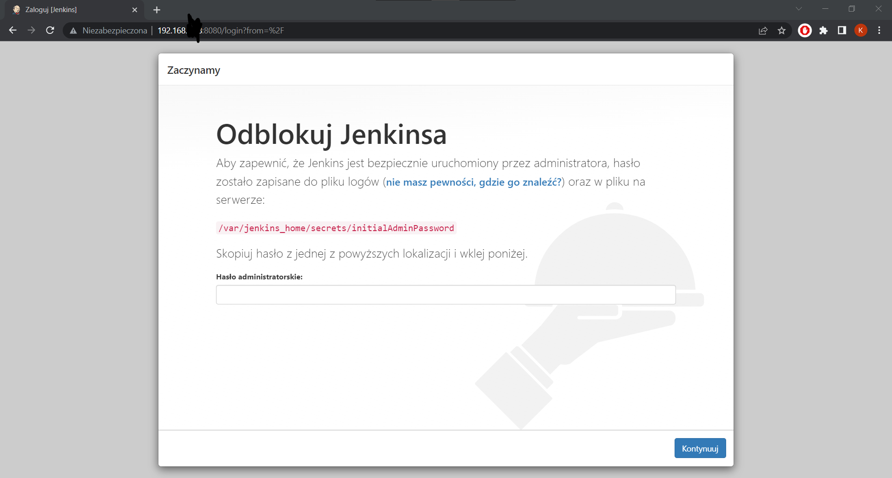
* sudo docker exec jenkins-blueocean cat /var/jenkins_home/secrets/initialAdminPassword
	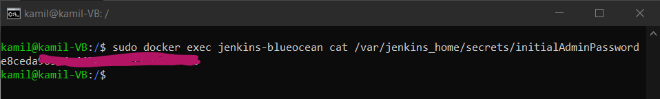
	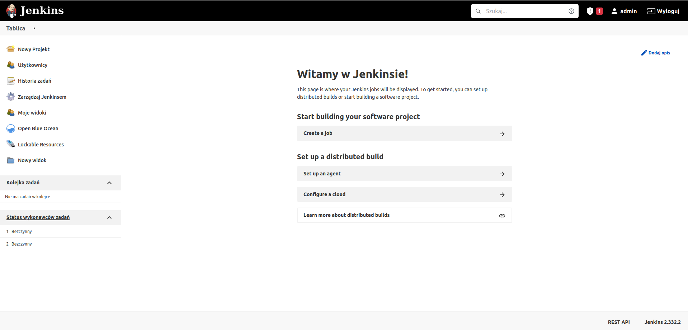

