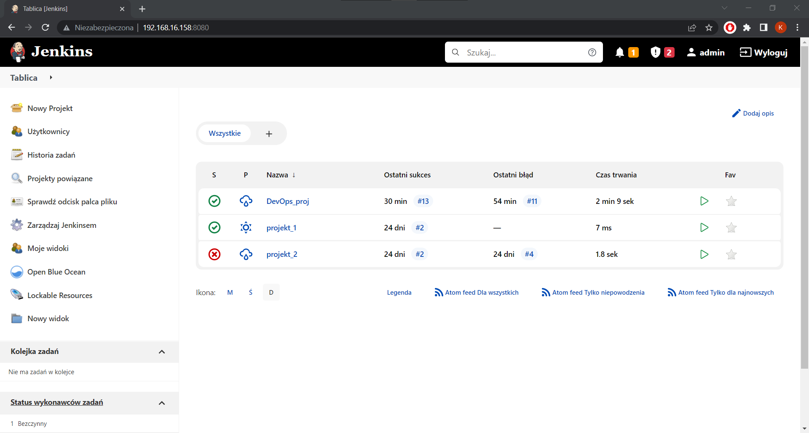
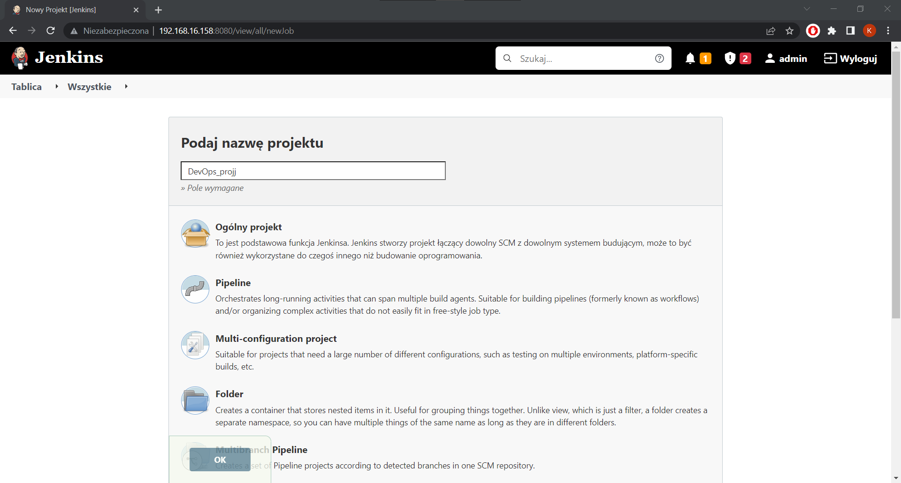
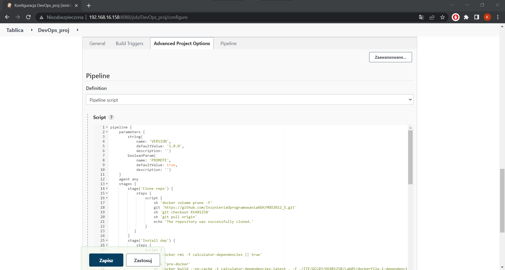
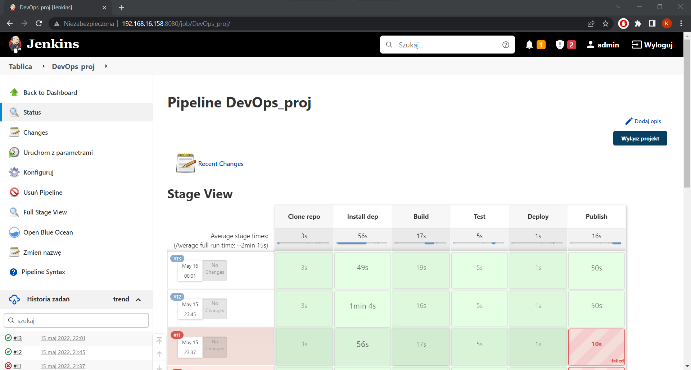
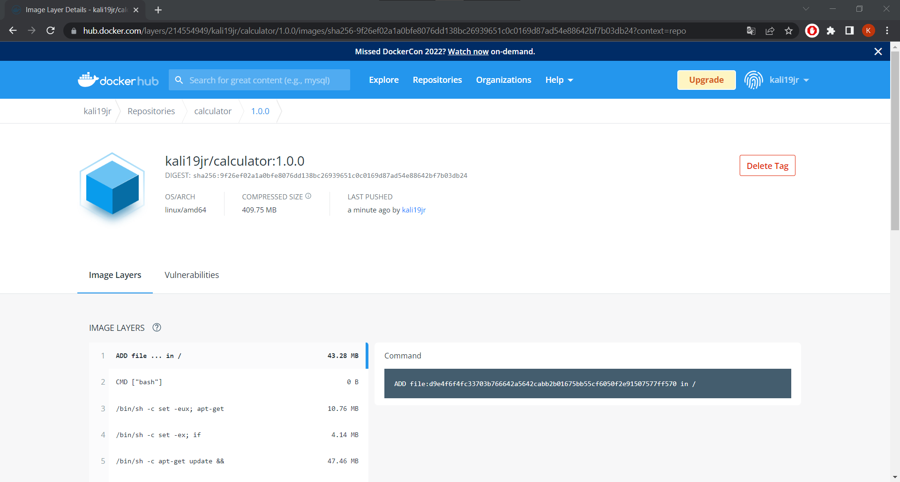
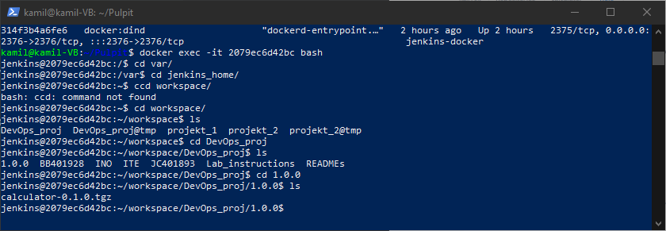
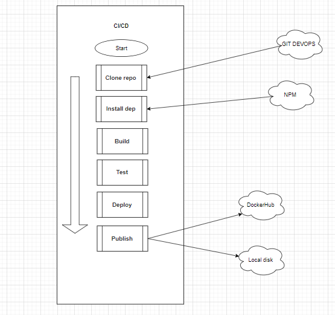
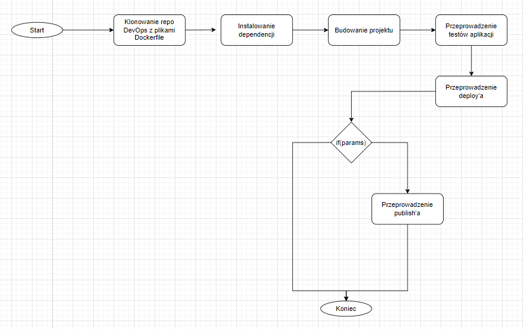

Kamil Kalisztan <br>
WIMiIP, IT, sem.: VI <br>
DevOps GCL03

- - -

# Sprawozdanie

## Instrukcja IV
### Lab 05, 06, 07

### Jenkins - pipeline

--- 
## Cel wykonywanych czynności i streszczenie 
#### Celem projektu było wykorzystanie Jenkins'a do zautomatyzowania czynności związanycbh z build'em, test'em, deploy'em oraz publish'em, wybranego do realizacji poprzednich laboratoriów, oprogramowania, które w moim przypadku znajduje się pod linkiem: https://github.com/ahfarmer/calculator
 #### Jenkins jest systemem CI/CD (Continuous Integration i Continuous Delivery), który pozwa zautomatyzować proces tworzenia oprogramowania wykorzystując do tego kroki zapisane w jenkis'owym skrypcie, zwanym pipeline'em. Kroki te są podzielone na segmenty oraz  zapisane w ściśle określonej kolejności. Specyfika tego systemu polega na tym, że aby każdy jeden krok został wykonany,  kroki poprzedzające muszą zakończyć się sukcesem. 
 #### W napisanym przeze mnie pipeline'ie dokonałem zautomatyzowania następujących czynności:
 * sklonowanie repozytorium kursu (na którym znajdują się pliki dockerfile)
 * sklonowanie repozytorimu z aplikacją webową
 * zainstalowanie dependencji 
 * zbudowanie projektu
 * przeprowadzenie testów
 * przeprowadzenie deploy'a
 * przeprowadznie publish'a 

--- 
## Kontener Jenkins i DIND
#### Kontener został skonfigurowany według instrukcji dostępnej w dokumentacji Jenkins'a, której nie będę powielał. Instrukcja ta jest dostępna pod linkiem: https://www.jenkins.io/doc/book/installing/docker/
#### Po wykonaniu kroków zawartych w instrukcji, dostępna będzie strona jenkins'a, którą odnaleźć można wpisując w przeglądarkę adres ip maszyny, na której wykoanno instrukcję, oraz port 8080[\<adres ip\>:8080] 

---
## Utworzenie projektu pipeline'a
#### Po poprawnym skonfigurowaniu Jenkins'a i zalogowaniu się widoczny jest panel zarządzania systemem. W celu utworzenie nowego projektu należy wybrać opcję "Nowy Projekt" z menu bocznego. Następnie wprowadzamy jego nazwę (w moim przypadku ...) i wybieramy typ "Pipeline". 

#### W tym momencie pojawia się formularz przeznaczony do tworzenie pipeline'a. Należy prześć do sekcji "Pipeline" i wybrać opcję "Pipeline script" w definicji. W polu przeznaczonym na skrypt należy umieścić kod pipeline'a. 

#### W moim przypadku pipeline składa się z kilku części.

 
### 1. Klonowanie repozytorium kursu DevOps (zawiera pliki dockerfile)

```
stage('Clone repo') {
	steps {
		script {
			sh 'docker volume prune -f'
			git 'https://github.com/InzynieriaOprogramowaniaAGH/MDO2022_S.git'
			sh 'git checkout KK401258'
			sh 'git pull origin'
			echo 'The repository was successfully cloned.'
		}
	}
} 
```

#### Pipeline rozpoczyna swoją pracę od usunięcia wszystkich nieużywanych woluminów lokalnych. następnie klonowane jest kursowe repo i zmiana na właściwą gałąź.

### 2. Instalowanie dependencji 
```
stage('Install dep') {
	steps {
		script {
			sh 'docker rmi -f calculator-dependencies || true'
                    
			echo 'pre-docker'
			sh 'docker build --no-cache -t calculator-dependencies:latest . -f ./ITE/GCL03/KK401258/Lab05/dockerfile-1-dependencies'

			echo 'Dependecies were successfully installed.'
		}
	}
}
```

#### W pierwszej kolejności, jeśli występuje, usuwany jest obraz 'calculator-dependencies'. następnie budowany jest obraz na podstawie 'dockerfile-1-dependencies'
```
# syntax=docker/dockerfile:1
FROM node:15.14.0
RUN git clone https://github.com/ahfarmer/calculator.git
WORKDIR calculator
RUN npm install
```
#### Wybrałem obraz node ponieważ zawiera on git'a i npm, czyli narzędzia potrzebne do obsługi aplikacji nodowej.
## Uwaga!
#### Wersja 15.14.0 ponieważ wybrany projekt nie buduje się w wersji noda wyższej niż 16.

### 3. Zbudowanie projektu 
```
stage('Build') {
	steps {
		script {
			sh 'docker rmi -f calculator-build || true'
                    
			sh 'docker volume create volume_in'
			sh 'docker build --no-cache -t calculator-build:latest . -f ./ITE/GCL03/KK401258/Lab05/dockerfile-2-build'
			sh 'docker run --mount type=volume,src="volume_in",dst=/calculator_pipv1/depBuild calculator-build:latest bash -c "ls -l && cd .. && cp -r /calculator /calculator_pipv1/depBuild"'
        
			echo 'Build was successfully completed.'
		}
	}
}
```
#### Analogicznie jak poprzednio, najpierw usuwany jest obraz, który jest budowany w tym kroku, o ile istnieje.
#### utwozony jest bolumen 'volume_in', na którym umieszczony zostanie rezultat zbudowania projektu.
#### Budowany jest obraz 'calculator-build' na podstawie pliku 'dockerfile-2-build'.
```
# syntax=docker/dockerfile:1 
FROM calculator-dependencies:latest

RUN npm run-script build
```
#### Obraz jest tworzony na podstawie obrazu uzyskanego w poprzednim kroku, rozszerzony zostaje o polecenie 'build'. 


### 4. Przeprowadzenie testów
```
stage('Test') {
	steps {
		script {
			sh 'docker rmi -f calculator-test || true'
			sh 'docker build --no-cache -t calculator-test:latest . -f ./ITE/GCL03/KK401258/Lab05/dockerfile-3-test'
  
			echo 'Test was successfully completed.'
		}
	}
}
```
#### Obraz do testów tworzony jest również na podstawie obrazu zbudowanego w drugim kroku (obraz z dependencjami):
```
# syntax=docker/dockerfile:1 
FROM calculator-dependencies:latest

CMD ['/usr/bin/npm', 'test', 'a']
```


### 5. Przeprowadzanie deploy'a
```
stage('Deploy') {
	steps {
		sh 'docker rm -f calculator-deploy || true'
		sh 'docker run -dit --name calculator-deploy --mount type=volume,src="volume_in",dst=/dest node:15.14.0'
		sh 'docker container exec calculator-deploy sh -c "ls -l && cd dest && ls -l && cd calculator && ls -l"'
		//sh 'docker container exec calculator-deploy sh -c "cd dest/calculator && ls -l && npm start"'
		//sh 'docker container kill calculator-deploy'
	}
}
```
#### W przypadku deploy'a nie miałem pomysłu na jego realizację. jedynym pomysłem na jaki wpadłem było uruchomienie aplikacji w kontenerze -zakomentowany fragment skrytptu. Kontener wykorzytany w tym kroku korzysta z wcześiej utworzonego wolumenu.

## 6. Przeprowadzenie publish'a
#### Do przeprowadzenia tego kroku potrzebne są parametry wejściowe. Po pierwsze informacja, czy wgl chcemy przeprowadzić publikację projektu - booleanParam - PROMOTE. Po drugie werjsa publikowanego programu, bedąca stringiem.
```
parameters {
	string(
		name: 'VERSION', 
		defaultValue: '1.0.0', 
		description: '')
	booleanParam(
		name: 'PROMOTE', 
		defaultValue: true, 
		description: '')
}
```

#### W przypadku gdy parametr PROMOTE jest prawdą, wówczas ponizszy skrypt najpierw buduje obraz realizujący plik 'dockerfile-4-pack', który to zawiera polecenie 'npm pack', następnie uruchamia go i utworzona paczka jest kopiowana do lokalnego folderu hosta o nazwie tożsamej z przekazanym parametrem 'VERSION'. 
```
# syntax=docker/dockerfile:1 
FROM calculator-dependencies:latest

RUN npm pack
```

#### Oprócz tego zbudowany obraz jest otagowywany i publkowany na docker hub'ie.
```
stage('Publish') {
	steps {
		script {
			if(params.PROMOTE) {
				sh "docker rm -f calculator-pub || true"
				sh 'docker rmi -f calculator-publish || true'
				sh "rm -rf ${params.VERSION} || true"
                        
				sh "mkdir ${params.VERSION}"
                        
				sh 'docker build --no-cache -t calculator-publish:latest . -f ./ITE/GCL03/KK401258/Lab05/dockerfile-4-pack'
				sh "docker run -dit --name calculator-pub calculator-publish:latest"
				sh 'docker container exec calculator-pub sh -c "ls -l && cd .. && ls -l && cd .. && ls -l"'
				sh "docker cp calculator-pub:/calculator/calculator-0.1.0.tgz ./${params.VERSION}"
                      
                        
				withCredentials([usernamePassword(credentialsId: 'dockerhub-devops', passwordVariable: 'pwddockerhub', usernameVariable: 'user')]) {
					sh "docker login -u kali19jr -p ${pwddockerhub}"
				}
				sh "docker tag calculator-publish:latest kali19jr/calculator:${params.VERSION}"
				sh "docker push kali19jr/calculator:${params.VERSION}"
			}
			else {
				sh 'echo "completed without publication"'
			}
	}
}
```

---
## Rezultat poprawnego wykonania pipeline'a
### O poprawnym przejściu skrytpu i wykonaniu wszystkich kroków świadczy ciąg "zielonych okienek" w raz z zawartymi w nich czasami realizacji.

### Po zalogowaniu się na konto dockerhub'a odnajdujemy repozytorium z opublikowanym obrazem.

### Natomiast jeśli chcemy zobaczyć gdzie znajduje się przygotowana przez skrypt paczka, należy wejść wewnątrz kontenera jenkinsowego, w którym to znalazała ona swoje miejsce.

### Szegółowe wyniki i opisy znajdują się w logach, które zostały dołączone w osobnym pliku txt.
---

## Diagram UML 


___


	


