Kamil Kalisztan <br>
WIMiIP, IT, sem.: VI <br>
DevOps GCL03

- - -

# Sprawozdanie

## Instrukcja XI

### Wdrażanie na zarządzalne kontenery: Kubernetes (1)

--- 

### Instalacja klastra Kubernetes
 * Zaopatrz się w implementację stosu k8s: minikube
 * https://minikube.sigs.k8s.io/docs/start/
 * Przeprowadź instalację, wykaż poziom bezpieczeństwa instalacji
 * zaopatrz się w polecenie kubectl
 * Uruchom Kubernetes, pokaż działający kontener/worker
 * Zmityguj problemy wynikające z wymagań sprzętowych lub odnieś się do nich (względem dokumentacji)
 * Uruchom Dashboard, otwórz w przeglądarce, przedstaw łączność
 * Zapoznaj się z koncepcjami funkcji wyprowadzanych przez kubernetesa (pod, deployment itp)
 
 #### Wykonane kroki:
 ##### 1. Instalacja zgodnie z dokumentacją oraz sprawdzenie wersji
 > ```curl -LO https://storage.googleapis.com/minikube/releases/latest/minikube-linux-amd64```
 
 > ```sudo install minikube-linux-amd64 /usr/local/bin/minikube```

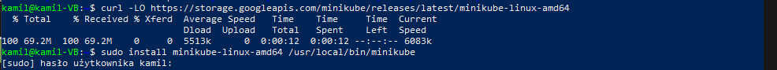

 ##### 2. Pobranie kubectl,  checksum kubectl oraz instalacja
 > ```curl -LO "https://dl.k8s.io/release/$(curl -L -s https://dl.k8s.io/release/stable.txt)/bin/linux/amd64/kubectl"```
 
 > ```curl -LO "https://dl.k8s.io/$(curl -L -s https://dl.k8s.io/release/stable.txt)/bin/linux/amd64/kubectl.sha256"```
 
 > ```echo "$(cat kubectl.sha256) kubectl" | sha256sum --check```
 
 > ```sudo install -o root -g root -m 0755 kubectl /usr/local/bin/kubectl```
 
 > ```kubectl version --client```
 
 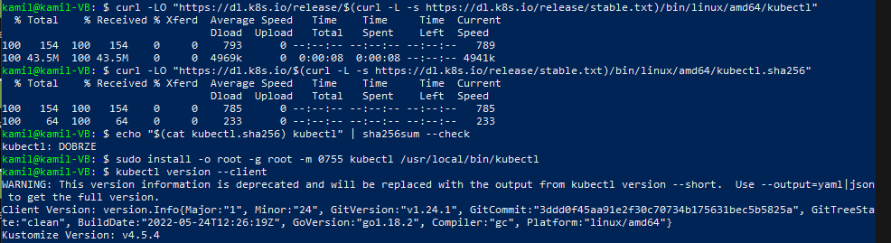
 
 
 ##### 3. Uruchomienie Kubernetes'a
 > ```sudo minikube start```
 
		Uruchomienie Kubernetes'a wymaga dodanie użytkownika do nowej grupy docker'a

> ```sudo usermod -aG docker $USER```

> ```newgrp docker```

 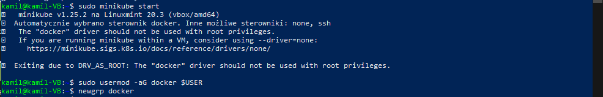

> ```sudo minikube start```

> ```kubectl get po -A```

> ```alias kubectl="minikube kubectl --"```

 

> ```minikube dashboard```

> ```docker ps```

 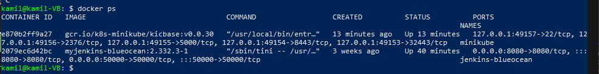
 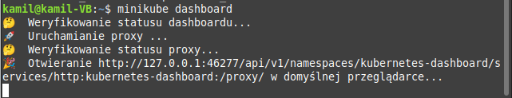
 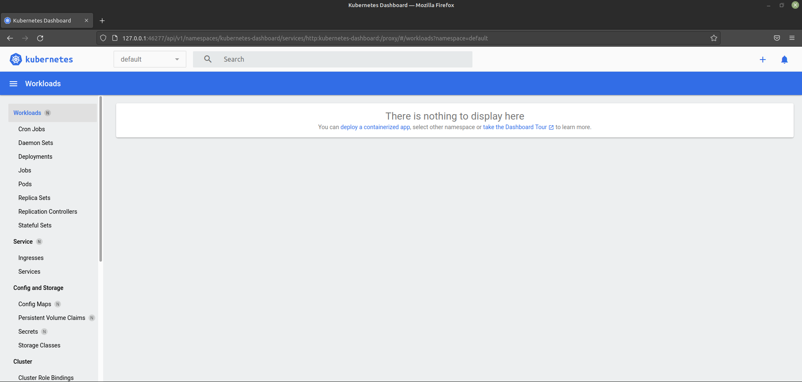

### Analiza posiadanego kontenera
 * Zdefiniuj krok "Deploy" swojego projektu jako "Deploy to cloud":
   * Deploy zbudowanej aplikacji powinien się odbywać "na kontener"
   * Przygotuj obraz Docker ze swoją aplikacją
   * Jeżeli wybrana aplikacja nie nadaje się do pracy w kontenerze i nie wyprowadza interfejsu funkcjonalnego przez sieć, wymień projekt na potrzeby tego zadania:
     * Minimum: obraz-gotowiec
	 * Optimum: samodzielnie wybrany program, obraz zbudowany na jego bazie
	 * Plan max: obraz wygenerowany wskutek pracy pipeline'u
   * Wykaż, że wybrana aplikacja pracuje jako kontener
##### Wybrana wcześniej aplikacja nie nadaje się do wdrożenia jej w tym laboratorium. Jest to prosta aplikacja (kalkulator), która nie udostępnia żadnych portów.
##### Dlatego też wybrałem obraz -gotowiec nginx.

#### Wykonane kroki:
 > ```docker pull nginx```
 > ```docker run -it --rm -d -p 8080:80 --name DevOps_nginx nginx```

 

### Uruchamianie oprogramowania
 * Uruchom kontener na stosie k8s
 * Kontener uruchomiony w minikubie zostanie automatycznie ubrany w pod.
 * ```minikube kubectl run -- <nazwa-wdrożenia> --image=<obraz-docker> --port=<wyprowadzany port> --labels app=<nazwa-wdrożenia>```
 * Przedstaw że pod działa (via Dashboard oraz kubectl)
 * Wyprowadź port celem dotarcia do eksponowanej funkcjonalności
 * ```kubectl port-forward <nazwa-wdrożenia> <LO_PORT>:<PODMAIN_CNTNR_PORT> ```
 * Przedstaw komunikację z eskponowaną funkcjonalnością
 
 #### Wykonane kroki:
 > ```kubectl run devops-nginx-deploy --image=nginx --port 80 --labels app=devops-nginx-deploy```
 
 > ```kubectl get pods```
 
  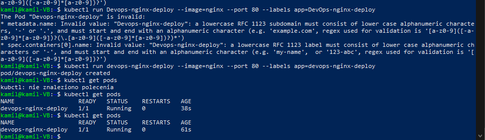
  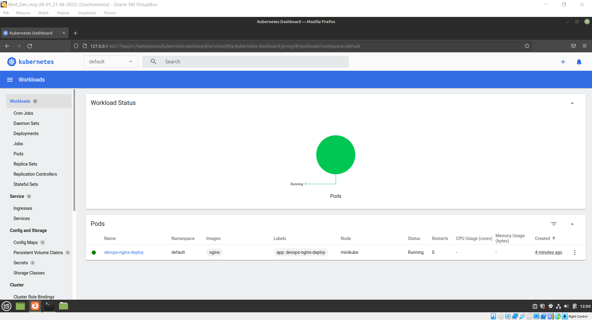
  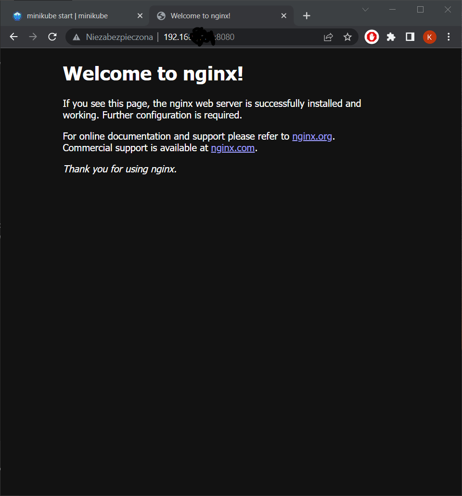

> ```kubectl port-forward devops-nginx-deploy 5000:80```

  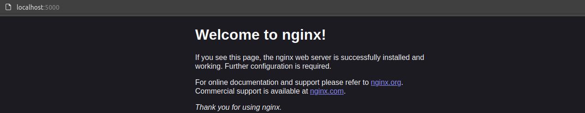


### Przekucie wdrożenia manualnego w plik wdrożenia (wprowadzenie)
 * Zapisanie wdrożenia jako plik YML
 * Dodanie replik
 * ```kubectl apply``` na pliku


```yml
apiVersion: apps/v1
kind: Deployment
metadata:
  name: devops-nginx-deploy-2
spec:
  selector:
    matchLabels:
      app: devops-nginx-deploy-2
  replicas: 5
  template:
    metadata:
      labels:
        app: devops-nginx-deploy-2
    spec:
      containers:
      - name: devops-nginx
        image: nginx
        ports:
        - containerPort: 80
```

> ```kubectl apply -f deploy.yml```

> ```kubectl get pods```

  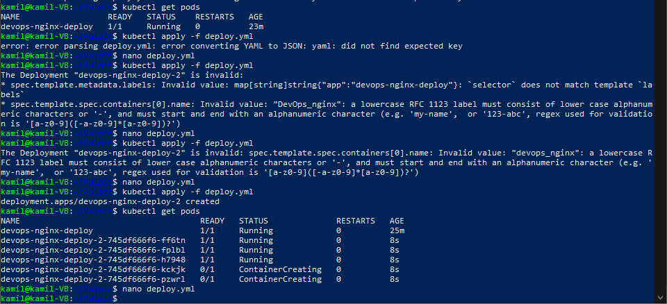

  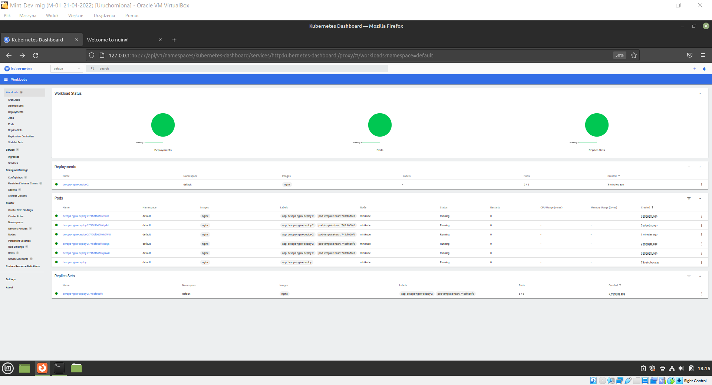


	


