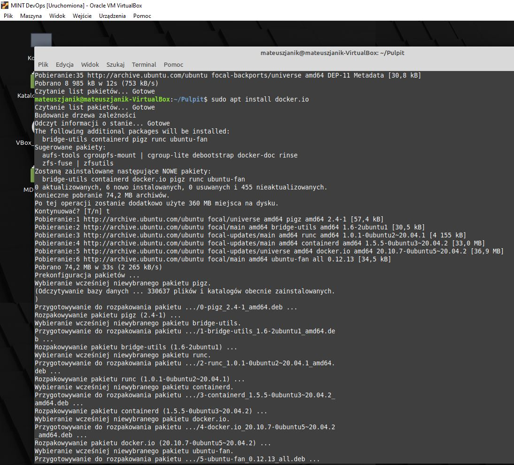
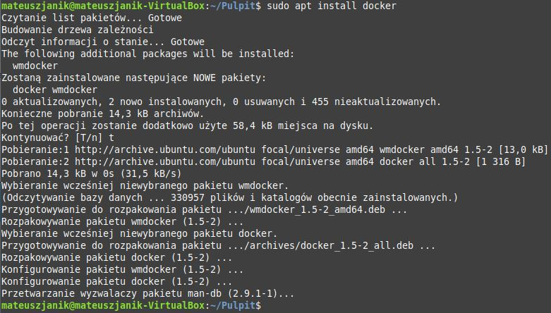
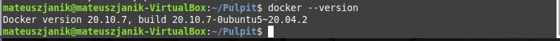
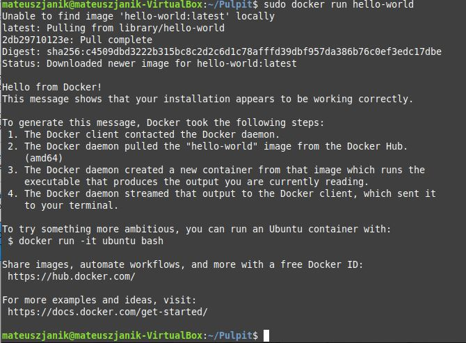
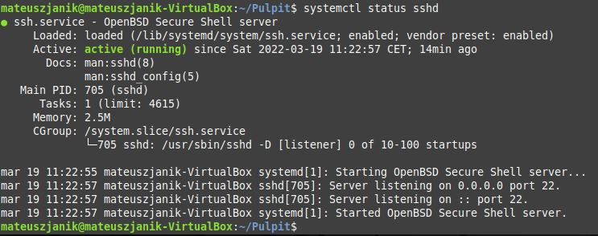
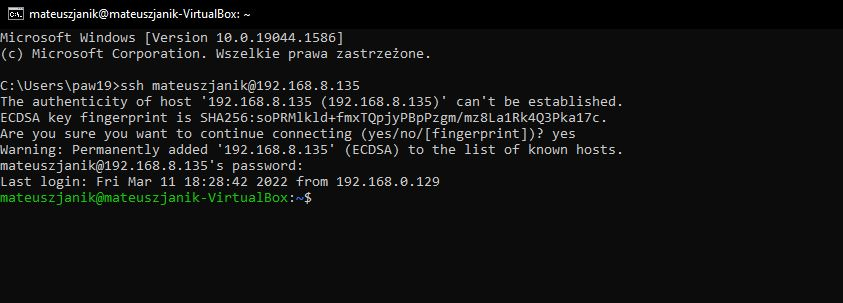
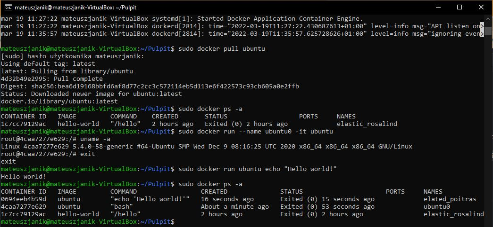
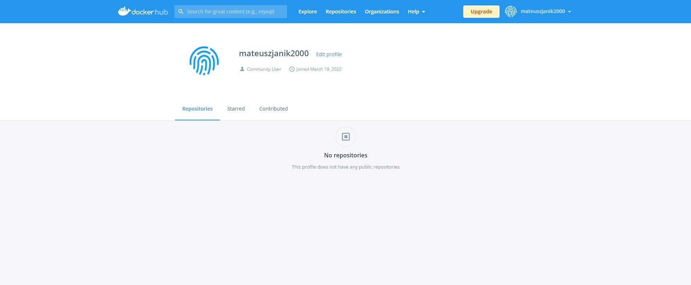

<h1>Sprawozdanie z zajęć laboratoryjnych 2 Metodyki DevOps</h1>
<strong>Mateusz Janik</strong>

<strong>grupa laboratoryjna 03</strong>

Zadania, które wykonałem:

1 Githook, który sprawdza tytuł commita (czy nazywa się MJ402123) oraz treść commita (czy pada w niej numer labu, właściwego dla zadania)
Plik commit_msg
```
#!/bin/sh
#-------------------------------------------------------------------moje-zmiany------------------------------
title=`head -n1 $1`
message=`tail -n1 $1`
message_p="(02)"
if ! [[ "$title" = "MJ402123" ]]; then
    echo "Zly tytul"
    exit 1
fi
if ! [[ "$message" =~ $message_p ]]; then
    echo "Zla wiadomosc commita"
    exit 1
fi

```

2 Zapewniłem przygotowanie środowiska dockerowego:
Instalowanie dockera:




Sprawdzenie wersji dockera:


Sprawdzenie działania przez uruchomienie hello-world


Sprawdzenie statusu ssh:


Połączenie z VM przez cmd:


3 Działanie środowiska:

Sprawdzenie statusu dockera:


Pobranie obrazu Ubuntu i uruchomienie:


4 Utworzenie konta na Docker Hub:



