<h1>Sprawozdanie z zajęć laboratoryjnych 3 Metodyki DevOps</h1>
<strong>Mateusz Janik</strong>

<strong>grupa laboratoryjna 03</strong>

Zadania, które wykonałem:

1.Przez problemy z innymi repozytoriami, które na początku znalazłem, postanowiłem wziąć do tego ćwiczenia repozytorium prezentowane na zajęciach : IRSSI

2.Na początku połączyłem się przez ssh

Następnie sprawdziłem docker images:

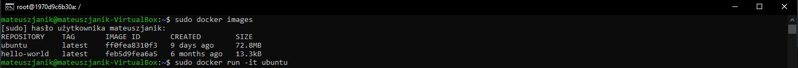

3.Zaopatrzyłem kontener w wymagania wstępne:

Na początku komenda apt-get -y update

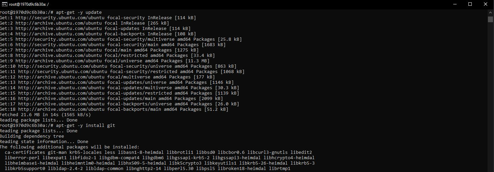

Instalowanie gita:

Instalowanie gcc:

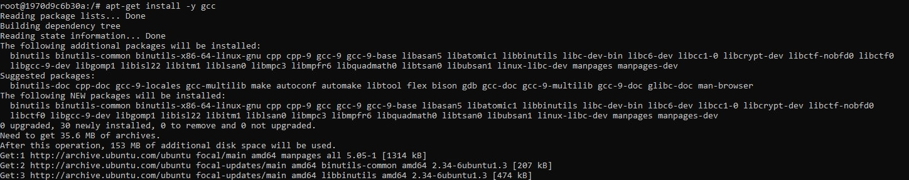

Instalowanie make:

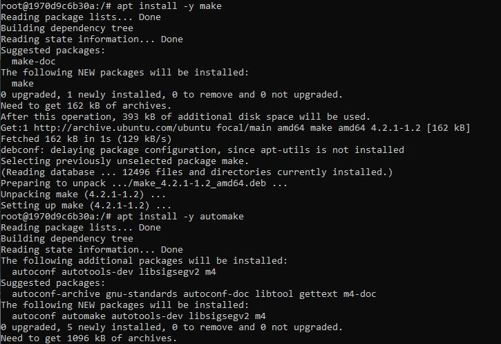

Instalowanie automake:

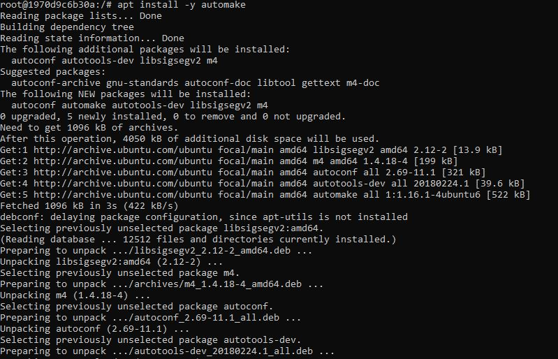

Instalowanie mesona:

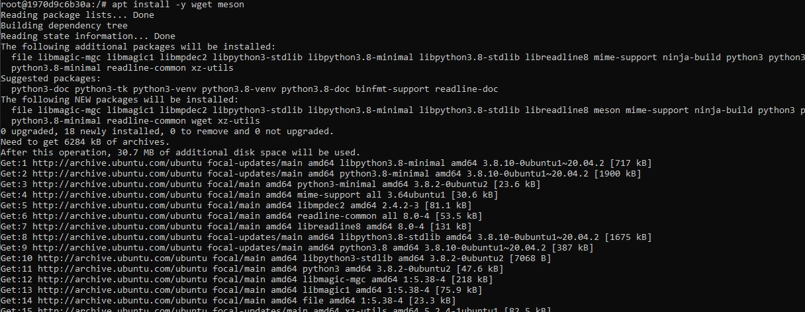

3. Sklonowanie repozytorium :

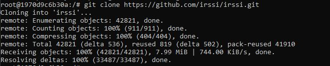

Okazało się, że trzeba zainstalowałem jeszcze paru potrzebnych rzeczy:

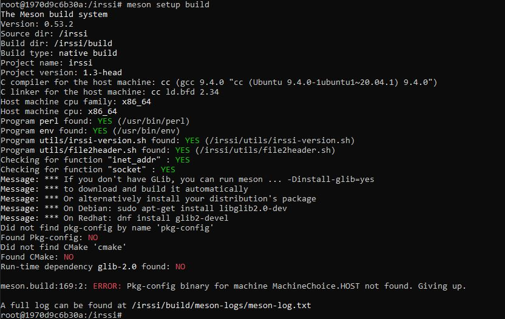

Dlatego zainstalowałem jeszcze libglib2.0-dev:

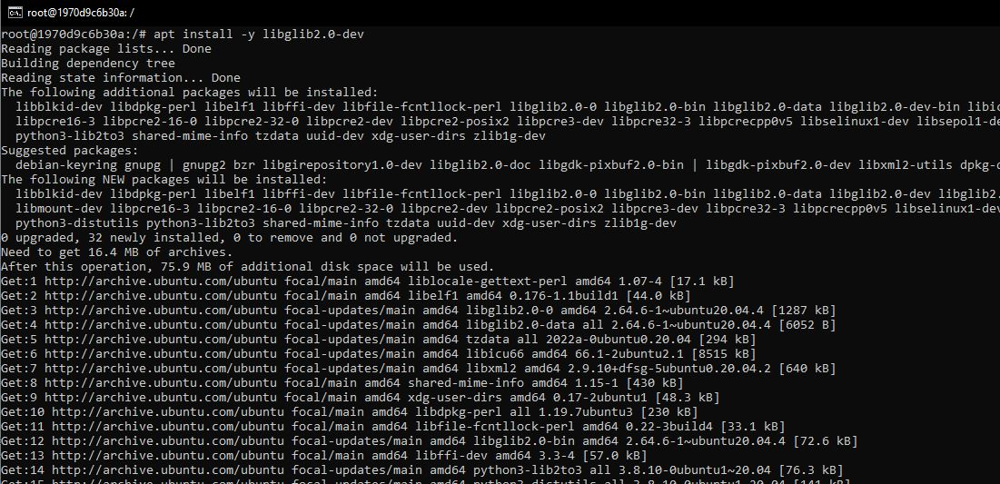

Następnie g++:

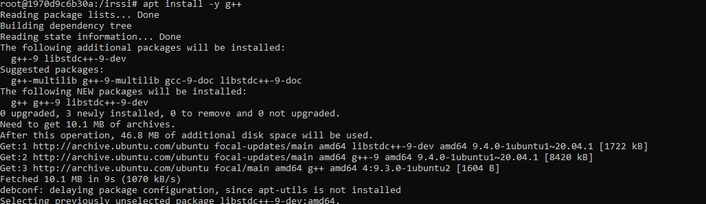

libssl-deva: 

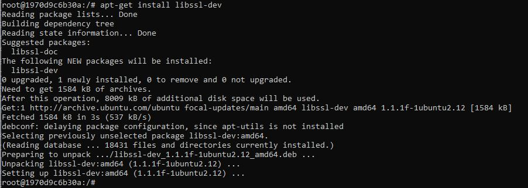

libtinfo-deva:

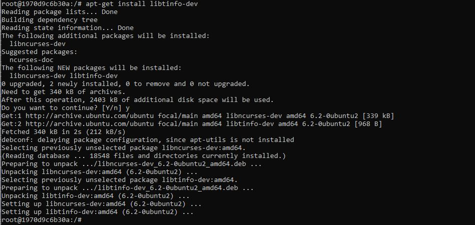

4. Uruchomiłem builda:

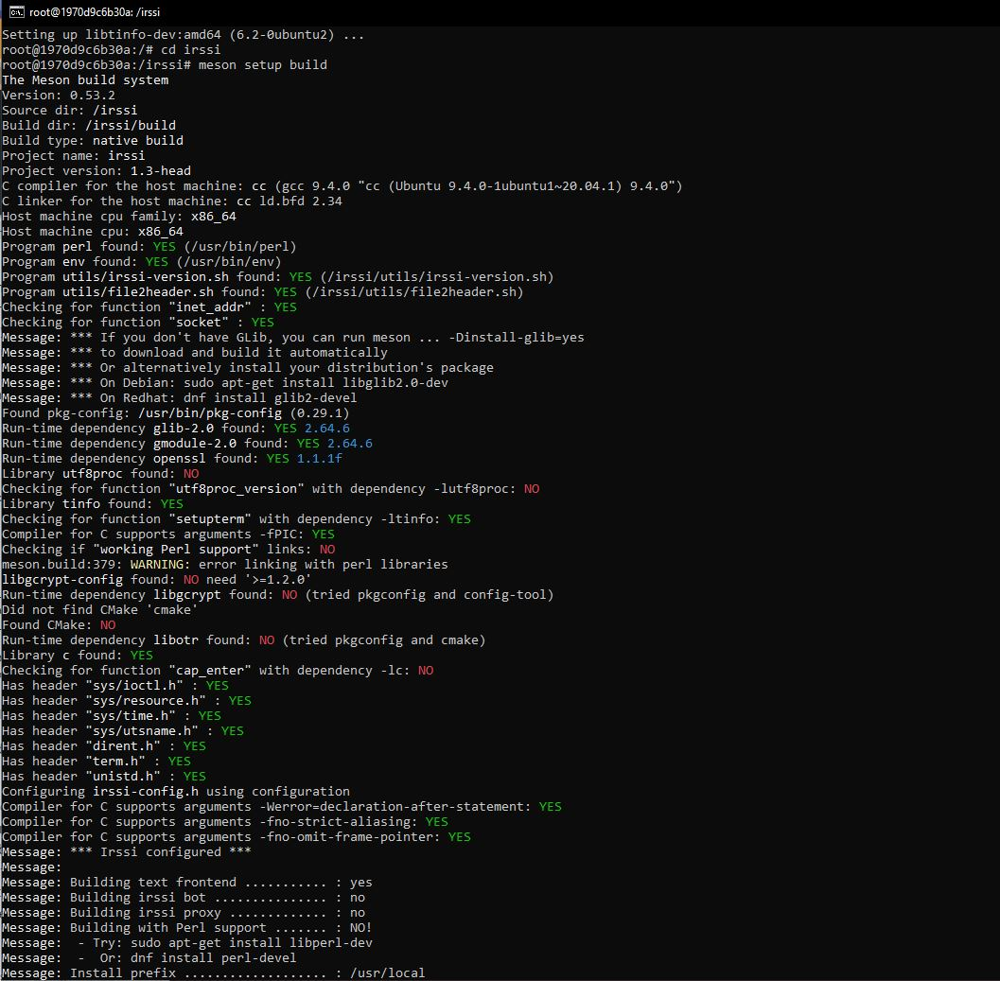
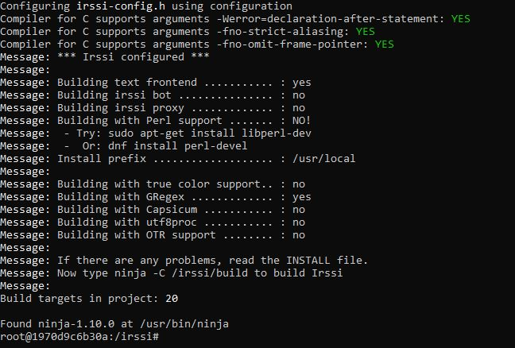

5. A następnie uruchomiłem testy:

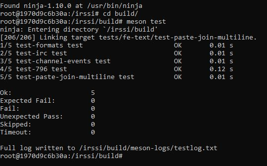

6. Stworzyłem katalog roboczy o nazwie "Lab03" oraz plik dockerfile "Docker-BLDR": 

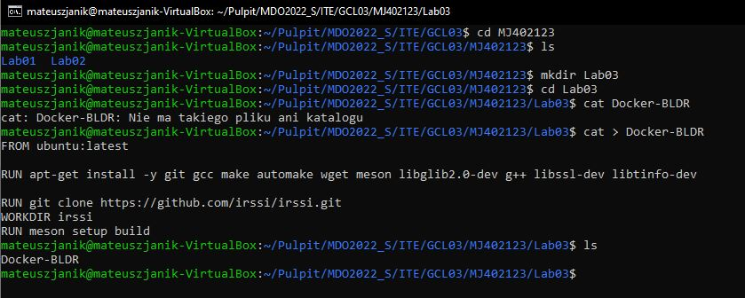

Po paru próbach i problemach mój dockerfile wygląda w następujący sposób:

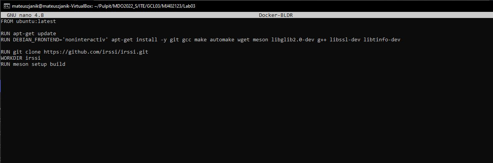

7.Stworzyłem obraz na podstawie dockerfile'a :Docker-BLDR":

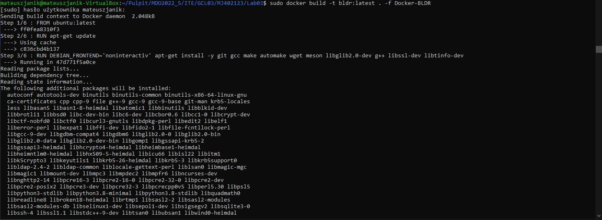

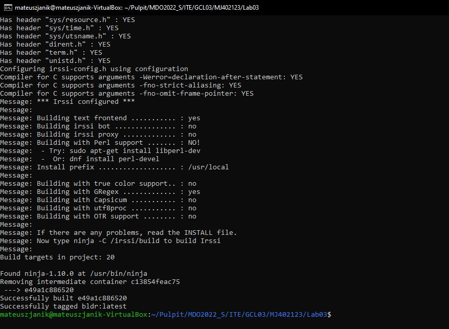

8. Sprawdziłem działanie :

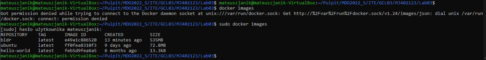
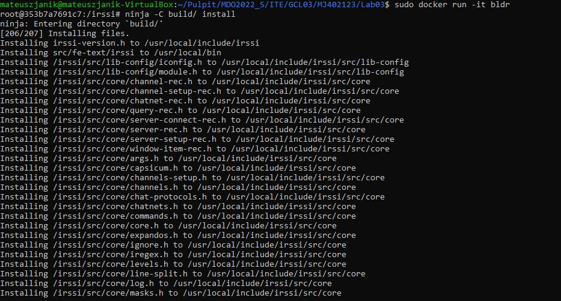

9. Włączyłem Irssi

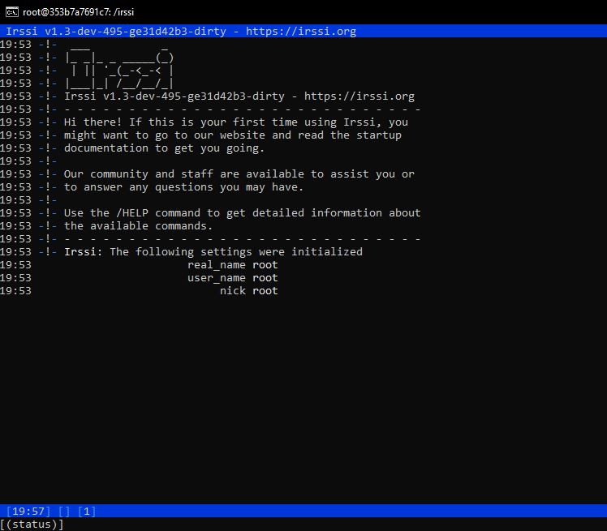

10. Stworzyłem drugi dockerfile'a do uruchamiania testów

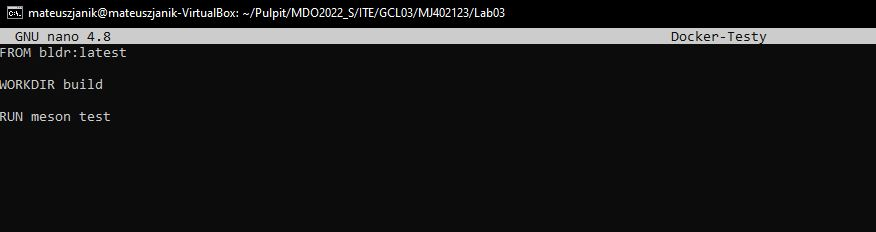

11. Uruchomiłem builda i otrzymałem wynik testów:

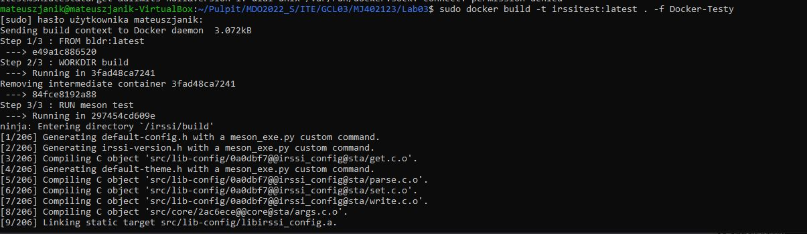
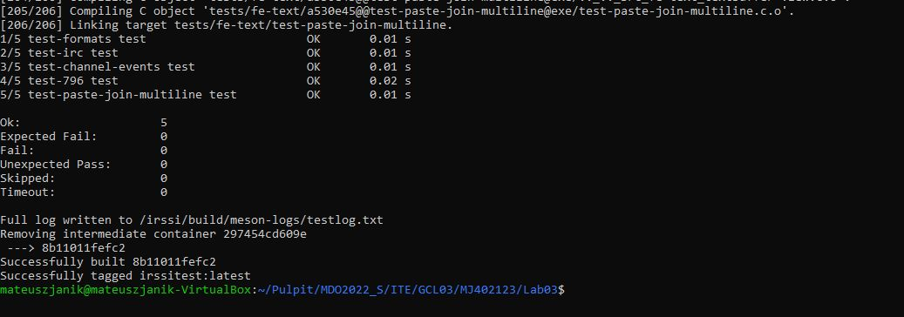

12. Sprawdziłem zapis w docker images:

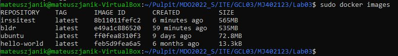
