<h1>Sprawozdanie z zajęć laboratoryjnych 4 Metodyki DevOps</h1>
<strong>Mateusz Janik</strong>

<strong>grupa laboratoryjna 03</strong>

Zadania, które wykonałem:

<strong>Zachowywanie stanu</strong>

- Przygotuj woluminy wejściowy i wyjściowy, o dowolnych nazwach, i podłącz je do
kontenera bazowego, z którego rozpoczynano poprzednio pracę:

Na początku stworzyłem dwa woluminy za pomocą polecenia docker volume create. Pierwszy wejściowy o nazwie volumin_wej i drugi wyjściowy o nazwie volumin_wyj

Następnie wyświetliłem szczegóły stworzonych woluminów.

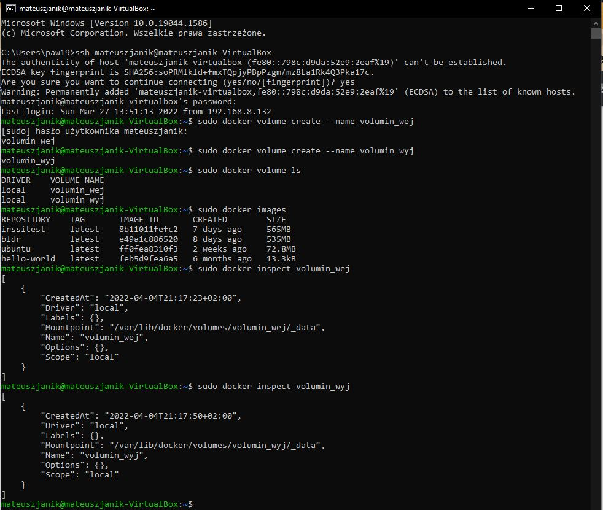

- Uruchom kontener, zainstaluj niezbędne wymagania wstępne (jeżeli istnieją), ale
bez gita
  
Uruchomiłem kontener jednocześnie montując oba woluminy:

A następnie zaistalowałem niezbędne wymagania wstępne (takie jak np. gcc)

- Sklonuj repozytorium na wolumin wejściowy

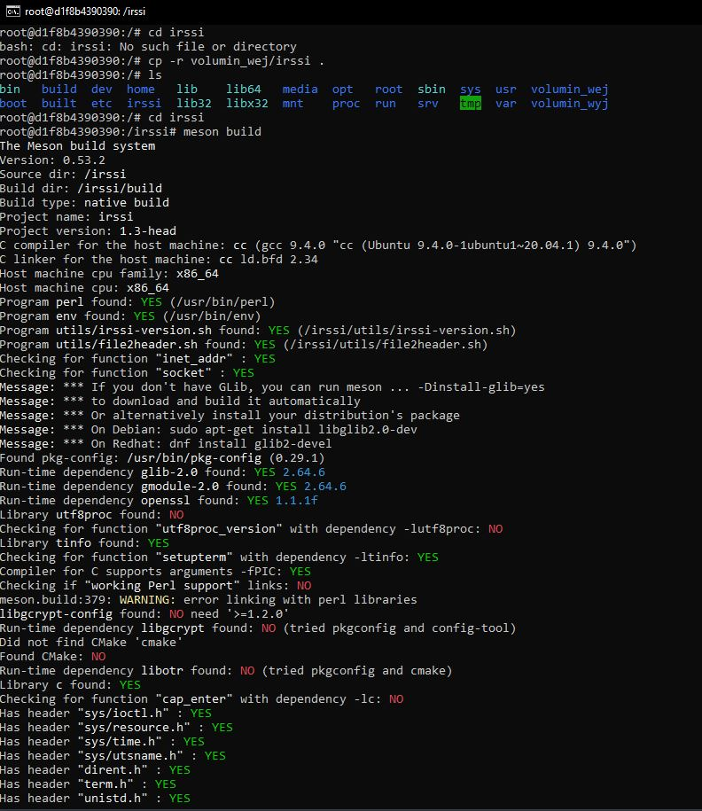

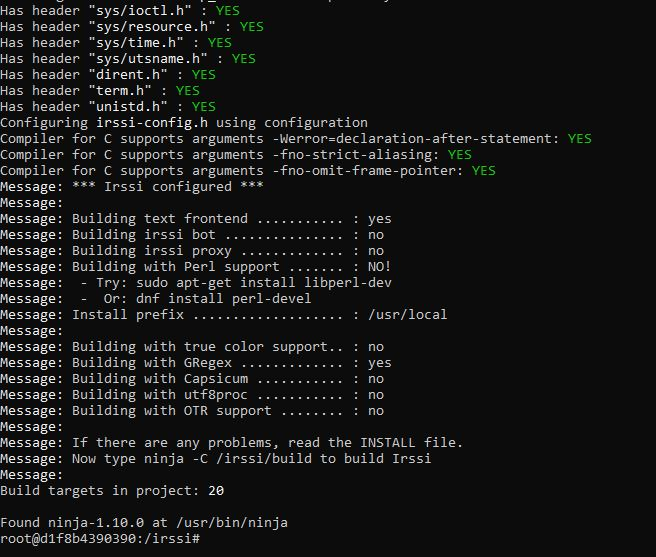

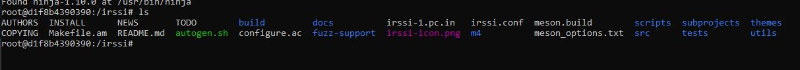

- Zapisz powstałe/zbudowane pliki na woluminie wyjściowym

Otworzyłem nowe cmd i zalogowałem się jako root na mojej maszynie wirtualnej.
Następnie zabisałem zbudowane pliki na woluminie wyjściowym. 

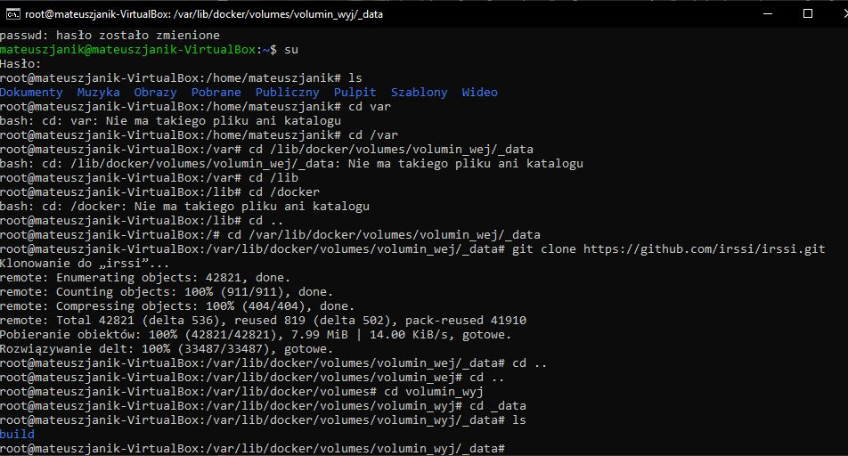

<strong>Eksponowanie portu</strong>

- Uruchom wewnątrz kontenera serwer iperf (iperf3)

Zaisntalowałem wszędzie iperf3

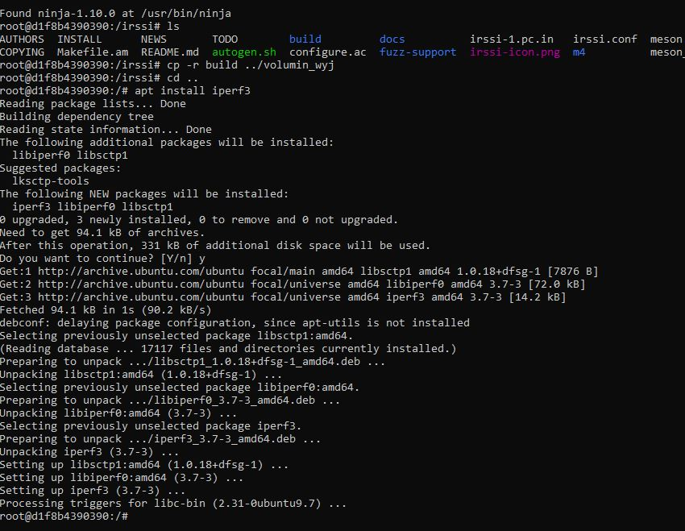

Ustawiłem serwera

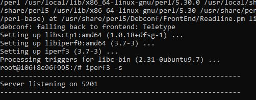

- Połącz się z nim z drugiego kontenera, zbadaj ruch

Następnie sprawdziłem nazwę drugiego kontenera

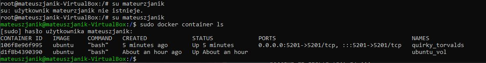

A następnie jego IPAdress

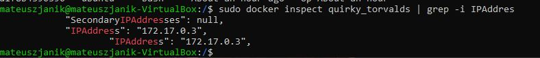

Połączenie z drugiego kontenera i zapis ruchu między nimi:

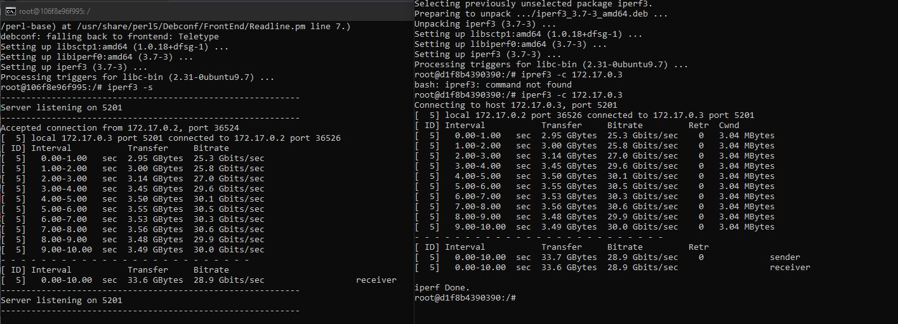

- Połącz się spoza kontenera (z hosta i spoza hosta)

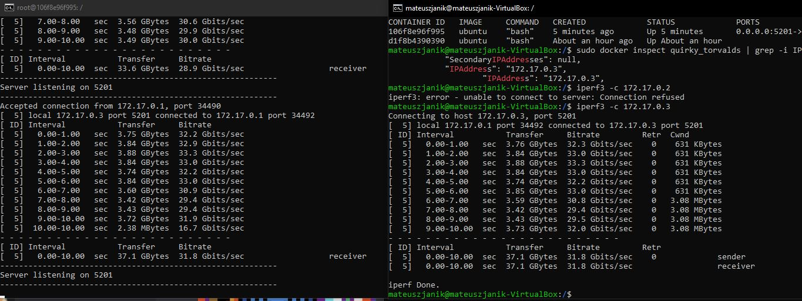

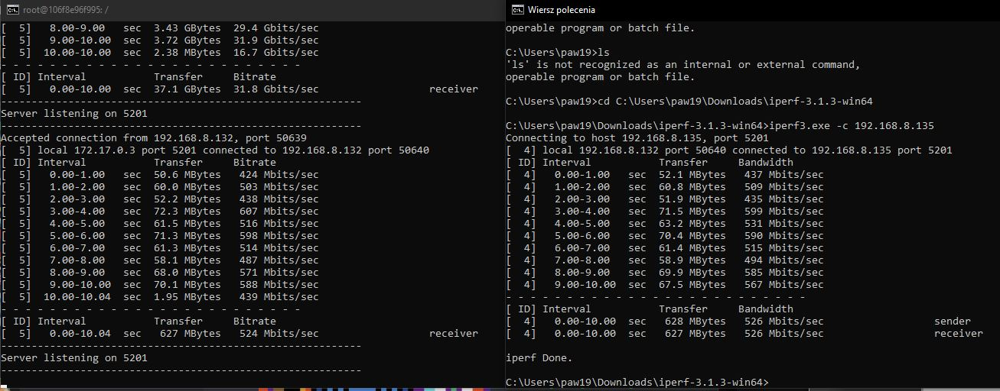

- Przedstaw przepustowość komunikacji lub problem z jej zmierzeniem (wyciągnij log
z kontenera)
  
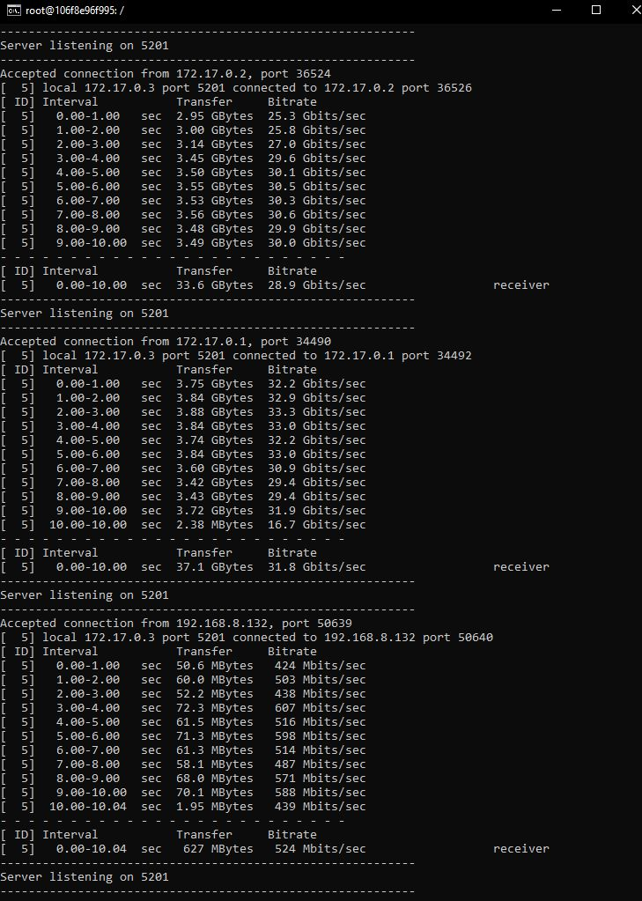

<strong>Instancja Jenkins</strong>

- Przeprowadź instalację skonteneryzowanej instancji Jenkinsa z pomocnikiem DIND

Na początku stworzyłem nową sieć dokerową za pomocą polecenie sudo docker network create

Następnie zgodnie z instrukcją znajdującą się w dokumentacji jenkinsa pobierałem i uruchomiłem obraz DIND kontenera.

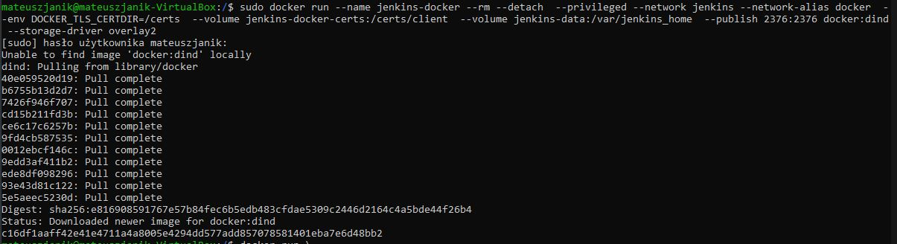

Później stworzyłem plik Dockerfile:

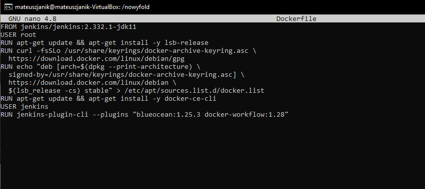

Następnie uruchomiłem build:

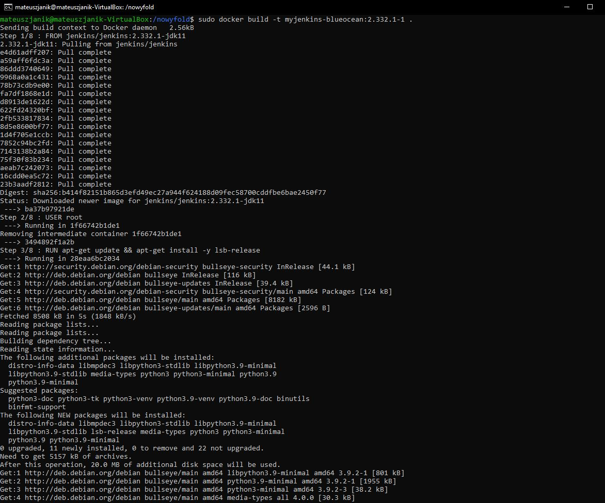

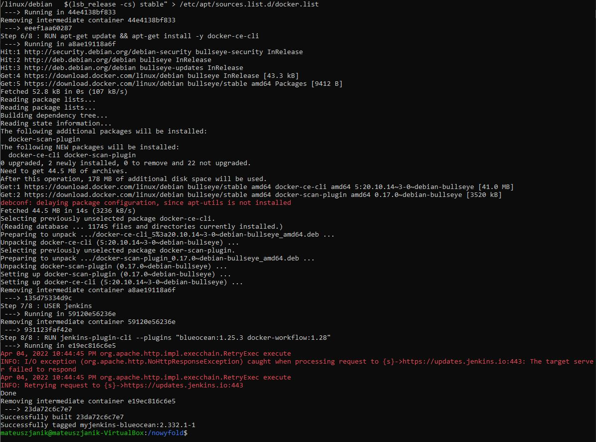

Później uruchomiłem powstały obraz:

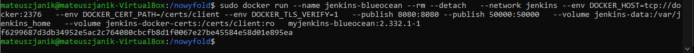

- Zainicjalizuj instację, wykaż działające kontenery, pokaż ekran logowania

Wszedłem na adres localhost:8080 :

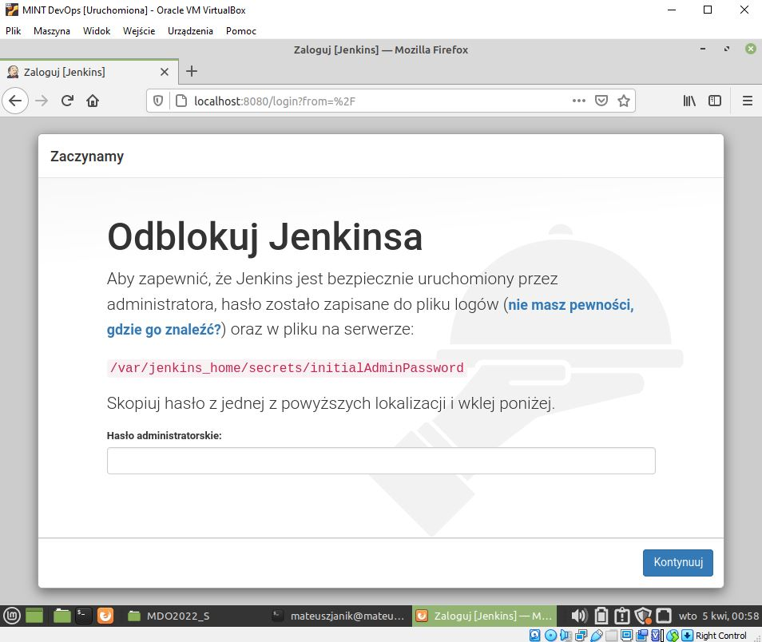

Następnie według instrukcji znalazłem hasło:

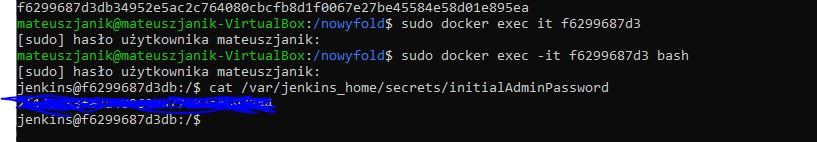

Później zainstalowałem zalecane wtyczki:

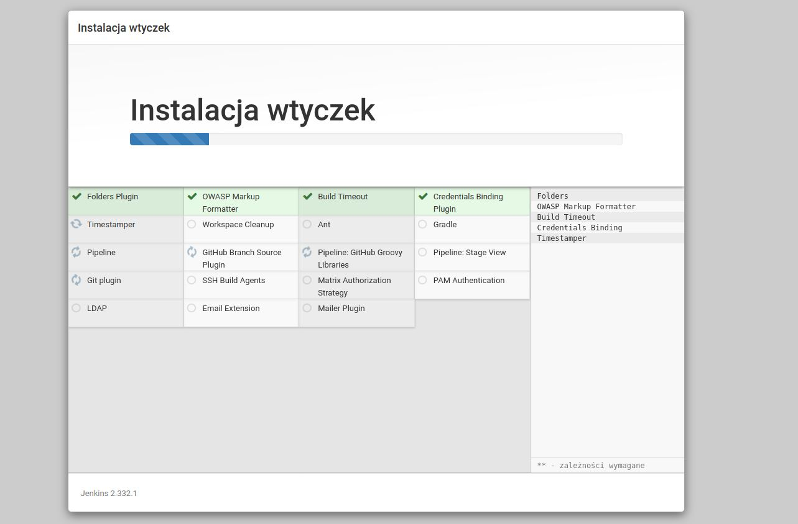

Ekran po utworzeniu konta i zalogowaniu:

I na sam koniec potwierdzenie, że kontenery działają:

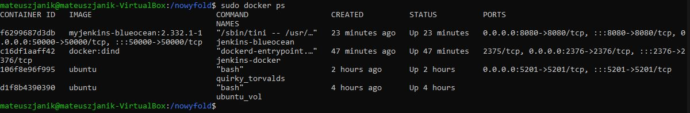

