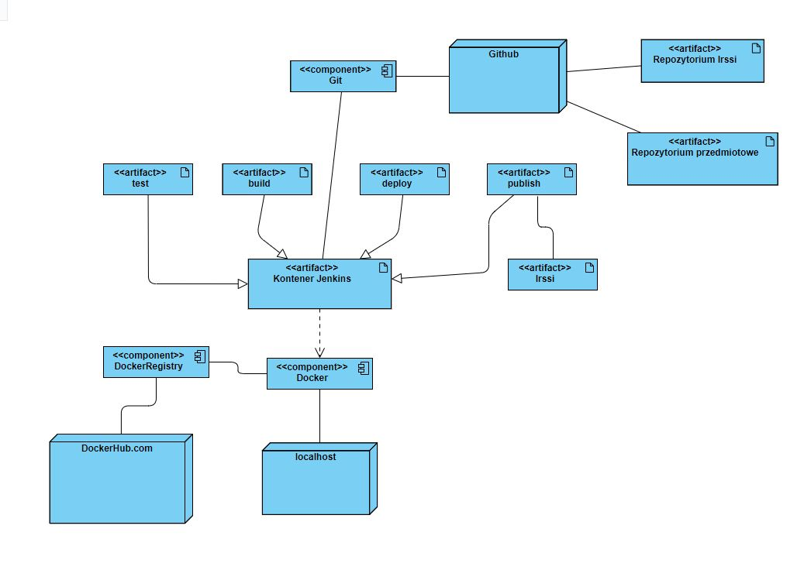
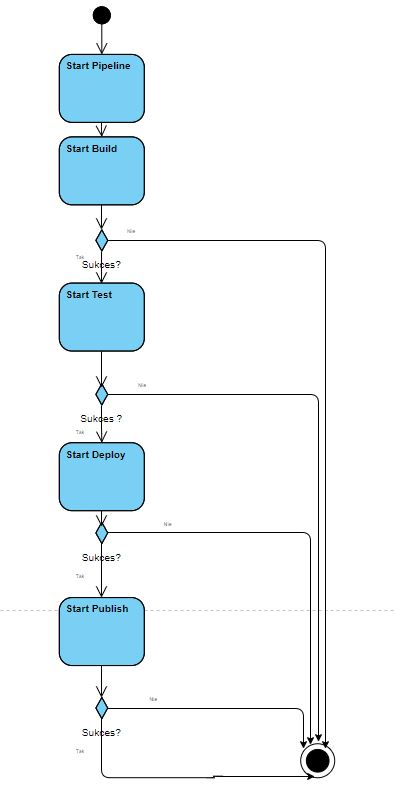
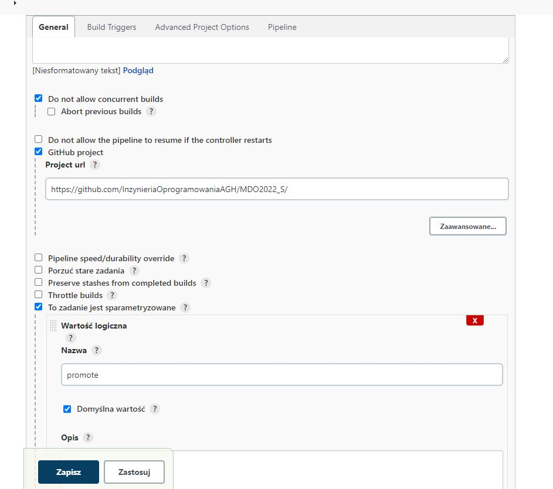
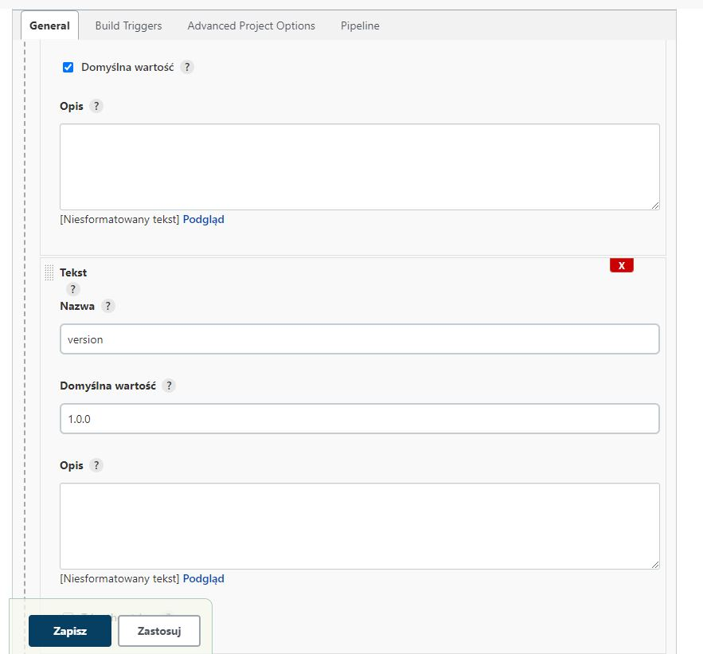
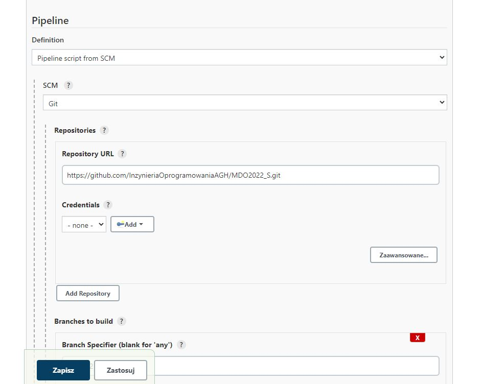
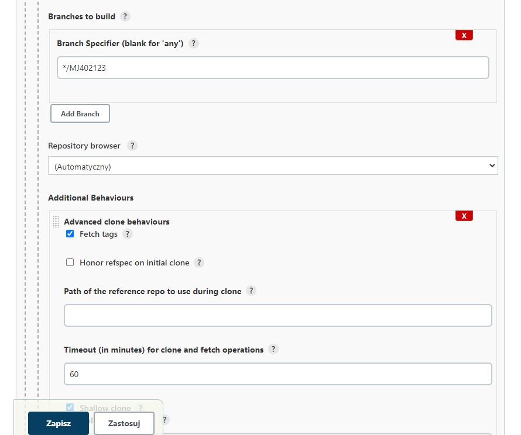
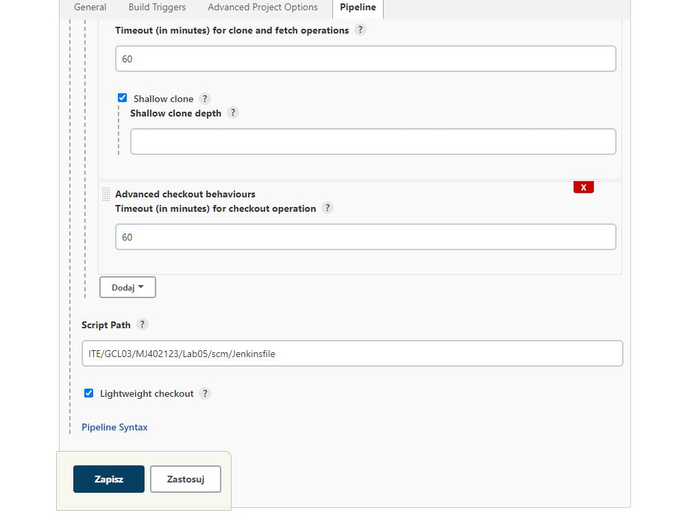
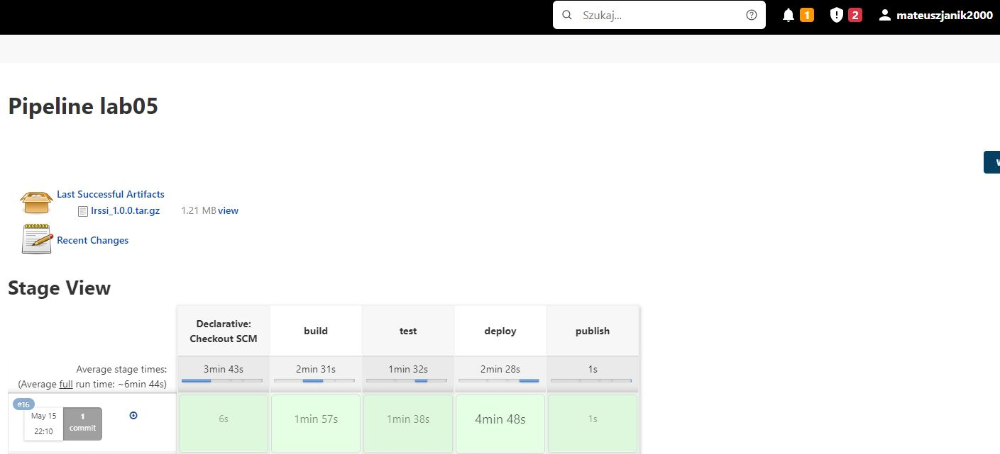

| Imię i nazwisko | Grupa laboratoryjna | Data wykonania |
| ----------- | ----------- | ----------- |
| Mateusz Janik | 03 | 13.05.2022r |

# Sprawozdanie z projektu z przedmiotu Metodyki DevOps

## Cel :

Jako repozytorium wykorzystane w projekcie wybrałem irssi.
Celem projektu było przeprowadzenie builda i testów repozyturium poprzez zautomatyzowany pipeline.

## Streszczenie projektu:

Do zrealizowania wyżej założonego celu posłużyłem się Jenkinsem zainstalowanym na Dockerze. 
Dzięki temu mogłem podzielić skomplikowane zadanie na kilka mniejszych stage'y, co pomogło w szybszej realizacji wymaganych kroków oraz w debugowaniu pipeline'u.
W projekcie znajdują się 4 stage'e: Build, Test, Deploy i Publish.

### pipeline wykonuje następujące kroki:
- Pobiera plik Jenkinsfile z repozytorium na githubie
- Tworzy nowy kontener, a następnie kopiuje do niego Irssi'
- Następnie buduje kod Irssi
- Później przeprowadza testy
- Kopiuje zbudowaną aplikacje i uruchamia ją na nowym systemie
- Udostępnia zbudowaną aplikację jako artefakt
- Pakuje do tar.gz


## Omówienie projektu:

### Etapy pipeline'a

Plik Jenkinsfile podzielony jest na już wyżej wspomniane 4 stage. Pierwszym z nich jest build:

1. build

    - Celem tego stage'a było zbudowanie na podstawie kodu z Githuba aplikacji Irssi

    - Jenkinsfile tworzy obraz build_irssi na podstawie pliku Docker-BLDR. Plik Docker-BLDR zawiera w sobie instrukcje, dzięki którym na nowopobranej maszynie ubuntu instalują się automatycznie Git oraz zależności wymagane do zbudowanie Irssi.
    Później kod Irssi pobierany jest z repozytorium i następnie rozpoczyna się budowanie aplikacji rozpoczęte uruchomieniem polecenia budującego. Po poprawnym stworzeniu obrazu zostaje uruchomiony kontener (na podstawie obrazu) i za pomocą polecenia docker cp zostaje skopiowany plik wykonywalny Irssi.

    - Fragment kodu:

```
stage('build') {
                options{
                timeout(time: 1, unit: 'HOURS')
}
            steps {
                sh 'docker kill kontener || true'
                sleep 2
                sh 'docker build -t build_irssi . -f ITE/GCL03/MJ402123/Lab05/Docker-BLDR'
                sh 'docker run --name kontener -dit --rm build_irssi'
                sh 'rm irssi || true'
                sh 'docker cp kontener:irssi/build/src/fe-text/irssi .'
                sh 'docker kill kontener'
            }
        }

```


2. test

    - Celem tego stage'a jest uruchomienie testów

    - Na podstwie stworzonego obrazu buildirssi zostaje stworzony obraz test_irssi, który uruchamia testy.

    - Fragment kodu:

```
 stage('test') {
            steps {
                sh 'docker build -t test_irssi . -f ITE/GCL03/MJ402123/Lab05/Docker-Testy'
                sh 'docker run test_irssi'
            }
        }


```


3. deploy

    - Celem tego stage'a jest uruchomienie aplikacji zbudoanej w stage'u build, na nowym kontenerze, który symuluje klienta.

    - W tym stage'u zbudowana wcześniej aplikacja zostaje przeniesiona na nowoutworzonym kontenerze ubuntu. Następnie doinstalowywane są zależności wymagane do poprawnego uruchomienia Irssi.
    Na koniec sprawdzana jest wersja Irssi. Jeżeli wersja by się nie wyświetliła oznaczało by to problem z deployem.
    
    - Fragment kodu:

```
stage('deploy') {
                steps{

                sh 'docker run --rm --name deploykontener -dit ubuntu'
                sh 'docker cp irssi deploykontener:.'
                sh 'docker container exec deploykontener sh -c "apt-get update"'
                sh 'docker container exec deploykontener sh -c "DEBIAN_FRONTEND="noninteractive" apt-get install -y libglib2.0"'
                sh "docker container exec deploykontener sh -c 'apt-get install -y libutf8proc-dev'"
                sh "docker container exec deploykontener sh -c './irssi --version'"
                sh "docker container kill deploykontener"
                }
        }


```

4.publish
    
    - Celem tego stage'a jest publiczne udostępnienie aplikacji, żeby klient mógł ją odebrać.
    - Plik Irsssi, po przejściu wcześniejszych kroków nadaje się do udostępnienie klientowi.
    - Fragment kodu:

```
stage('publish') {
                when{
                        expression{
                                return params.promote==true;
}
}
                steps {
                        sh 'rm -r Irssi_Pliki || true'
                        sh 'mkdir Irssi_Pliki'
                        sh 'echo "Proszę zainstaluj przed uruchomieniem libglib2.0 i libutf8proc-dev" > Readme'
                        sh 'cp irssi Irssi_Pliki'
                        sh 'cp Readme Irssi_Pliki'
                        sh "tar -zcf Irssi_${params.version}.tar.gz Irssi_Pliki"
                        archiveArtifacts artifacts: "Irssi_${params.version}.tar.gz"
                }


```


## Diagramy:

### Diagram wdrożenia:



### Diagram aktywności:



## Screeny:

### Tworzenie pipelinu:











### Efekt końcowy



