<h1>Sprawozdanie z zajęć laboratoryjnych 9 Metodyki DevOps</h1>
<strong>Mateusz Janik</strong>

<strong>grupa laboratoryjna 03</strong>

Zadania, które wykonałem:

<strong>
Przeprowadziłem instalację systemu Fedora w VM(VirtualBoxie), skonfigurowałem użytkowników używając prostego hasła, sieć, wybierałem podstawowy zbiór oprogramowania:

(przydzieliłem miejsce na dysku, wybrałem język angielski i polski układ klawiatury, następnie przeprowadziłem manualne partcjonowanie, wybrałem instalacje minimalną i stworzyłem konto roota i konto użytkownika bez uprawnień admina)
</strong>

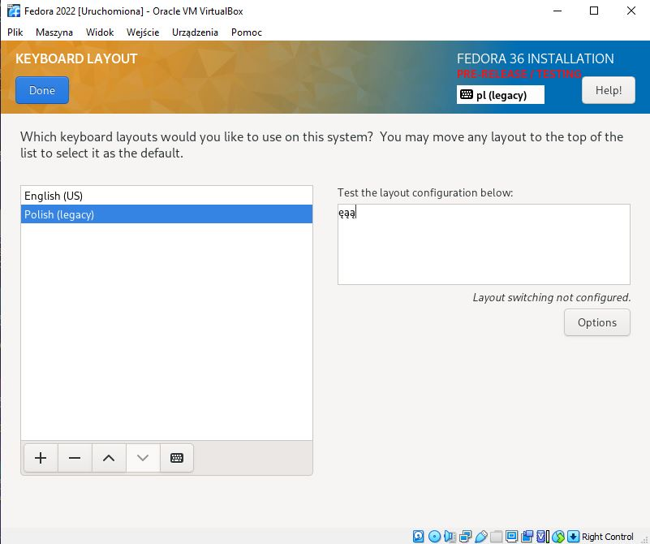

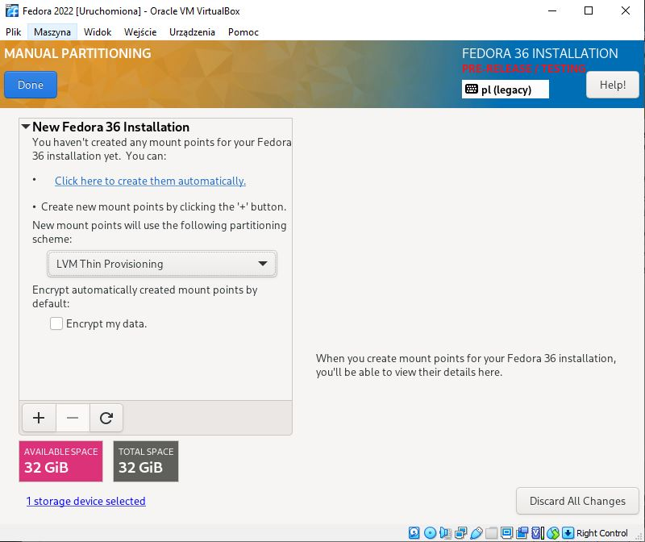

<strong>
Następnie przeprowadziłem instalację drugiego systemu Fedora, który będzie serwował repozytorium przez HTTP:
</strong>

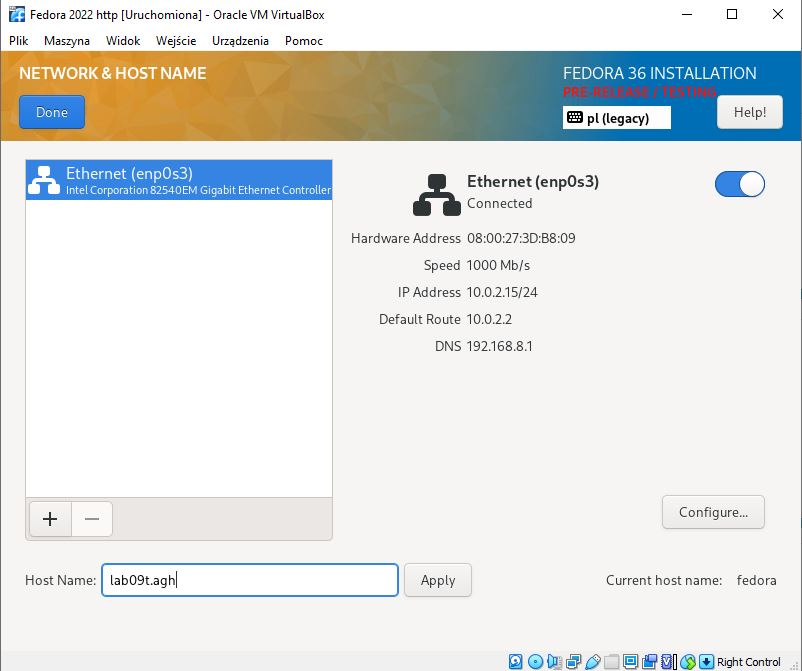

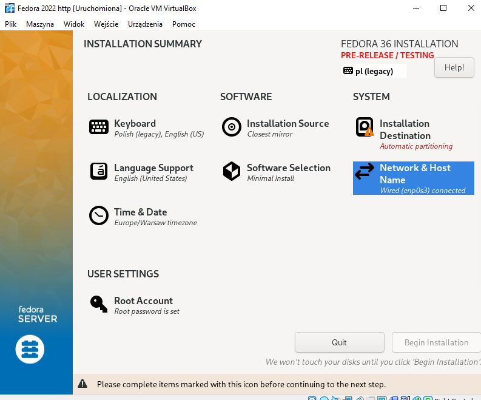

<strong>
Następnie zainstalowałem FileZille i połączyłem się z moją wirtualną maszyną
</strong>

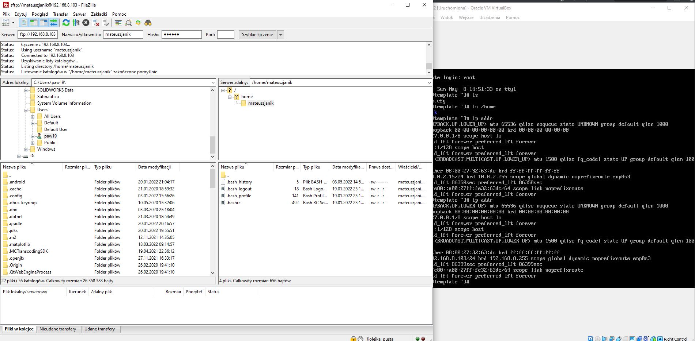

<strong>
Po poprawnie przeprowadzonej instalacji pierwszej wirtualnej maszyny z Fedorą powstał plik zawierający informacje dla instalatora.
Dzięki temu plikowi można powtórzyć instalację bez wybierania od nowa wszystkich rzeczy.
Na zdjęciu widać jak kopiuję ten plik. Plik ma nazwę "anaconda-ks.cfg"
</strong>

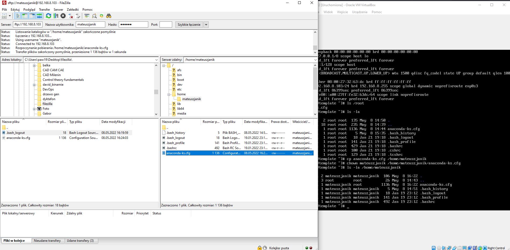

<strong>
Instalowanie httpd na drugiej fedorze
</strong>

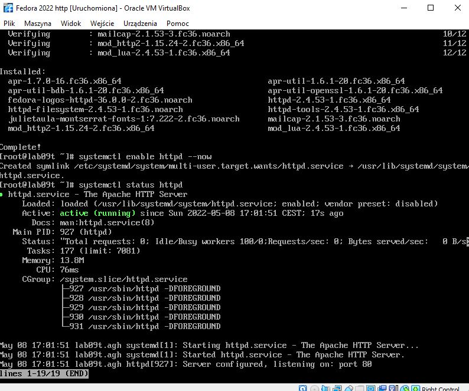

<strong>
Umieściłem artefakt z projektu na serwerze http
</strong>

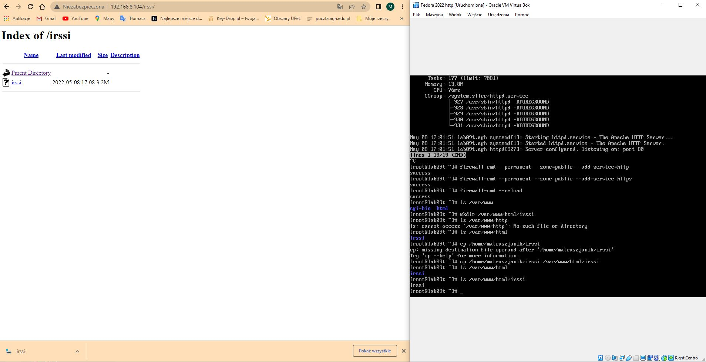

<strong>
Na pierwszej maszynie wirtualnej z fedorą zainstalowałem potrzebne pakiety np. wget
</strong>

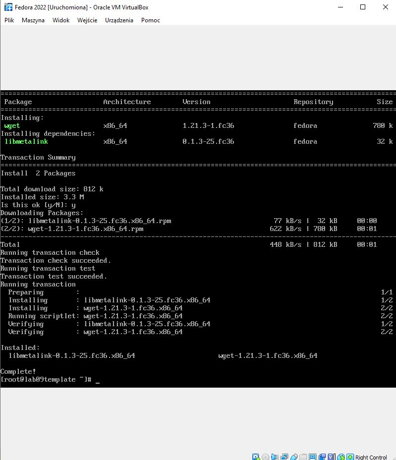

<strong>
Następnie pobrałem irssi z serwera http
</strong>

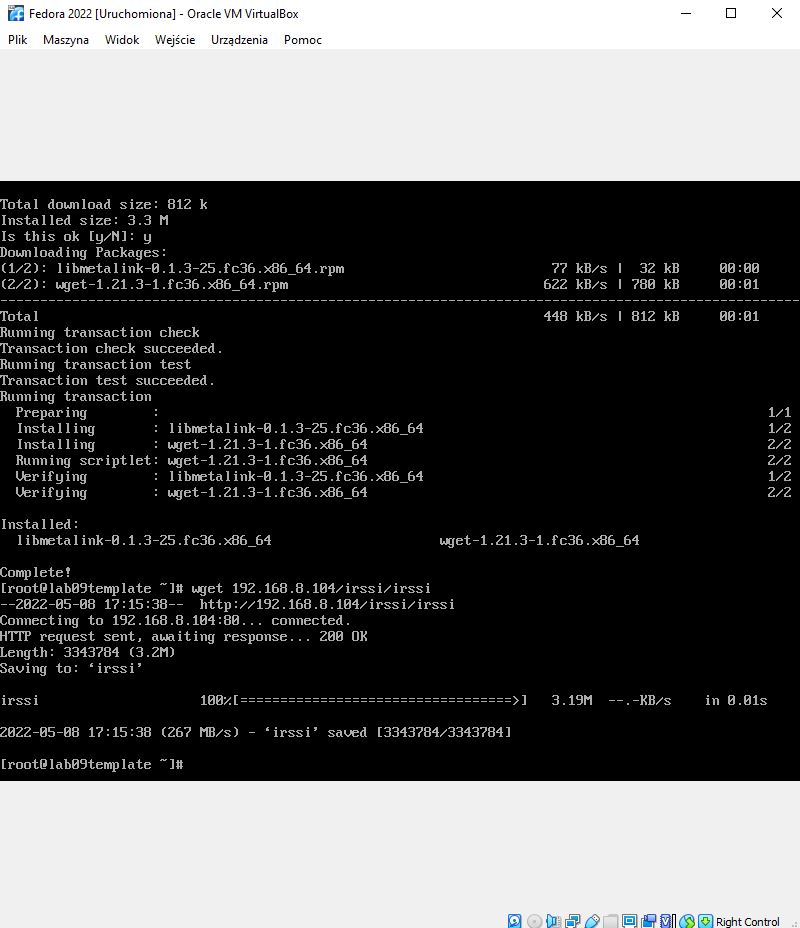

<strong>
Instalacja nienadzorowana:

Zlokalizowałem plik odpowiedzi z instalacji i dodałem do niego elementy odpowiedzialne za wszystkie potrzebne dependencje
Następnie zdefiniowałem repizytoria i dodałem proces pobierania artefaktu.

</strong>

Zmiany które zrobiłem:
<blockquote>

# Use graphical install
text

....

# Repo
url --mirrorlist=http://mirrors.fedoraproject.org/mirrorlist?repo=fedora-$releasever&arch=x86_64
repo --name=updates --mirrorlist=http://mirrors.fedoraproject.org/mirrorlist?repo=updates-released-f$releasever&arch=x86_64

...

%packages
@^minimal-environment
wget
libgcrypt*
utf8proc*
ncurses*

....

%post
mkdir /MJ402123
wget 192.168.8.104/irssi/irssi -O /tmp/irssi
cp /tmp/irssi /MJ402123
%end
</blockquote>

<strong>
Próba instalacji mowej fedory
</strong>

<strong>
i pierwszy błąd wynikający z faktu że pierwotna maszyna z której brany był plik odpowiedzi miała inny rozmiar dysku
</strong>

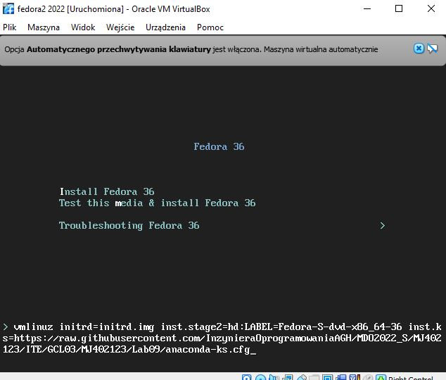

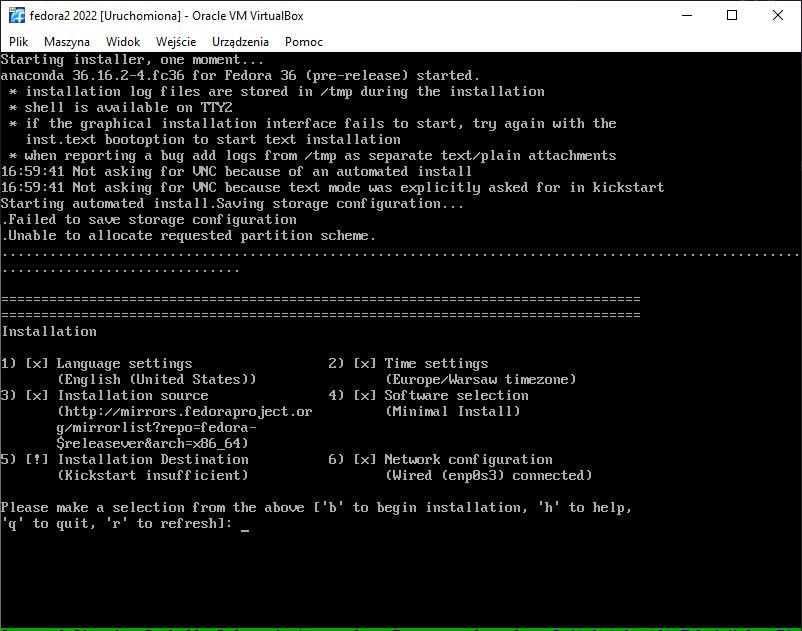

<strong>
Po naprawieniu tego
</strong>

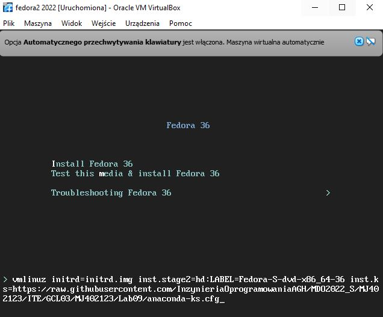

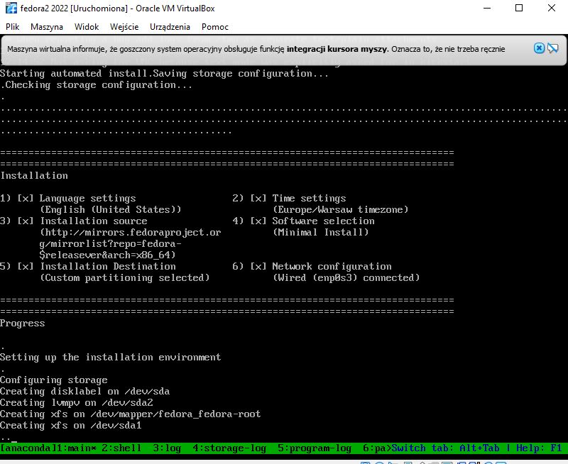

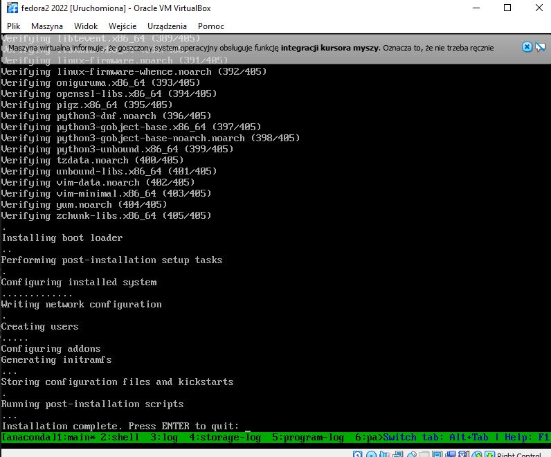

<strong>
Uruchomienie irssi
</strong>

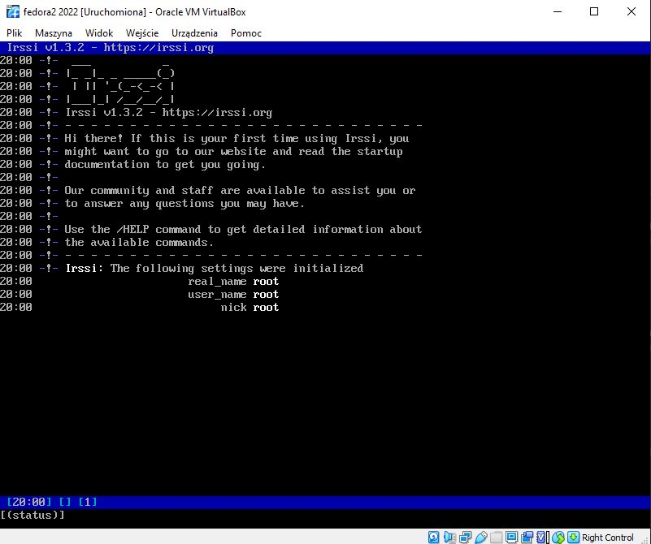

