# Sprawozdanie

## Zainstaluj klienta Git i obsługę kluczy SSH
Instalacja git: `sudo apt install git`
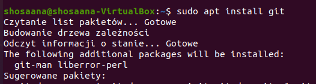

Sprawdzenie aktualnej wersji: `git --version`
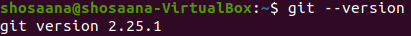

oraz sprawdzenie narzędzia SSH: `ssh -V`
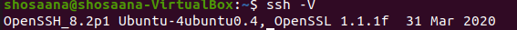

## Sklonuj repozytorium https://github.com/InzynieriaOprogramowaniaAGH/MDO2022_S za pomocą HTTPS

Sklonowanie repozytorium za pomocą HTTPS: `git clone https://github.com/InzynieriaOprogramowaniaAGH/MDO2022_S`
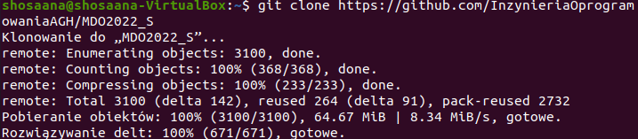
## Upewnij się w kwestii dostępu do repozytorium jako uczestnik i sklonuj je za pomocą utworzonego klucza SSH
 Utworzenie klucza SSH: `ssh-keygen -t ed25519 -f my_key` 
 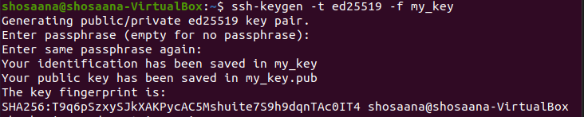
 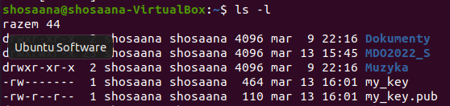
 Konfiguracja jako metoda dostępu do github - 
 dodanie klucza agenta: `ssh-add my_key`
 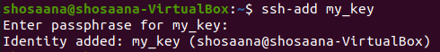
 Dodanie nowego klucza w ustawieniach: 
 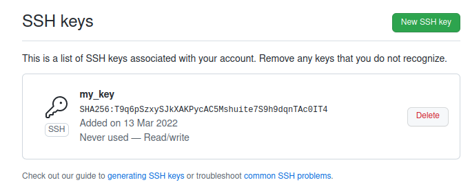
Sklonowanie repozytorium  z wykorzystaniem SSH: `git clone git@github.com:InzynieriaOprogramowaniaAGH/MDO2022_S.git`
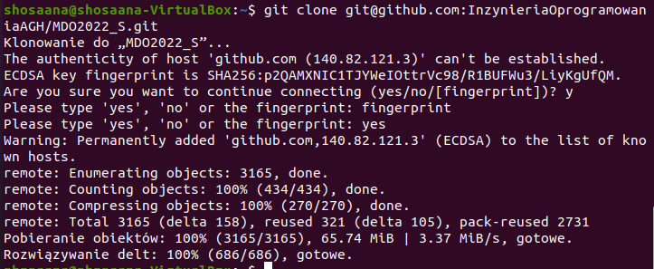
## Przełącz się na gałąź ```main```, a potem na gałąź swojej grupy (pilnuj gałęzi i katalogu!)
Wywołanie w katalogu MDO2022_S polecenia `git checkout main` oraz `git checkout ITE-GCL03` - przejscie odpowiednio na gałąż main i gałąź grupy oraz sprawdzenie położenia za pomocą polecenia `git branch`
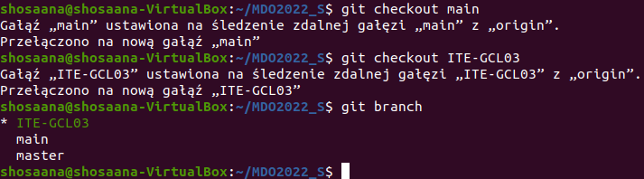
## Utwórz gałąź o nazwie "inicjały & nr indeksu" np. ```KD232144```. Miej na uwadze, że odgałęziasz się od brancha grupy!
Utworzenie nowej gałęzi poleceniem: `git checkout -b MK401219`
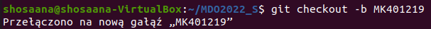
## Rozpocznij pracę na nowej gałęzi
W katalogu właściwym dla grupy utworzenie nowego katalogu z inicjalami oraz indeksem poleceniem: `mkdir MK401219`.
Utworzenie w MK401219 katalogu o nazwie lab01 poleceniem `mkdir lab01` oraz umieszczenie w nim zrzutów ekranu oraz sprawozdania.
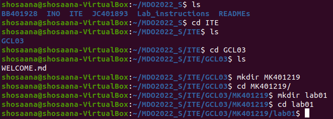

