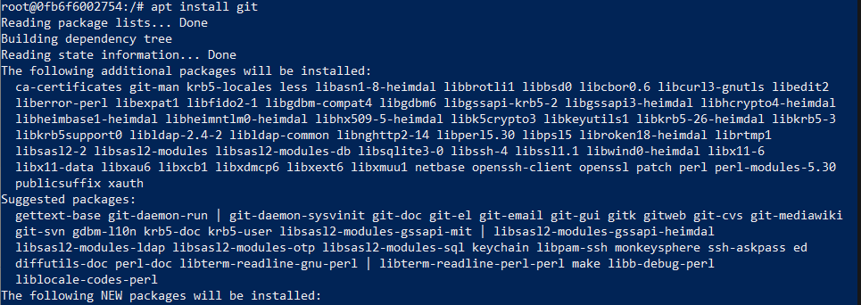
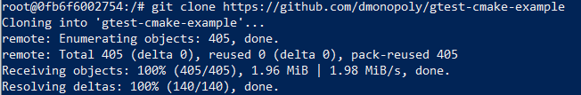
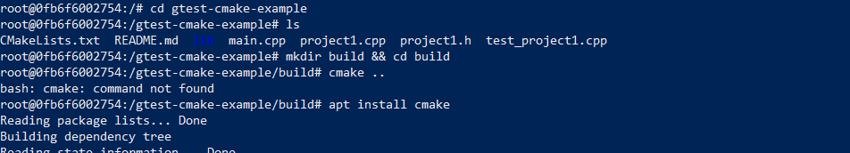
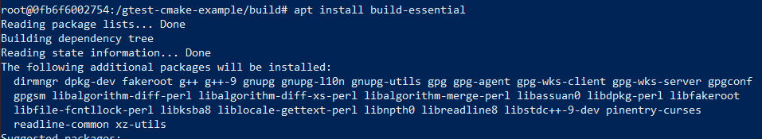
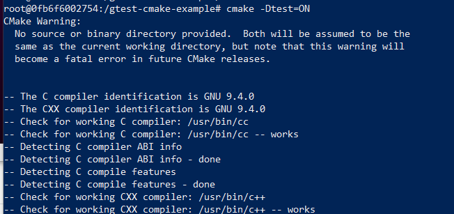
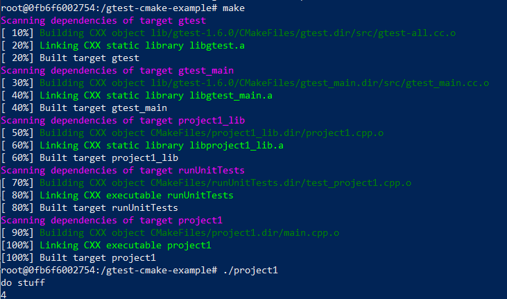
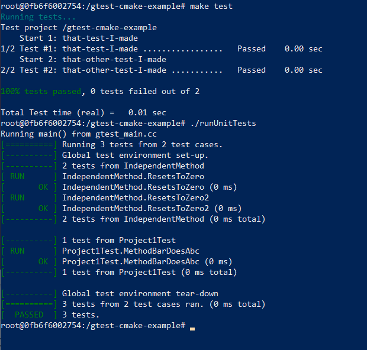
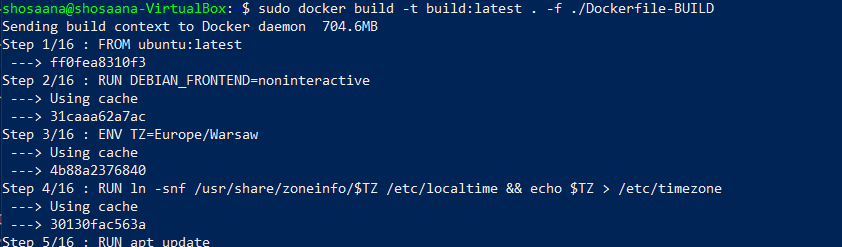
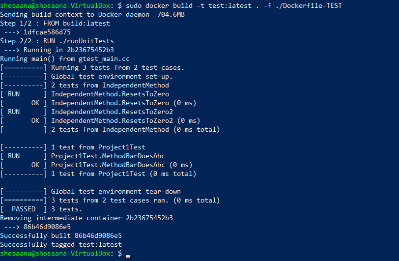
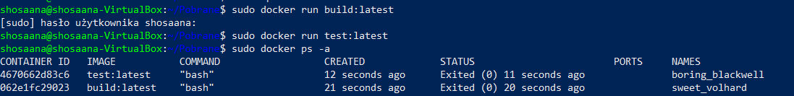

##Wybór oprogramowania na zajecia
Znalezione repozytorium z odpowiednimi narzedziami do budowania (cmake) - https://github.com/dmonopoly/gtest-cmake-example
##Wykonaj kroki build i test wewnatrz wybranego kontenera bazowego 
Pobranie kontenera poleceniem ```sudo docker pull ubuntu```oraz uruchomienie go interaktywnie ```sudo docker run --name build -it lab3```.

Doinstalowanie zaleznosci za pomoca komendy ```apt install git```:



Sklonowanie repozytorium komenda ```git clone https://github.com/dmonopoly/gtest-cmake-example```:



Doinstalowanie cmake oraz build-essential niezbednych do uzycia cmake oraz stworzenie katologu build w glownym katalogu repozytorium:






Uruchomienie cmake z dodatkowa funckja ``` cmake -Dtest=ON ..``` w glownym katalogu repozytorium:



Zbudowanie projektu za pomoca komendy ```make``` oraz uruchomienie programu ```./project1```:



Uruchomienie testow komendami ``` make test``` oraz ```./runUnitTests:



##Stworz dwa pliki Dockerfile automatyzujace kroki powyzej
Zawartosc pliku Dockerfile-BUILD:
```dockerfile
FROM ubuntu:latest

RUN DEBIAN_FRONTEND=noninteractive
ENV TZ=Europe/Warsaw
RUN ln -snf /usr/share/zoneinfo/$TZ /etc/localtime && echo $TZ > /etc/timezone

RUN apt update
RUN apt install -y tzdata git cmake build-essential

RUN git clone https://github.com/dmonopoly/gtest-cmake-example
WORKDIR gtest-cmake-example
RUN mkdir build
WORKDIR build
RUN cmake ..
RUN make
RUN cd ..
RUN cmake -Dtest=ON ..
RUN make
RUN ./project1

```
Zbudowanie Dockerfile do obrazu komenda ```sudo docker build -t build:latest . -f ./Dockerfile-BUILD```.



Zawartosc drugiego pliku dockerfile, gdzie kontener drugi bazuje na pierwszym i wykonuje testy:

```Dockerfile
FROM build:latest
RUN ./runUnitTests
```
Zbudowanie Dockerfile do obrazu poleceniem ```sudo docker build -t test:latest . -f ./Dockerfile-TEST```.


##Wykaz, ze kontener wdraza sie i pracuje poprawnie
Uruchomienie obu zbudowanych obrazow ```sudo docker run build:latest``` oraz ```sudo docker run test:latest```, a nastepnie wyswietlenie ich za pomoca komendy ```sudo docker ps -a```. Zrzut ekranu przedstawia uruchomione i wdrozone poprawnie kontenery.



