## 1. Zachowywanie stanu  
* Przygotuj woluminy wejściowy i wyjściowy, o dowolnych nazwach, i podłącz je do kontenera bazowego, z którego rozpoczynano poprzednio pracę  
Tworzenie woluminów komendami:  
```
sudo docker volume create inv
sudo docker volume create outv
sudo docker volume ls
```  
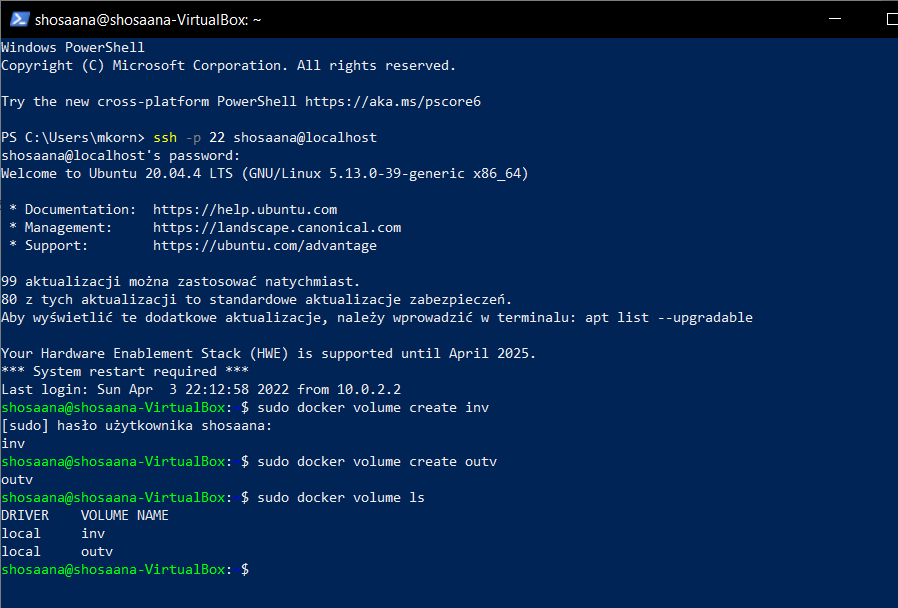  
Do kontenera podłączone zostały one komendą:  
```
sudo docker run -it --name ubuntu --mount source=in_volume,target=/in --mount source=outv,target=/out ubuntu
```  
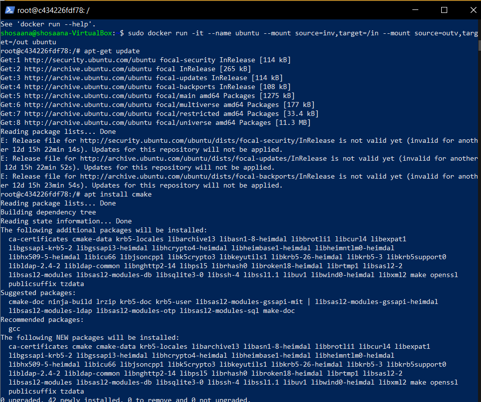  
* Uruchom kontener, zainstaluj niezbędne wymagania wstępne (jeżeli istnieją), ale bez gita  
Kontener został uruchomiony, a zależności zainstalowano poleceniami:   
```
apt-get update
apt-get install cmake
apt-get install build-essential
```  
 
* Sklonuj repozytorium na wolumin wejściowy  
Poleceniem: ```sudo -s```uzyskano dostęp do katalogu z woluminem, a następnie sklonowano repozytorium poleceniem ```git clone https://github.com/dmonopoly/gtest-cmake-example.git /var/lib/docker/volumes/inv/_data/```.  
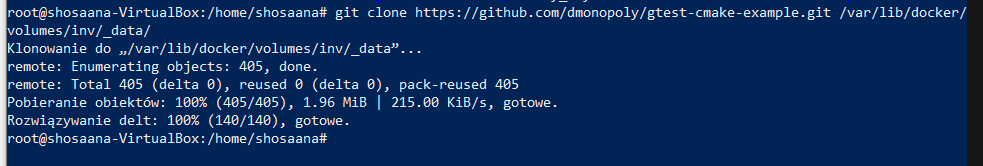  
Skopiowało sie prawidłowo co potwierdza screenshot: 
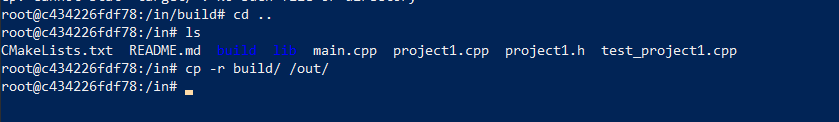  
* Uruchom build w kontenerze  
W katalogu in/build należało uruchomić polecenie ```cmake ..```.

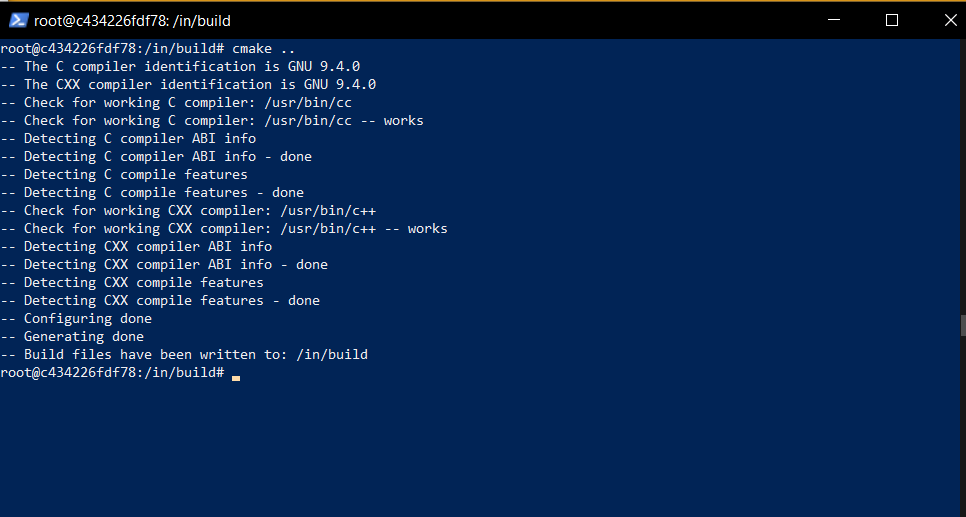  

* Zapisz powstałe/zbudowane pliki na woluminie wyjściowym  
W katalogu w ktorym został zbudowany projekt uruchomiono polecenie ```cp -r build/ /out/```. 
  
Pliki w katalogu outv/_data:
  
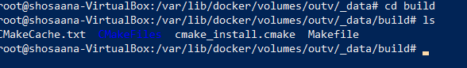  

## 2. Eksponowanie portu
* Uruchom wewnątrz kontenera serwer iperf (iperf3)  
Pobrano kontener z serwerem iperf poleceniem: ```sudo docker pull clearlinux/iperf``` oraz uruchomiono go w kontenerze poleceniem: ```sudo docker run -it --rm --name=iperf -p 5201:5201 clearlinux/iperf -s```  
  
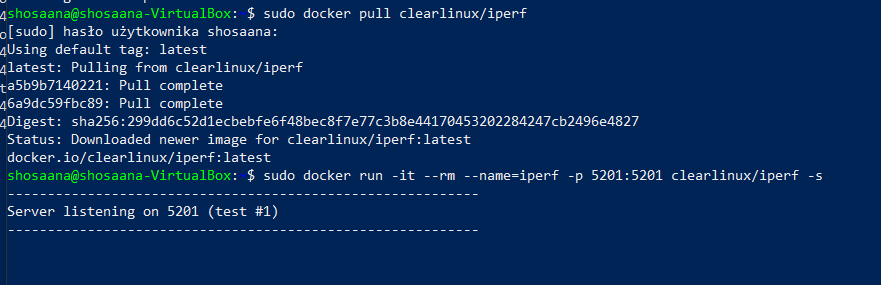
    
* Połącz się z nim z drugiego kontenera, zbadaj ruch  
Ip serwera zostało sprawdzone poleceniem: ```sudo docker inspect iperf```.
  
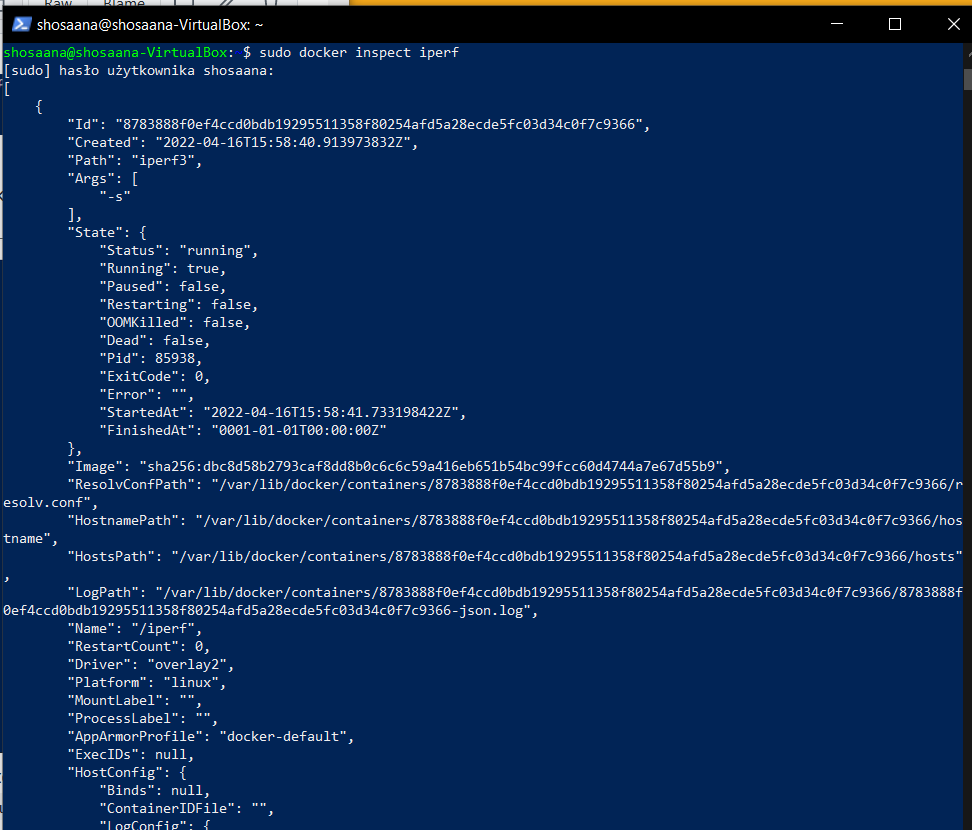
  
Uruchomiono następnie kontener, który połączono do serwera poleceniem: ```sudo docker run -it --rm --name=iperf_client clearlinux/iperf -c 172.17.0.2```. Poniżej przedstawione jest pomyślne zbadanie ruchu.  

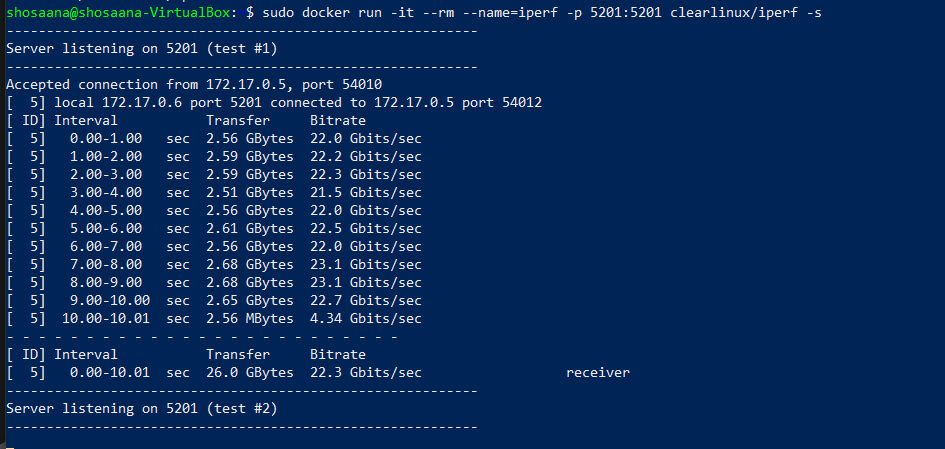  


* Połącz się spoza kontenera (z hosta i spoza hosta)  
Zainstalowanie iperf3 na hoście poleceniem:  ```sudo apt-get install iperf3```  


  
Połączenie pomiędzy hostem a kontenerem zbadano poleceniem: ```iperf3 -c 172.17.0.2 -t 30 -p 5201```:  

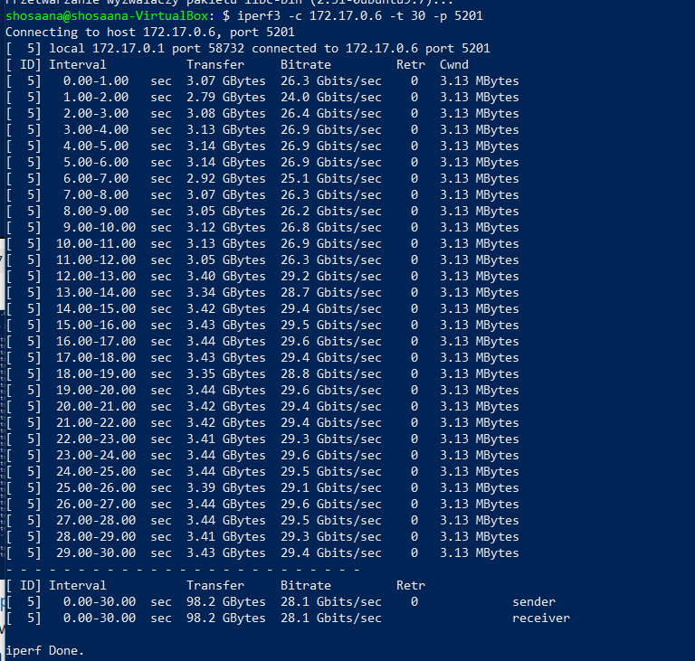 
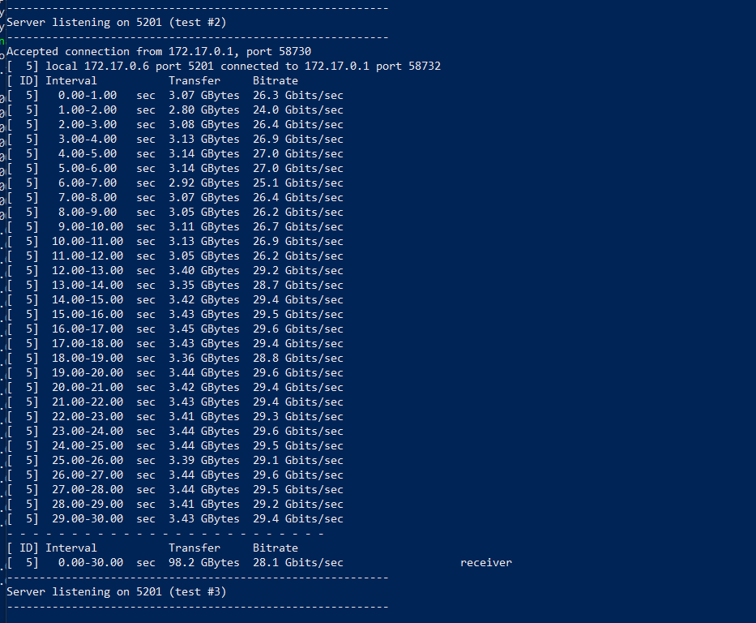

Na pierwotny system operacyjny pobrano program iperf, wypakowano go oraz po uprzednim dodaniu portu w virtualboxie połączono się (z katalogu z programem) z maszyną wirtualną.
Testu połączenia windows/kontener wykonano poleceniem: ```.\iperf3.exe -c 127.0.0.1 -t 30 -p 5201```. 
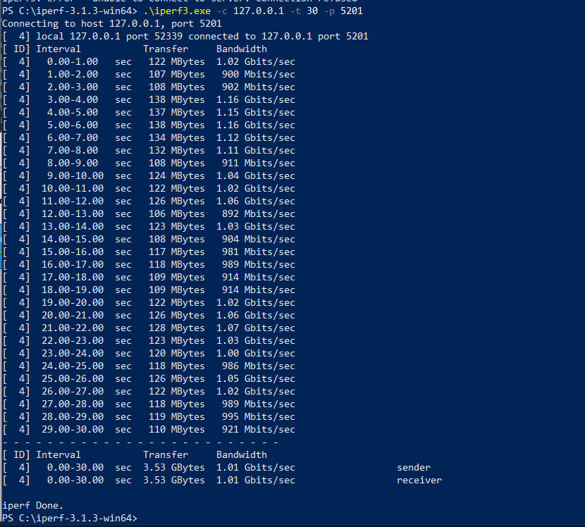  
* Przedstaw przepustowość komunikacji  

| Połączenie           | Przepustowość   |
| -------------------- | --------------- |
| kontener/kontener    | 22.3 Gbits/sec  |
| host/kontener        | 28.1 Gbits/sec  |
| windows/kontener     | 1.01 Gbits/sec  |

## 3. Instancja Jenkins   
* Przeprowadź instalację skonteneryzowanej instancji Jenkinsa z pomocnikiem DIND  
W dockerze utworzono sieć poleceniem: ```sudo docker network create jenkins```  
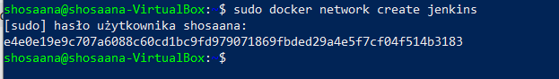  
oraz uruchomiono kontener dockera DIND:  
```
sudo docker run \
  --name jenkins-docker \
  --rm \
  --detach \
  --privileged \
  --network jenkins \
  --network-alias docker \
  --env DOCKER_TLS_CERTDIR=/certs \
  --volume jenkins-docker-certs:/certs/client \
  --volume jenkins-data:/var/jenkins_home \
  --publish 2376:2376 \
  docker:dind \
  --storage-driver overlay2
```  
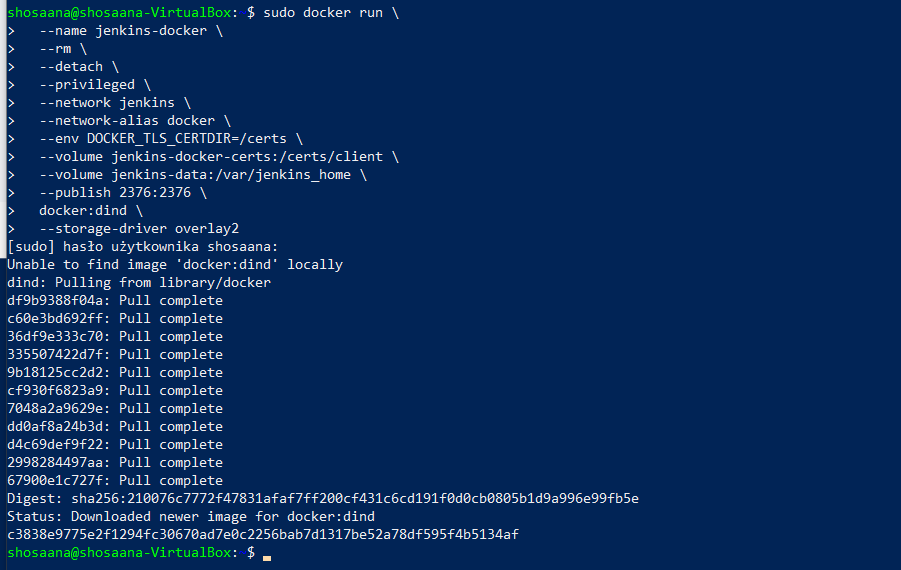  
Następnie na podstawie Dockerfile stworzono obraz jenkinsa:  
```docker
FROM jenkins/jenkins:2.332.2-jdk11
USER root
RUN apt-get update && apt-get install -y lsb-release
RUN curl -fsSLo /usr/share/keyrings/docker-archive-keyring.asc \
  https://download.docker.com/linux/debian/gpg
RUN echo "deb [arch=$(dpkg --print-architecture) \
  signed-by=/usr/share/keyrings/docker-archive-keyring.asc] \
  https://download.docker.com/linux/debian \
  $(lsb_release -cs) stable" > /etc/apt/sources.list.d/docker.list
RUN apt-get update && apt-get install -y docker-ce-cli
USER jenkins
RUN jenkins-plugin-cli --plugins "blueocean:1.25.3 docker-workflow:1.28"
```  

oraz zbudowano go poleceniem ```sudo docker build -t myjenkins-blueocean:2.332.2-1 .```.  
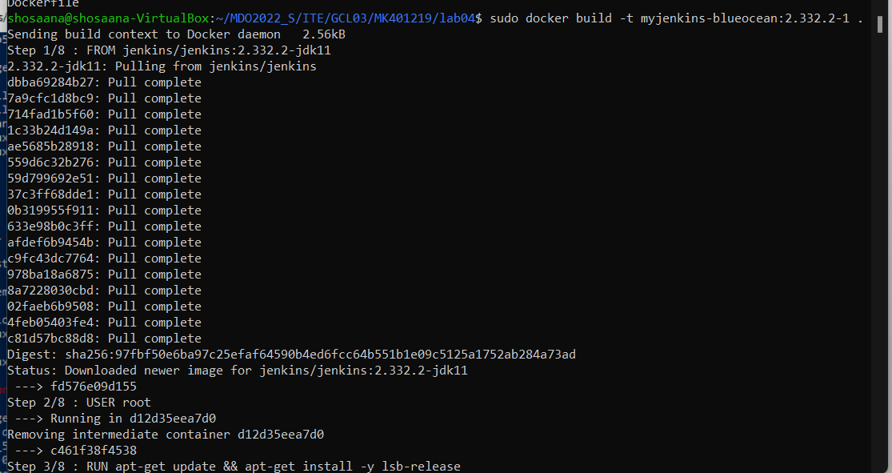  
* Zainicjalizuj instację, wykaż działające kontenery, pokaż ekran logowania  
Instancje zainicjalizowano poleceniem:  
```
sudo docker run \
  --name jenkins-blueocean \
  --rm \
  --detach \
  --network jenkins \
  --env DOCKER_HOST=tcp://docker:2376 \
  --env DOCKER_CERT_PATH=/certs/client \
  --env DOCKER_TLS_VERIFY=1 \
  --publish 8080:8080 \
  --publish 50000:50000 \
  --volume jenkins-data:/var/jenkins_home \
  --volume jenkins-docker-certs:/certs/client:ro \
  myjenkins-blueocean:2.332.2-1 
```  
  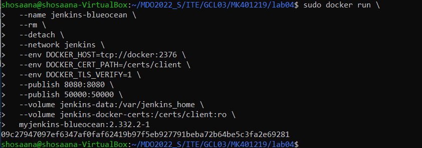  
Kontenery wyświetlono poleceniem ```sudo docker ps``` dzięki któremu można zobaczyć, że działają poprawnie:
  
  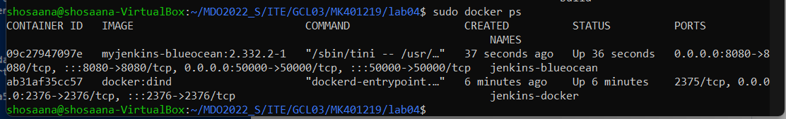  

Do strony Jenkinsa połączono się za pomocą url http://localhost:8080/, (po dodaniu do sieci odpowiednich portów): 
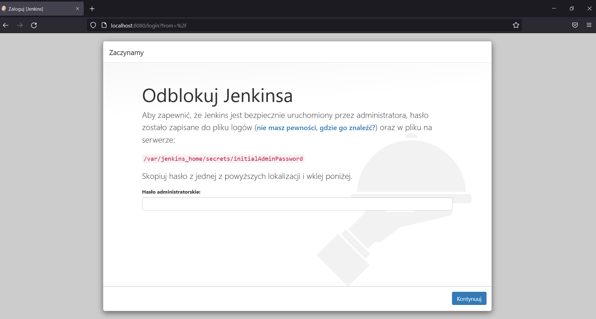  
Poleceniem ```sudo docker exec jenkins-blueocean cat /var/jenkins_home/secrets/initialAdminPassword``` uzyskano hasło administratora oraz zalogowano się z jego pomocą i przeprwadzono konfigurację.

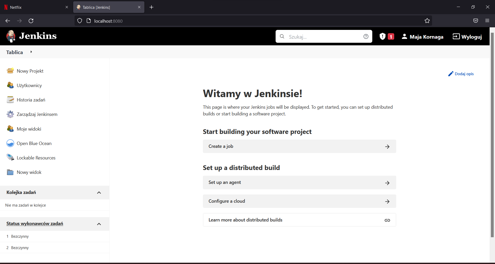  

