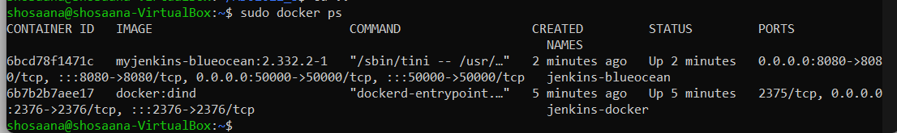
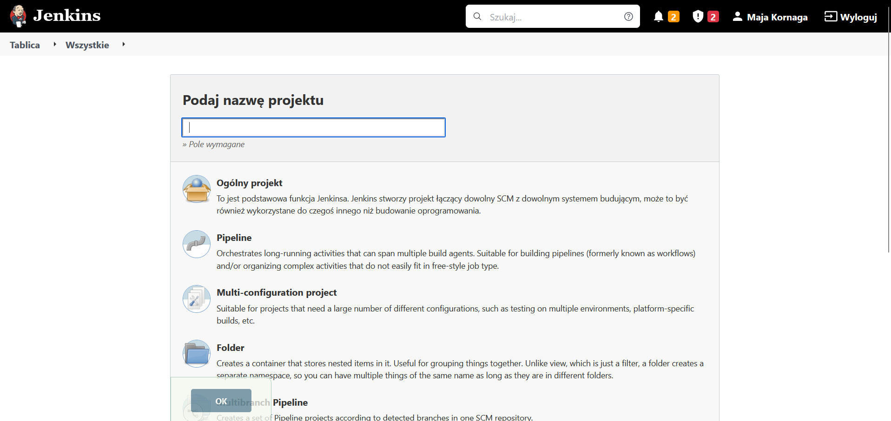
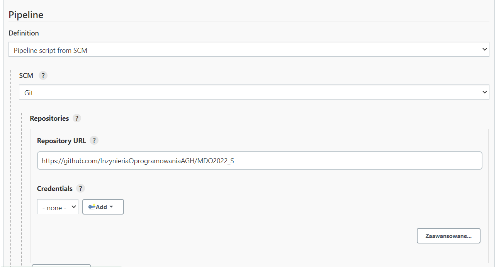
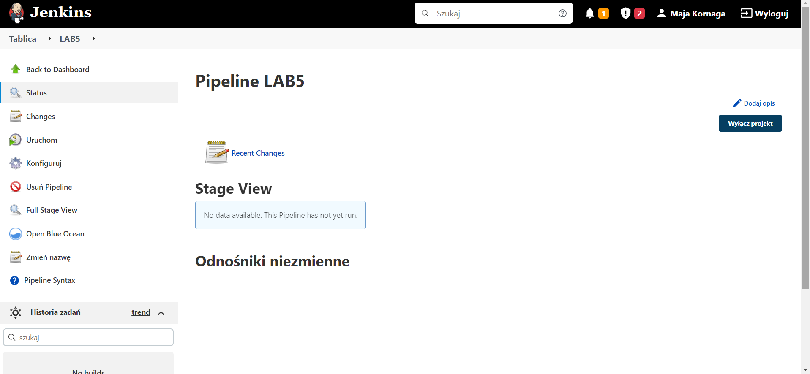
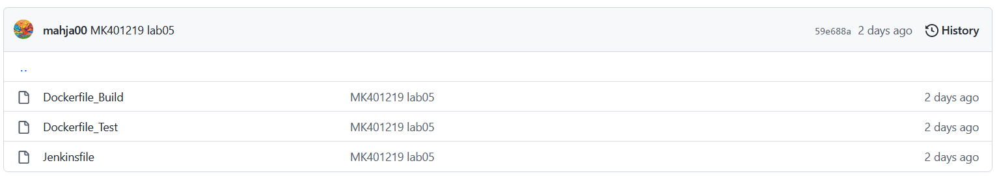
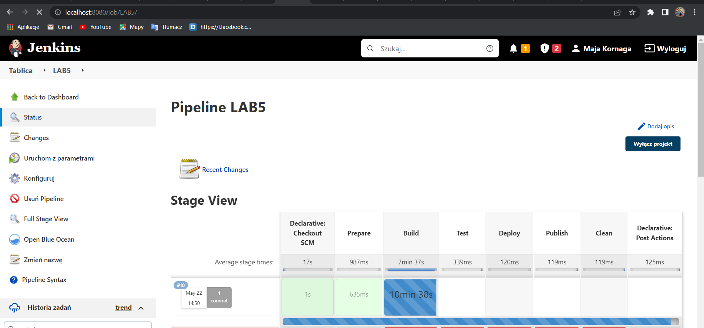

# Sprawozdanie z laboratorium nr 5
#Maja Kornaga
## Cel projektu:

Celem projektu było utworzenie pipeline'u za pomocą serwera Jenkins. Pipeline ma na celu zbudownie, testowanie, wdrożenie oraz opublikowanie wybranego projektu.
Użyto do tego celu programu z open sourcowego repozytorium - https://github.com/cytoscape/cytoscape.js. Technologie wykorzystane w projekcie to Jenkins, Docker, git oraz npm. 


## Utworzenie projektu:

### Przygotowanie kontenerów.
Na samym początku należało przygotować kontenery niezbędne do wykonania zadania. Były to dwa kontenery - jeden kontener z Jenkinsem oraz kontener z obrazem DIND. Szczegółowa instrukcja uruchamiania tych kontenerów została opisana w sprawozdaniu z laboratorium nr 4 (od podpunktu 3).
Komendą `sudo docker ps ` można sprawdzić poprawne uruchomienie kontenerów.




### Utworzenie projektu w Jenkinsie.
Po utworzeniu kontenerów należy połączyć się za pomocą url http://localhost:8080/ z Jenkinsem oraz zalogować. Następnie należy stworzyć nowy projekt typu pipeline, nazwać go oraz skonfigurować (zaznaczyć pola `Do not allow concurrent builds` oraz `To zadanie jest sparametryzowane`).



Następnie w opcjach zaawansowanych jako Definition należy wybrać z listy rozwijanej `Pipeline script from SCM` oraz jako SCM należy wybrać opcję `Git` z listy rozwijanej. Ponadto należy dodać Repository URL, tj. repozytorium przedmiotu `https://github.com/InzynieriaOprogramowaniaAGH/MDO2022_S`. 



Kolejnym krokiem jest dodanie Branch Specifier. W polu należy wpisać nazwę własnego brancha - `*/MK401219` oraz w ostatnim polu dodać ścieżkę do Jenkinsfile `ITE/GCL03/MK401219/lab05/Jenkinsfile`.

Po utworzneiu projektu widoczny jest następujący erkan startowy:




### Niezbędne pliki.
Przed przejściem do pisania pipeline należy umieścić pliki dockerfile w branchu dodanym podczas konfiguracji. W tym przypadku są to trzy pliki `Dockerfile_Build`, `Dockerfile_Test` oraz uprzednio wskazany plik `Jenkinsfile`. 





`Dockerfile_Build`:
```
FROM node:lts-bullseye
RUN git clone https://github.com/RafalOlech00/cytoscape.js.git
WORKDIR cytoscape.js
RUN npm install
RUN npm run build

```
Pierwszy z plików odpowiedzialny jest za budowanie projektu. Wykonywane jest w nim po kolei klonowanie projektu z repozytorium, instalowanie zależności oraz komendy `npm install` oraz `npm run build` stricte odpowiedzialne za build programu.

`Dockerfile_Test`:
```
FROM mk_build:latest
WORKDIR cytoscape.js
RUN npm test

```
Plik DockerfileTest odpowiedzialny jest natomiast za uruchomienie testów znajdujących się w projekcie - za pomocą komendy `npm test`.
Ostatnim pilkiem jest plik Jenkinsfile zawierający treść całego pipelinu.

`Jenkinsfile`:

```
pipeline
{
 parameters
    {
        string(name: 'VERSION', defaultValue: '1.0.0', description: '')
        booleanParam(name: 'PROMOTE', defaultValue: true, description: '')
    }
	agent any
	stages
	{
	
	stage('Prepare')
		{
			steps
			{
				sh '''
				echo "Project preparing.."
				
				docker rm -f ro_build || true
				docker volume prune -f
				docker volume  create --name volume_in
				docker volume  create --name volume_out
				 	      
                    		echo "Preparing finished."
				'''
				
			}
		}
	
		stage('Build')
		{
			steps
			{
				sh '''
				echo "Project building..."
				
				docker build . -f ./ITE/GCL03/MK401219/lab05/Dockerfile_Build -t mk_build
                    		docker run --mount type=volume,src="mk_build",dst=/volume_in mk_build:latest bash -c "cd .. &&  cp -r /cytoscape.js /volume_in && cp -r /volume_in /volume_out && ls ./volume_in && ls ./volume_out" 
                    		 	      
                    		echo "Building finished."
				'''
				
			}
		}
		
		stage('Test')
		{
			steps
			{
				sh '''
				echo "Project testing..."
				
				docker rm -f Dockerfile_Test || true
				docker build . -f ./ITE/GCL03/MK401219/lab05/Dockerfile_Test -t mk_test
				docker run --name test_container --rm --mount source=ro_test,target=/volume_in mk_test:latest
				
				echo "Testing finished."
				'''
			}
		}
		
		 stage('Deploy')
        {
            steps
            {
                sh '''
                echo "Project deploying..."
                
                docker rm -f deploy_container || true
                docker run -dit --name deploy_container --mount type=volume,src="volume_out",dst=/mk_project node
                exit $(docker inspect deploy_container --format="{{.State.ExitCode}}")
                
                echo "Deploying finished."
            	 '''
            }
        }
        
       stage ('Publish')
        {
            when
            {
                expression {return params.PROMOTE}
            }
            steps
            {
            	sh ''' echo "Publishing project..." '''
            	 
                sh 'rm -rf /var/jenkins_home/workspace/mk_artifacts9'
                sh 'mkdir /var/jenkins_home/workspace/mk_artifacts9'
                sh 'chmod -R 777 /var/jenkins_home/workspace/mk_artifacts9'
                sh 'docker rm -f mk_publish || true'
                sh 'docker run -d --name mk_publish --mount type=volume,src="volume_out",dst=/usr/local/mk_project --mount type=bind,source=/var/jenkins_home/workspace/mk_artifacts9,target=/usr/local/mk_copy node bash -c "chmod -R 777 /usr/local/mk_project && chmod -R 777 /var/jenkins_home/workspace/mk_artifacts9 && cp -R /usr/local/mk_project/. /usr/local/mk_copy"'
                sh "tar -zcvf cytoscape_${params.VERSION}.tar.xz -C /var/jenkins_home/workspace/mk_artifacts9 ."
                archiveArtifacts artifacts: "cytoscape_${params.VERSION}.tar.xz"
                
                sh ''' echo "Publishing finished." '''
                
            }
        }
        
        stage('Clean')
		{
			steps
			{
				sh '''
				echo "Project cleaning..."
				
				docker rm -f ro_build || true
                		docker rm -f ro_test || true
                		docker rm -f deploy_container || true
                		docker rm -f ro_publish || true
				
				echo "Cleaning finished"
				'''
			}
		}
        
	}
	
	
}


```
`Prepare`
Plik Jenkinsfile składa się z kilku poszczególnych części zwanych stage'ami. Pierwszym z nich jest Stage Prepare odpowiedzialny za utworzenie dwóch woluminów - wejściowego oraz wyjściowego. Zastosowane jest tu również zabezpieczenie usuwające pozostałe po uprzednich uruchominiach kontenery oraz woluminy.
`Build`
W drugim kroku przeprowadzany jest build projektu znajdującego się pod wskazanym linkiem. Uruchamiany jest tu kontener wynikowy z podpiętym woluminem wejściowym. Zbudowany projekt kopiowany jest do obu poprzednio utworzonych woluminów (volume_in oraz volume_out), po czym wyświetlana jest ich zawartośc w celu weryfikacji poprawności wykonanego kopiowania. dzięki któremu projekt jest kompilowany, a następnie pliki wynikowe są kopiowane z woluminu wejściowego na wyjściowy.  
`Test`
W kroku trzecim testowany jest program - na podstawie dockerfile `Dockerfile_Test` tworzony jest kontener `mk_test`, w którym uruchamiane są testy znajdujące się w projekcie. 
`Deploy`
Krok ten odpowiedzialny jest za wdrożenie projektu. Uruchamiany jest tutaj kontener z podpiętym woluminem wyjściowym, w celu wdrożenia projektu.
`Publish`
W kroku publish pubikowany jest program. Sprawdzany jest tutaj parametr `PROMOTE` na podstawie, którego przeprowadzana jest weryfikacja czy należy publikować nową wersję programu czy też nie. Uruchamiany jest tutaj kontener do publikowania (`mk_publish`) z podpiętym woluminem wyjściowym oraz tworzony jest artefakt z numerem wersji określonym w parametrze `VERSION`. Krok publish tworzy paczkę z projektem.
`Clean`
Krok ten kończy działanie pipeline - odpowiedzilany jest za usuwanie powstałych uprzednio kontenerów.


### Uruchomienie projektu.

W celu uruchomienia projektu należy wcisnąć przycisk uruchom z parametrami widoczny po lewej stronie tablicy projektu (Przy pierwszym uruchomieniu jest to tylko przycisk uruchom, należy więc uruchomić pipeline ponownie w celu utworzenia artefaktów). Nie jest konieczne zmienianie domyślnych wartości ustawionych parametrów. Niestety utworzony pipeline stanął na kroku build i spowodował zawieszenie całej strony co uniemożliwiło przeprowadzenie testów.



### Diagram aktywności.
!{](diagram.png)