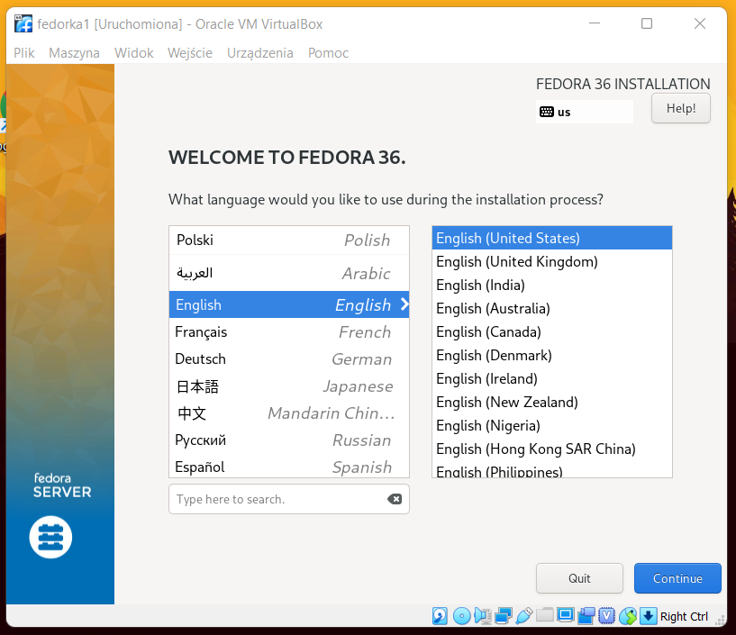
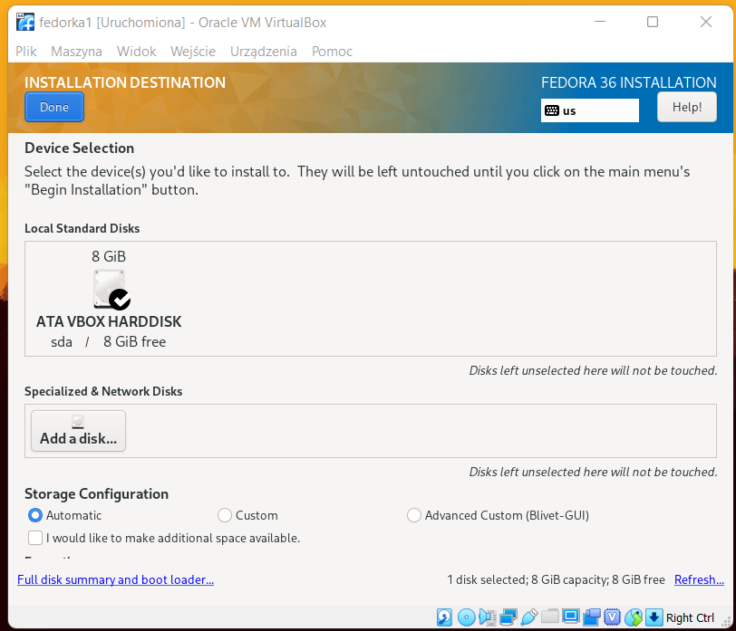
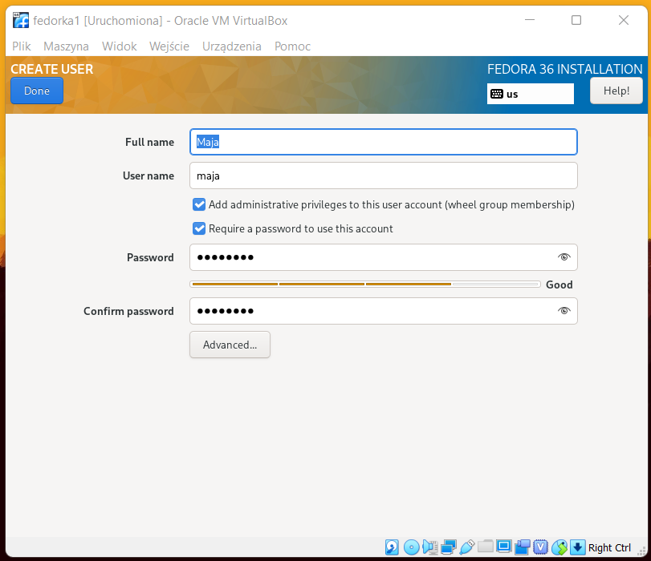
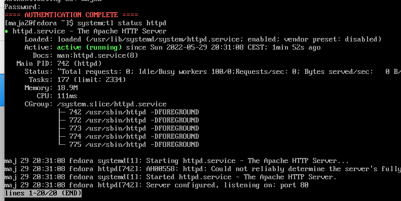
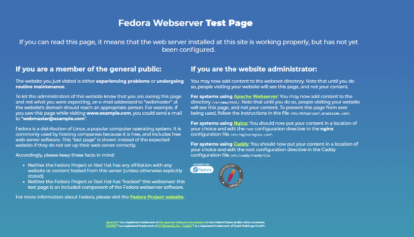
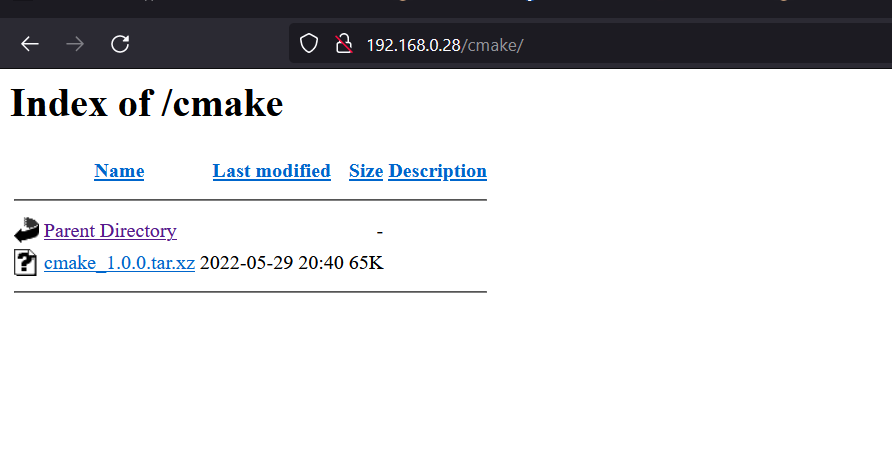
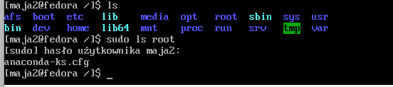
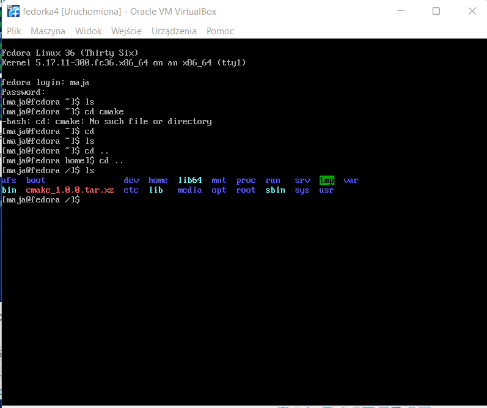

## 1. Przygotowanie systemu pod uruchomienie
* Przeprowadź instalację systemu Fedora w VM, skonfiguruj użytkowników (użyj haseł, które można bezkarnie umieścić na GitHubie!), sieć, wybierz podstawowy zbiór oprogramowania, optymalnie bez GUI  
  
Należy pobrać obraz fedory (np. wersję server) i zainstalować system na maszynie wirtualnej.  
Przy jej instalowaniu nie jest potrzebna jakaś specjalna konfiguracja, należy uwzględnić dysk, na którym powstanie obraz oraz język i strefę czasową. Należy ponadto utworzyć użytkownika, którego konto będzie używane w dalszej części laboratorium.

 

 

 

* Przeprowadź drugą instalację systemu Fedora w VM - celem drugiego systemu będzie wyłącznie serwowanie repozytorium przez HTTP  
  
Drugi system został zainstalowany w analogiczny sposób jak poprzedni. Skonfigurowany został na nim serwer HTTP, za pomocą poleceń:

```bash
dnf group install "Web Server" 
``` 
Usługę następnie uruchomiono oraz dodano do zapory poleceniami:
```bash
sudo systemctl enable httpd
sudo firewall-cmd --permanent --zone=public --add-service=http
sudo firewall-cmd --permanent --zone=public --add-service=https
sudo firewall-cmd --reload
```
Fakt czy usługa działa poprawnie sparwdzono poleceniem `systemctl status httpd`.



W maszynie zmieniono również sieć z NAT na Bridge. Połączenie przetestowano i ujrzano stronę testową.



* Umieść artefakty z projektu na serwerze HTTP  
Po pomyślnym przetestowaniu serwera należało pobrać artefakt z poprzedniego projektu. Artefakt umieszczono w katalogu /var/www/html/cmake/ oraz pobrano na pierwsza maszyne za pomocą `wget`. 
Po pierwsze należało poleceniem `sudo dnf install wget`zainstalować na maszynie usługę wget oraz z jej pomocą pobrać artefakt poleceniem `wget 192.168.0.28/cmake/cmake_1.0.0.tar.xz`. 
 
 

## 2. Instalacja nienadzorowana
* Zlokalizuj plik odpowiedzi z instalacji    
Plik odpowiedzi z instalacji znajduje się w katalogu /root.



* Dodaj do niego elementy odpowiedzialne za wszystkie potrzebne dependencje  
  
Do pliku dodane zostały nastepujący fragment:
```cfg
%packages
@^minimal-environment
wget

%end
```
Zdefiniowano w nim ponadto repozytoria:
```  
# Repo
url --mirrorlist=http://mirrors.fedoraproject.org/mirrorlist?repo=fedora-$releasever&arch=x86_64
repo --name=updates --mirrorlist=http://mirrors.fedoraproject.org/mirrorlist?repo=updates-released-f$releasever&arch=x86_64
```
Oraz dodano proces pobierania artefaktu:  
```cfg
%post
wget 192.168.0.28/cmake/cmake_1.0.0.tar.xz

%end
```  
  
## 3. Infrastructure as a code

* Umieść plik odpowiedzi w repozytorium  

Plik konfiguracyjny znajduje się na repozytorium przedmiotu pod linkiem - 
[https://github.com/InzynieriaOprogramowaniaAGH/MDO2022_S/MK401219/ITE/GCL03/MK401219/lab09/anaconda-ks.cfg]

* Skonfigurowanie nowej maszyny na podstawie pliku odpowiedzi  

Należy utworzyć nową maszynę wirtualną oraz skonfigurowac ją jak dwie poprzednie maszyny. W pierwszym oknie, które należy wcisnąć przycisk Tab - włączyć zaawansowaną konfigurację i wpisać polecenie:  
```
vmlinuz initrd=initrd.img inst.stage2=hd:LABEL=Fedora-S-dvd-x86_64-36 rd.live.check quiet inst.ks=https://raw.githubusercontent.com/InzynieriaOprogramowaniaAGH/MDO2022_S/MK401219/ITE/GCL03/MK401219/lab09/anaconda-ks.cfg
```  
  
Po kliknięciu entera system się instaluje z odpowiedziami zawartymi w anaconda-ks.cfg. Po instalacji należy kliknąć enter, wyłączyć maszynę, usunąć płytę instalacyjną .iso i ponownie uruchomić maszynę. 
Instalacja przebiegłą pomyślnie - artefakt został pobrany z serwera http: 
 
  
