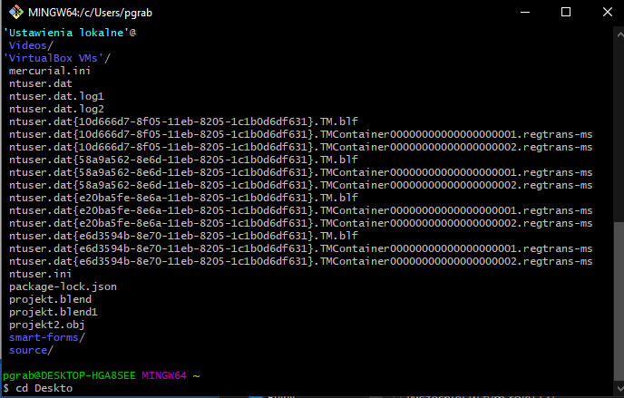
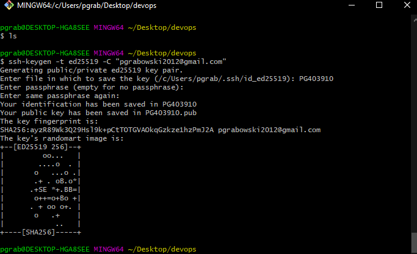
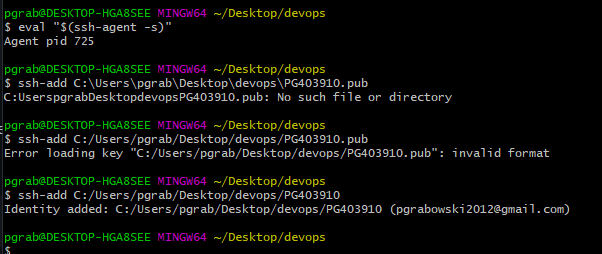
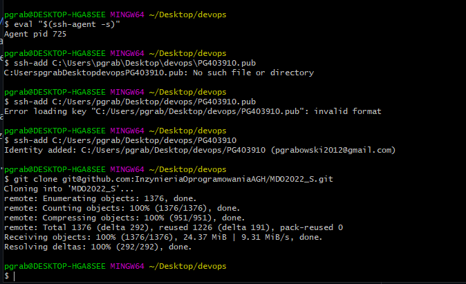
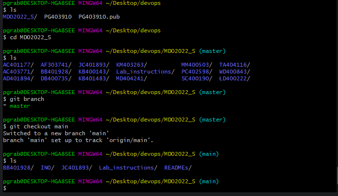
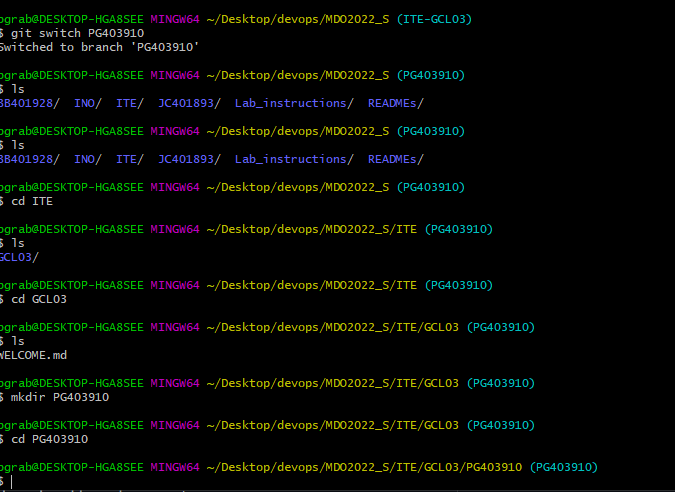
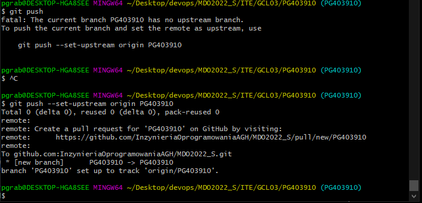

|Patryk Grabowski|403910|
| :- | :- |
|IT WIMIIP|
#
# Sprawozdanie  
1.	Zainstalowano gita i obsługę kluczy SSH.  
  
2.	Utworzono klucze SSH za pomocą polecenia ssh-keygen -t ed25519 -C „email-do-gita”  
  
3.	Skonfigurowano klucze jako metodę dostępu poprzez komendę ssh-add ścieżka_do_klucza  
  
4.	Dodano klucz jako metodę dostępu do konta w GitHubie (https://github.com/settings/keys)  
5.	Sklonowano repozytorium poprzez SSH używają komendy git clone  
  
6.	Przełączono się na gałąź main: git checkout main  
  
7.	Utworzono gałąź o nazwie PG403910: git branch PG403910  
  
8.	W katalogu ITE/GCL03 stworzono katalog PG403910: mkdir  
9.	W katalogu PG403910 utworzono katalog Lab01: mkdir  
10.	Dodano sprawozdanie  
11.	Push gałęzi poprzez komendę git push  
  
12.	Aktualizacja sprawozdania  