|Patryk Grabowski|403910|
| :- | :- |
|IT WIMIIP|
#
# Git hook\
1. Ustawienie git hooka by sprawdzał czy w nazwie jest PG403910 i Lab02\
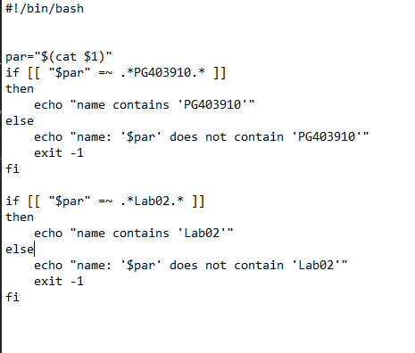\
  
2. Działanie skryptu\
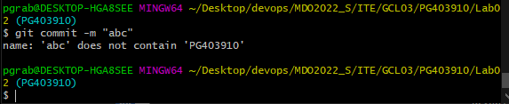\
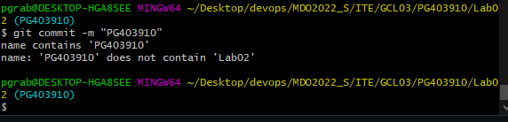\
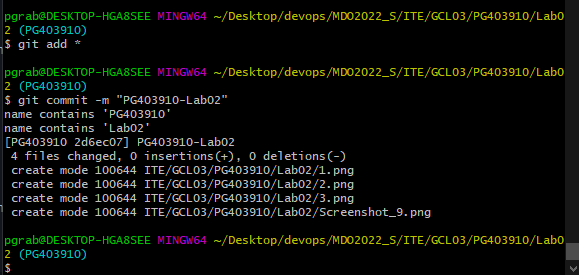\
  
# Instalacja SSH  
1. Połączenie się z maszyną wirtualną poprzez SSH (Putty i Powershell)\  
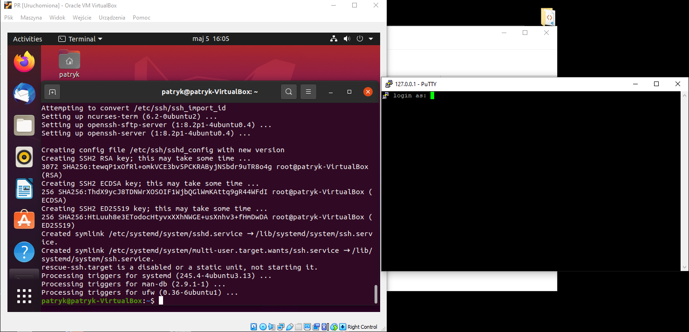\
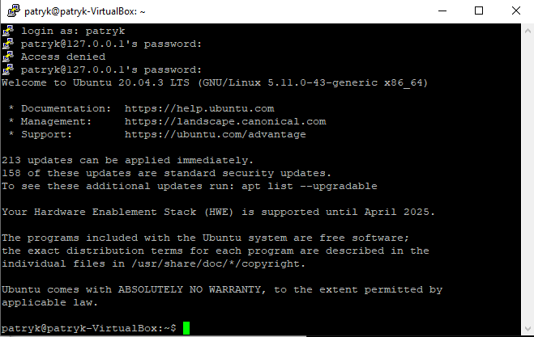\
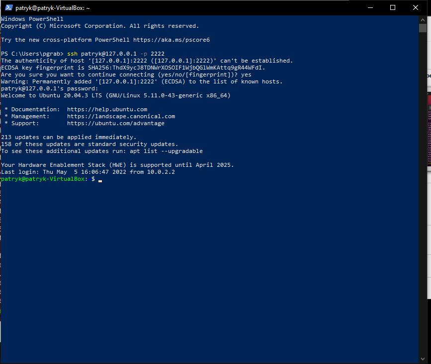\

# Instalacja i przygotowanie dockera
1. Instalacja\
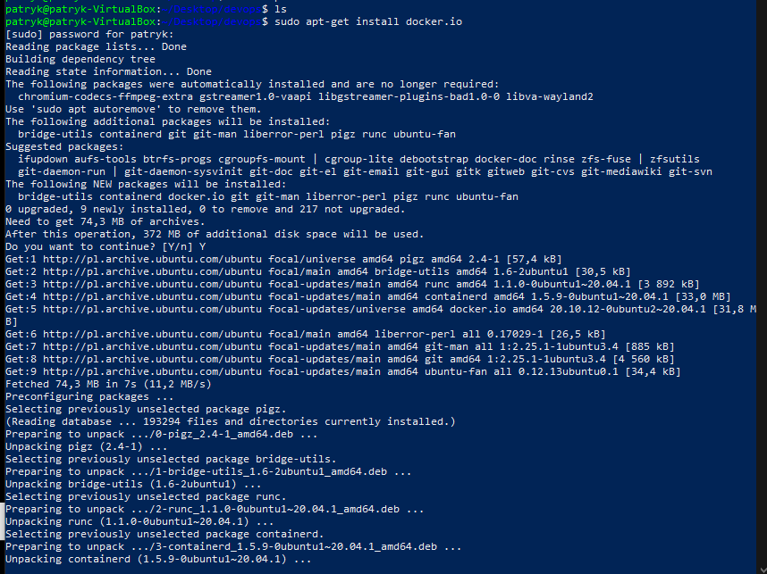\

2. Sprawdzenie instalacji oraz dostępnych obrazów  \
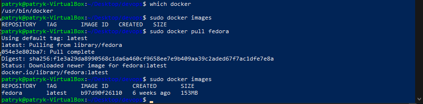\
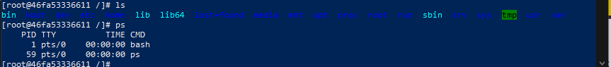\

3. Odpalenie kontenera z obrazem fedory o nazwie fedora\_devops\
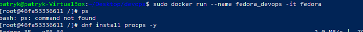\
\
4. Wyświetlenie wersji fedory i sprawdzenie działających na niej procesów\
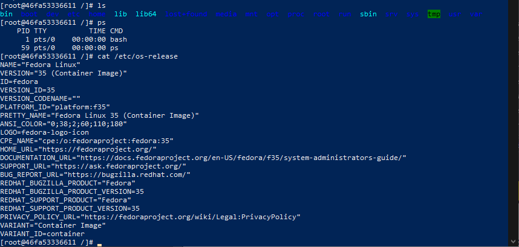\
\
5. Sprawdzenie uruchomionych kontenerów z drugiego terminala\
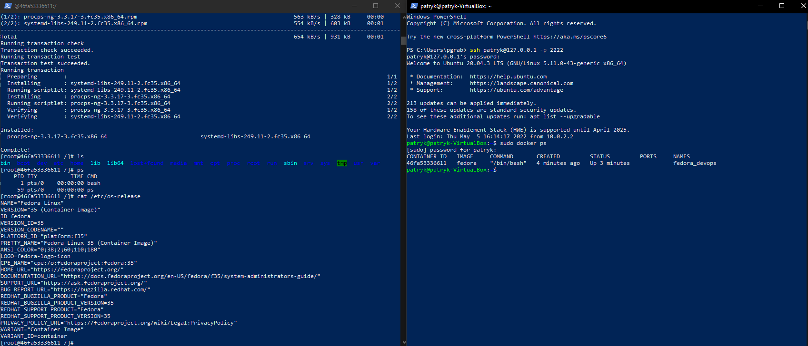\
\
6. Zarejestrowanie się na docker hub\
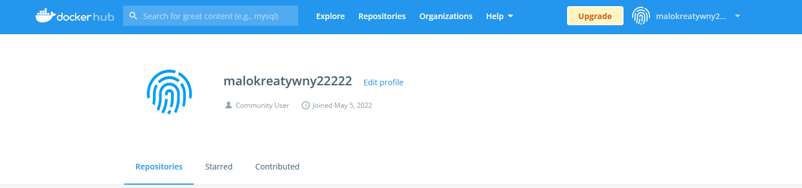\