|Patryk Grabowski|403910|
| :- | :- |
|IT WIMIIP|
#
# Repozytorium \
1. Repozytorium którego używam bazuje na node.js i prezentuje standardowe metody testowania małych aplikacji z backendem w node\
LINK: https://github.com/Lissy93/quick-example-of-testing-in-nodejs \
\
# Docker \
1. Pobranie obrazu fedory i uruchomienie kontenera\
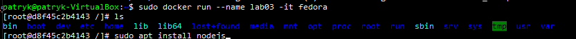\
2. Zainstalowanie wszystkich pakietów ręcznie w celu odpalenia programu z repozytorium\
    Lista komend:\
    sudo dnf install nodejs \
    sudo dnf -y install git\
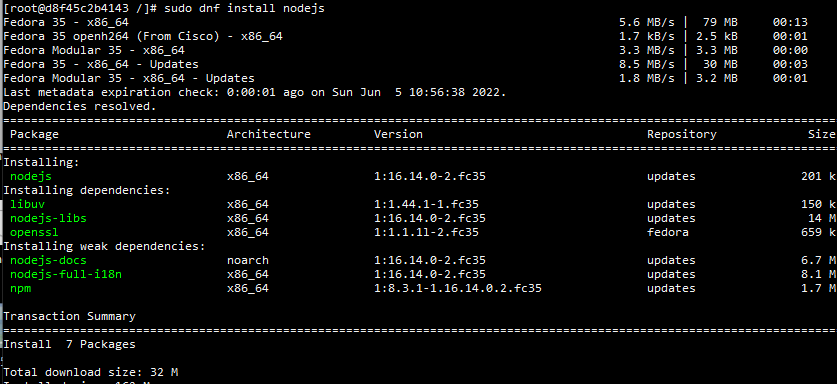\
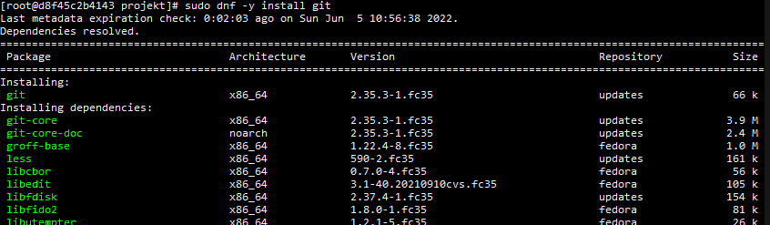\
3. Klonowanie repozytorium z gita\
\
4. Zainstalowanie dependencji poprzez npm install (wszystkie dependencje będą ściągały się z pliku package.json)\
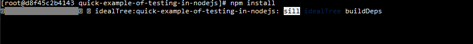\
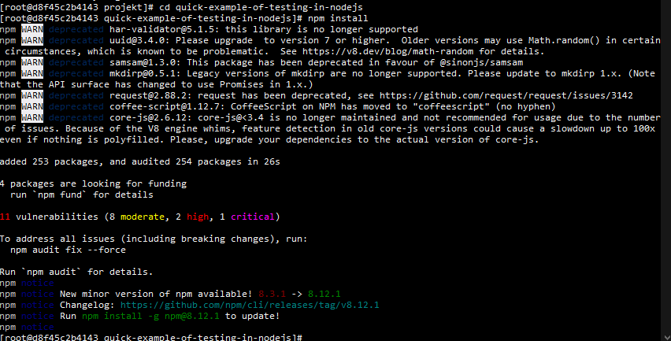\
5. Odpalenie testów jednostkowych Mocha tests i Istanbul coverage tests\
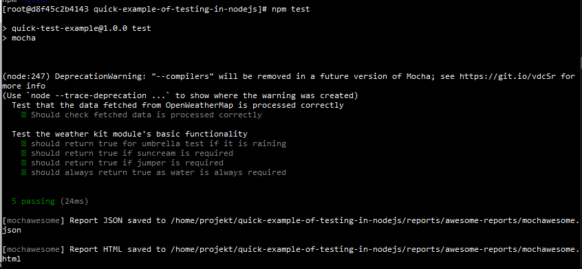\
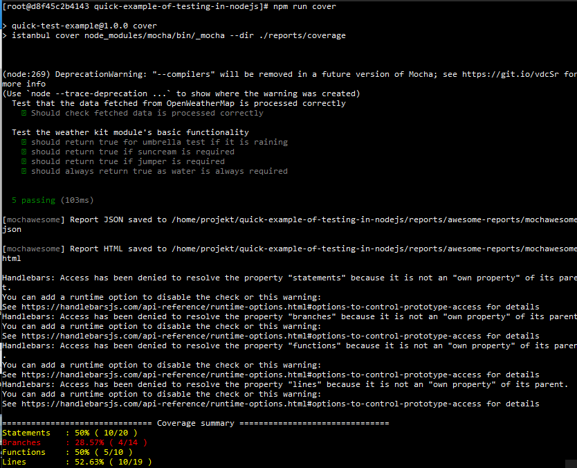\
\
# Dockerfile \
1. Stworzenie pliku dockerfile_1 który wykonuje wszystkie komendy z podpunktu "Docker"\
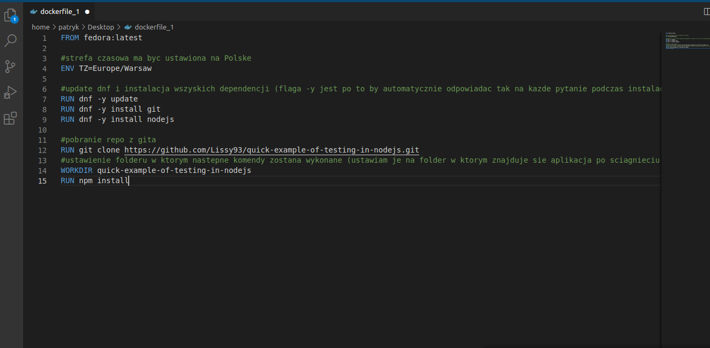\
2. Stworzenie pliku dockerfile_testing wykonującego testy\
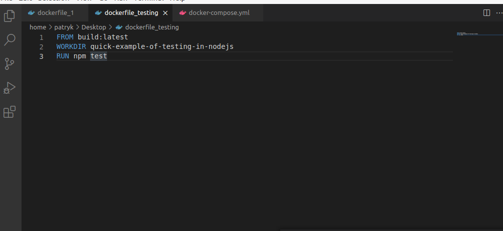\
3. Odpalenie builda za pomocą `sudo docker build -t build:latest . -f dockerfile_1`\
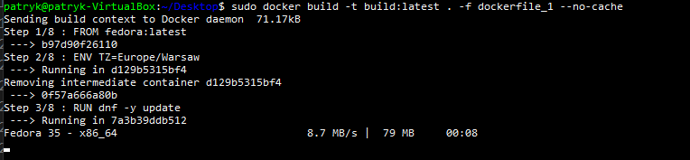\
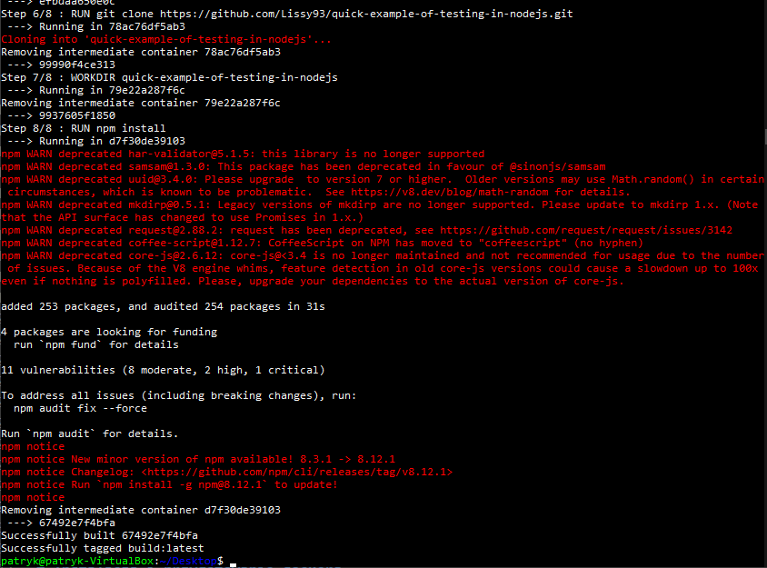\
4. Odpalenie testów za pomocą `sudo docker build -t test:latest . -f dockerfile_testing`\
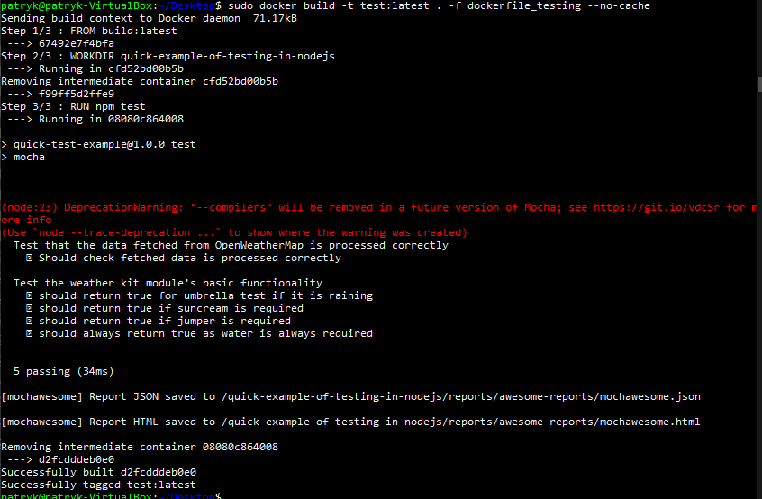\
5. Lista obrazów dockera \
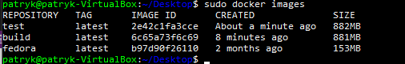\
6. Włączenie w osobnych oknach obu kontenerów:\
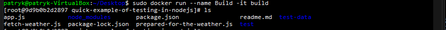\
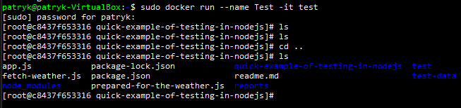\
7. Działające kontenery\
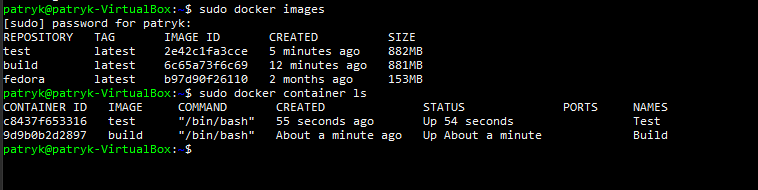\

# Docker Compose
1. Plik docker-compose.yml
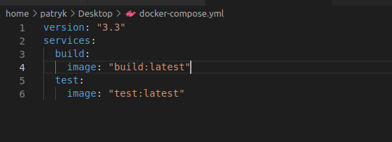

2. Uruchomienie docker-compose
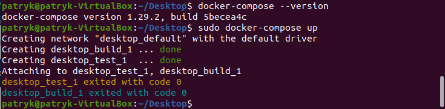

3. Wnioski
Konteneryzacja w przypadku aplikacji webowych jest bardzo powszechna. Wynika to z tego, że często aplikacje webowe mają wiele pakietów i dependencji które są wymagane by je odpalić (dlatego tak samo używamy package.json dzięki któremu npm wie co ma zainstalować, a nie musimy za każdym razem przenosić wszystkich plików lub instalować każdego pakietu pojedynczo). Dzięki konteneryzacji możemy testować oprogramowanie zanim dostarczymy je klientowi. Możemy równocześnie mieć gotowy build który wrzucamy na produkcję i kontener testowy na którym mamy kopie produkcji gdzie będziemy wprowadzać nowe zmiany. Dzięki temu, gdy aplikacja się wywali to build na produkcji będzie nadal dobrze działał. Jest to też przydatne z tego powodu, że aplikacje webowe mają tendencję do crashowania (polegają na wielu pakietach i zasobach które mogą przestać działać jak również są często targetowane przez złośliwe oprogramowanie, boty i ludzi którzy chcą zepsuć nam stronę). Dzięki konteneryzacji jesteśmy w stanie odpalić aplikację na nowo w zaledwie pare sekund, z builda który wiemy, że działał.