|Patryk Grabowski|403910|
| :- | :- |
|IT WIMIIP|
#
# Zachowywanie stanu (woluminy) 
1. Stworzenie woluminu wejściowego i wyjściowego (vol-in i vol-out)\
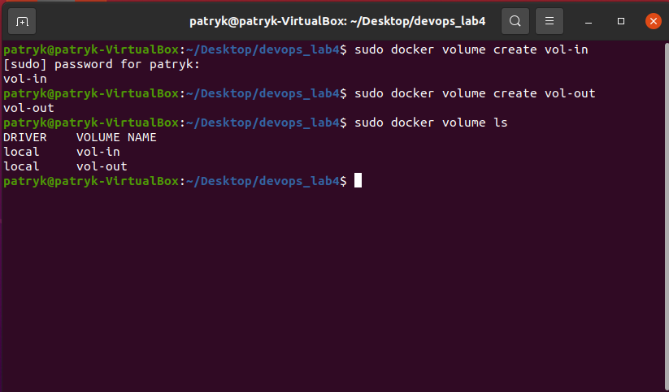  
  
2. Odpalenie kontenera na bazie obrazu fedory z podpiętymy woluminami\
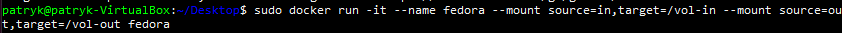  
  
3. Instalacja potrzebnych pakietów\
```
dnf -y update\
dnf -y install nodejs\
dnf -y install git\
```
4. Sprawdzenie stworzonych woluminów\
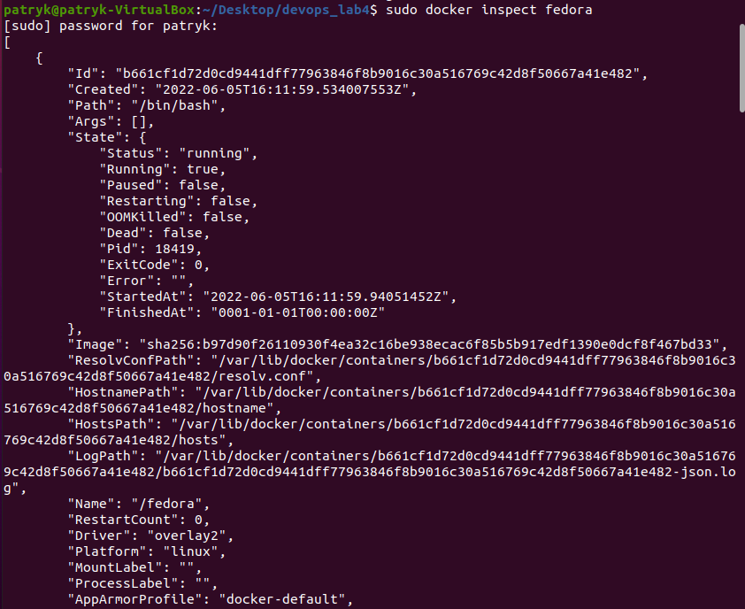  
  

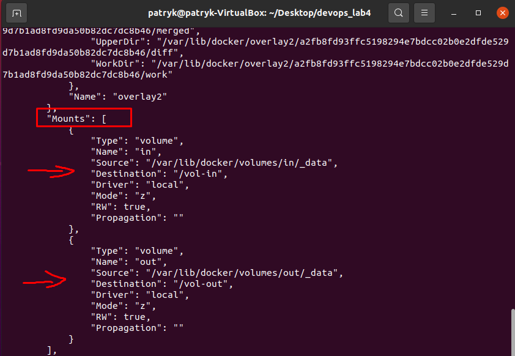  
5. Przejście do katalogu związanego z woluminem wejściowym i ściągnięcie repozytorium z poprzednich laboratoriów\
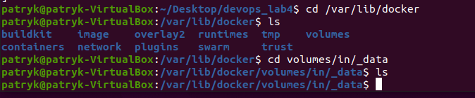   
  

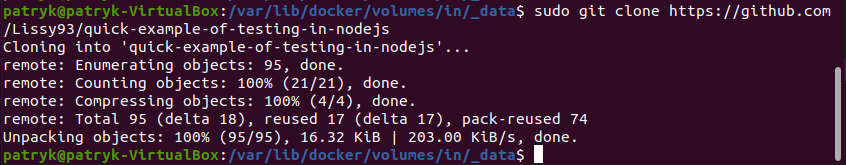   
6. Sprawdzenie czy w kontenerze pojawiły się pliki\
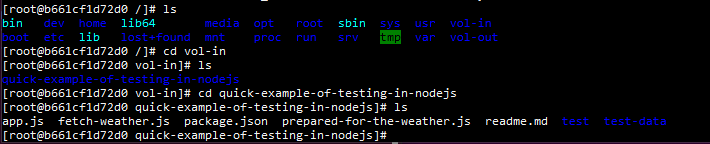   
  

7. Instalacja wszystkich pakietów i przeniesienie programu do woluminu wyjściowego następującymi komendami\
```
npm install \
cp -r quick-example-of-testing-in-nodejs/ ../vol-out
```
  
8. Przejście do katalogu wyjściowego i sprawdzenie, czy pliki się tam znajdują\
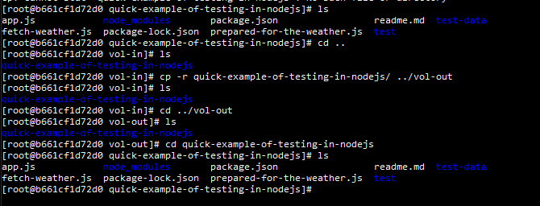  

# Eksponowanie portu
1. Pobranie obrazu ipers3\
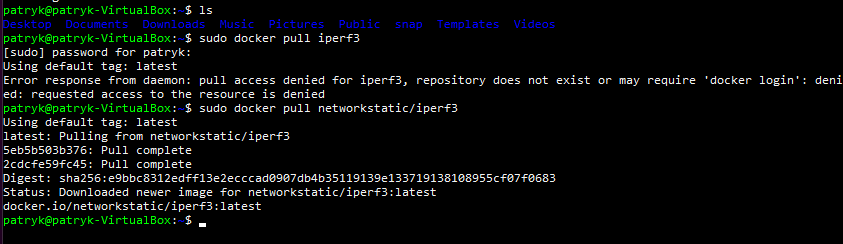  
  
2. Sprawdzenie adresu ip i odpalenie kontenera z serwerem\
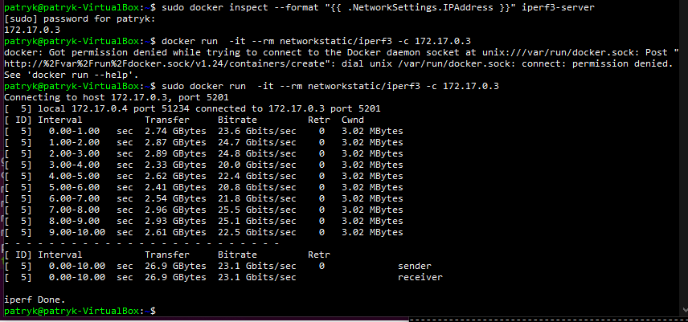  
  
3. Połączenie się z hostem (kontroler - kontroler)\
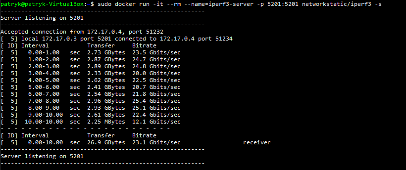  
  
```
Przepustowość: 23.1 Gbits/s
```
4. Połączenie się z hostem (konroler - host)\
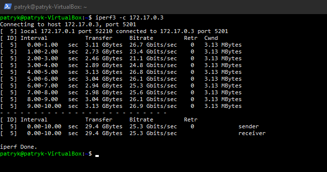  
  

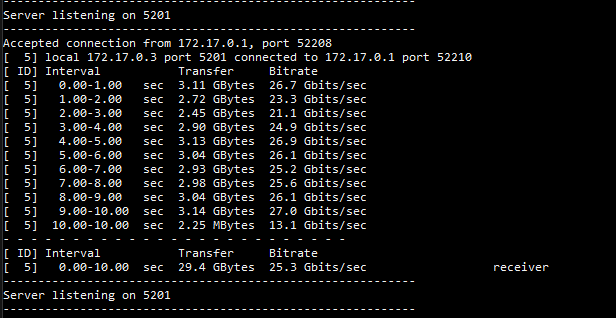  
```
Przepustowość: 25.1 Gbits/s
```
# Instalacja Jenkins
1. Stworzenie sieci\
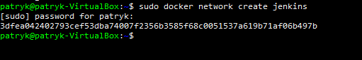  
2. Pobranie i uruchomienie obrazu dind\
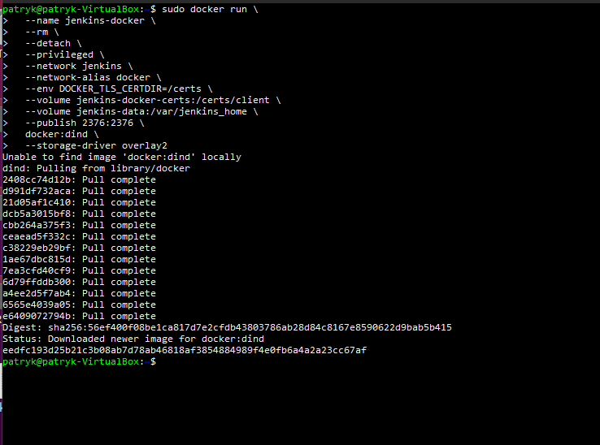  
3. Napisanie dockerfile dla jenkinsa\
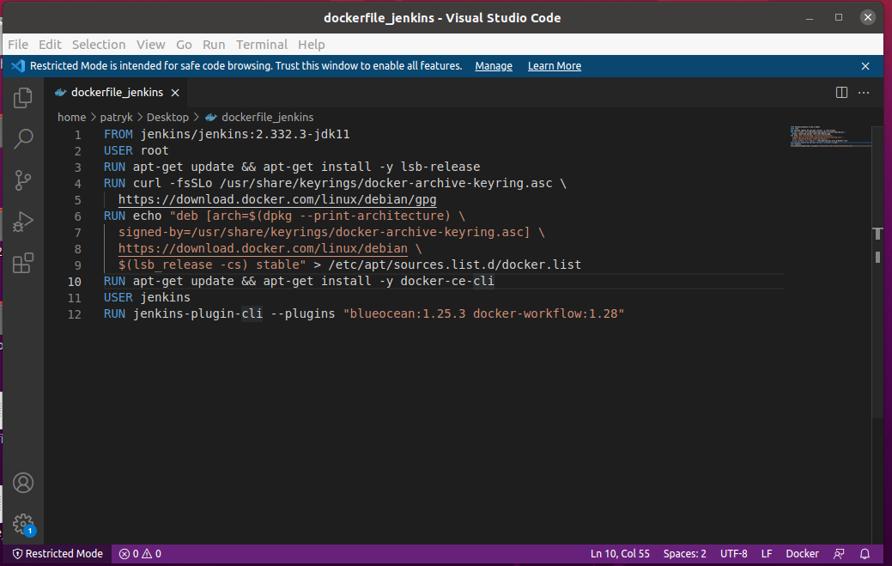  
4. Stworzenie obrazu za pomocą dockerfile\
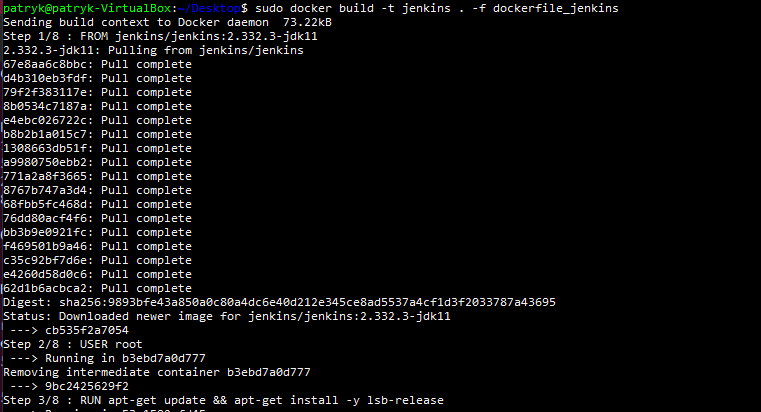  
5. Sprawdzenie aktualnych obrazów\
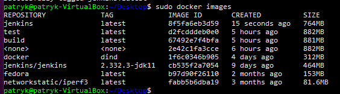  
6. Odpalenie kontenera na podstawie stworzonego obrazu\
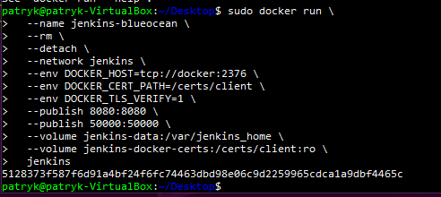  
  
  
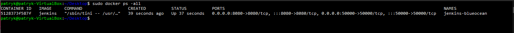  
  
  
7. Sprawdzenie hasła do jenkinsa\
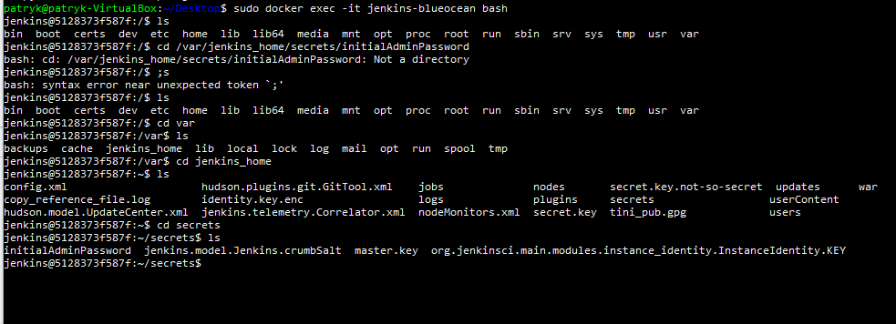  
8. Odpalenie okna jenkinsa w przeglądarce\
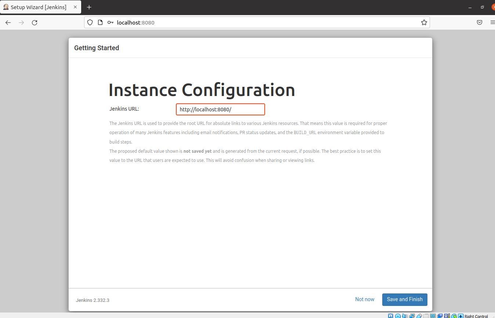  
  


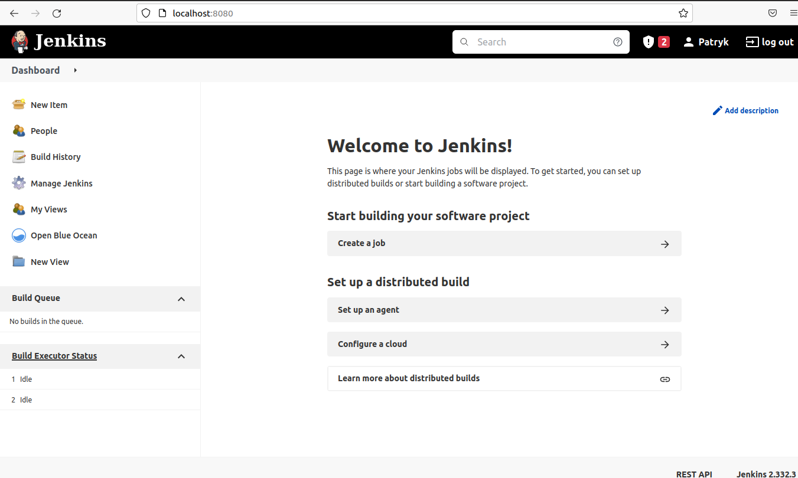  