| Imię i nazwisko  | Grupa | Data ćwiczenia     |
|------------------|-------|------------|
| Radosław Jurczak | 03    | 17.03.2022 |

## 1. Przygotuj git hook, który rozwiąże najczęstsze problemy z commitami
* hook sprawdzający, czy tytuł commita nazywa się RJ306452
* hook sprawdzający, czy w treści commita pada numer labu, właściwy dla zadania

W pliku .git/hooks/commit-msg zapisano skrypt sprawdzający powyższe wartości.
Następnie, aby umożliwić uruchamianianie skryptu, zmieniono uprawnienia do pliku przy użyciu polecenia `chmod +x commit-msg`  
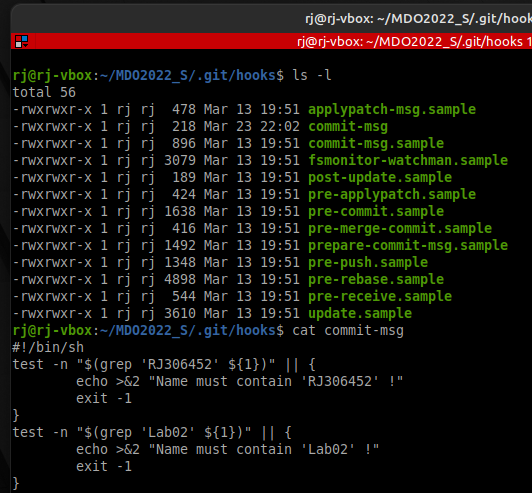  
Test działania hook'a:  
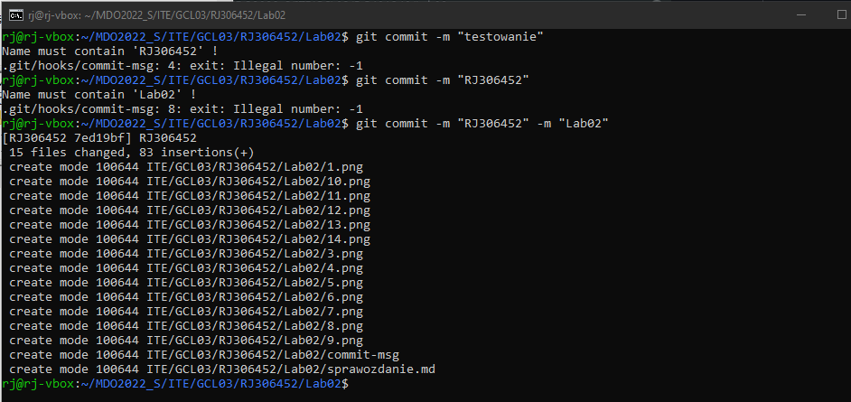

## 2. Umieść hook w sprawozdaniu w taki sposób, aby dało się go przejrzeć
```
#!/bin/sh
test -n "$(grep 'RJ306452' ${1})" || {
        echo >&2 "Name must contain 'RJ306452' !"
        exit -1
}
test -n "$(grep 'Lab02' ${1})" || {
        echo >&2 "Name must contain 'Lab02' !"
        exit -1
}
```
## 3. Rozpocznij przygotowanie środowiska Dockerowego 
* zapewnij dostęp do maszyny wirtualnej przez zdalny terminal (nie "przez okienko")

Skonfigurowano maszynę wirtualna tak aby działała w tej samej sieci (Wyłączenie NAT).  
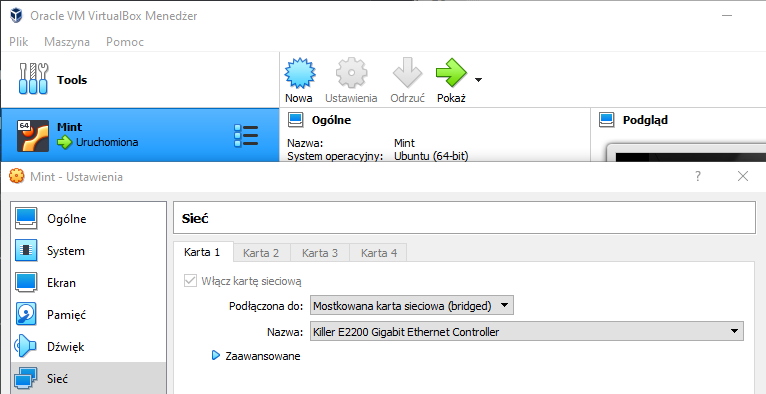
Zainstalowanie OpenSSH.  
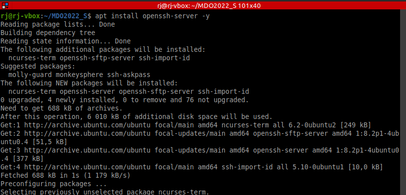
Sprawdzenie działania usługi sshd:  
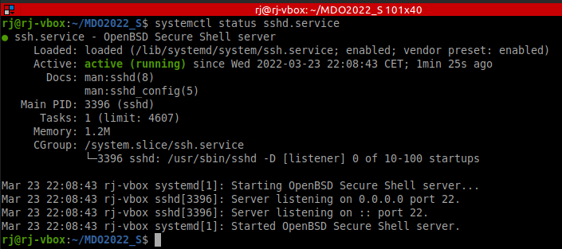
Przypisanie maszynie wirtualnej stałego adresu IP. Od razu sprawdzono dostępność VM przy użyciu pinga.  
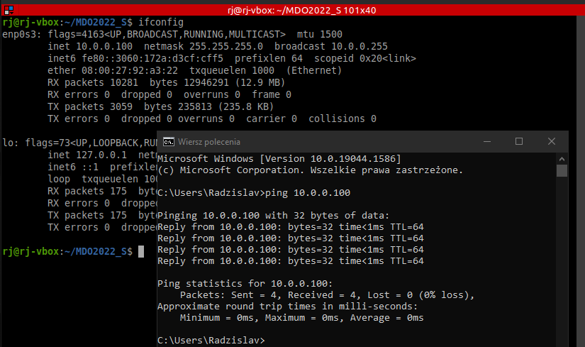
Aby umożliwić łączenie poprzez SSH z maszyną wirtualną, musimy odblokować port i uruchomić zaporę sieciową:  
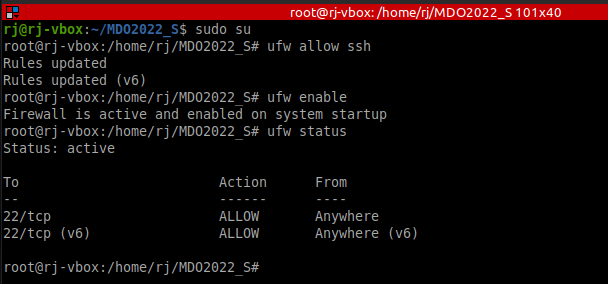 
Sprawdzenie połączenia przy użyciu PuTTY:  
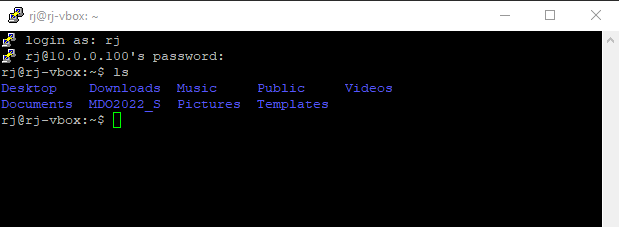

Z domyślnej konsolii Windowsa połączenie poprzez `ssh rj@10.0.0.100` również zadziałało bezproblemowo.

* zainstaluj środowisko dockerowe w stosowanym systemie operacyjnym
Instalacja Dockera:  
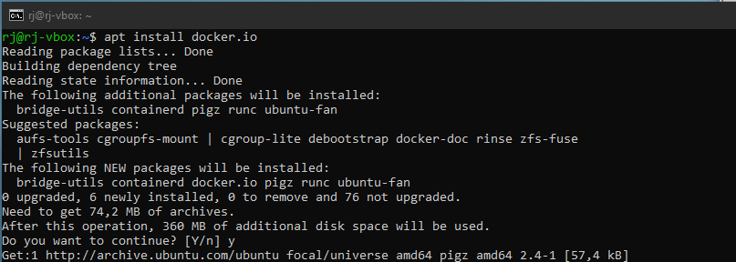  

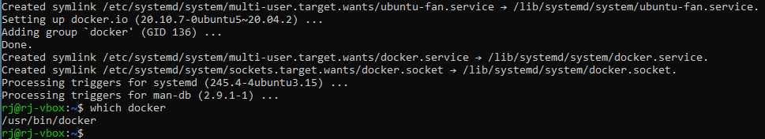

## 4. Działanie środowiska 
* wykaż, że środowisko dockerowe jest uruchomione i działa (z definicji)

Uruchomienie testowej aplikacji:  
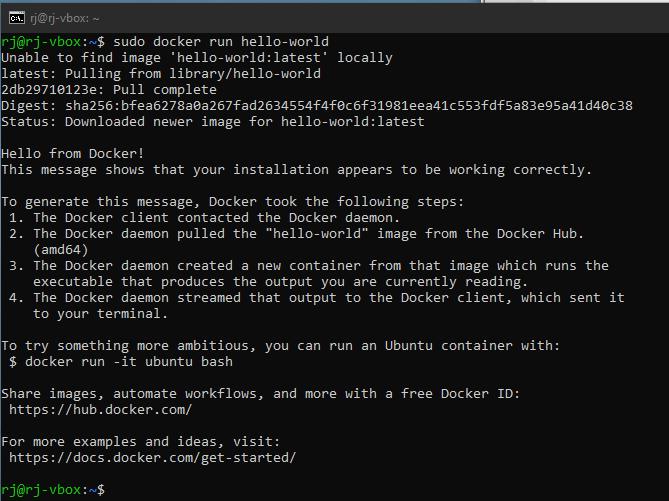

* wykaż działanie z sposób praktyczny (z własności):
	* pobierz obraz dystrybucji linuksowej i uruchom go
	* wyświetl jego numer wersji		
		Pobranie obrazu ubuntu: `sudo docker pull ubuntu`
		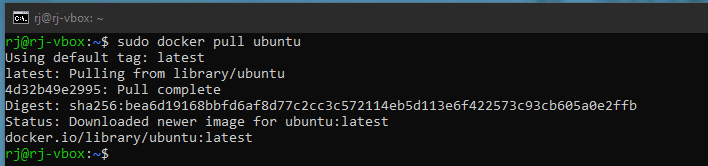
		
		Uruchomienie: `sudo docker run ubuntu` i wyświetlenie wersji:
		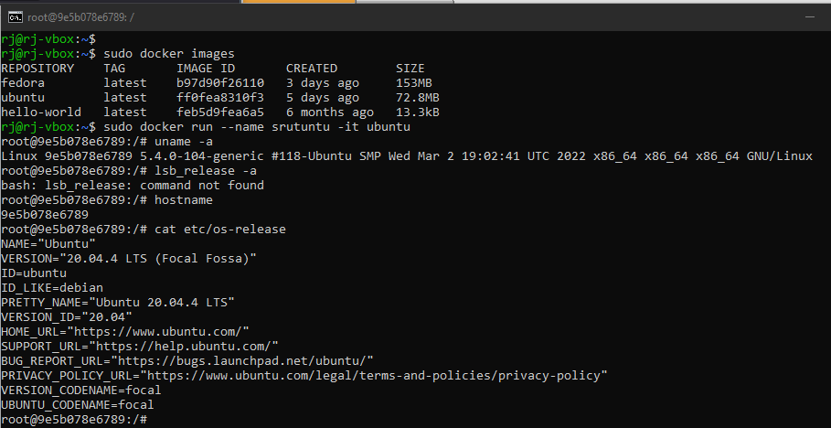
		
## 5. Załóż konto na Docker Hub
Konto utworzone już w zeszłym roku 🤠  
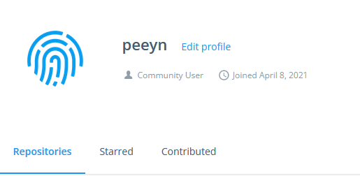