| Imię i nazwisko  | Grupa | Numer ćwiczenia     |
|------------------|-------|------------|
| Radosław Jurczak | 03    | Lab03 |

## Wybranym repozytorium jest deltachat-desktop:  
https://github.com/deltachat/deltachat-desktop

1. Pobranie obrazu node  
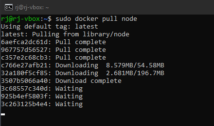  
Sprawdzenie docker images  
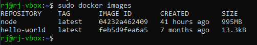  
Uruchomienie kontenera i pobranie repozytorium  
  
Przejście do katalogu głównego repozytorium  
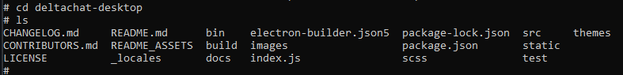  
Uruchomienie npm install  
W wyniku problemów z połączeniem internetowym dodano kilka linijek do npm config:  
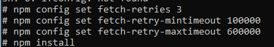  
npm install  
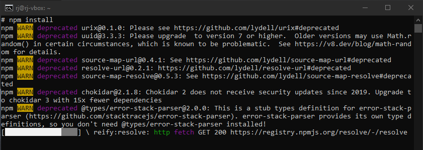  
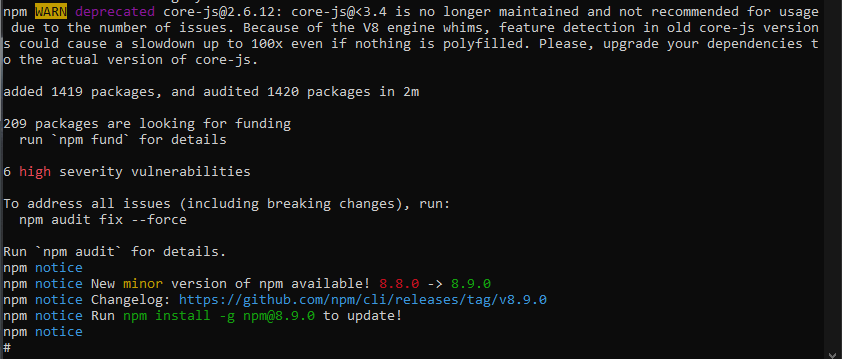  
npm run build  
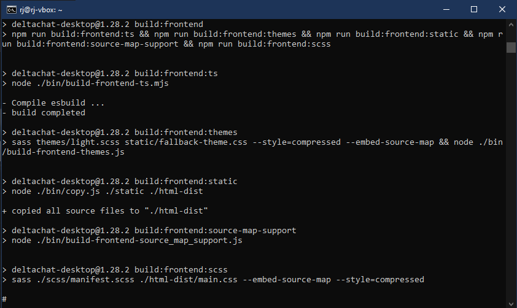  
npm run test  
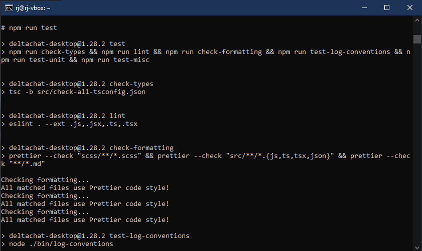  
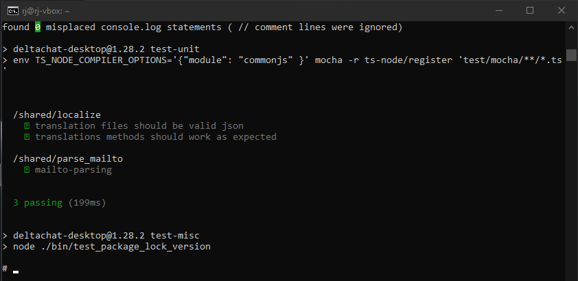  

Utworzenie dockerfile dla build: build.dockerfile  

```FROM node:latest  
RUN git clone https://github.com/deltachat/deltachat-desktop.git  
WORKDIR /deltachat-desktop/  
RUN npm install  
RUN npm run build
```

Sprawdzenie działania:  
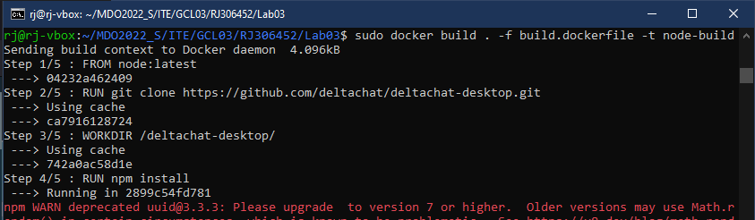  
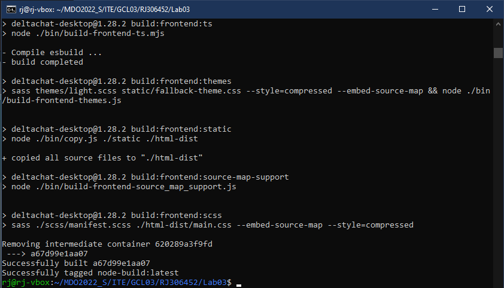  

Utworzenie dockerfile dla test: test.dockerfile  

```FROM node-build:latest  
WORKDIR /deltachat-desktop/  
RUN npm run test  
```
Sprawdzenie działania  
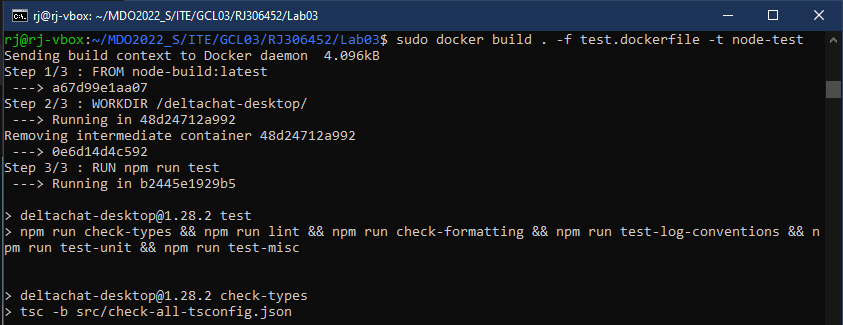  
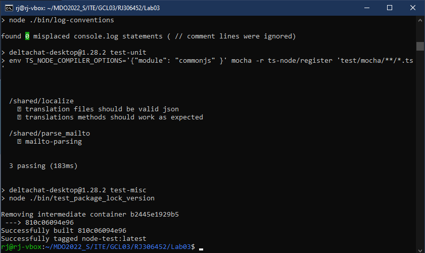  
