| Imię i nazwisko  | Grupa | Numer ćwiczenia     |
|------------------|-------|------------|
| Radosław Jurczak | 03    | Lab04 |

## Zachowywanie stanu / Eksponowanie portu  
1. Utworzenie woluminów:  
wejściowy: `volume_in`  
wyjściowy: `volume_out`  
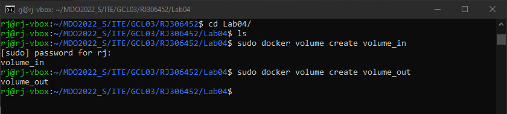  
2. Uruchomienie kontenera:  
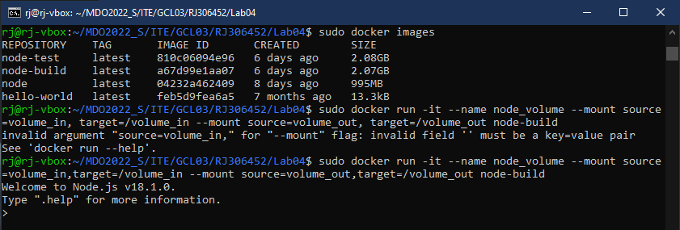  
3. Sklonowanie repozytorium na wiolumin wejściowy (musiałem użyć uprawnień root'a):  
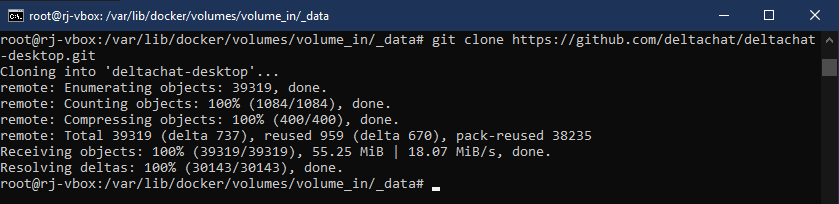  
4. Zapisanie plików build na woluminie wyjściowym:  
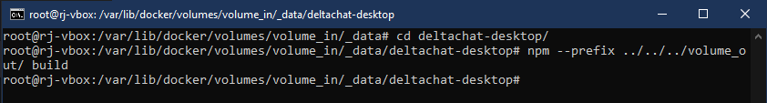  
5. Pobranie obrazu iperf3:  
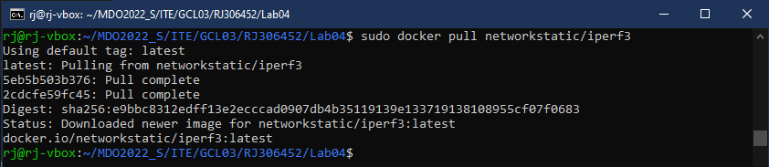  
6. Uruchomienie iperf3 w roli serwera:  
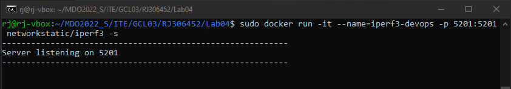  
7. Sprawdzenie konfiguracji, w tym adresu IP:  
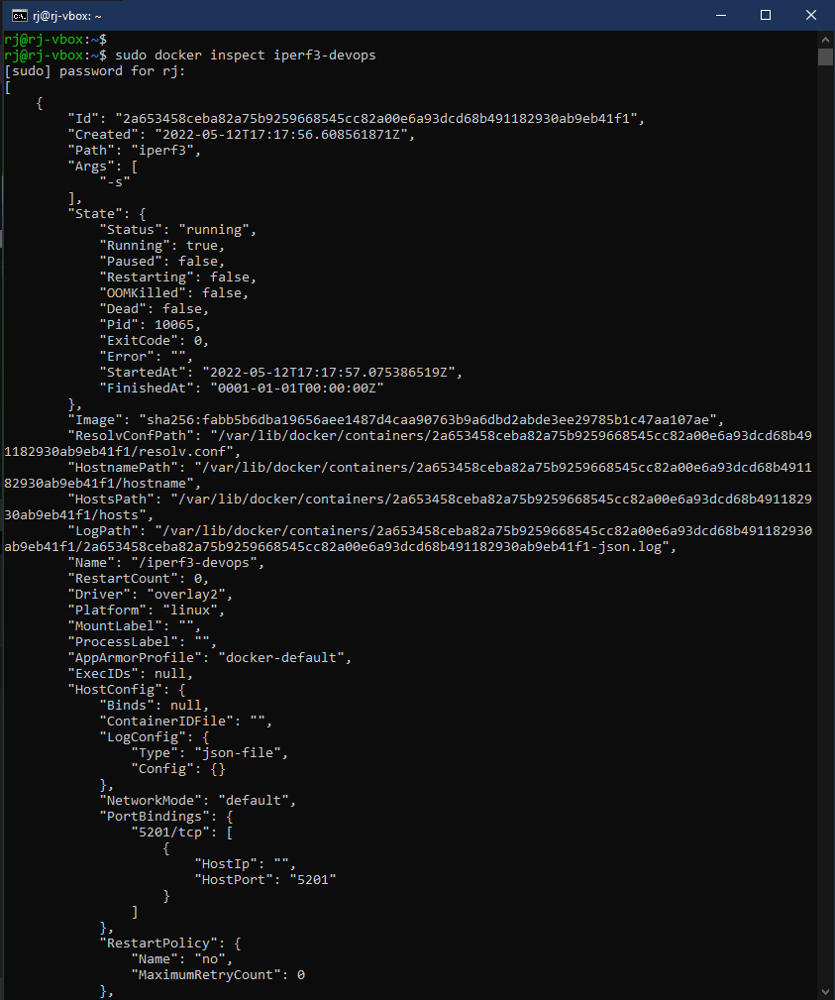  
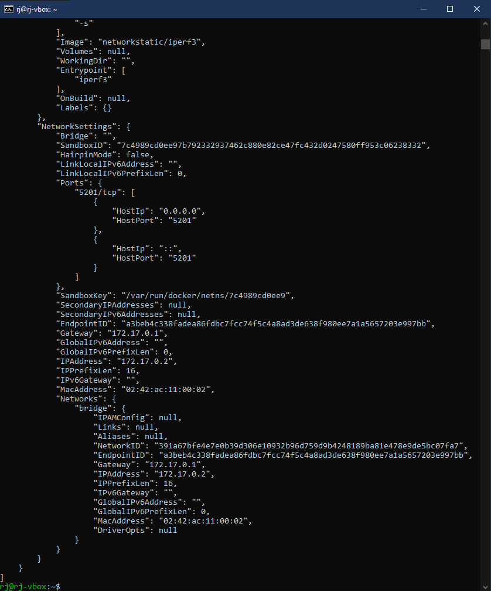  
`172.17.0.2`  
8. Połączenie się z serwerem za pomocą drugiego kontenera i wykonanie testu:  
Bitrate: `21.9 Gbits/sec`   
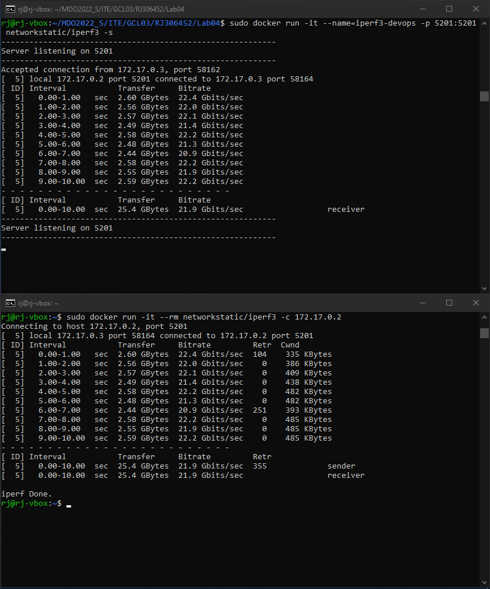  
9. Połączenie się z serwerem spoza kontenera (z hosta) i wykonanie testu:  
Bitrate: `24.8 Gbits/sec`  
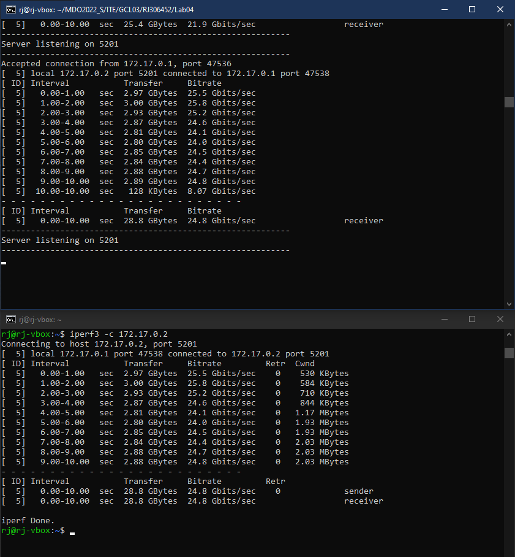  
10. Połączenie się z serwerem spoza kontenera (spoza hosta) i wykonanie testu:  
Bitrate: `3.36 Gbits/sec`  
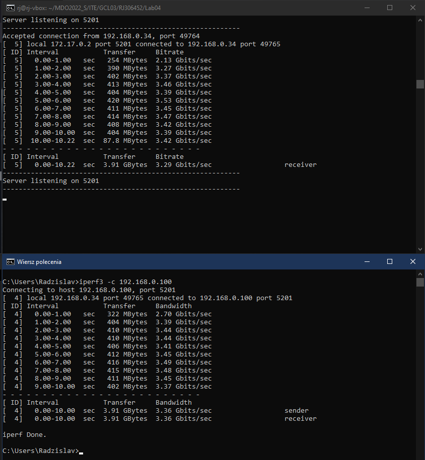  
## Instalacja Jenkins  
11. Utworzenie sieci:  
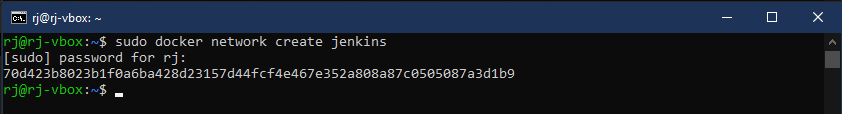  
12. Instalacja Jenkins w kontenerze:  
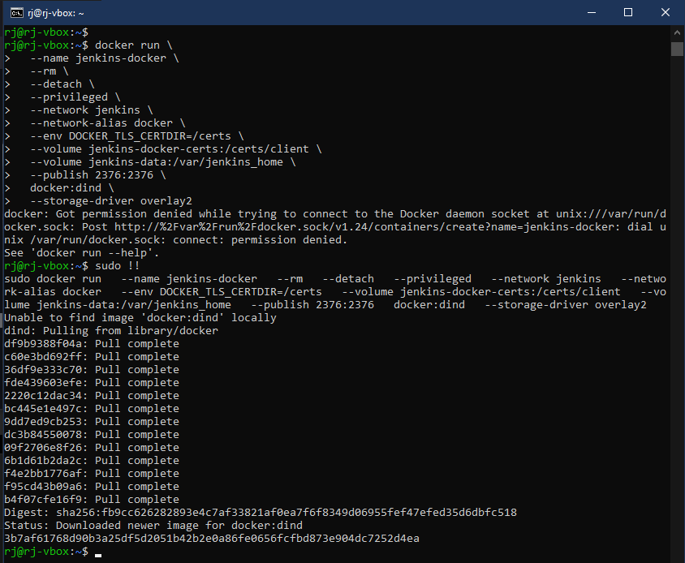  
13. Utworzenie Dockerfile:  
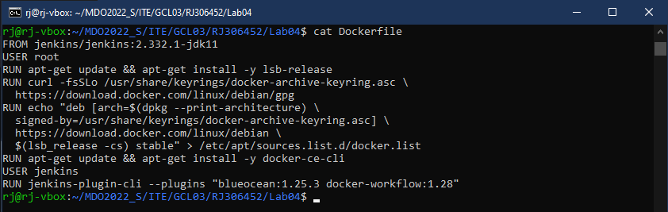  
14. Utworzenie obrazu:  
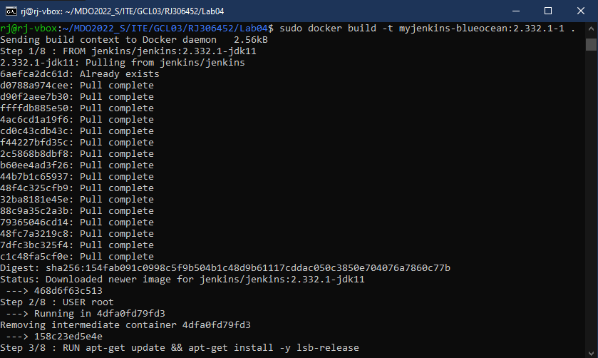  
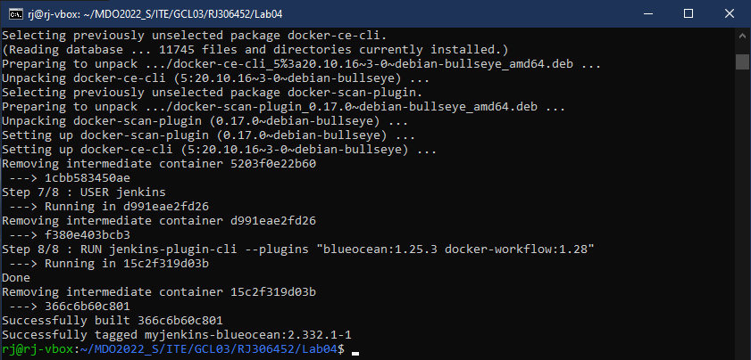  
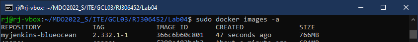  
15. I uruchomienie kontenera:  
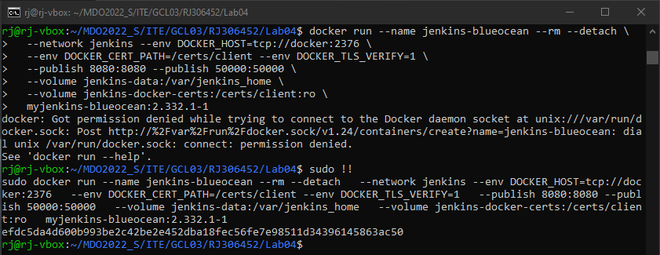  
16. Sprawdzenie kontenerów:  
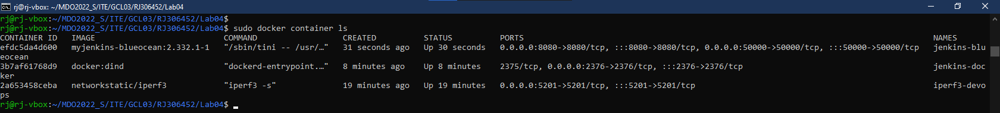  
17. Jenkins jeszcze nie jest odblokowany:
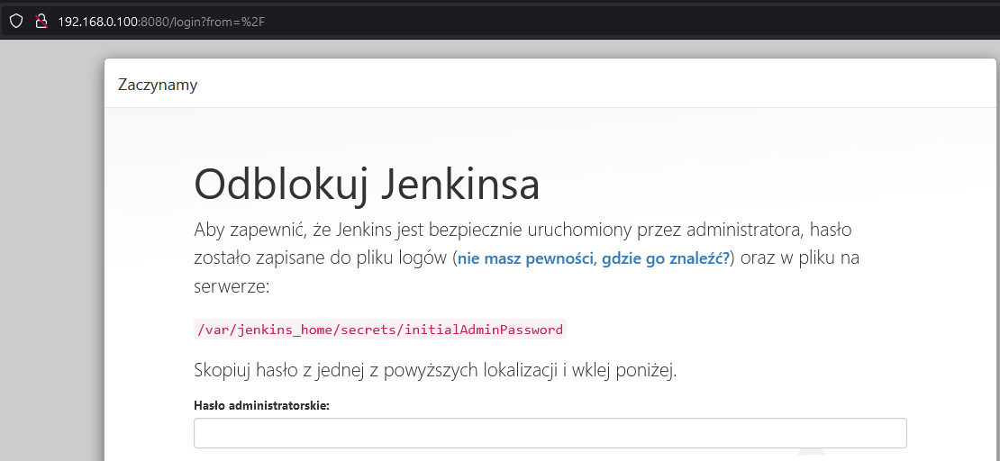  
18. Sprawdzenie logów w kontenerze:  
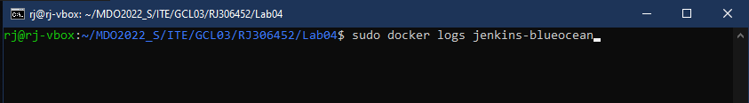  
19. Odnalezienie hasła dostępu:  
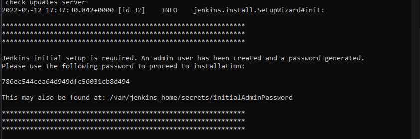  
20. Jenkins działa poprawnie:
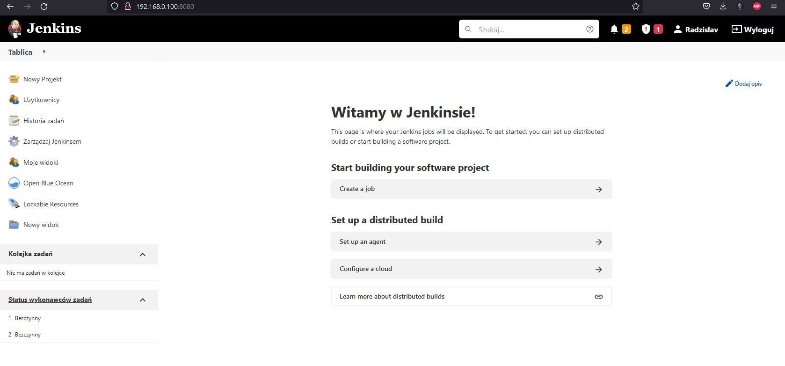  