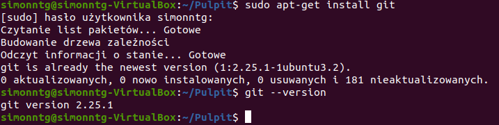
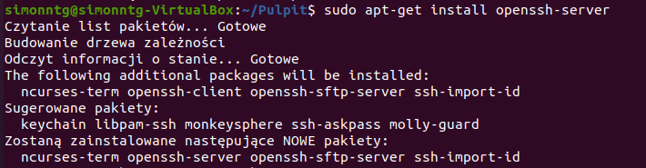
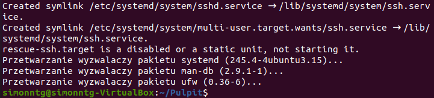
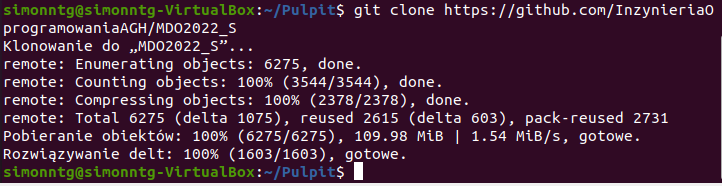
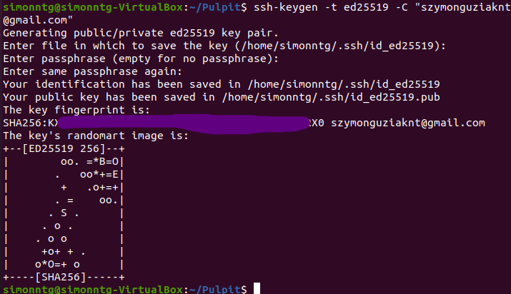
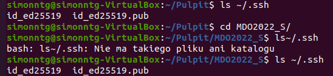
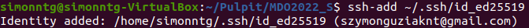
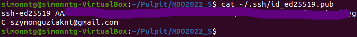
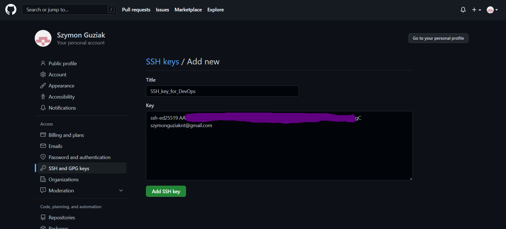
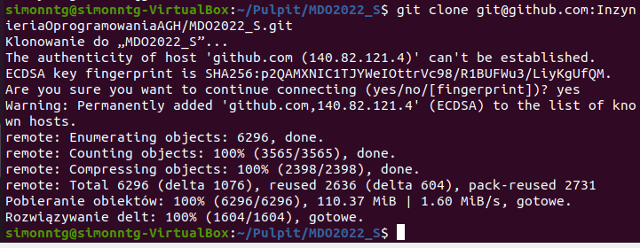

#Szymon Guziak, IT, gr.3, ITE-GCL03

#Metodyki DevOps - sprawozdanie z Lab01

1. Zainstaluj klienta Git i obsługę kluczy SSH

Wykorzystałem w tym celu utworzonę wcześniej na potrzeby poprzednich semestrów maszynę wirtualną w programie VirtualBox - Ubuntu 20.04
Git na tej maszynie był już wcześniej pobierany, więc tylko sprawdziłem, czy wszystko jest poprawnie oraz sprawdziłem wersję Git-a

Za pomocą komendy 'sudo apt-get install openssh-server' pobrałem obsługę ssh

2. Sklonuj repozytorium za pomocą HTTPS

Ten podpunkt wykonałem stosując komendę 'git clone //adres_URL_do_repozytorium'

3. Sklonowanie repozytorium za pomocą utworzonego klucza SSH

Na początku wygenerowałem klucz SSH. Następnie sprawdziłem, czy wszystko jest poprawnie i dodałem ten klucz za pomocą add-ssh

Kolejną czynnością było skopiowanie klucza i dodanie go do GitHub-a - klucz pokazałem na terminalu poprzez zastosowanie komendy 'cat'

Na koniec dodałem repozytorium poprzez SSH

4. Przełączenie się na gałąż main i utworzenie własnej gałęzi, z utworzeniem odpowiednich folderów oraz plików

W tym punkcie przełączyłem się przy pomocy 'git checkout ITE-GCL03' na gałąż swojej grupy.Następnie wszedłem do folderu ITE/GCL03 i utworzyłem tam katalog mkdir SG401600, a w nim katalog Lab01. W ostatnim katalogu utworzyłem przy pomocy komendy touch sprawozdanie z rozszerzeniem .md.

Następnie przy pomocy git checkout -b "SG401600" utworzyłem i przeniosłem się do swojej gałęzi i po wykonaniu git add * wykonałem commit za pomocą komendy git commit -m "komentarz" i spushowałem poprzez komendę git push origin SG401600
### tutaj powinien być screen komend, które użyłem w tym podpunkcie, ale po wykonaniu pushu (przed wykonaniem SS) przypadkowo zamknąłem terminal i jedynie widzę komendy, a nie informacje, które dostawałem po wykonaniu tych komend
