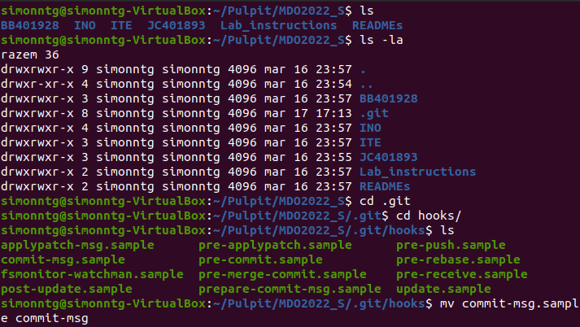
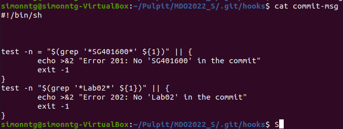
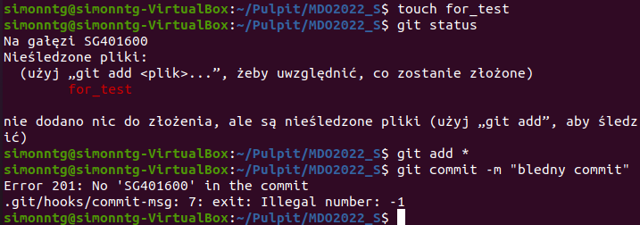
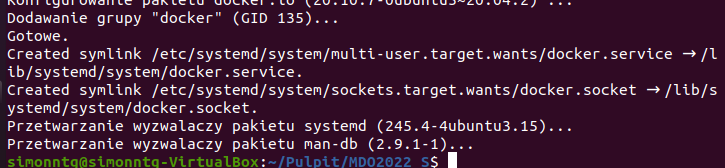
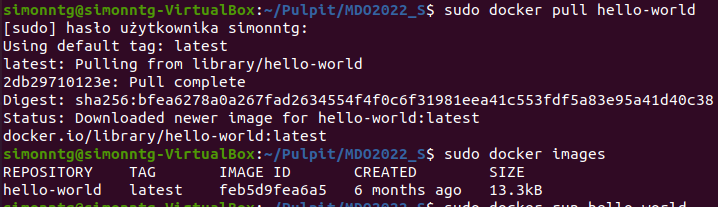
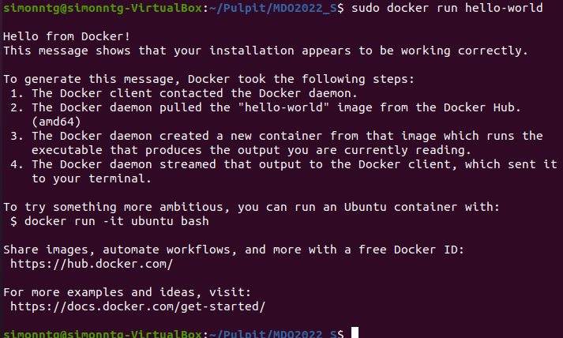
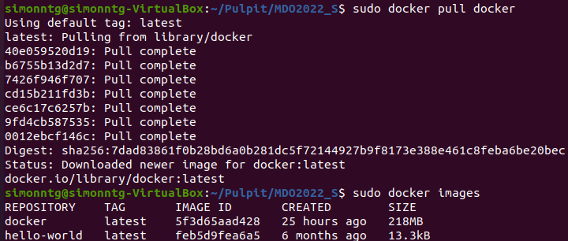
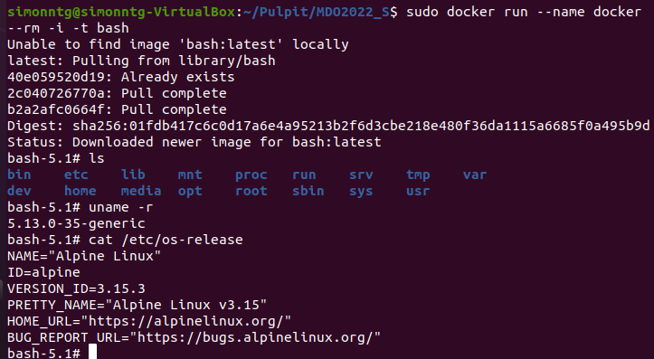
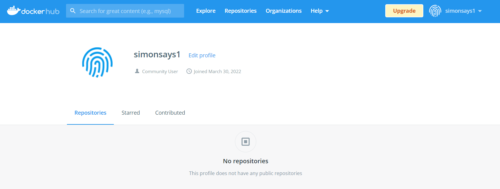

Sprawozdanie DevOps - Lab02
Szymon Guziak - ITE-GCL03

## 1) Przygotuj git hook
Odnaleziono katalog hooks, w którym utworzono prostego commita sprawdzającego:

Następnie przetestowałem stworzonego hooka:

## 2) Środowisko Dockerowe
Przy pomocy komendy 'sudo apt-get install docker.io' zainstalowano środowisko dockerowe:

## 3) Przetestowanie Dockera - działanie środowiska
Wykonałem szybki test, czy środowisko dobrze się zainstalowało.
W tym celu użyłem najbardziej popularnego obrazu 'hello-world'
Wykonałem to przy pomocy komendy 'sudo docker pull hello-world'
Następnie wykonałem komendę 'sudo docker images' która sprawdza czy obraz się zainstalował i uruchomiłem go :

Kolejnym etapem było praktyczne wykorzystanie docekra -
 - pobranie obrazu dystrybucji linuksowej za pomocą komendy 'sudo docker pull docker' //taka incepcja :D
Następnie uruchomiłem obraz i sprawdziłem wersję systemu

## 4) Założenie konta na Docker Hub

Ostatnim już elementem laboratoriów numer 2 było założenie konta na Docker Hub:

