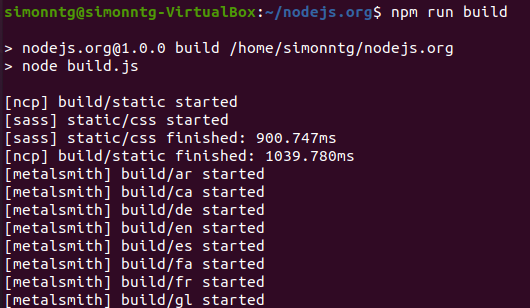
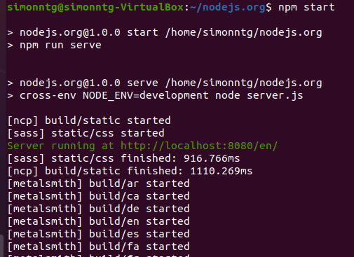
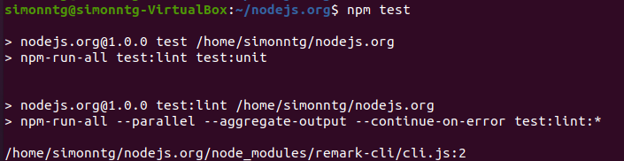
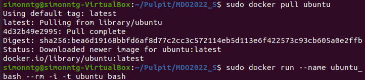
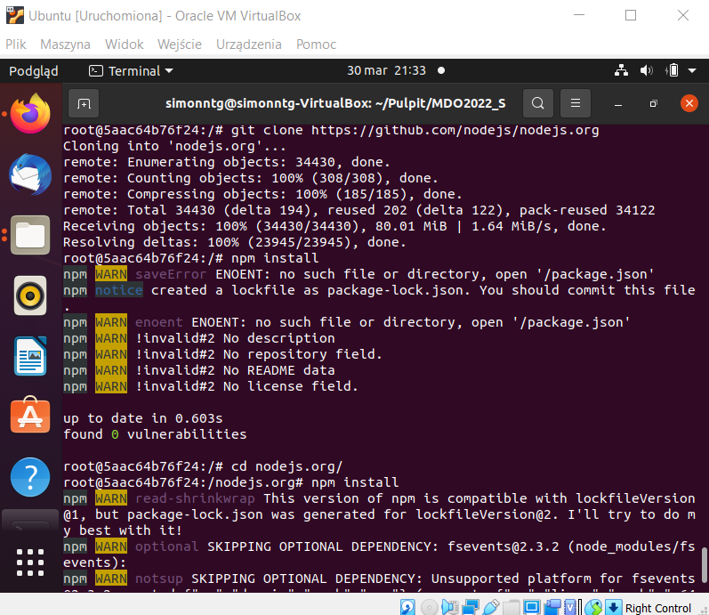
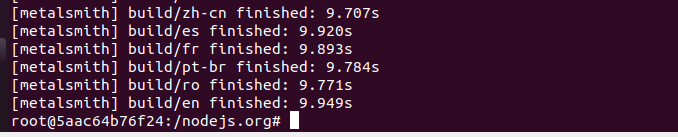
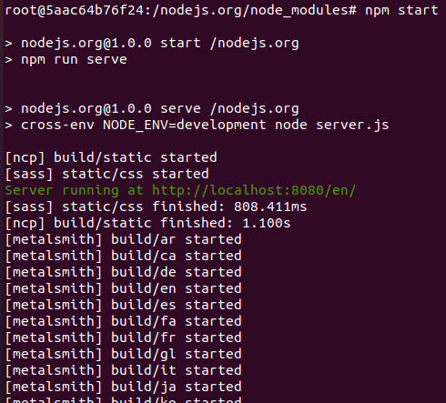
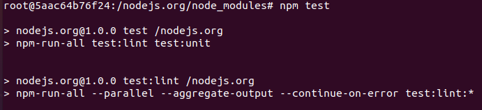
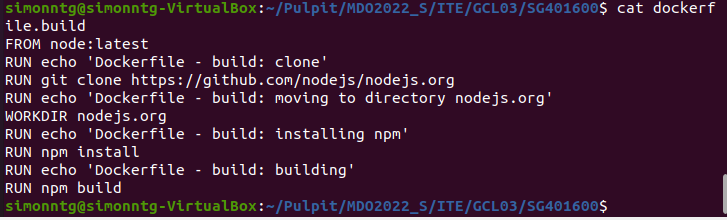
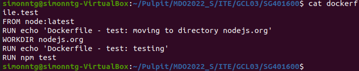

Sprawozdanie DevOps - Lab03
Szymon Guziak - ITE/GCL03

## 1) Wybór oprogramowania
Szukając odpowiedniego repozytorium natknąłem się na nodejs.org
Wybrałem je, ponieważ już kiedyś o nim słyszałem (przy szukaniu info o Node JS)

## 2) Wykonanie build i test na maszynie wirtualnej
Na początku przeprowadziłem operacje na Linuxie.
Wykonałem clonowanie git-a, następnie instalowałem npm,
 by na koniec móc wykonać build oraz test:

## 3) Wykonanie build i test na dockerze
Wpierw, by móc działać na git-cie wykonałem komende 'sudo docker pull ubuntu' i przygotowałem dockera - wykonałem clone i npm install

Następnie, gdy już miałem git-a, zainstalowałem sobie npm, zbudowałem, wykonałem i przeprowadziłem testy dla tego repozytorium:

## 4) Stwórz dwa pliki dockerfile - build oraz test
Utworzono Dockerfile dla obrazu budującego oraz testującego

