# Sprawozdanie z Lab04
# Szymon Guziak, IT, gr.3, ITE-GCL03

## Wyjaśnienie

Sprawozdanie z tego labolatorium długo nie pojawiało się, ponieważ zaistniał dość poważny problem podczas wykonywania go.
Mianowicie mój Linux w połowie wykonywania labolatorium wziął i umarł:

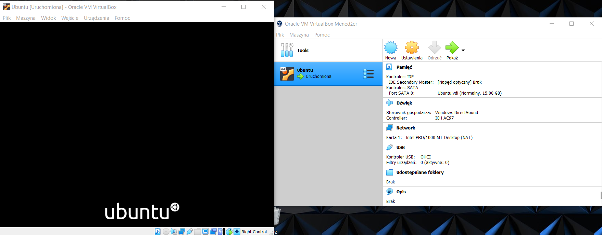

Liczyłem, że problem szybko uda mi się opanować niestety Linux kompletnie nie działał i czarny ekran z napisem Ubuntu wyświetlał się cały czas.
Byłem zmuszony do przeinstalowania Linuxa. W tym celu musiałem się zabawić się z czyszczeniem komputera ze zbędnych i mniej ważnych plików co spowodowało, iż miałem już dość pamięci na zainstalowanie środowiska.

Tym razem zainstalowałem środowisko i dalem dość dużo pamięci dla tego środowiska - poprzednie Ubuntu uważam że już się nie ładowało ponieważ się przepełniło.
Po zainstalowaniu środowiska musiałem przejść praktycznie całe poprzednie labolatoria, gdyż w z dużej ilości elementów korzystaliśmy podczas Lab04.

Bardzo przepraszam za tak późne oddanie tego sprawozdania.
Każde następne sprawozdanie teraz będzie się już pojawiać regularnie.

## 1. Zachowanie stanu
### a) Utworzenie woluminów wejściowych i wyjściowych oraz podłączenie do kontenera
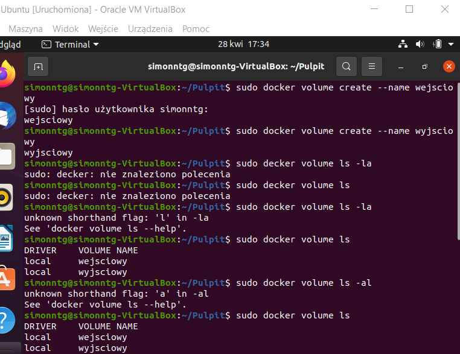

Wyświetlenie woluminów:

### b) Uruchomienie kontenera, zainstalowanie wymagań oraz sklonowanie repozytorium na wolumin wejściowy
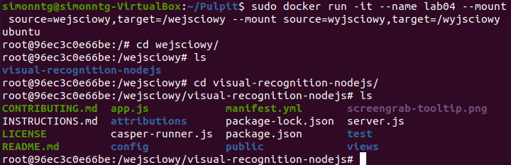
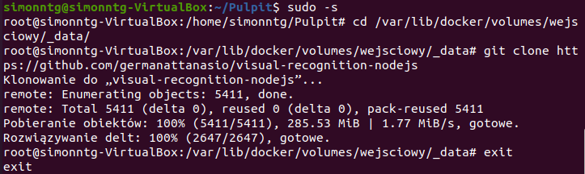

### c) Uruchomienie builda
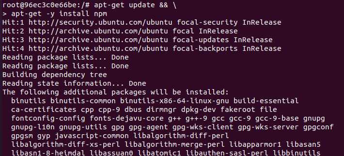
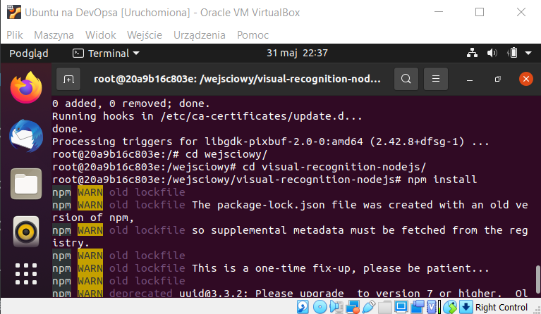

### d) Zapisanie plików na woluminie wyjściowym
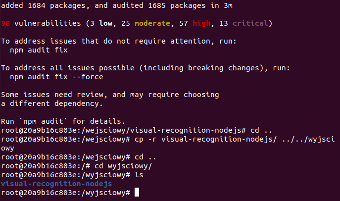

## 2. Esportowanie portu
### a) Uruchomienie kontenera z serwerem iperf3

Poprzez komendę 'docker pull networkstatic/iperf3' wniosłem serwer iperf3
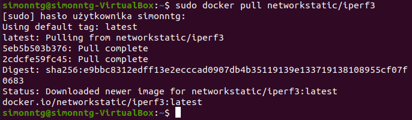
Następnie uruchomiłem mój kontener i sprawdziłem IP:
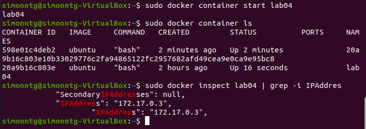

Tutaj wyniknął mały problem ponieważ nie byłem w stanie nic robić na środowisku, ponieważ miałem daily update oraz lock_is_held.
Próbowałem zainstalować net-tools - oczekiwanie kilkudziesięciu minut pomogło i mogłem dalej pracować (nie wiem czemu tak długo to trwało, ale ważne, że mi pozwoliło działać):

Sprawdziłem czy serwer nasłuchuje po włączeniu go:

### b) Połączenie się z kontenerem z hosta zewnętrznego:
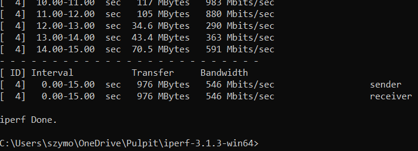
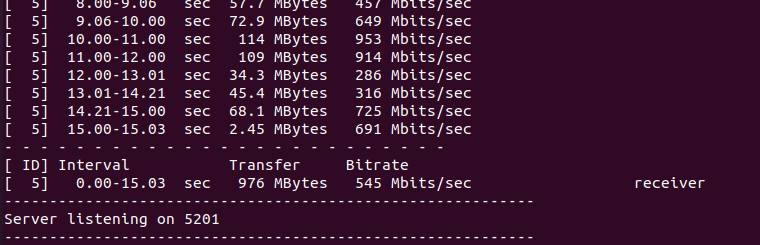
Przepustowość średnia: 545Mb/s

### c) Połączenie się z kontenerem z hosta zewnętrznego:
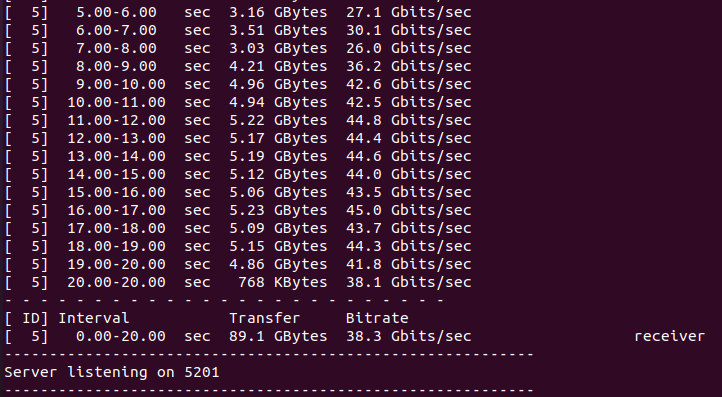
Przepustowaść średnia: 38.3Gb/s

### d) Połączenie się z kontenerem z hosta wewnętrznego:
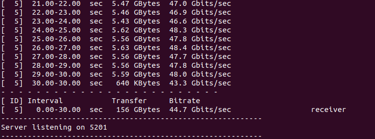
Przepustowość średnia: 44.7Gb/s

Najlepszą przepustowość uzyskano podczs połączenia z hostem wewnętrznym (44.7Gb/s), a najgorszą dla hosta zewnętrznego (niespełna 0.5Gb/s).

## 3. Instalacja Jenkinsa
Na początku zapoznałem się z dokumentacją Jenkinsa.
Następnie przystąpiłem do instalacji skonteneryzowanej instalacji Jenkinsa z pomocnikiem w postaci DIND.
W tym celu utworzono sieć oraz pobrano, a następnie uruchomiono obraz DIND:

Napotkałem tutaj problem w postaci takiej, iż nie chciało mi tutaj pobrać DIND z powodu "Error response from daemon: error parsing HTTP 408 response body ...".
Rozwiązaniem tego problemu była zmiana połączenia sieciowego z mostkowego na NAT.
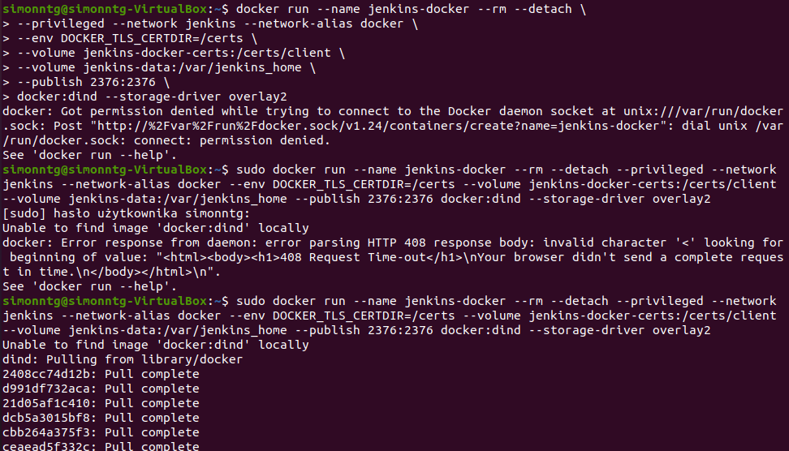
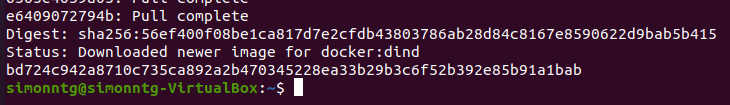

Utworzono plik DockerFile:
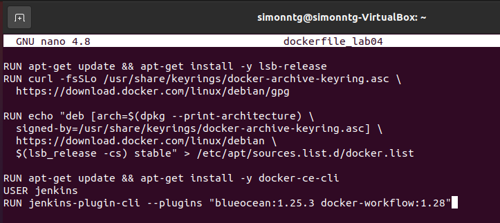

Następnie zbudowano obraz za pomocą mojego pliku DockerFile dockerfile_lab04:
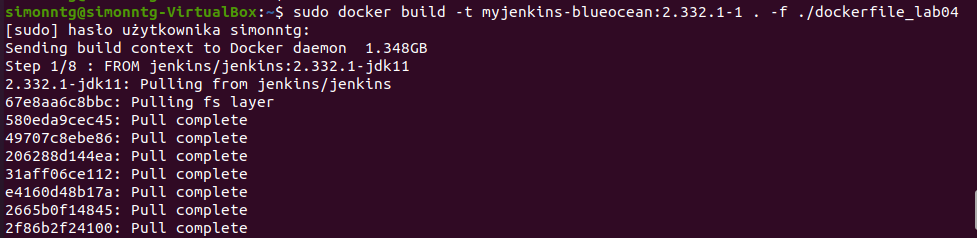
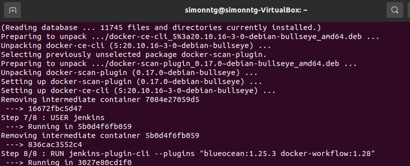
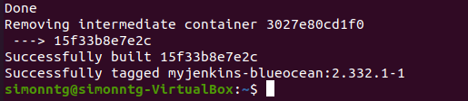

Kolejnym krokiem było uruchomienie kontenera

Następnie połączyłem się z Jenkinsem i otrzymałem ekran logowania:
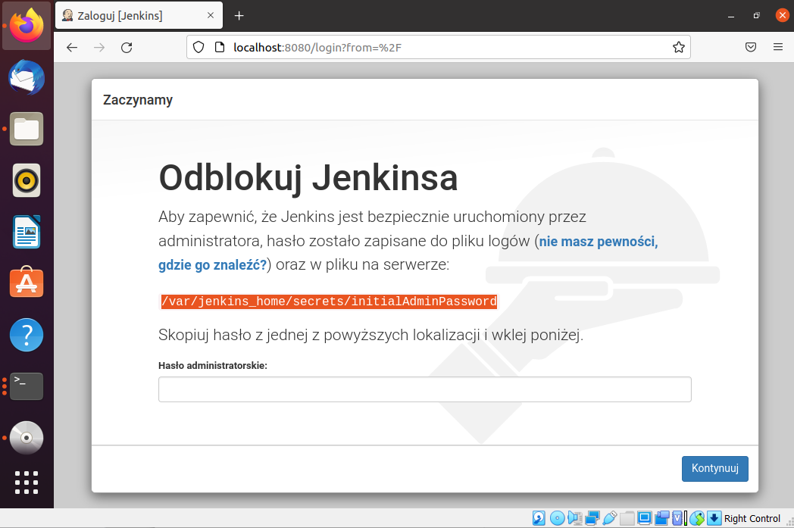

Poprzez 'sudo docker exec -it' wszedłem do jenkinsa i za pomocą komendy cat sprawdziłem hasło, dzięki któremu mogłem się zalogować do jenkinsa:
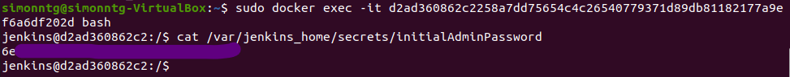

Ujrzałem ekran powitalny Jenkinsa po zainstalowaniu wtyczek:
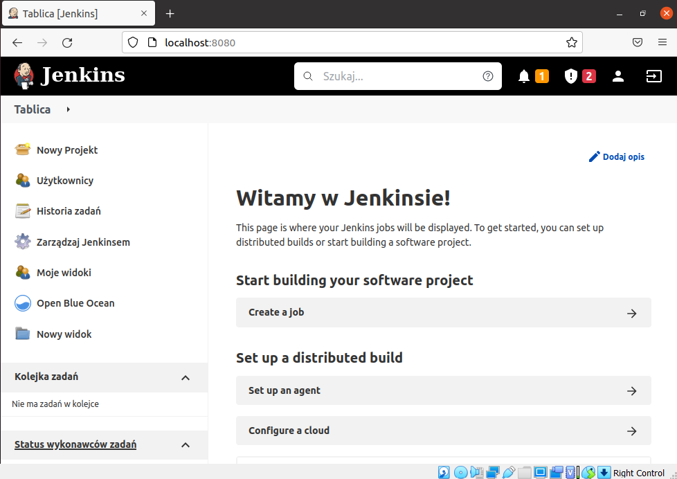

I sprawdziłem, że mam działający kontener:
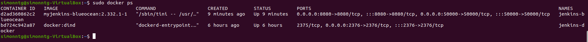
