# Sprawozdanie

**1. Zainstaluj klienta Git i obsługę kluczy SSH**
Klient git oraz obsługa kluczy SSH została zainstalowana przed zajęciami, sprawdzono wersje zainstalowanego gita oraz SSH.
`git --version`
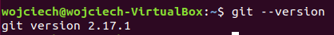

`ssh -V`
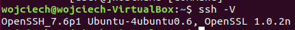

**2. Sklonuj repozytorium https://github.com/InzynieriaOprogramowaniaAGH/MDO2022_S za pomocą HTTPS**
Sklonowano repozytorium za pomocą HTTPS
`git clone https://github.com/InzynieriaOprogramowaniaAGH/MDO2022_S`
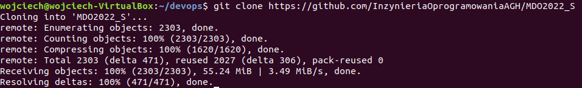

**3. Upewnij się w kwestii dostępu do repozytorium jako uczestnik i sklonuj je za pomocą utworzonego klucza SSH**

- Utwórz dwa klucze SSH, inne niż RSA, w tym co najmniej jeden zabezpieczony hasłem
  Utworzenie dwóch kluczy ssh, pierwszy bez hasła ed25519, natomiast drugi zabezpieczony hasłem
  `ssh-keygen -t ed25519 -f devops_key`
  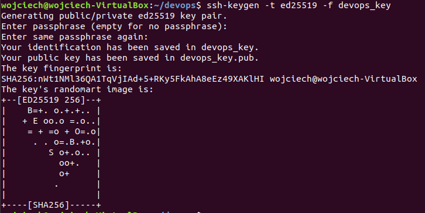
  `ssh-keygen -t ecdsa`
  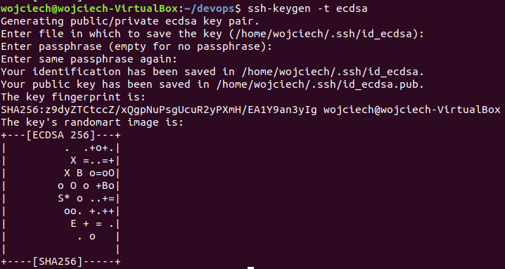
  -Skonfiguruj klucz SSH jako metodę dostępu do GitHuba
  Dodano wygenerowany klucz do GitHuba
  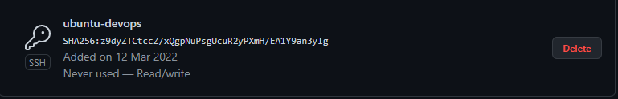
  Dodano wygenrowany klucz do SSH
  `ssh-add /home/wojciech/.ssh/id_ecdsa`
  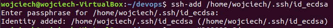
  -Sklonuj repozytorium z wykorzystaniem protokołu SSH
  Usunięto repozytorium sklonowane za pomocą HTTPS
  `sudo rm -r MDO2022_S/`
  Sklonowano repozytorium z wykorzystaniem protokołu SSH
  `git clone git@github.com:InzynieriaOprogramowaniaAGH/MDO2022_S.git`
  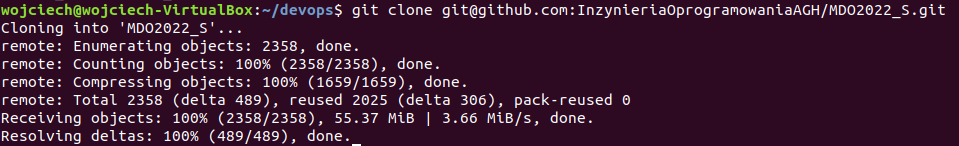
  **4. Przełącz się na gałąź main, a potem na gałąź swojej grupy (pilnuj gałęzi i katalogu!)**
  Dokonano przełączenia się do gałęzi main a następnie do gałęzi grupy 3 czyli ITE-GCL03
  `cd MDO2022_S/`
  `git checkout main`
  `git checkout ITE-GCL03`
  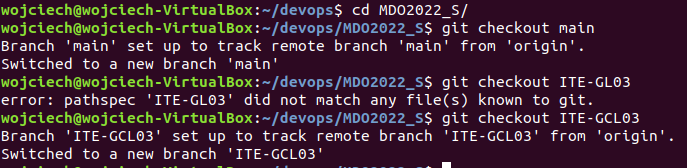
  **5. Utwórz gałąź o nazwie "inicjały & nr indeksu" np. KD232144. Miej na uwadze, że odgałęziasz się od brancha grupy!**
  Utworzono nową gałąź WJ400220
  `git checkout -b WJ400220`
  
  **6. Rozpocznij pracę na nowej gałęzi**
- W katalogu właściwym dla grupy utwórz nowy katalog, także o nazwie "inicjały & nr indeksu" np. KD232144
  `cd ITE/GCL03/`
  `mkdir WJ400220`
  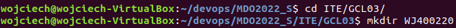
- W nim także utwórz katalog: Lab01
  `cd WJ400220/`
  `mkdir Lab01`
  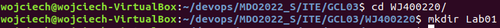
- W nowym katalogu dodaj plik ze sprawozdaniem
- Dodaj zrzuty ekranu (jako inline)
  Skopiowano sprawozdanie wraz z zrzutami ekranu
  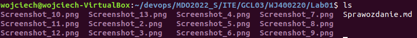
- Wyślij zmiany do zdalnego źródła
  `git add ../`
  `git commit -m "sprawozdanie"`
  
  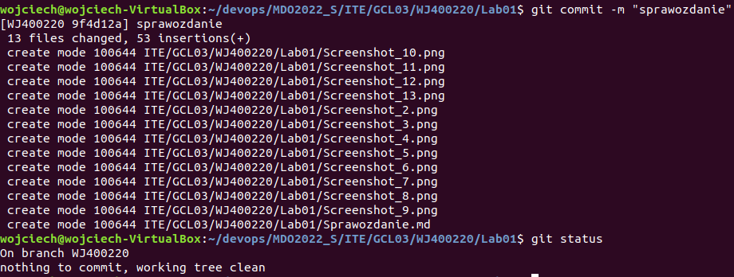
  Wysłanie zmian wymagało podpięcia branch lokalnego do brancha zdalnego
  `git push`
  `git push --set-upstream origin WJ400220`
  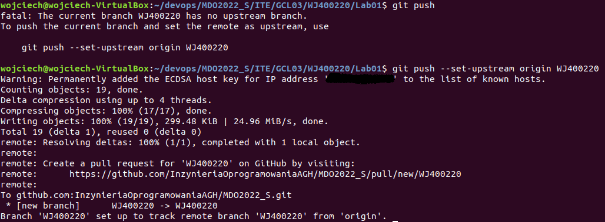
