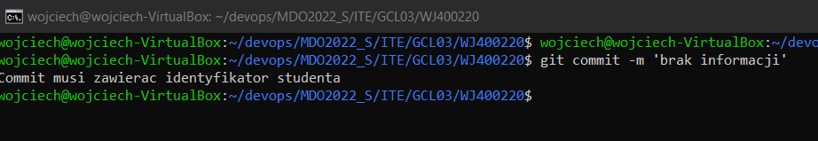
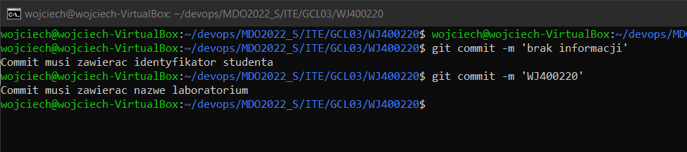
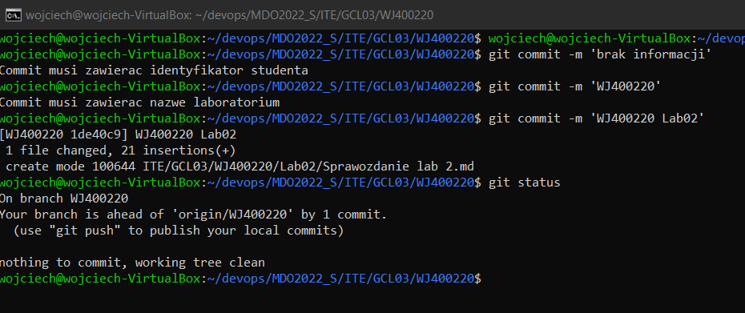
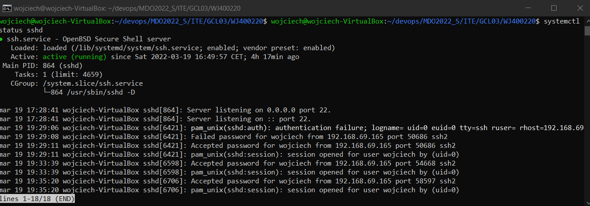
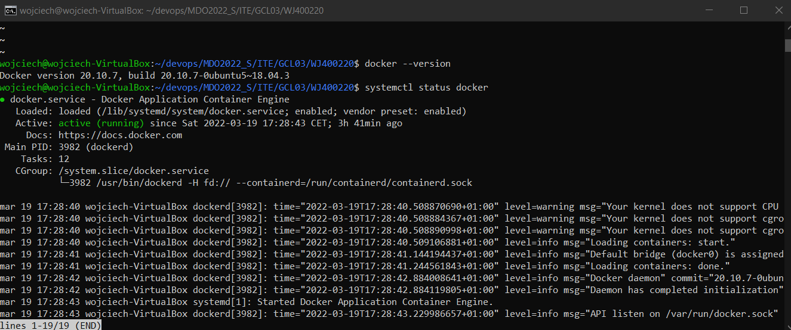
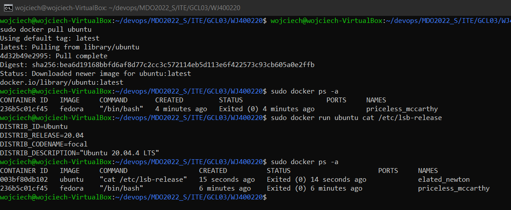
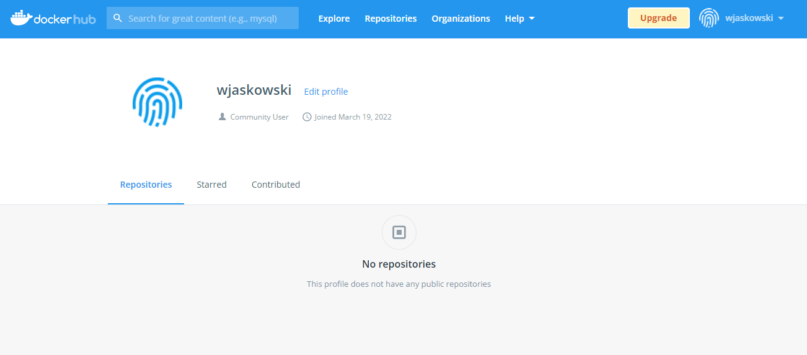

# Sprawozdanie lab 2

* Przygotowanie hooka sprawdzającego czy w tytule commita znajduje się numer indeksu wraz z inicjałami oraz numer laboratorium

```sh

#!/bin/sh
if [ "$(grep -E -w -o 'WJ400220' "$1" | wc -l)" != "1" ]
then
	echo Commit musi zawierac identyfikator studenta
	return 1
fi
if [ "$(grep -E -w -o 'Lab02' "$1" | wc -l)" != "1" ]
then
        echo Commit musi zawierac nazwe laboratorium
	return 1
fi
return 0

```

Przykład działania - brak identyfikatora



Przykład działania - poprawny identyfikator, brak numeru laboratorium



Przykład działania - poprawne wykonanie commita



* Łączenie do maszyny wirtualnej za pomocą ssh



* Docker został zainstalowany (wersja 20.10.7)



* Uruchomienie obrazu ubuntu w kontenerze



* Utworzenie konta na Docker Hub

