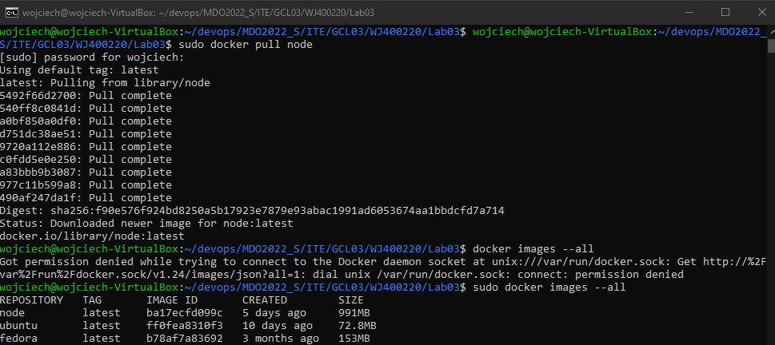
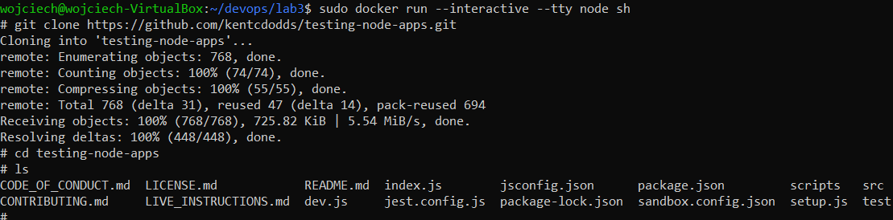
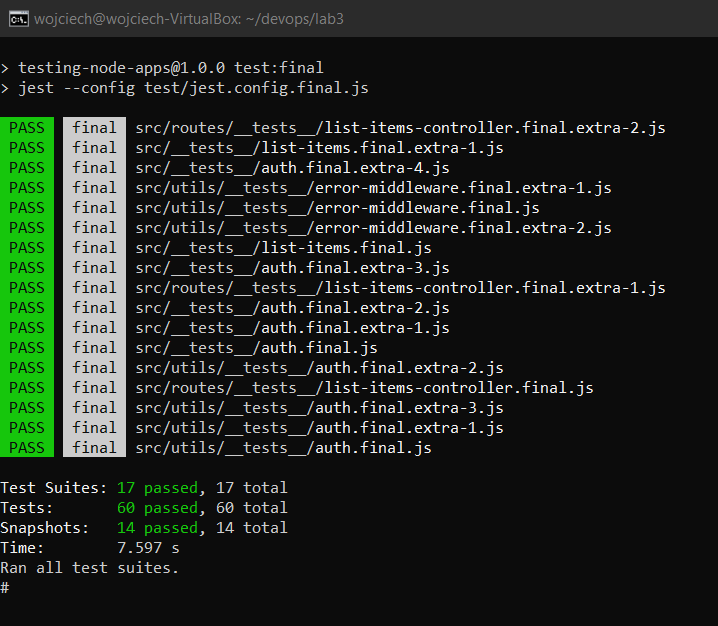
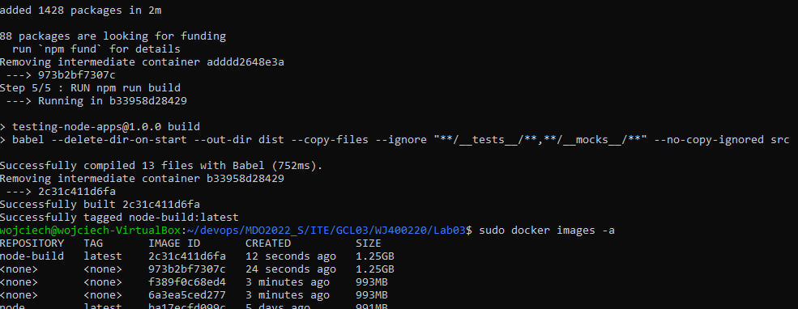
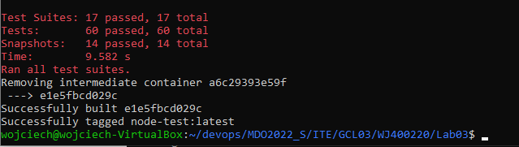
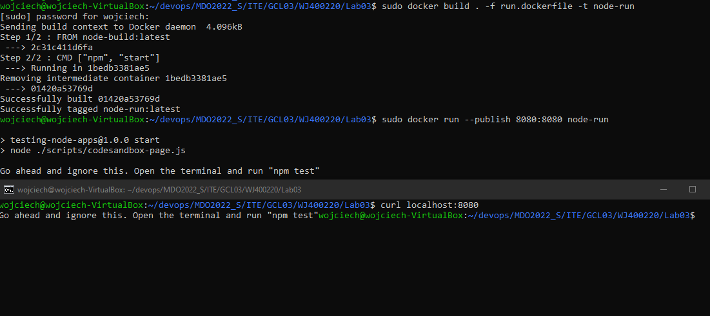
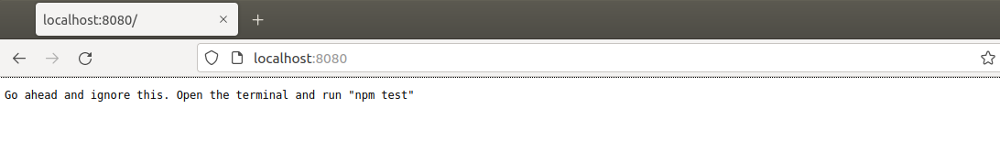

# SPRAWOZDANIE 3

* Wybrano repozytorium https://github.com/kentcdodds/testing-node-apps.git, jest to prosta aplikacja w Node.js zawierająca testy.
* Pobrano obraz node

```
sudo docker pull node
sudo docker images --all
```



* Kolejnym krokiem było uruchomienie kontenera, podłączenie się do niego oraz klonowanie repozytorium

```bash
sudo docker run --interactive --tty node sh
git clone https://github.com/kentcdodds/testing-node-apps.git
```



* W uruchomionym kontenerze zbudowano projekt oraz uruchomiono testy

```bash
npm install
npm run build
```


```
npm run test
```



* Utworzono dockerfila o nazwie "build.dockerfile" służącego do budowania projektu oraz przetestowano jego działanie

```dockerfile
FROM node:latest
RUN git clone https://github.com/kentcdodds/testing-node-apps.git
WORKDIR /testing-node-apps/
RUN npm install
RUN npm run build
```

```bash
sudo docker build . -f build.dockerfile -t node-build
```



* Utworzono dockerfila o nazwie "test.dockerfile" służącego do uruchomienia testów bazując na poprzednim obrazie 

```dockerfile
FROM node-build:latest
WORKDIR /testing-node-apps/
RUN npm run test:final
```

```bash
sudo docker build . -f test.dockerfile -t node-test
```




* W celu przetestowania działania kontenera utworzono dockerfile "run.dockerfile" oraz uruchomiono kontener

  ```dockerfile
  FROM node-build:latest
  CMD ["npm", "start"]
  ```





