# SPRAWOZDANIE

* Zachowywanie stanu

Utworzenie woluminu wejściowego oraz wyjściowego

```bash
sudo docker volume create volume_in
sudo docker volume create volume_out
```

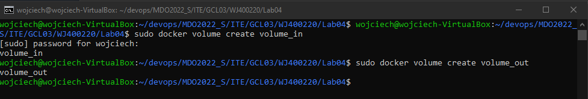

Uruchomienie kontenera

```bash
sudo docker run -it --name node_volume --mount source=volume_in,target=/volume_in --mount source=volume_out,target=/volume_out node-build
```


Klonowanie repozytorium na wolumin wejściowy

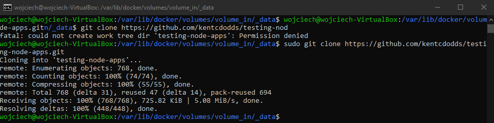

Zapisanie plików builda na wolumenie wyjściowym 

```bash
npm --prefix ../../../volume_out/ build
```

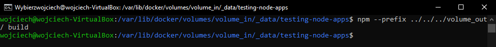

* Eksponowanie portu

Pobranie obrazu iperf3

```bas
sudo docker pull networkstatic/iperf3
```

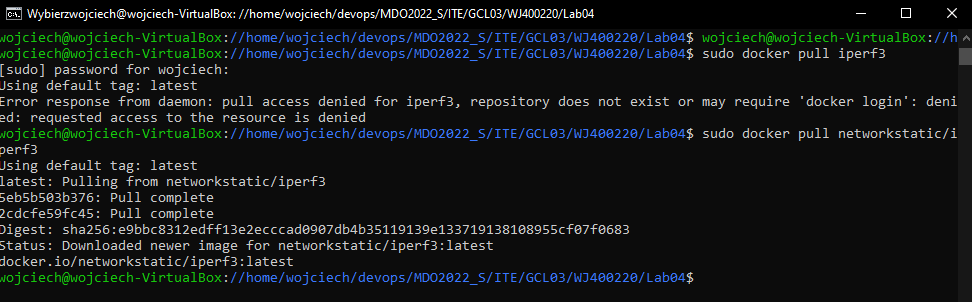

Uruchomienie iperf3 (jako serwer - opcja -s) w kontenerze

```bash
sudo docker run -it --name=iperf3-devops -p 5201:5201 networkstatic/iperf3 -s
```

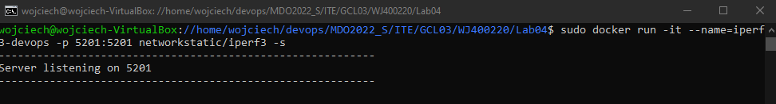

Sprawdzenie adresu IP kontenera

```bash
sudo docker inspect iperf3-devops
```

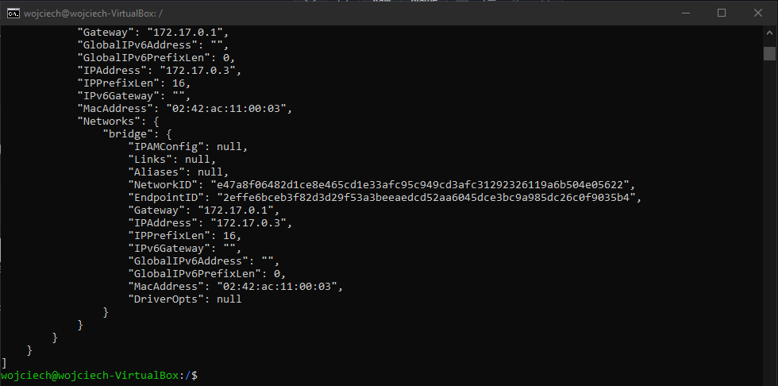

Połącznie się z drugiego kontenera do serwera, zbadanie ruchu

```bash
sudo docker run -it --rm networkstatic/iperf3 -c 172.17.0.3
```

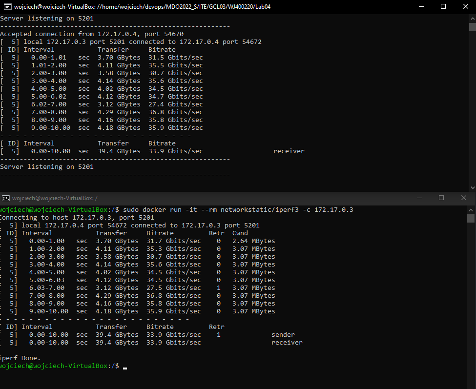

Wynik - 33.9 Gbits/sec

Połączenie się z hosta

```bash
iperf3 -c 172.17.0.3
```

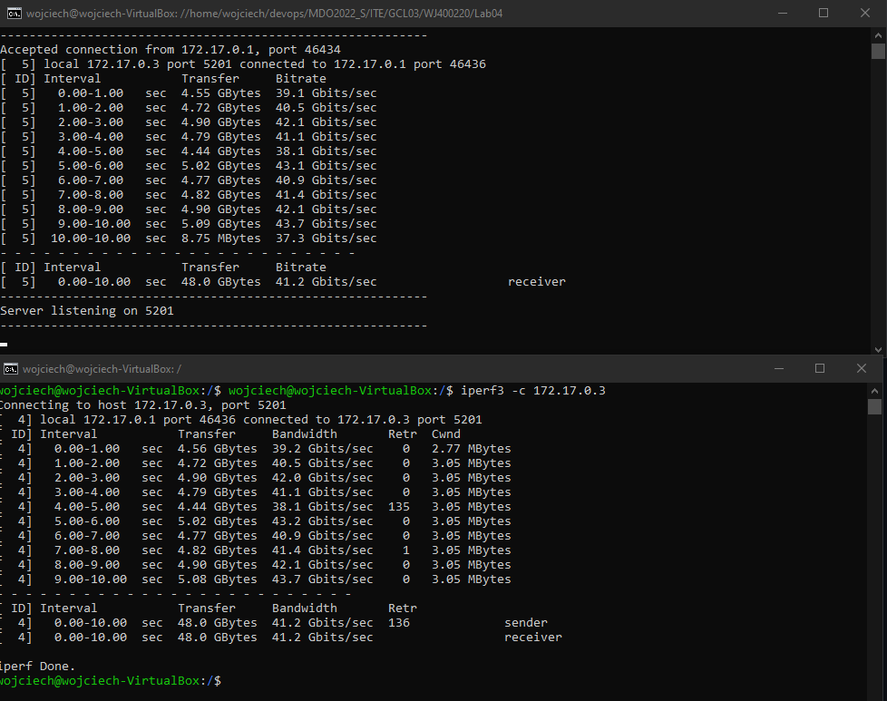

Wynik - 41.2 Gbits/sec

Połączenie poza hostem

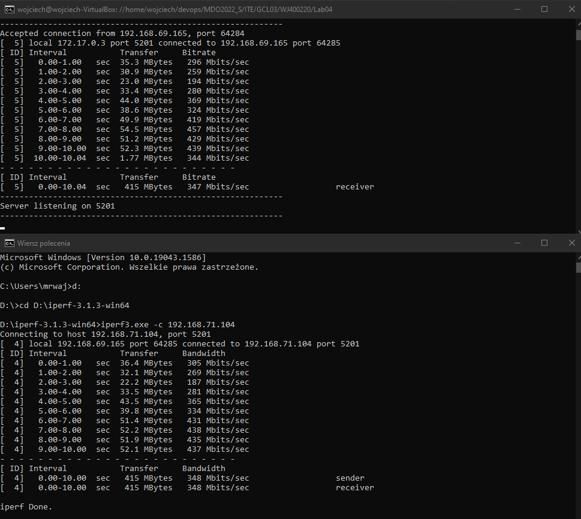

Wynik - 347 Mbit/sec

* Instalacja Jenkins

Utworzenie sieci

```bash
sudo docker network create jenkins
```

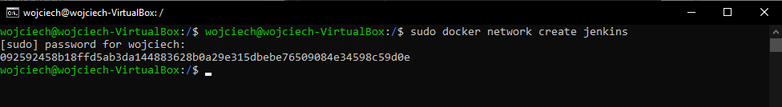

Instalacja Jenkinsa w kontenerze z wykorzystaniem DIND

```bash
docker run --name jenkins-docker --rm --detach \
  --privileged --network jenkins --network-alias docker \
  --env DOCKER_TLS_CERTDIR=/certs \
  --volume jenkins-docker-certs:/certs/client \
  --volume jenkins-data:/var/jenkins_home \
  --publish 2376:2376 \
  docker:dind --storage-driver overlay2

```

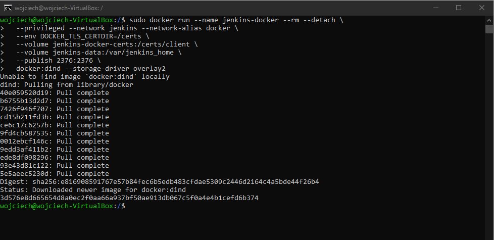

Utworzenie dockerfile

```dockerfile
FROM jenkins/jenkins:2.332.1-jdk11
USER root
RUN apt-get update && apt-get install -y lsb-release
RUN curl -fsSLo /usr/share/keyrings/docker-archive-keyring.asc \
  https://download.docker.com/linux/debian/gpg
RUN echo "deb [arch=$(dpkg --print-architecture) \
  signed-by=/usr/share/keyrings/docker-archive-keyring.asc] \
  https://download.docker.com/linux/debian \
  $(lsb_release -cs) stable" > /etc/apt/sources.list.d/docker.list
RUN apt-get update && apt-get install -y docker-ce-cli
USER jenkins
RUN jenkins-plugin-cli --plugins "blueocean:1.25.3 docker-workflow:1.28"
```

Utworzenie obrazu 

```bash
docker build -t myjenkins-blueocean:2.332.1-1 .
```

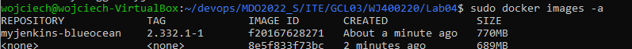

Uruchomienie kontenera

```bash
docker run --name jenkins-blueocean --rm --detach \
  --network jenkins --env DOCKER_HOST=tcp://docker:2376 \
  --env DOCKER_CERT_PATH=/certs/client --env DOCKER_TLS_VERIFY=1 \
  --publish 8080:8080 --publish 50000:50000 \
  --volume jenkins-data:/var/jenkins_home \
  --volume jenkins-docker-certs:/certs/client:ro \
  myjenkins-blueocean:2.332.1-1
```


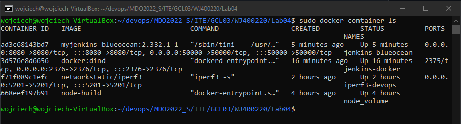

Poprawne działanie Jenkins

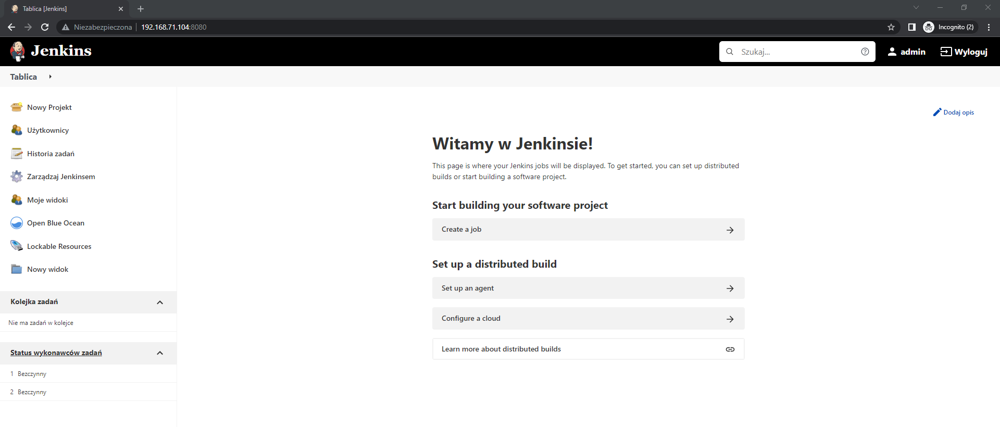
