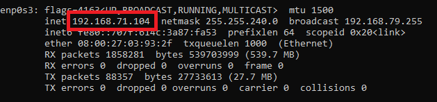
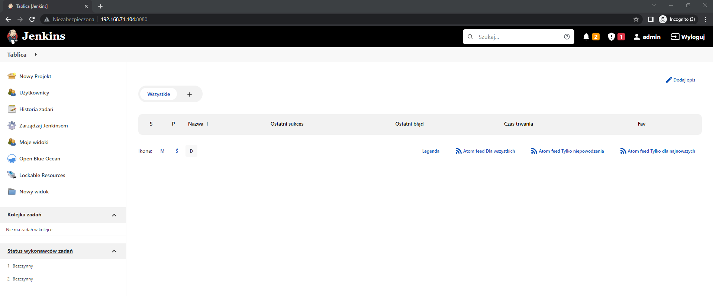
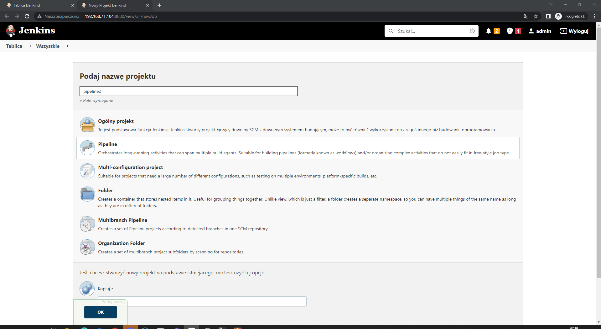
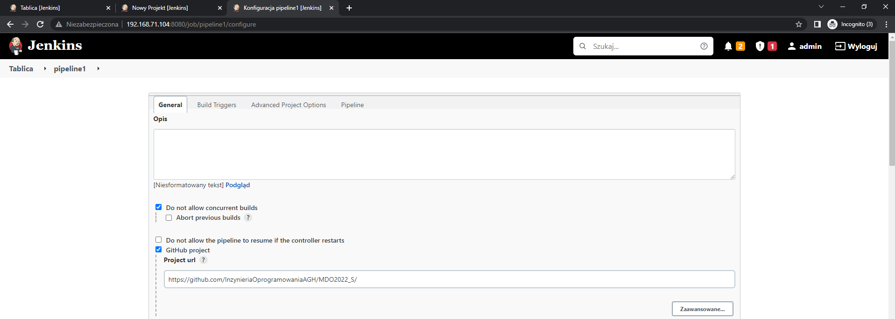
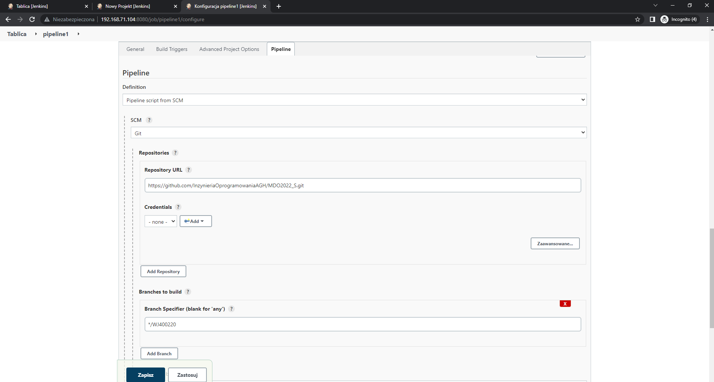
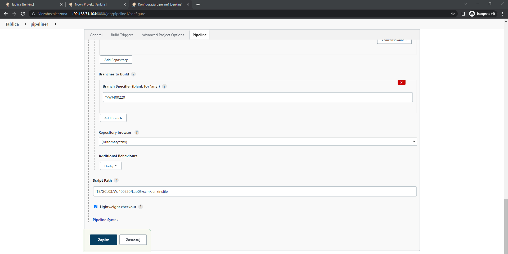
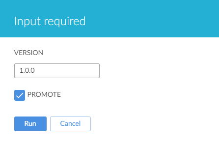
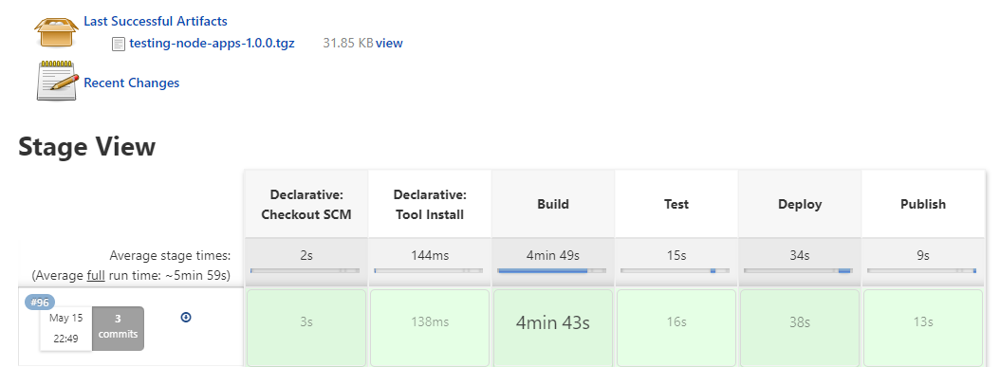
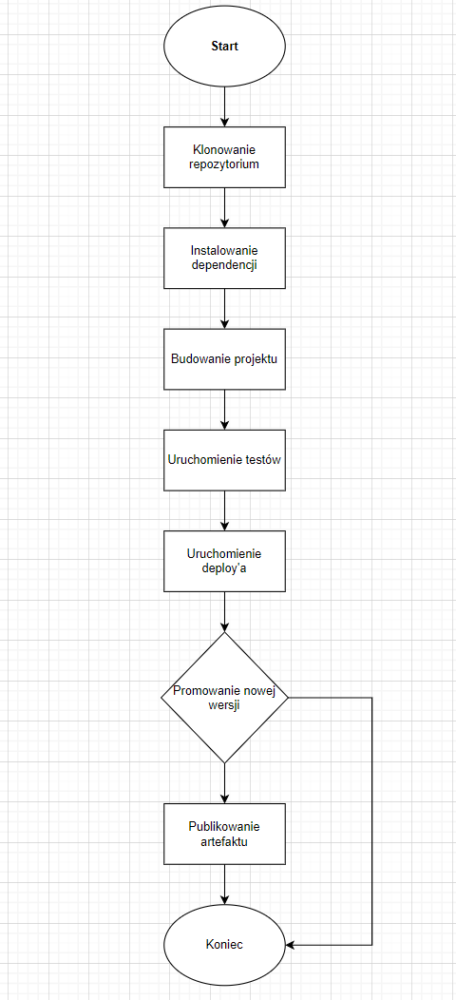
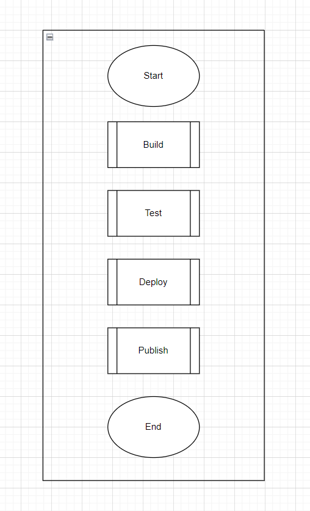

# Sprawozdanie

### Cel projektu

Głównym celem projektu było przygotowanie pipeline'a w Jenkinsie który miał za zadanie przeprowadzić 4 główne kroki:

* Build
* Test
* Deploy
* Publish

Podczas wykonywania zadania wykorzystano aplikacje napisaną w Node.js publicznie udostępnioną na githubie (https://github.com/kentcdodds/testing-node-apps)

### Przygotowanie środowiska

Konfiguracja oraz uruchomienie zostało wykonane według oficjalnej dokumentacji Jenkinsa, która opisuje krok po kroku uruchomienie Jenkinsa w Dockerze.

* Utworzenie nowej sieci w dockerze na potrzeby Jenkinsa 

```
docker network create jenkins
```

* Uruchomienie kontenera z Jenkinsem

```
docker run --name jenkins-docker --rm --detach \
  --privileged --network jenkins --network-alias docker \
  --env DOCKER_TLS_CERTDIR=/certs \
  --volume jenkins-docker-certs:/certs/client \
  --volume jenkins-data:/var/jenkins_home \
  --publish 2376:2376 \
  docker:dind --storage-driver overlay2
```


* Utworzenie Dockerfile'a

```
FROM jenkins/jenkins:2.332.3-jdk11
USER root
RUN apt-get update && apt-get install -y lsb-release
RUN curl -fsSLo /usr/share/keyrings/docker-archive-keyring.asc \
  https://download.docker.com/linux/debian/gpg
RUN echo "deb [arch=$(dpkg --print-architecture) \
  signed-by=/usr/share/keyrings/docker-archive-keyring.asc] \
  https://download.docker.com/linux/debian \
  $(lsb_release -cs) stable" > /etc/apt/sources.list.d/docker.list
RUN apt-get update && apt-get install -y docker-ce-cli
USER jenkins
RUN jenkins-plugin-cli --plugins "blueocean:1.25.3 docker-workflow:1.28"
```

* Utworzenie obrazu na bazie Dockerfile'a

```
docker build -t myjenkins-blueocean:2.332.3-1 .
```

* Uruchomienie kontenera z dind (Docker-in-Docker) pozwalającego na uruchomienie Dockera w Dockerze

```
docker run --name jenkins-blueocean --restart=on-failure --detach \
  --network jenkins --env DOCKER_HOST=tcp://docker:2376 \
  --env DOCKER_CERT_PATH=/certs/client --env DOCKER_TLS_VERIFY=1 \
  --publish 8080:8080 --publish 50000:50000 \
  --volume jenkins-data:/var/jenkins_home \
  --volume jenkins-docker-certs:/certs/client:ro \
  myjenkins-blueocean:2.332.3-1
```

Dokładny opis każdej z komend wraz z opisem parametrów znajduje się w dokumentacji Jenkinsa - https://www.jenkins.io/doc/book/installing/docker/.

W przypadku uruchomienia Jenkinsa na maszynie wirtualnej wymagane jest sprawdzenie lokalnego adresu IP maszyny wirtualnej

```
ifconfig
```



Domyślnie Jenkins jest uruchomiony na porcie 8080.



### Utworzenie pipeline'a

* Wybór opcji "Nowy Projekt"  z listy po lewej stronie

* Wybór nazwy, zaznaczenie opcji "Pipeline" oraz kliknięcie "OK"



* W sekcji "General" zaznaczenie opcji "Do not allow concurrent builds" oraz "GitHub project" gdzie należy podać link do repozytorium w którym znajdują się pliki Jenkinsfile oraz Dockerfile, w przypadku projektu wykonywanego na zajęciach - https://github.com/InzynieriaOprogramowaniaAGH/MDO2022_S/.



* W sekcji "Advanced Project Options" w podsekcji "Pipeline" należy wybrać opcję "Pipeline script from SCM", następnie w "Repository URL" należy ponownie podać link do githuba, lecz tym razem z rozwinięciem .git, w polu "Branch Specifier (blank for 'any')" należy podać nazwę swojego brancha, w polu "Script Path" należy podać ścieżkę do pliku Jenkinsfile oraz zaznaczyć opcję "Lightweight checkout"





### Omówienie pipeline'a

* Build

Jak już zostało wspomniane na wstępie pipeline składa się z 4 podstawowych etapów, pierwszym z nim jest "Build"

```
stage('Build') {
            steps {
                script {
		    sh 'docker rm -f build_node || true'
                    sh 'docker volume prune -f'
                    git 'https://github.com/InzynieriaOprogramowaniaAGH/MDO2022_S.git'
                    sh 'git checkout WJ400220'
                    sh 'git pull origin'
                    sh 'cd ITE/GCL03/WJ400220/Lab05/dockerfiles/ ; docker build --no-cache -t build_node:latest . -f ./build.dockerfile'
                    sh 'docker volume create volume_out'
                    sh 'docker run --mount type=volume,src="volume_out",dst=/node_app/files build_node:latest bash -c "ls -l && cd .. && ls -l && cp -r /testing-node-apps /node_app/files"'
                }
           }
        }
```

Na początku usuwane są możliwe pozostałości po wcześniejszych uruchomieniach pipeline'a, następnie kolonowane jest repozytorium, zmiana gałęzi oraz pobranie zmian. W kolejnym kroku tworzony jest obraz "build_node" na podstawie Dockerfile

```
# syntax=docker/dockerfile:1
FROM node:16.15.0
RUN git clone https://github.com/kentcdodds/testing-node-apps.git
WORKDIR /testing-node-apps/
RUN npm install
RUN npm run build
```

Na tym etapie kolonowane jest repozytorium z kodem programu oraz następuje instalacja dependencji i budowanie projektu.

Kolejnym etapem jest utworzenie woluminu "volume_out" gdzie będzie odkładany zbudowany obraz w tym celu tworzony jest kontener który służy tylko do odłożenia zbudowanego programu na wolumin.

* Test

Następnym krokiem jest "Test" w którym na bazie poprzedniego obrazu uruchamiane są testy.

```
stage('Test') {
            steps {
		sh 'docker rm -f test_node || true'
                sh 'cd ITE/GCL03/WJ400220/Lab05/dockerfiles/ ; docker build --no-cache -t test_node:latest . -f ./test.dockerfile'
            }
        }
```

W pierwszym etapie czyszczone są pozostałości po poprzednich uruchomieniach, następnie tworzony jest obraz "test_node" na podstawie Dokcerfile

```
FROM build_node:latest
WORKDIR /testing-node-apps/
RUN npm run test:final
```

Dockerfile bazuje na poprzednim obrazie "build_node" oraz uruchamia testy programu.

* Deploy

Krok "Deploy" również czyści pozostałości po wcześniejszych uruchomieniach, następnie pobiera już zbudowany program z woluminu oraz uruchamia na nim komendę sprawdzającą działanie programu.

```
stage('Deploy') {
            steps {
                sh 'docker rm -f deploy_node || true'
		sh 'docker run --rm -dit --name deploy_node --mount type=volume,src="volume_out",dst=/node_app/files node'
		sh 'docker container exec deploy_node sh -c "ls -l"'
		sh 'docker container exec deploy_node sh -c "cd node_app/files/testing-node-apps && ls -l && npm run validate"'
            }
        }
```

* Publish

Przed rozpoczęciem wykonywania jakiejkolwiek instrukcji sprawdzane jest czy opcja "PROMOTE" została zaznaczona podczas uruchamiania kontenera



Jeżeli opcja "PROMOTE" jest zaznaczona pobierany jest z woluminu zbudowany program, pakowany do pliku .tgz oraz publikowany jest nowy artefakt.

```
stage('Publish') {
	     when {
		expression {return params.PROMOTE}
	     }
	     steps {
		sh 'docker rm -f publish_node || true'
		sh 'find /var/jenkins_home/workspace -name "artifacts" || mkdir /var/jenkins_home/workspace/artifacts'
		sh 'docker run -d --rm --name publish_node --mount type=volume,src="volume_out",dst=/node_app/files --mount type=bind,source=/var/jenkins_home/workspace/artifacts,target=/usr/local/copy node bash -c "ls -al && chmod -R 777 /node_app  && cd node_app/files && tar -xvz testing-node-apps -f testing-node-apps-${params.VERSION}.tgz  && ls -al && cd ../.. && cp -r /node_app/. /usr/local/copy"'
		sh 'ls -al'
		sh 'docker ps'
		sh 'cd ../artifacts/files/testing-node-apps && ls -al'
		sh 'cd /var/jenkins_home/workspace/artifacts/files/testing-node-apps && ls -al'
		sh 'pwd'
		sh "ls -al && cd ../artifacts/files/ && ls -al && cd testing-node-apps && ls -al && cp testing-node-apps-${params.VERSION}.tgz /var/jenkins_home/workspace/pipeline1"
		sh 'ls -al'
		archiveArtifacts artifacts: "testing-node-apps-${params.VERSION}.tgz"
		sh 'docker rm -f build_node || true'
                sh 'docker rm -f test_node || true'
                sh 'docker rm -f deploy_node || true'
                sh 'docker rm -f publish_node || true'
	     }
	}
```



* Parameters

Pipeline uruchamiany jest z parametrami "VERSION" oraz "PROMOTE" które ustawiane są podczas startu programu 


```
parameters {
	string(name: 'VERSION', defaultValue: '1.0.0', description: '')
	booleanParam(name: 'PROMOTE', defaultValue: true, description: '')
    }
```

### Diagramy





