# Sprawozdanie

### Instalacja Fedory

* Wybór języka

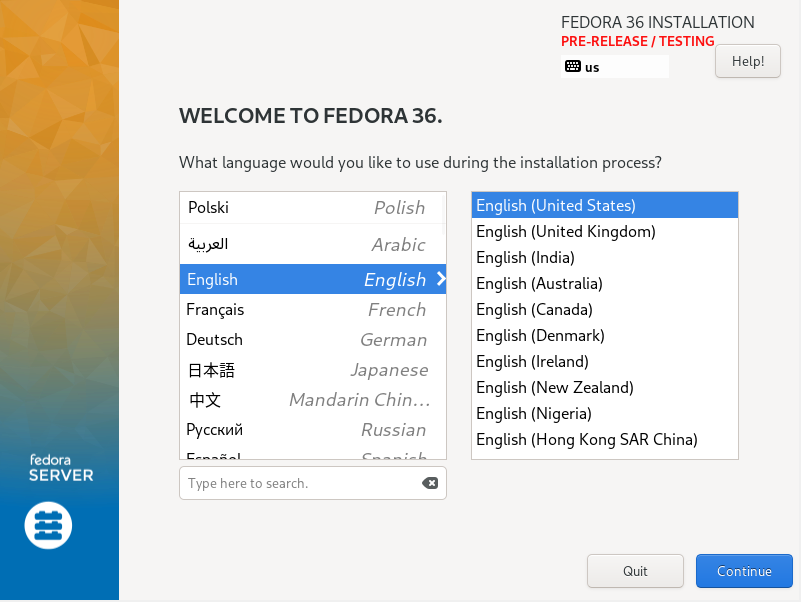

* Dodanie polskiej klawiatury

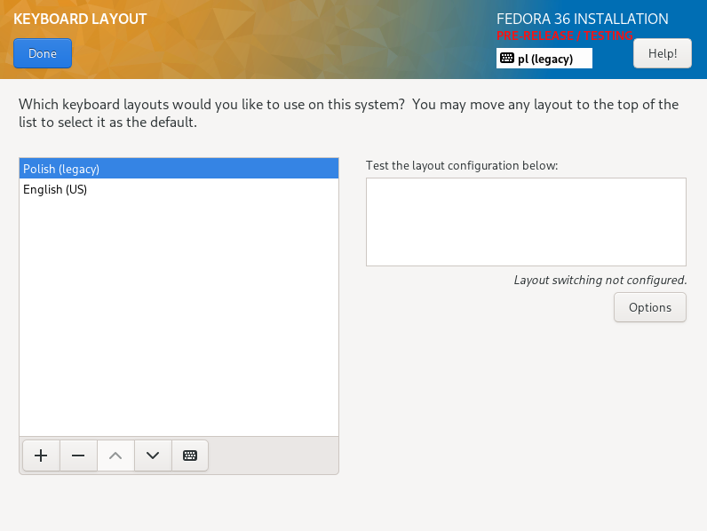

* Ustawienie partycji 

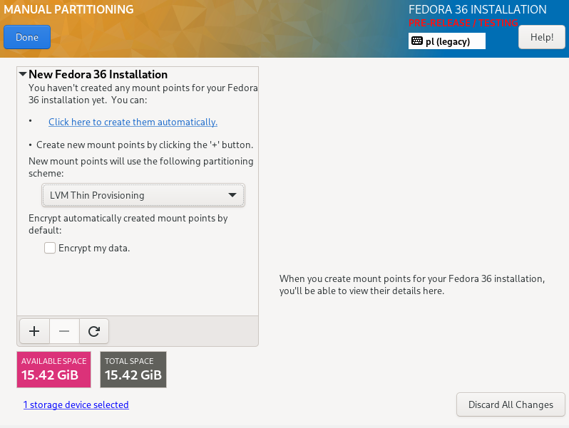

* Wybranie opcji instalacji minimalnej

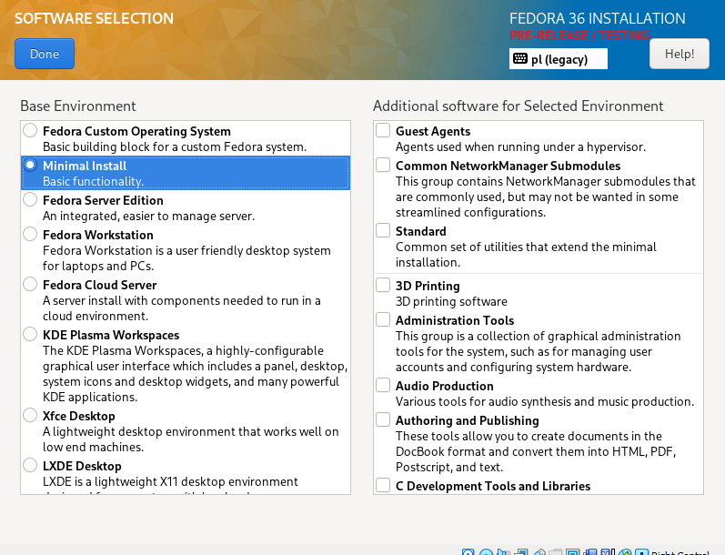

* Ustawienie nazwy sieci 

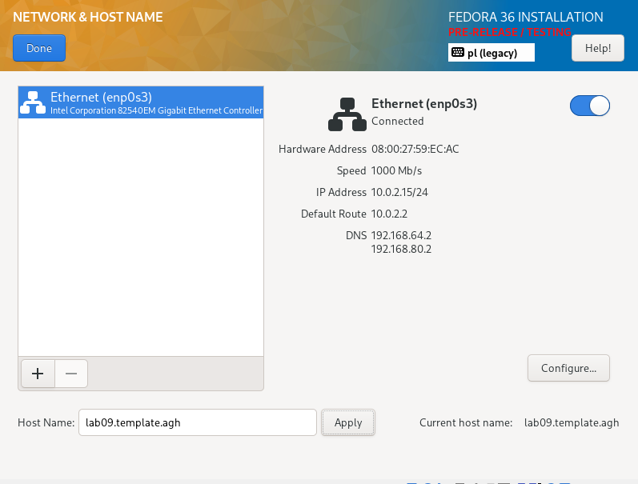

* Ustawienie prostego hasła 

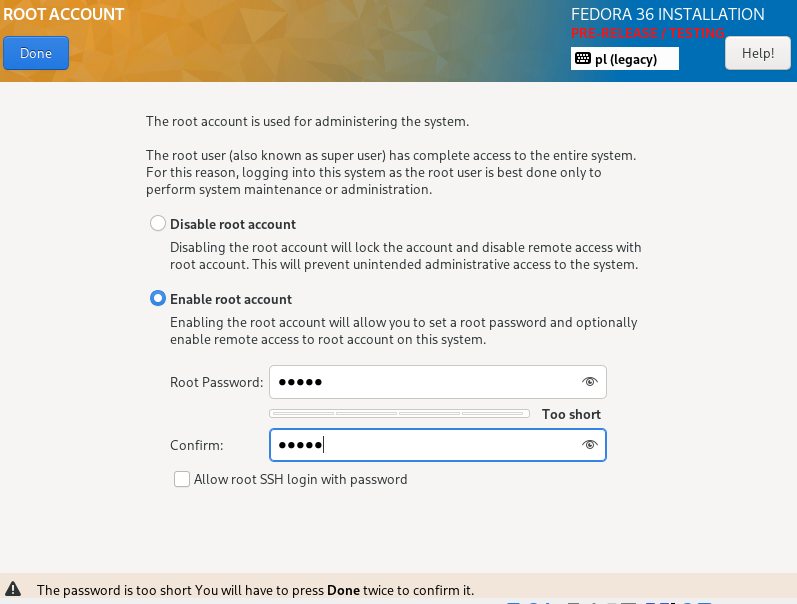

* Rozpoczęcie instalacji 

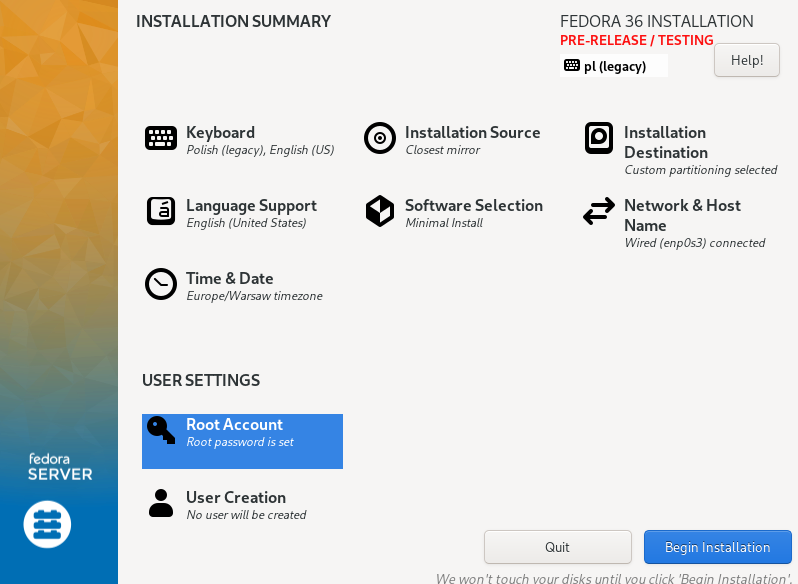

* Została utworzona druga maszyna a analogiczny sposób o innej nazwie sieci

* Instalacja oraz uruchomienie serwera http

```
sudo dnf module enable nginx:mainline  
sudo dnf install nginx
```

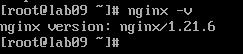

```
sudo systemctl enable nginx --now
sudo firewall-cmd --reload
```

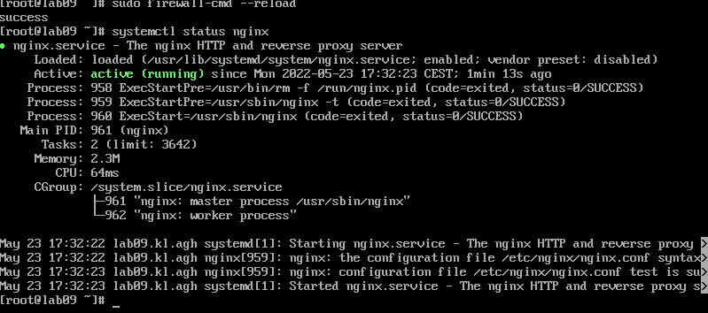

* Sprawdzenie połączenia pomiędzy maszynami 

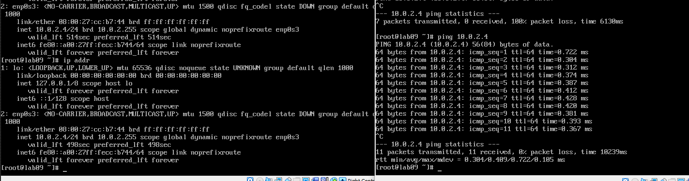

* Sprawdzenie lokalizacji root nginx'a

```
cat /etc/nginx/nginx.conf 
```

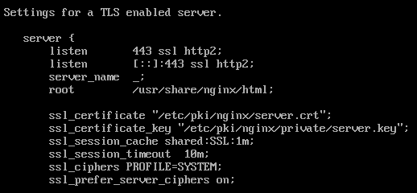

* Pobranie artefaktu wykonanego poprzez pipeline z poprzedniego zadania oraz zmiana uprawnień pliku

```
wget https://transfer.sh/ug46dt/testing-node-apps-1.0.0.tgz
sudo chmod 777 testing-node-apps-1.0.0.tgz
```

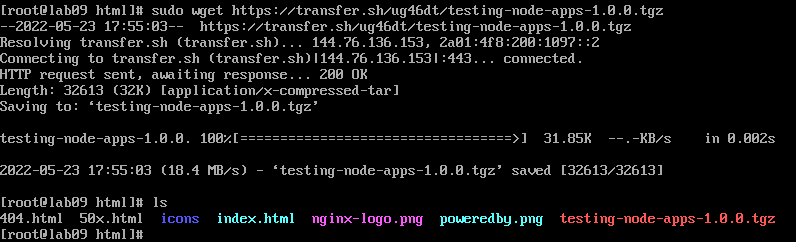

* W celu pobrania pliku na drugiej maszynie konieczna jest instalacja wget tak samo jak na serwerze

```
sudo dnf install wget
wget https://10.0.2.4/testing-node-apps-1.0.0.tgz
```

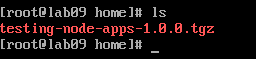

### Instalacja nienadzorowana

* Pobranie pliku anaconda-ks.cfg

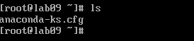

* Dodanie wget do sekcji "packages"

```
%packages
@^minimal-environment
wget

%end
```

* Dodanie repozytoriów 

```
url --mirrorlist=http://mirrors.fedoraproject.org/mirrorlist?repo=fedora-$releasever&arch=x86_64
repo --name=updates --mirrorlist=http://mirrors.fedoraproject.org/mirrorlist?repo=updates-released-f$releasever&arch=x86_64
```

* Dodanie sekcji "post"

```
%post
wget https://10.0.2.4/testing-node-apps-1.0.0.tgz
%end
```

* Umieszczenie pliku na githubie

https://github.com/InzynieriaOprogramowaniaAGH/MDO2022_S/blob/WJ400220/ITE/GCL03/WJ400220/Lab09/anaconda-ks.cfg

### Infrastructure as a code

* Utworzenie nowej maszyny i rozpoczęcie instalacji Fedory, podczas uruchomienia instalacji podana została poniższa komenda zawierająca link do wcześniej zmodyfikowanego pliku "anaconda-ks.cfg"

```
vmlinuz initrd=initrd.img inst.stage2=hd:LABEL=Fedora-S-dvd-x86_64-36 rd.live.check quiet inst.ks=https://raw.githubusercontent.com/InzynieriaOprogramowaniaAGH/MDO2022_S/WJ400220/ITE/GCL03/WJ400220/Lab09/anaconda-ks.cfg
```

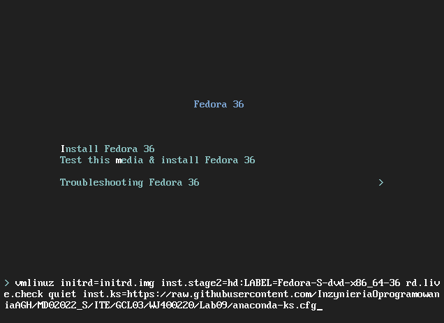

* Wynik instalacji

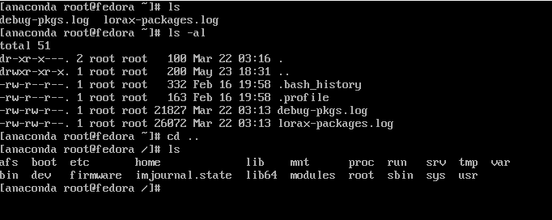