| Imie   | Nazwisko | Data         |
|--------|----------|--------------|
| Łukasz | Gołojuch | 13.03.2022 r.|

# 1. Instalacja git i ssh
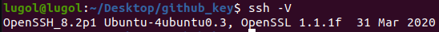
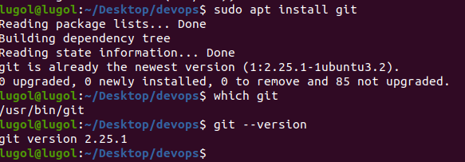
# 2. Klonowanie repozytorium za pomocą HTTPS
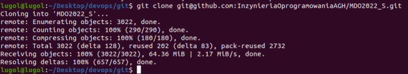
# 3. Generowanie klucza oraz klonowanie repozytorium za pomocą protokołu SSH

1. Generowanie i przypisywanie klucza odbywało się bardzo podobnie jak na stronie: [Link](https://docs.github.com/en/authentication/connecting-to-github-with-ssh)

    - Generowanie klucza: [Link](https://docs.github.com/en/authentication/connecting-to-github-with-ssh/generating-a-new-ssh-key-and-adding-it-to-the-ssh-agent)
    Jedyną różnicą jest to, że nie zostało dodane ' -C "mój@mail" '
    
    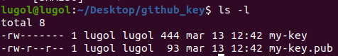

2. Dodanie klucza do Github: [Link](https://docs.github.com/en/authentication/connecting-to-github-with-ssh/adding-a-new-ssh-key-to-your-github-account)

    - 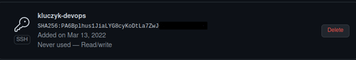

3. Test połączenia

    - 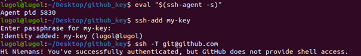

4. Pobranie repozytorium

    - 

# 4.  Działanie na gicie

1.  Przełączenie się na gałąź main, a potem na gałąź swojej grupy 

    - 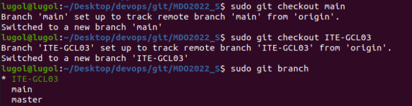

2. Tworzenie i połączenie się z gałęzią "ŁG403881"

    - 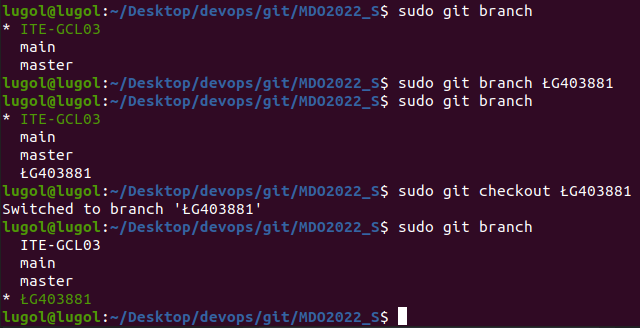

3. Tworzenie struktury plików w folderze grupy

    - 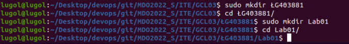 

4. Dodanie plików ze sprawozdaniem 

    - 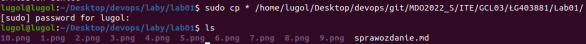

5. Sprawdzenie struktury plików

    - 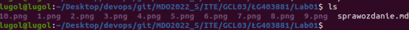

6. git add *

    - 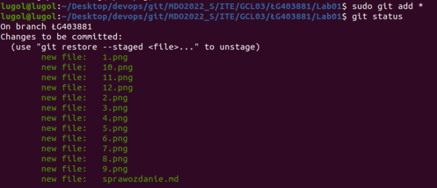

7. git commit

    - 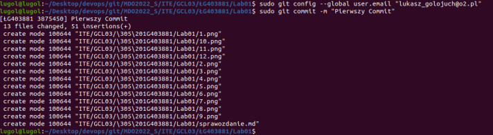

