| Imie   | Nazwisko   | Data       |
|--------|------------|------------|
| Łukasz | Gołojuch   | 22.03.2022 |

# 1. Przygotowanie git hook, który rozwiąże najczęstsze problemy z commitami:

1. Hook sprawdzający, czy tytuł commita posiada w nazwie:
    - "ŁG403881" (inicjały i nr indeksu)
    - "Lab02" (nr laboratorium)
- napisano poniższy skrypt w pliku: ```(...) /.git/hooks/commit-msg.sample```
```bash
#!/bin/bash


par="$(cat $1)"
if [[ "$par" =~ .*ŁG403881.* ]]
then
    echo "name contains 'ŁG403881'"
else
    echo "name: '$par' does not contain 'ŁG403881'"
    exit -1
fi

if [[ "$par" =~ .*Lab02.* ]]
then
    echo "name contains 'Lab02'"
else
    echo "name: '$par' does not contain 'Lab02'"
    exit -1
fi
```
    - Skrypt ten sprawdza, czy w przekazanych parametrach jest "ŁG403881" i "Lab02". Jeśli którekolwiek z nich nie istnieje - commit nie zostanie przekazany dalej.
- Zmieniono nazwę pliku z ```commit-msg.sample``` na ```commit-msg```. Dzięki temu skrypt się odpala.
- zmieniono uprawnienia pliku ze skryptem za pomocą komendy ```sudo chmod +x commit-msg```. Dzięki temu skrypt działa poprawnie, gdyż nie ma problemu z jego egzekuzją.

2. Przykład działania skryptu:

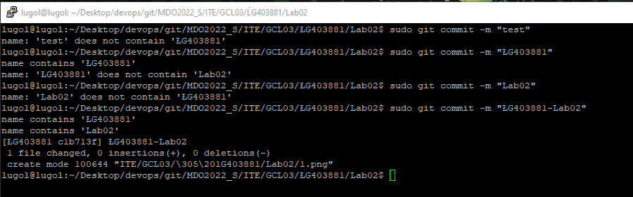

# 2. Instalacja SSH i działanie SSH 
1. Połączenie się do wirtualnej maszyny Ubuntu z PuTTY.
    - Przejście krok po kroku za poradnikiem ze strony: [link](https://abodeqa.com/ssh-to-ubuntu-installed-on-virtualbox-putty-to-ubuntu/)
2. Zrzuty ekranu potwierdzające połączenie się:
    - zmiana karty sieciowej w Virual Box na "bridged":
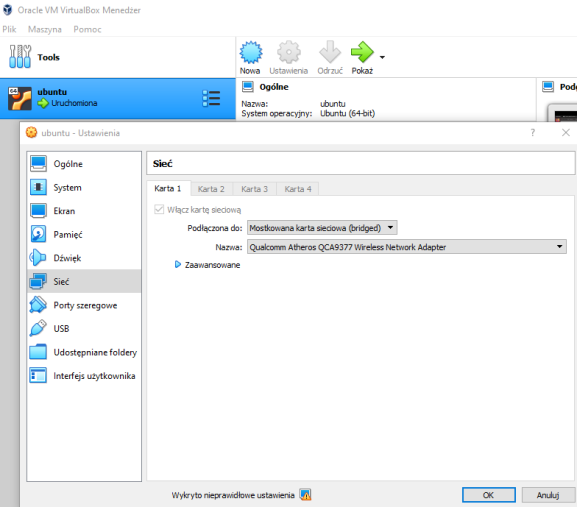
    - przepisanie do PuTTY adresu IP

    - połączenie się:
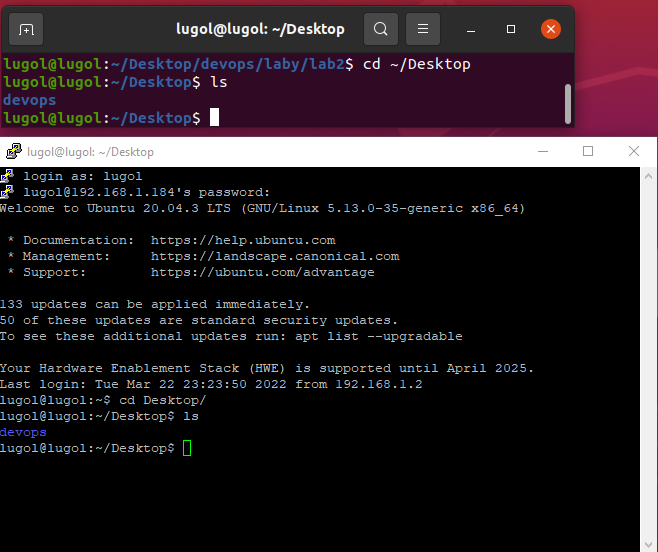

# 3. Przygotowywanie Dockera:
1. Instalacja:

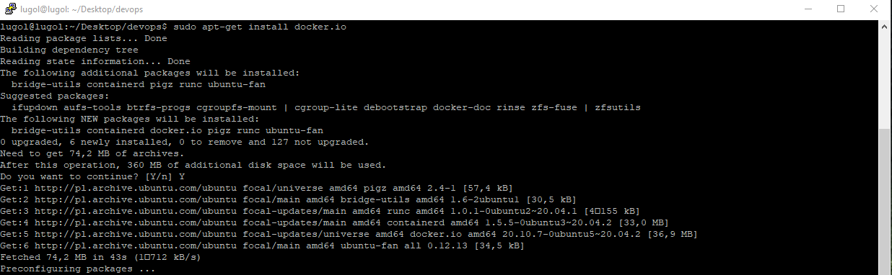

2. Potwierdzenie instalacji:

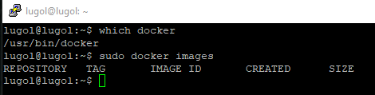

3. Sprawdzanie działąnia dockera:
    - instalacja obrazu Fedory,
    - sprawdzenie dostępnych obrazów po instalacji.

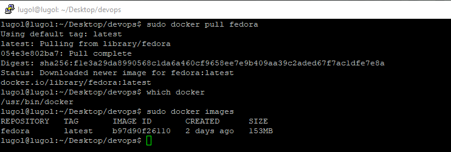

4. Odpalenie  kontenera bazującego na wcześniej pobranym obrazie:
    - nazwa kontenera to fedi (parametr --name),
    - parametr -it pozwolił na połączenie do pseudo-TTY,
    - instalacja "ps",
    - za pomocą komendy ps sprawdzenie działających procesów:

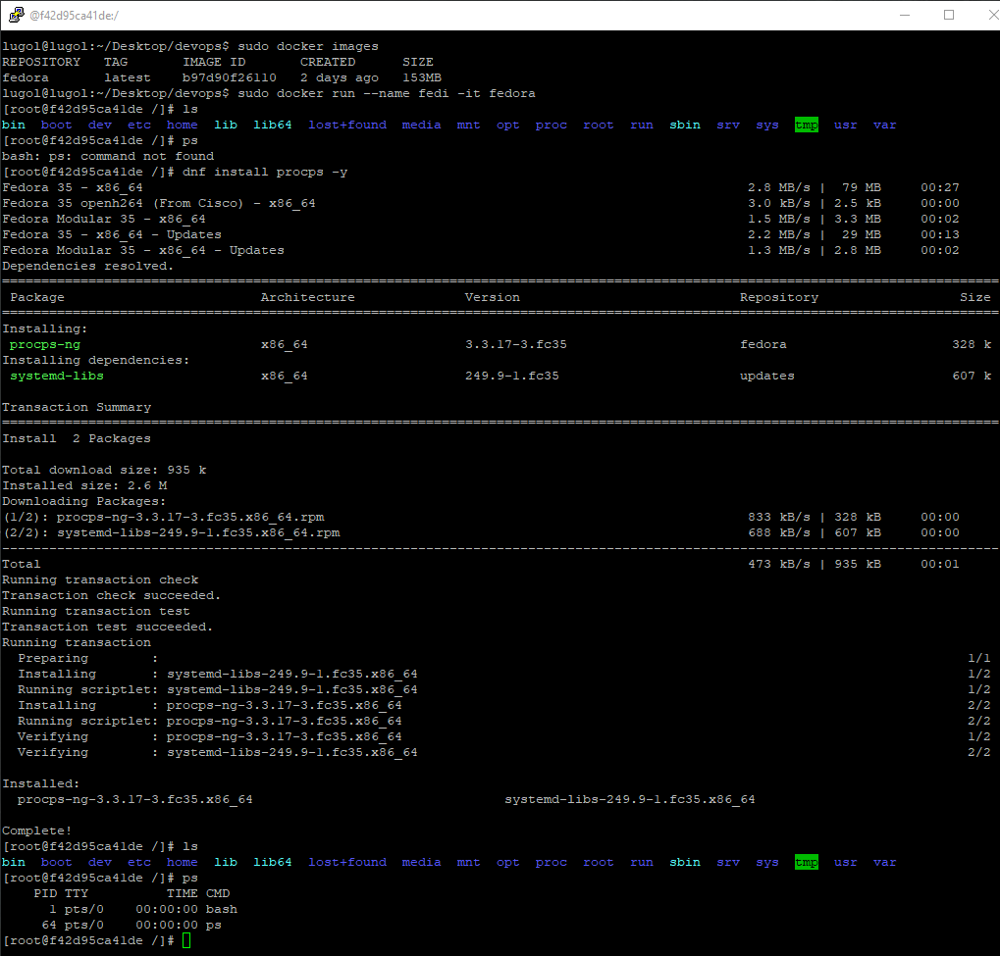

5. Wyświetlenie wersji fedory

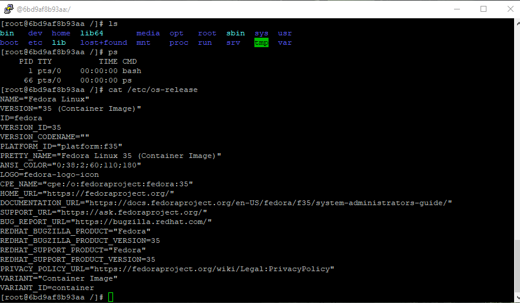

6. Wyświetlenie uruchomionych kontenerów z drugiego terminalu

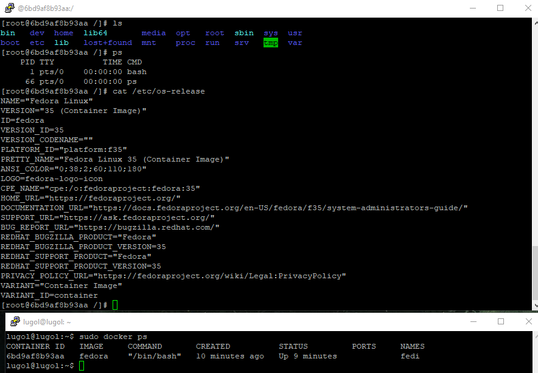

# 3. Utworzenie konta na dockerhub

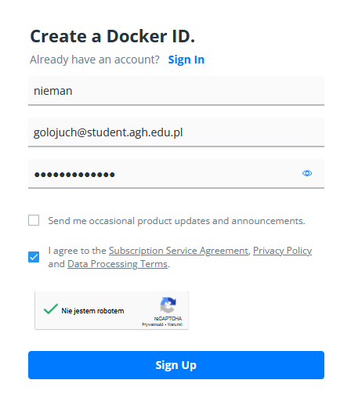

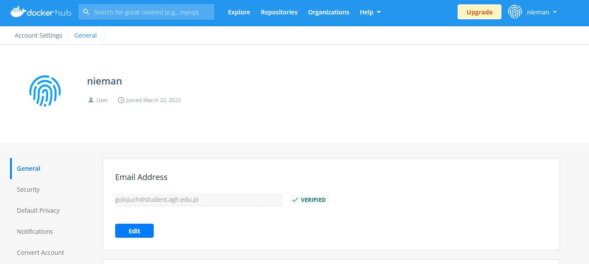
