| Imie   | Nazwisko   | Data       |
|--------|------------|------------|
| Łukasz | Gołojuch   | 29.03.2022 |

# 1. Repozytorium:
1. Zostało ono stworzone na potrzeby laboratorium nr 3.
2. Program został napisany w C#, do testów został wykorzystany NUnit.
3. Link do repozytorium: [link](https://github.com/Niemans/DevOpsLab03)
4. Główny plik:

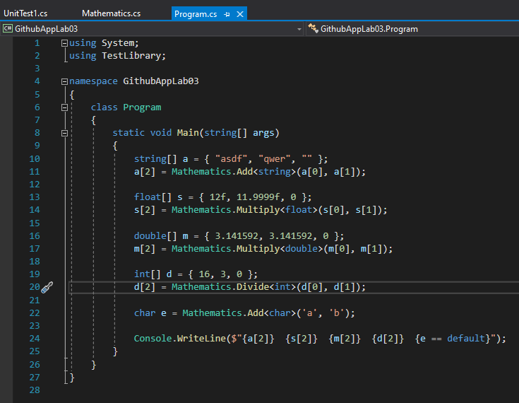

5. Biblioteka:

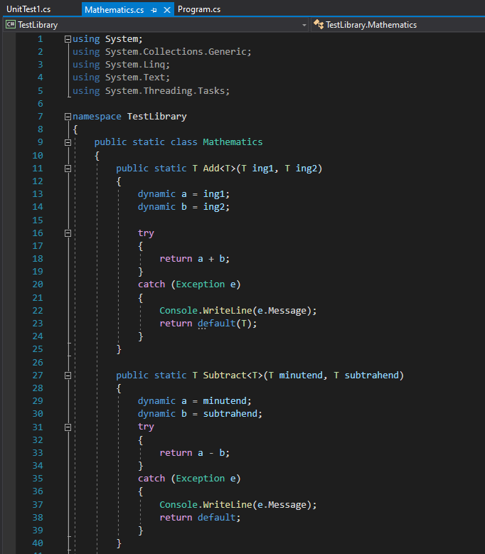
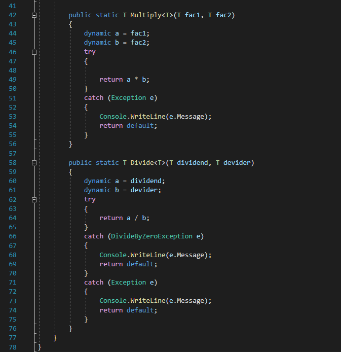

6. Test


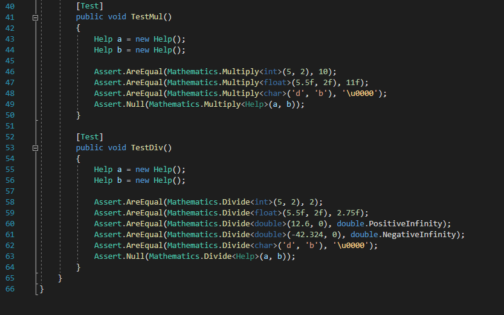

# 2. Docker:
Wybór obrazu Ubuntu i pobieranie .NET SDK działo się zgodnie z instrukcjami na tej sronie: [link](https://docs.microsoft.com/en-us/dotnet/core/install/linux-ubuntu)
1. Sprawdzenie, który obraz Ubuntu wspiera .NET Core 3.1 (20.04 posiada):  

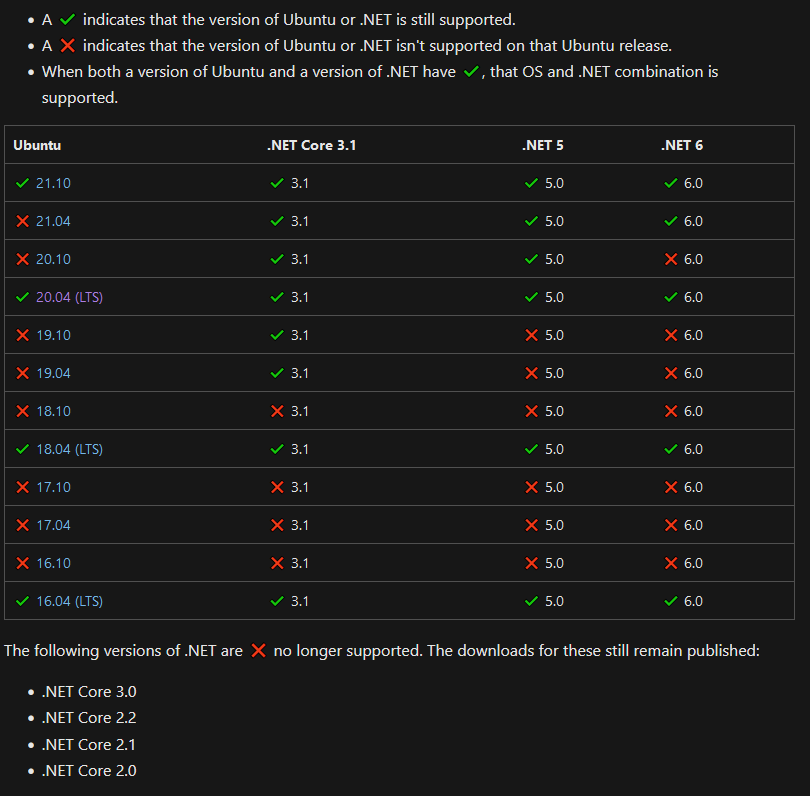

2. Pobranie tego obrazu i uruchomienie kontenera (działanie na PuTTY): 

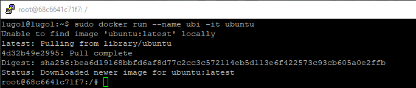

3. Przygotowanie kontenera do odpalenia programu z repozytorium, np. pobranie wget,dotnet-sdk-3.1, git itd.
(dokładne instrukcje znajdują się poniżej, w pierwszym dockerfile'u przy komendzie "RUN"):

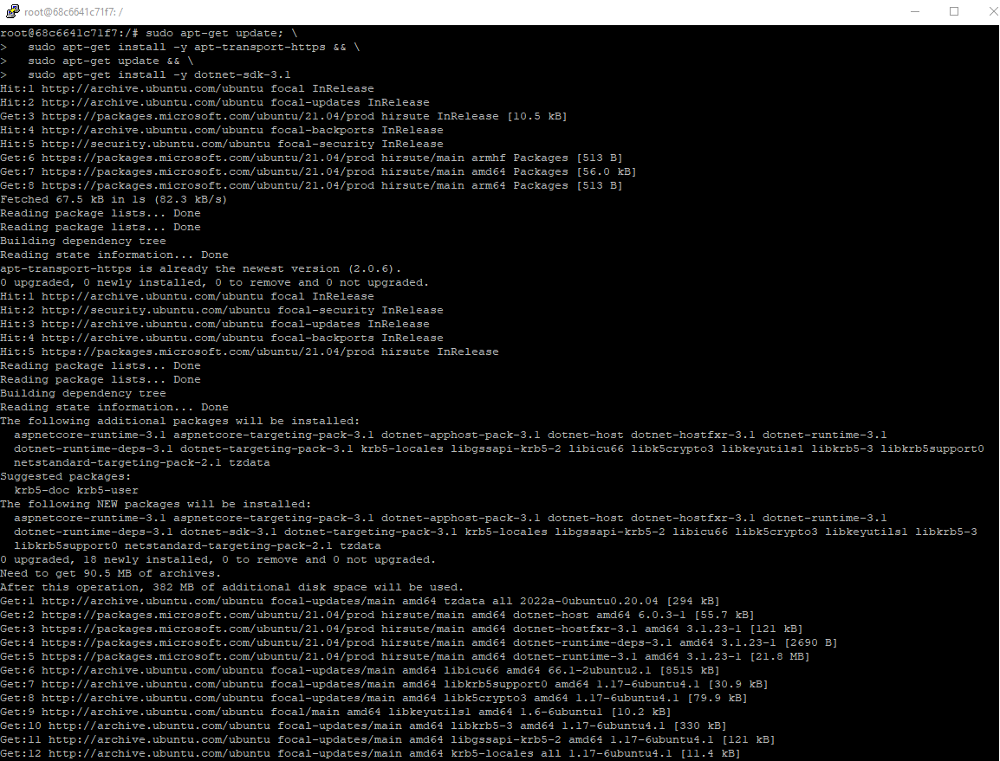

4. Sklonowanie projektu z Githuba:

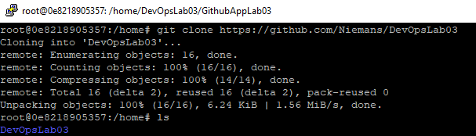

5. Zbudowanie projektu:

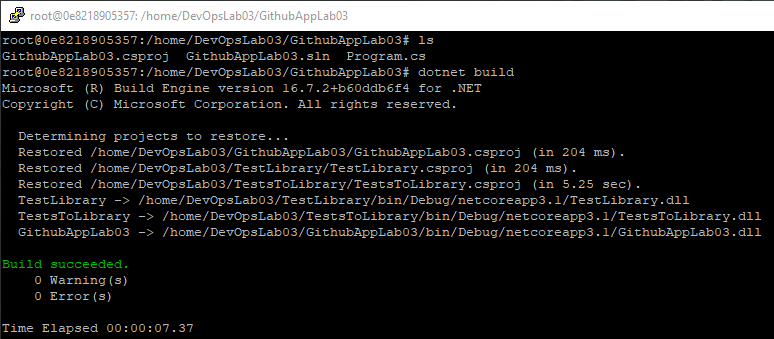

6. Odpalenie testów:

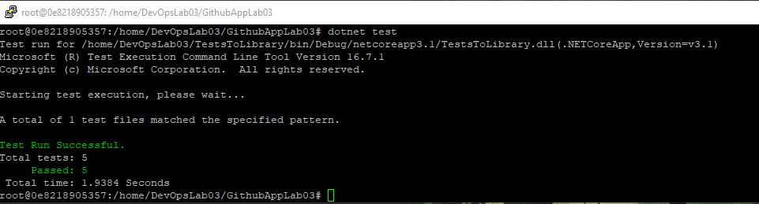

# 3. Dockerfile:
1. Stworzenie pliku Dockerfile, którego zadaniem byłoby zbudowanie projektu z punktu 1.
2. Zawarcie w tym pliku wszystkich niezbędnych komend, które doprowadzą do zadziałania `dotnet build`

```dockerfile
#obraz startowy
FROM ubuntu:latest

#by nie było interakcji przy wykonywaniu
ARG DEBIAN_FRONTEND=noninteractive

#instalacje
RUN apt-get -y update
RUN apt-get -y install git
RUN apt-get -y install wget
RUN apt-get -y install tzdata

#ustawienie strefy czasowej (timezone) na Warszawę
ENV TZ=Europe/Warsaw

#ze strony (bez sudo) https://docs.microsoft.com/en-us/dotnet/core/install/linux-ubuntu#2004-
RUN wget https://packages.microsoft.com/config/ubuntu/20.04/packages-microsoft-prod.deb -O packages-microsoft-prod.deb
RUN dpkg -i packages-microsoft-prod.deb
RUN rm packages-microsoft-prod.deb

#nadal z tej samej strony (.NET SDK w wersji 3.1, nie 6.0)
RUN apt-get update; \
  apt-get install -y apt-transport-https && \
  apt-get update && \
  apt-get -y install dotnet-sdk-3.1

#pobieranie repo z githuba i zbudowanie projektu
RUN git clone https://github.com/Niemans/DevOpsLab03.git
WORKDIR DevOpsLab03/GithubAppLab03
RUN dotnet build
```
3. Stworzenie drugiego dockerfile'a, który na ma wykonać testy:
```dockerfile
#obraz startowy
FROM build:latest

#wybranie katalogu
WORKDIR .

#odpalenie testów
RUN dotnet test
```
4. Stworzenie obrazów na podstawie tych dwóch dockerfile'i:
    - pierwszy obraz zbudowany za pomocą komendy `sudo docker build -t build:latest . -f Dockerfile` 
    - 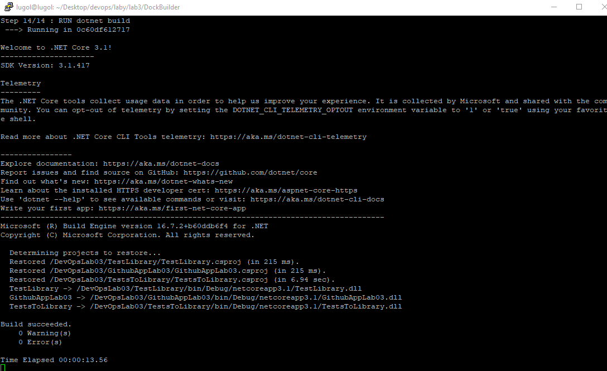
    - drugi obraz zbudowany podobną komendą (Dockerfile znajduje się w innym kattalogu): `sudo docker build -t build:latest . -f Dockerfile`
    - 
    - lista obrazów:
    - 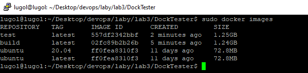
5. Odpalenie na osobnych PuTTY kontenerów z obrazów build i test:
    - `sudo docker run --name Builder -it build`
    - `sudo docker run --name Tester -it test`
    - 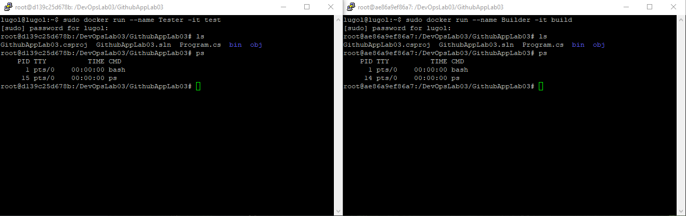
    - sprawdzenie działających kontenerów:
    - 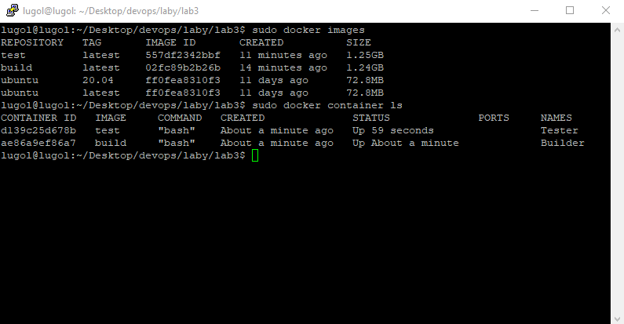
# 4. Docker Compose
1. Stworzenie pliku "docker-compose.yml":
```docker
version: "3.3"
services:
  build:
    image: "build:latest"
  test:
    image: "test:latest"
```
2. Uruchomienie go przy pomocy komendy `sudo docker-compose up`:

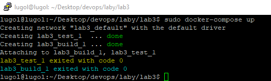

3. Wnioski końcowe:
Nie ma sensu tworzyć kontenerów dla tego typu projektu, w którym znajduje się jedynie biblioteka z prostymi działaniami matematycznymi, gdyż do takich rzeczy przeznaczony jest, np. pakiet NuGet. Inną sprawą jest fakt, że sam ten projekt .NET jest mało przydatny, gdyż został on stworzony tylko na potrzeby tego laboratorium.
Lepszym zastosowaniem konteneryzacji byłoby wykorzystanie go do serwisów świadczących usługi, testowania projektów przed przed wdrożeniem gdziekolwiek dalej czy też przy aplikacjach multi-cloud lub hybrid-cloud.